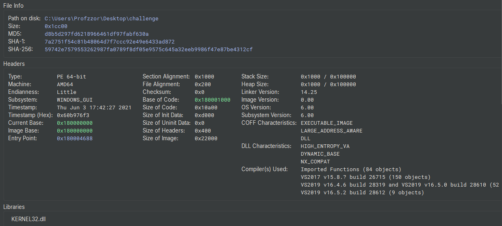
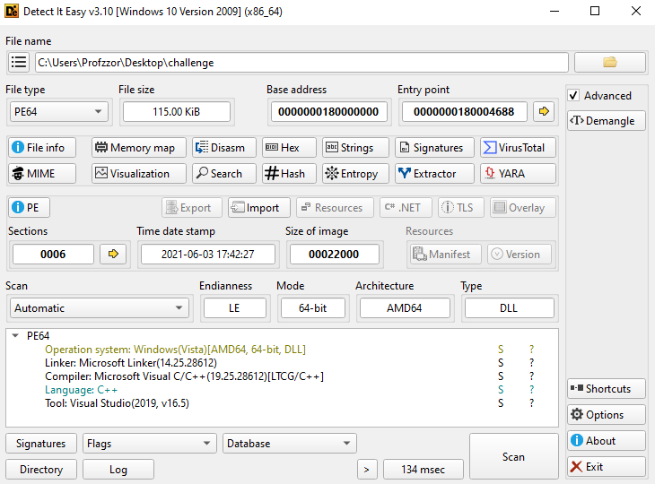

# 1. Executive Summary

This report details the comprehensive technical analysis of the **Aurat** malware sample, a reverse engineering challenge provided by **MalOps.io** ([https://malops.io/challenges/aurat](https://www.google.com/url?sa=E&q=https%3A%2F%2Fmalops.io%2Fchallenges%2Faurat)). The sample is a sophisticated, custom-built **Backdoor** developed in C++ designed to simulate a realistic targeted attack.

**Key Findings:**
- **Defense Evasion:** The binary employs advanced evasion techniques, including **header tampering** (removal of DOS/PE signatures) to defeat static scanners and **Dynamic API Resolution** (using a DJB2 hashing algorithm) to conceal its import table and functionality.
- **Network Resilience:** The malware operates a robust Command and Control (C2) infrastructure with a **failover mechanism**. It iterates through three hardcoded C2 servers, attempting to tunnel traffic first via **DNS (Port 53)** and falling back to **HTTPS (Port 443)**.
- **Encrypted Communication:** Network traffic is protected using **AES-128 encryption** via the Windows CryptoAPI, rendering network-based signature detection ineffective without the encryption keys.
- **Malicious Capabilities:** The malware possesses a versatile command set allowing it to:
    - **Inject Malicious Code:** It performs process hollowing against **svchost.exe** to execute payloads stealthily.
    - **Download & Execute:** It functions as a dropper, capable of saving files to disk (\Temp\auk.exe) or loading modules directly into memory.
    - **Reconnaissance:** It actively harvests system metadata, including usernames, OS versions, and active user sessions.
# 2. Technical Analysis

## 2.1. Sample Overview

The sample is a binary file with a size of `117756 bytes` and the following `SHA-256 identifier: 9d4600b440a7c730737f83de7188cc68e83124a10934c3d280610b8709084859`
```powershell
dir challenge
15-10-2025  14:52           117,756 challenge

certutil -hashfile challenge sha256
SHA256 hash of challenge:
9d4600b440a7c730737f83de7188cc68e83124a10934c3d280610b8709084859
CertUtil: -hashfile command completed successfully.
```
Initial inspection of the sample reveals the absence of the standard `MZ` DOS header and `PE` signature required for a valid Windows Portable Executable. This indicates deliberate header tampering, a commonly used technique to evade static analysis. 


## 2.2. Header Reconstruction

### 2.2.1 DOS Header Reconstruction

The first **64 bytes** of a Windows Portable Executable correspond to the **DOS header** (`IMAGE_DOS_HEADER`). This header begins with the **magic value `MZ` (`0x4D5A`)**, which identifies the file as a DOS/Windows executable and enables the Windows loader to parse subsequent PE structures. 
```c
typedef struct _IMAGE_DOS_HEADER {     // DOS .EXE header
    WORD e_magic;                      // 00h: Magic number "MZ"
    WORD e_cblp;                       // 02h: Bytes on last page of file
    WORD e_cp;                         // 04h: Pages in file
    WORD e_crlc;                       // 06h: Relocations
    WORD e_cparhdr;                    // 08h: Size of header in paragraphs
    WORD e_minalloc;                   // 0Ah: Minimum extra paragraphs needed
    WORD e_maxalloc;                   // 0Ch: Maximum extra paragraphs needed
    WORD e_ss;                         // 0Eh: Initial (relative) SS value
    WORD e_sp;                         // 10h: Initial SP value
    WORD e_csum;                       // 12h: Checksum
    WORD e_ip;                         // 14h: Initial IP value
    WORD e_cs;                         // 16h: Initial (relative) CS value
    WORD e_lfarlc;                     // 18h: File address of relocation table
    WORD e_ovno;                       // 1Ah: Overlay number
    WORD e_res[4];                     // 1Ch: Reserved words
    WORD e_oemid;                      // 24h: OEM identifier (for e_oeminfo)
    WORD e_oeminfo;                    // 26h: OEM information; e_oemid specific
    WORD e_res2[10];                   // 28h: Reserved words
    LONG e_lfanew;                     // 3Ch: Offset to NT header
} IMAGE_DOS_HEADER;
```
In the sample, the DOS header data is present but the `MZ` magic bytes are missing due to intentional header tampering.

To restore the DOS header, **two bytes were inserted at the beginning of the file** using a hex editor (`Edit → Insert Bytes`) and modified to the correct magic value: `4D 5A`


After inserting the `MZ` signature, the DOS header is structurally valid.
#### e_lfanew Field Analysis

One of the most critical fields within the DOS header is **`e_lfanew`**, a 4-byte value located at offset **`0x3C`**. This field specifies the file offset to the **NT Headers** (`IMAGE_NT_HEADERS`), which contain the PE signature, File Header, and Optional Header.

In this sample, the `e_lfanew` value points to offset **`0x180`**, indicating the location of the NT Headers within the file. This confirms that the remainder of the PE structure exists and that only the initial header values were modified.


### 2.2.2 NT Headers and PE Signature

At the offset specified by `e_lfanew`, a valid PE file must contain the **PE signature**, which consists of the 4-byte magic value:
```
50 45 00 00  ("PE\0\0")
```
Analysis of the sample shows that while the NT Headers region is present, the **PE signature is missing**, further confirming intentional header manipulation.

Immediately following the PE signature is the **IMAGE_FILE_HEADER**, which has a fixed size of **20 bytes** and is defined as:
```c
typedef struct _IMAGE_FILE_HEADER {
    WORD  Machine;              // 00h: The target machine type (e.g., 0x014c = Intel 386)
    WORD  NumberOfSections;     // 02h: Number of sections in the PE file
    DWORD TimeDateStamp;        // 04h: Timestamp of file creation (seconds since Epoch)
    DWORD PointerToSymbolTable; // 08h: File offset of COFF symbol table (usually 0)
    DWORD NumberOfSymbols;      // 0Ch: Number of symbols in COFF symbol table (usually 0)
    WORD  SizeOfOptionalHeader; // 10h: Size of the Optional Header (usually 224 for PE32)
    WORD  Characteristics;      // 12h: Flags describing attributes (e.g., executable, DLL)
} IMAGE_FILE_HEADER;
```

> For a deeper understanding of the Windows PE file structure, I recommend checking out this [article](https://plant-hornet-797.notion.site/Dive-into-PE-files-structure-2605df796637807ab54bc4f6980cf499).
> **Creds:** [@m7mad](https://www.linkedin.com/in/mohammed-nour-al-murie-1792a32b6/)

**Architecture Identification**

The `Machine` field within the IMAGE_FILE_HEADER identifies the target architecture of the executable. Common values include:

```c
0x014c = Intel 386 (x86)
0x8664 = x64
0x01C0 = ARM
0x01C4 = ARMv7 Thumb
0x0200 = Intel Itanium (IA64)
```
In this sample, the `Machine` value is **`0x8664`**, indicating that the malware is compiled as a **64-bit (x64) Windows executable**.

By inserting the `PE` magic bytes (`0x50 0x45`), the executable structure is restored with both a valid DOS header and PE signature.


## 2.3. File Identification

After reconstructing the PE headers, the sample is correctly parsed as a **64-bit Windows Portable Executable (AMD64)**. The binary is marked as a **DLL**, however, no exported functions are present, suggesting it is not intended to be loaded through standard DLL export mechanisms.

| Property              | Value                                                            |
| --------------------- | ---------------------------------------------------------------- |
| File Name             | challenge                                                        |
| File Type             | PE64 DLL (Windows GUI)                                           |
| Architecture          | AMD64 (x86-64)                                                   |
| File Size             | 115.00 KiB (0x1CC00 bytes)                                       |
| MD5                   | d8b5d297fd6218966461df97fabf630a                                 |
| SHA-1                 | 7a2751f54c81b48064d7f7ccc92e49e6433ad872                         |
| SHA-256               | 59742e7579553262987fa0789f8df05e9575c645a32eeb9986f47e87be4312cf |
| Compilation Timestamp | 2021-06-03 17:42:27                                              |
| Entry Point           | 0x180004688                                                      |
| Compiler / Language   | Microsoft Visual C/C++                                           |
| Toolchain             | Visual Studio 2017 / 2019                                        |
| Linker Version        | 14.25                                                            |
| Operating System      | Windows (AMD64, 64-bit)                                          |



The import table lists only **KERNEL32.dll**, indicating that the malware likely resolves additional APIs dynamically at runtime rather than through static imports, a common technique used to reduce static visibility and hinder analysis.



## 2.4. Static Analysis
### 2.4.1. Entry Point Analysis

The analysis begins at the entry point address **0x180004688** (`_start`). Examination of the decompiled code reveals that this section consists of standard initialization routines generated by the **Microsoft Visual C/C++ compiler**, rather than custom malicious logic.

The entry point performs the following operations:

1. **Stack Cookie Initialization**:  
    The function calls` _security_init_cookie` (at 0x1800046d0). This is a standard Microsoft CRT (C Runtime) routine used to initialize the Global Security Cookie (GS Cookie) for stack buffer overflow protection.
    
    As seen in the decompiled code, it gathers entropy using:
    - GetSystemTimeAsFileTime
    - GetCurrentThreadId
    - GetCurrentProcessId
    - QueryPerformanceCounter
    
    This confirms the code is compiler boilerplate intended to harden the binary against exploitation.
    
2. **CRT Dispatcher**:  
    The code subsequently calls dllmain_dispatch (0x180004554), which acts as the wrapper for the standard `_DllMainCRTStartup`. This function is responsible for initializing the C/C++ runtime environment (constructors, static variables) before passing execution to the developer-written main function.
    
    Inside dllmain_dispatch, the code handles standard DLL states (DLL_PROCESS_ATTACH, DLL_THREAD_ATTACH, etc.) and eventually directs execution to **sub_180003fc0**:
```c
// Extract from dllmain_dispatch
if (arg2 - 1 u> 1 || rax_2 != 0)
    sub_180003fc0(arg1, arg2) // <--- Actual DllMain
    rbx_1 = 1
```

### 2.4.2. Analysis of User Code (DllMain)

The function **sub_180003fc0** serves as the actual entry point for the user-defined code (the real DllMain).

Upon execution, it checks if arg2 (the fdwReason) equals 1 (DLL_PROCESS_ATTACH). If the DLL is being loaded into a process, it performs two distinct function calls using a helper function **sub_180001000**. This helper function takes a hexadecimal integer as an argument, which suggests it is an **API hashing routine** used to resolve function pointers dynamically.

```c
// Decompiled Logic of sub_180003fc0
if (arg2 == 1) // DLL_PROCESS_ATTACH
{
    // Resolve Function A via hash 0x1acb4b50 and call it with string
    sub_180001000(0x1acb4b50)("DLL_PROCESS_ATTACH");

    // Resolve Function B via hash 0x26662fcc and call it to spawn a thread
    sub_180001000(0x26662fcc)(0, 0, sub_180003f60, &data_18001c9f0, 0, 0);
}
```
To understand what these functions do, we must analyze the hashing algorithm implemented in `sub_180001000`.
### 2.4.3. Dynamic API Resolution (API Hashing)

The malware employs a technique known as **Dynamic API Resolution** to conceal its imported functions from static analysis tools. This is handled by **sub_180001000** and **sub_180004030**.
#### Module Base Resolution

The function **sub_180004030** is responsible for locating the base address of a specific system DLL without using GetModuleHandle. It accesses the **Process Environment Block (PEB)** via the GS register `(on x64 systems, GS:[0x60] points to the PEB)`.

It traverses the PEB_LDR_DATA structure:
1. Accesses InLoadOrderModuleList.
2. Traverses the doubly linked list 3 times (Flink->Flink->Flink).

Thus, the function returns the base address of **kernel32.dll**.
#### Hashing Algorithm
Once the base address of kernel32.dll is obtained, **sub_180001000** parses its Export Table. It iterates through the export names and calculates a hash for each name using a specific algorithm found in the inner loop:

```c
rax_1 = rax_1 * 0x21 + sx.d(i)
```
This is a variant of the **DJB2** hashing algorithm, using the multiplier **0x21 (33 decimal)**. The logic is:
```c
hash = hash × 33 + char
```
#### Hash Decryption

Automated resolution of API hashes is typically performed using community-driven plugins such as **HashDB** (available for IDA Pro, Ghidra, and Binary Ninja Commercial). These tools query a central database to identify hashing algorithms and resolve values dynamically.

However, this analysis is being conducted using **Binary Ninja Free**, which does not support the internal Python API or third-party plugins. To overcome this limitation and resolve the 121 API calls identified in the binary, an external static analysis approach was adopted.

A standalone Python script was developed to generate a **"Rainbow Table"** (a pre-computed reference list). The script mimics the malware's specific DJB2 hashing logic (hash * 33 + char) and iterates through the Export Address Tables (EAT) of common Windows system DLLs. This produces a searchable text file mapping the malware's hashes to their corresponding human-readable API names.

Python Resolution Script (resolver.py):
```python
import pefile
import os
import glob

def malware_hash(api_name):
    # The DJB2 variant found in the malware: hash = hash * 33 + char
    hash_val = 0
    for char in api_name:
        val = ord(char)
        hash_val = (hash_val * 0x21 + val) & 0xFFFFFFFF
    return hash_val

def build_rainbow_table():
    # List of DLLs the malware likely imports from
    dll_paths = [
        r"C:\Windows\System32\kernel32.dll", # sub_180001000
        r"C:\Windows\System32\user32.dll", # sub_180001160
        r"C:\Windows\System32\msvcrt.dll", # sub_1800012d0
        r"C:\Windows\System32\advapi32.dll", # sub_180001430
        r"C:\Windows\System32\wtsapi32.dll", # sub_180001590
        r"C:\Windows\System32\shell32.dll", # sub_1800016f0
        r"C:\Windows\System32\ws2_32.dll", # sub_180001850
        r"C:\Windows\System32\userenv.dll" # sub_1800019b0 
    ]

    print(f"{'HASH':<12} | {'API NAME'}")
    print("-" * 40)
    
    for path in dll_paths:
        if not os.path.exists(path): continue
        try:
            pe = pefile.PE(path)
            if hasattr(pe, 'DIRECTORY_ENTRY_EXPORT'):
                for exp in pe.DIRECTORY_ENTRY_EXPORT.symbols:
                    if exp.name:
                        func_name = exp.name.decode('utf-8')
                        h = malware_hash(func_name)
                        print(f"0x{h:08x}   | {func_name}")
        except Exception as e:
            pass

if __name__ == "__main__":
    build_rainbow_table()
```
The script requires the pefile library to parse the DLL headers. The output is redirected to a text file for easy searching during manual analysis.
```powershell
python -m pip install pefile

python resolver.py > api_list.txt
```
#### Reconstructed DllMain Logic

With the hashes resolved, the behavior of **sub_180003fc0** becomes clear:
1. **Anti-Analysis / Logging**:  
    It calls `OutputDebugStringA("DLL_PROCESS_ATTACH")`. Signal that execution has begun.
2. **Payload Execution**:  
    It calls `CreateThread` to execute the main malicious code located at **sub_180003f60**.
```c
CreateThread(NULL, 0, (LPTHREAD_START_ROUTINE)sub_180003f60, &data_18001c9f0, 0, 0);
```

# 3. DllMain
## 3.1. Thread Entry Point (sub_180003f60)
The new thread spawned by DllMain executes the function **sub_180003f60**. This function acts as the initialization routine for the malware's core logic.

Using our generated API reference list (Rainbow Table), we resolved the first API call in this function:
- **Hash 0xb9f2133d** -> **GetProcessHeap** (Kernel32.dll)
### 3.1.1. Object Allocation
After resolving GetProcessHeap, the function calls a memory allocation routine. Although the decompiler labels it `_get_terminate`, the arguments match the signature of **HeapAlloc**:
```c
// 0xb9f2133d -> GetProcessHeap
_get_terminate()(ResolveKernal32_API(0xb9f2133d)(), 8, 0x98)
```
1. **Handle**: Result of GetProcessHeap().
2. **Flags**: 8 (Corresponds to **HEAP_ZERO_MEMORY**).
3. **Size**: 0x98 (Decimal **152 bytes**).

This confirms the malware is allocating a **152-byte structure** on the heap. This structure likely holds the malware's runtime configuration or "Context."
### 3.1.2. Initialization and Execution
Once the memory is allocated, the pointer to this structure (rax_3) is passed through two key functions:

**Constructor (sub_180002110)**:
```c
rax_3 = sub_180002110(rax_3)
```
This function takes the empty 152-byte buffer and populates it. In C++ malware, this is typically the **Class Constructor**, responsible for setting default values.

**Main Routine (sub_180002460)**:
```c
sub_180002460(rax_3, arg1, arg3, arg2)
```
The initialized structure and the global data pointer (arg1 / data_18001c9f0) are passed to this function. This is likely the "Run" method of the malware.
## 3.2. Modular API Resolution
The malware uses dedicated loader functions for specific system libraries. This structure confirms the malware's modular design.

| Resolver Function | Targeted DLL     | Purpose                                             |
| ----------------- | ---------------- | --------------------------------------------------- |
| **sub_180001000** | **Kernel32.dll** | Core system APIs (process, memory, threads, loader) |
| **sub_180001160** | **User32.dll**   | Windowing, input handling, UI interaction           |
| **sub_1800012d0** | **Msvcrt.dll**   | C Runtime (strings, memory, formatted I/O)          |
| **sub_180001430** | **Advapi32.dll** | Registry, services, security, user management       |
| **sub_180001590** | **Wtsapi32.dll** | Terminal Services / session enumeration             |
| **sub_1800016f0** | **Shell32.dll**  | Shell operations, filesystem helpers                |
| **sub_180001850** | **Ws2_32.dll**   | Networking (sockets, DNS, TCP/IP)                   |
| **sub_1800019b0** | **Userenv.dll**  | User profiles, environment variables                |
## 3.3. Payload Initialization (Constructor Analysis)
The function **sub_180002110** takes the previously allocated 152-byte structure (passed as arg1) and populates it with runtime configuration and victim data. This process relies heavily on the modular API resolvers identified in Section 3.2.
### 3.3.1. Network Initialization
The very first action is to initialize the Windows Sockets library.
```c
// Hash 0x2b7ae73e -> WSAStartup
ResolveWS2_32_API(0x2b7ae73e)(0x202, &var_2d8);
```
The malware requests Winsock version **2.2** (0x202), confirming that it intends to communicate over the network.
### 3.3.2. Target Path Generation
The malware constructs a specific file path, likely for a secondary payload or self-replication.
1. **Get System Directory**:  
    It allocates a buffer (0x104 bytes) and calls **GetWindowsDirectoryA**.
```c
// Hash 0xefeef041 -> GetWindowsDirectoryA
ResolveKernal32_API(0xefeef041)(rax_16, 0x104);
```
2. **Append Filename**:  
	It appends the string \Temp\auk.exe to the directory path using **lstrcatA**.
```c
// Hash 0x570c615e -> lstrcatA
__builtin_strcpy(&var_138, "\\Temp\\auk.exe");
ResolveKernal32_API(0x570c615e)(rbx_5, &var_138);
```
**Result:** The malware targets the path `C:\Windows\Temp\auk.exe`.
### 3.3.3. System Reconnaissance (Victim Profiling)
The function proceeds to gather unique identifiers from the infected machine. These are stored in a larger internal structure allocated during execution (size 0x278).
1. **OS Version**:  
    It calls **GetNativeSystemInfo** (Hash 0x5cbebb8) and checks specific version numbers (likely checking for Windows 10/Server 2016/2019 versions corresponding to major version 9 or 6). It sets a configuration flag at offset 0x92 based on this check.
2. **Username**:  
    It uses the Advapi32 resolver to steal the current user's name.
```c
// Hash 0x4320e6c1 -> GetUserNameA
ResolveAdvapi32_API(0x4320e6c1)(arg1[0xa] + 0x114, &var_318);
```
3. **Computer Name**:  
	It uses the Kernel32 resolver to get the machine name.
```c
// Hash 0xec9840b1 -> GetComputerNameA
ResolveKernal32_API(0xec9840b1)(rbx_8 + 0x10, &var_318);
```
### 3.3.4. Local IP Discovery
The malware attempts to identify the local IP address of the victim machine using standard Winsock APIs:
1. **gethostname** (0x78cc8e3f): Retrieves the local computer name.
2. **gethostbyname** (0xc3de085a): Resolves the host name to a host entry structure.
3. **inet_ntoa** (0x57116105): Converts the retrieved raw IP address into a human-readable string (e.g., "192.168.1.50").
### 3.3.5. Bot Versioning
Finally, the malware stamps the configuration structure with a version string.
```c
__builtin_strncpy(&var_318, "V1.1", 4);
ResolveMsvcrt_API(0x5a370cb)(rbx_15 + 0x258, &var_318, 4); // memcpy
```

At the end of sub_180002110, the malware has prepared a configuration object containing:
- **Target Path:** `C:\Windows\Temp\auk.exe`
- **Username:** `[Current User]`
- **Computer Name:** `[Host Name]`
- **Local IP:** `[IP Address]`
- **Bot Version:** V1.1
## 3.4. Command and Control (C2) Loop
The function **sub_180002460** implements the primary lifecycle of the malware. It performs an initial uniqueness check and then enters an infinite loop to manage C2 communications.
### 3.4.1. Persistence and Mutex Check
At the very beginning of the loop, the malware attempts to ensure only one instance is running.
```c
// Hash 0x16fe6d88 -> CreateMutexA
ResolveKernal32_API(0x16fe6d88)(0, 0, "V4.0");

// Hash 0xc7e0265e -> GetLastError
if (ResolveKernal32_API(0xc7e0265e)() == 0xb7) // ERROR_ALREADY_EXISTS
    return; // Exit if another instance is running
```
It creates a mutex named **"V4.0"**. If GetLastError returns 0xB7 (ERROR_ALREADY_EXISTS), the malware terminates, preventing multiple infections on the same host.
### 3.4.2. Main Execution Loop
If the mutex is successfully acquired, the malware enters an infinite while(true) loop (Address 0x180002506). This loop orchestrates the connection attempts and command processing.

**Session Cleanup:**  
The first action within every iteration of this loop is a call to **sub_180001e70**.
```c
while (true)
{
    sub_180001e70((char*)arg1 + 0x30); // Cleanup previous session state
    
    // ... Proceed to Connection Logic
}
```
This function resets the internal state by iterating through active task objects and releasing their memory using HeapFree. This ensures that if a connection fails or a command finishes, the next attempt starts with a clean slate.
### 3.4.3. Connection Establishment (Redundancy Logic)
The function **sub_180003720** is responsible for establishing the network connection to the Command & Control server. It employs standard Windows Sockets (Winsock) but implements a **failover strategy** to ensure connectivity even if the primary server is down.
#### Socket Creation
The function begins by creating a standard TCP/IPv4 socket:
```c
// Hash 0x1451fe69 -> socket
// AF_INET (2), SOCK_STREAM (1), IPPROTO_TCP (6)
SOCKET s = ResolveWS2_32_API(0x1451fe69)(2, 1, 6);
```
#### Failover Configuration
The malware accesses a configuration structure pointed to by (arg1 + 0x28). It attempts to connect to up to three different C2 servers sequentially. If one attempt fails, it closes the socket (closesocket), creates a new one, and tries the next configuration slot.

**1. Primary C2 Attempt:**
- **Address Offset**: 0x30 -> **10.21.72.11**
- **Port Offset**: 0x24 -> 0x0035 -> **53**
```c
// Attempt 1: Connect to 10.21.72.11:53
if (sub_1800035f0(ctx, config + 0x30) == 1) { 
    sub_180003490(ctx, config + 0x30, *(uint16_t*)(config + 0x24));
    return 1; // Success
}
```
**2. Secondary C2 Attempt (If Primary Fails):**
- **Address Offset**: 0x58 -> **5.34.176.199**
- **Port Offset**: 0x26 -> 0x01BB -> **443**
```c
ResolveWS2_32_API(0x5de2e91f)(socket); // closesocket
// ... create new socket ...
// Attempt 2: Connect to 5.34.176.199:443
sub_180003490(ctx, config + 0x58, *(uint16_t*)(config + 0x26));
```
**3. Tertiary C2 Attempt (If Secondary Fails):**
- **Address Offset**: 0x80 -> **45.134.17.171**
- **Port Offset**: 0x06 -> 0x01BB -> **443**
- **Logging**: Before this attempt, it formats the string %s:%d (using wsprintfA from User32) and logs it via OutputDebugStringA, indicating a last-resort attempt.
#### Helper Functions
1. **sub_1800035f0 (DNS Resolution)**:
    - **Hash 0xc3de085a** -> **gethostbyname**: Resolves a hostname to an IP.
    - **Hash 0xbf9998e1** -> **inet_addr** (or similar IP copy): Copies the IP address.
    - It logs "Gethos failed" if resolution fails.
2. **sub_180003490 (Socket Connect)**:
    - **Hash 0x79b772c** -> **htons**: Converts port number to network byte order.
    - **Hash 0xbf92328a** -> **inet_addr**: Converts string IP to integer.
    - **Hash 0xcfb6b06a** -> **connect**: Attempts the TCP connection.
    - It logs "Tcp failed" or "Tcp succeed" using OutputDebugStringA.
## 3.5. C2 Communication Protocol
Once the network socket is established, the malware enforces a strict encrypted communication protocol. This ensures the integrity and confidentiality of the command stream.
### 3.5.1. Encryption Mechanism
Traffic is encrypted using the Windows **CryptoAPI** (advapi32.dll). The function **sub_180001b10** handles the cryptographic operations:
1. **Algorithm**: The malware imports a hardcoded key using CryptImportKey with parameters (0x660e), identifying the algorithm as **AES-128**.
2. **Hashing**: Before encryption, the payload is hashed (CryptCreateHash / CryptHashData) to generate a signature, likely for integrity verification.
3. **Operation**: The data is encrypted using CryptEncrypt before being sent and decrypted using CryptDecrypt upon receipt.
[ALG_ID (Wincrypt.h) - Win32 apps | Microsoft Learn](https://learn.microsoft.com/en-us/windows/win32/seccrypto/alg-id)
### 3.5.2. Handshake and Initial Packets
The main loop (sub_180002574) reveals the initial handshake sequence performed immediately after a successful connection.

**1. Initial Beacon (sub_180003290)**  
The function sub_180003290 is called first. It packages the victim profile (User, OS, IP) created in the Constructor, encrypts it, and transmits it to the C2.

**2. Status Update Packets (Types 8 and 5)**  
If the beacon is sent successfully (rax_12 != 0), the malware performs two status checks and sends specific packet types using the packet builder function **sub_180001cf0**.
- **Packet Type 8 (Initial Status):**  
    Checks the flag at offset 0x31. If 0, it sends a packet with ID **8**.
```c
// sub_180001cf0(Command_ID, Data, Size, Output)
sub_180001cf0(8, (char*)arg1 + 0x91, 1, &var_c0);
sub_180001fb0(...); // Send
```
- **Packet Type 5 (Extended Info):**  
	Checks the pointer at offset 0x20. If NULL, it sends a packet with ID **5**.
```c
sub_180001cf0(5, (char*)arg1 + 0x91, 1, &var_bc);
sub_180001fb0(...); // Send
```
### 3.5.3. Packet Construction (sub_180001cf0)
The helper function **sub_180001cf0** acts as the generic "Packet Builder". It performs the following steps:

1. **Allocation**: Allocates memory for the packet buffer.
2. **Header Generation**: Writes the Command ID (e.g., 8, 5, or 13) into the header.
3. **Encryption**: Calls sub_180001b10 to encrypt the payload and header.
4. **Finalization**: Returns the pointer to the encrypted blob, ready for transmission via sub_180001fb0 (Send).
## 3.6. Command Dispatcher

The core functionality of the malware lies in its ability to receive and execute commands from the C2 server. The loop in sub_180002460 parses incoming packets and dispatches them based on a **Command ID** (rax_35 in the decompiled code).
### 3.6.1. Command Table
The malware parses the Command ID (extracted from the received packet) and executes the corresponding action. The supported commands are:

| Command ID    | Action                 | Technical Description                                                                                                                               |
| ------------- | ---------------------- | --------------------------------------------------------------------------------------------------------------------------------------------------- |
| **0x03**      | **Sleep**              | Enters a sleep state for a specified duration (default 0xea60 / 60,000 ms).                                                                         |
| **0x04**      | **Execute Shellcode**  | Sets an execution flag (Offset 0x90), changes memory permissions to RWX (VirtualProtect), and executes a buffer directly in the current process.    |
| **0x05**      | **Process Injection**  | **Major Capability**. Calls sub_180003ae0, which spawns a suspended svchost.exe, writes payload memory, and resumes the thread (Process Hollowing). |
| **0x06**      | **Memory Setup**       | Calls VirtualProtect to set memory permissions (RWX). Likely used for staging payloads.                                                             |
| **0x07**      | **Memory Execution**   | Similar to 0x06 but sets a specific internal state flag (Offset 0x9C) indicating readiness or execution.                                            |
| **0x08**      | **Load Module**        | Allocates memory, copies data (memcpy), sets permissions, and executes a module entry point. Used for loading plugins.                              |
| **0x09**      | **Reset/Cleanup**      | Calls sub_180001e70 to free allocated objects and reset the internal plugin list.                                                                   |
| **0x0A** (10) | **Send Status**        | Sends a heartbeat or status update packet (Packet Type 8) to the C2.                                                                                |
| **0x0B** (11) | **Enumerate Sessions** | Calls sub_180002e40 to list active user sessions using WTSEnumerateSessionsA.                                                                       |
| **0x0C** (12) | **Spawn Process**      | Calls sub_180003d70 to execute a command or file using ShellExecute or CreateProcess. Checks exit code via GetExitCodeProcess.                      |
| **0x0D** (13) | **Download File**      | **Dropper Capability**. Creates a file (CreateFileA), writes received data (WriteFile), and closes the handle.                                      |
| **0x0E** (14) | **Terminate**          | Closes the connection and sets an exit flag to terminate the malware instance.                                                                      |
### 3.6.2. Advanced Injection (sub_180003d70)
The function **sub_180003d70** implements a classic **Process Hollowing / Injection** technique:
1. **Target Selection**: It targets **\svchost.exe**.
2. **Process Creation**: Calls CreateProcessA with the CREATE_SUSPENDED flag (0x4).
3. **Memory Allocation**: Calls VirtualAllocEx in the remote process.
4. **Code Writing**: Calls WriteProcessMemory to inject the payload.
5. **Execution**: Calls CreateRemoteThread (or ResumeThread) to execute the malware inside the trusted svchost.exe process.
# 4. Conclusion

The analysis of the **Aurat** challenge identifies the binary as a complex, modular **backdoor** written in C++. The design of this specimen exhibits a high degree of sophistication, characterized by the use of Object-Oriented programming patterns, custom dynamic API resolution for evasion, and a resilient, encrypted network communication protocol.

**Technical Recap:**
1. **Entry & Initialization:** The malware initializes by repairing its own headers in memory and resolving necessary Windows APIs dynamically to hide its intent. It ensures a single instance runs using the Mutex **V4.0**.
2. **Victim Profiling:** Before connecting, it aggregates victim data (Hostname, IP, OS, User) into a specialized configuration structure.
3. **C2 Protocol:** It attempts connections to **10.21.72.11**, **5.34.176.199**, and **45.134.17.171**. All traffic is hashed for integrity and encrypted with **AES-128**.
4. **Payload Execution:** The command dispatcher supports 15 distinct commands. The most critical capability is **Process Injection**, where the malware spawns a suspended svchost.exe, injects a payload, and resumes the thread to mask its activity within a legitimate system process.